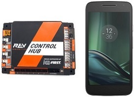
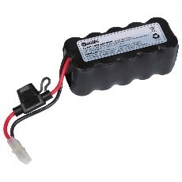

Required Materials
==================

This wiki contains tutorials that demonstrate how to configure, program, and
operate the *FIRST* Tech Challenge control system. In order to complete the
tutorials, you will need to have the following materials available:

.. |androidphones| image:: images/twoAndroidPhones.jpg

.. |wifi| image:: images/WiFiSymbol.jpg

.. |laptop| image:: images/Laptop.jpg

.. |chrome| image:: images/ChromeBrowser.jpg

.. |exhub| image:: images/ExpansionHub.jpg

.. |switch| image:: images/REVSwitch.jpg

.. |tamiya| image:: images/TamiyaAdapter.jpg

.. |slimbattery| image:: images/REVSlimBattery.jpg

.. |motor| image:: images/MotorAndCable.jpg

.. |jst| image:: images/AndersonToJST.jpg

.. |servo| image:: images/HitecServo.jpg

.. |color| image:: images/REVColorSensor.jpg

.. |touch| image:: images/REVTouchSensor.jpg

.. |usba| image:: images/USBTypeACable.jpg

.. |otg| image:: images/OTGAdapter.jpg

.. |f310| image:: images/LogitechF310.jpg

+------------------------------------------------+---------------------+
| Required Item(s)                               | Image               |
+================================================+=====================+
+ Two (2) *FIRST*-approved\* Android             + |androidphones|     +
| Devices - this could be two Android            |                     |
| smartphones, OR it could be a Control Hub      | Or                  |
| and a smartphone, OR a Control Hub and a       |                     |
+ Driver Hub.                                    + |chandphones|       +
+------------------------------------------------+---------------------+
| Wireless Internet access.                      | |wifi|              |
|                                                |                     |
|                                                |                     |
+------------------------------------------------+---------------------+
| Laptop with Microsoft Windows 7, 8 or 10 and   | |laptop|            |
| Wi-Fi capability.Note that your laptop should  |                     |
| have the most current service packs and system |                     |
| updates from Microsoft.If you are using a      |                     |
| different type of machine (such as a           |                     |
| Chromebook, Android Tablet, etc.) as your      |                     |
| programming device, the steps might differ     |                     |
| slightly on how to access the Programming      |                     |
| Server on the Robot Controller. Refer to your  |                     |
| device’s user documentation for details on how |                     |
| to connect to a Wi-Fi network.                 |                     |
+------------------------------------------------+---------------------+
| Javascript-enabled web browser (Google Chrome  | |chrome|            |
| is the recommended browser).                   |                     |
|                                                |                     |
+------------------------------------------------+---------------------+
| If you are using a smartphone as part of your  | |exhub|             |
| Robot Controller, you will also need a REV     |                     |
| Robotics Expansion Hub (REV-31-1153) to        |                     |
| connect to the motors, servos, and sensors.    |                     |
| Control Hub users will use the integrated      |                     |
| ports built into the Control Hub to connect    |                     |
| motors, servos, and sensors.                   |                     |
+------------------------------------------------+---------------------+
| REV Robotics Switch, Cable, & Bracket          | |switch|            |
| (REV-31-1387).                                 |                     |
|                                                |                     |
+------------------------------------------------+---------------------+
| If you are using an approved 12V battery that  | |tamiya|            |
| has an Tamiya connector (like the Tetrix       |                     |
| W39057 battery) you will need a >REV Robotics  |                     |
| Tamiya to XT30 Adapter Cable (REV-31-1382). If |                     |
| you have a REV Robotics Slim Battery           |                     |
| (REV-31-1302) then you will not need this      |                     |
| adapter since the REV battery already has an   |                     |
| XT30 connector.                                |                     |
+------------------------------------------------+---------------------+
| *FIRST*-approved\* 12V Battery (such as Tetrix | |battery|           |
| W39057 or REV Robotics REV-31-1302).\*\ **For  |                     |
| a list of FIRST-approved 12V batteries, refer  |                     |
| to the current Game Manual Part 1, rule        | Or                  |
| <RE03>.**\                                     | |slimbattery|       |
|                                                |                     |
|                                                |                     |
+------------------------------------------------+---------------------+
| *FIRST*-approved\* 12V DC Motor (such as       | |motor|             |
| Tetrix W39530, with power cable W41352).       |                     |
| \*\ **For a list of FIRST-approved 12V motors, |                     |
| refer to the current Game Manual Part 1,       |                     |
| rule <RE09>.**\                                |                     |
+------------------------------------------------+---------------------+
| REV Robotics Anderson to JST VH Cable          | |jst|               |
| (REV-31-1381).                                 |                     |
|                                                |                     |
+------------------------------------------------+---------------------+
| 180-Degree Standard Scale Servo (such as Hitec | |servo|             |
| HS-485HB).                                     |                     |
|                                                |                     |
+------------------------------------------------+---------------------+
| REV Robotics Color Sensor with 4-Pin Cable     | |color|             |
| (REV-31-1154).                                 |                     |
|                                                |                     |
+------------------------------------------------+---------------------+
| REV Robotics Touch Sensor with 4-Pin Cable     | |touch|             |
| (REV-31-1425).                                 |                     |
|                                                |                     |
+------------------------------------------------+---------------------+
| If you are using a smartphone as your Robot    | |usba|              |
| Controller, you will need a USB Type A male to |                     |
| type mini-B male cable. Control Hub users do   |                     |
| not need this cable.                           |                     |
+------------------------------------------------+---------------------+
| If you are using a smartphone as your Robot    | |otg|               |
| Controller, you will need two (2) micro USB    |                     |
| OTG adapters. If you are using a Control Hub   |                     |
| as your Robot Controller, you will need one    | |otg|               |
| (1) micro USB OTG adapter.                     |                     |
|                                                |                     |
+------------------------------------------------+---------------------+
| Logitech F310 USB Gamepad.                     | |f310|              |
|                                                |                     |
|                                                |                     |
+------------------------------------------------+---------------------+

