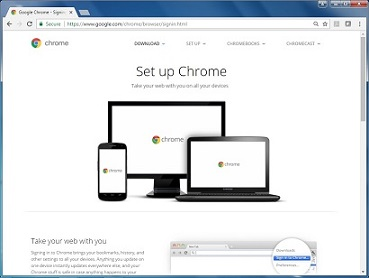

Required Materials
==================

This wiki contains tutorials that demonstrate how to configure, program, and
operate the *FIRST* Tech Challenge control system. In order to complete the
tutorials, you will need to have the following materials available:

.. |androidphones| image:: images/twoAndroidPhones.jpg
.. |chandphones| image:: images/ControlHubAndPhone.jpg

.. |laptop| image:: images/Laptop.jpg

.. |exhub| image:: images/ExpansionHub.jpg

.. |switch| image:: images/REVSwitch.jpg

.. |tamiya| image:: images/TamiyaAdapter.jpg

.. |battery| image:: images/Battery.jpg
.. |slimbattery| image:: images/REVSlimBattery.jpg

.. |motor| image:: images/MotorAndCable.jpg

.. |jst| image:: images/AndersonToJST.jpg

.. |servo| image:: images/HitecServo.jpg

.. |color| image:: images/REVColorSensor.jpg

.. |touch| image:: images/REVTouchSensor.jpg

.. |usba| image:: images/USBTypeACable.jpg

.. |otg| image:: images/OTGAdapter.jpg

.. list-table::
   :widths: 50 50
   :class: longtable
   :header-rows: 1

   * - Required Item(s)
     - Image

   * - Two (2) FIRST-approved* Android devices OR One (1) Control Hub and one (1) FIRST-approved* Android device for the DRIVER STATION
     - |androidphones|   Or |chandphones|

   * - Wireless Internet access.
     - |wifi|

   * - Laptop with Microsoft Windows 7, 8 or 10 and Wi-Fi capability. Note that your laptop should have the most current service packs and systemu pdates from Microsoft. If you are using a different type of machine (such as a Chromebook, Android Tablet, etc.) as your programming device, the steps might differ slightly on how to access the Programming Server on the Robot Controller. Refer to your device’s user documentation for details on howto connect to a Wi-Fi network.
     - |laptop|

   * - Javascript-enabled web browser (Google Chrome is the recommended browser).
     - |chrome|

   * - If you are using a smartphone as part of your Robot Controller, you will also need a REV Robotics Expansion Hub (REV-31-1153) to connect to the motors, servos, and sensors. Control Hub users will use the integrated ports built into the Control Hub to connect motors, servos, and sensors.
     - |exhub|

   * - REV Robotics Switch, Cable, & Bracket (REV-31-1387).
     - |switch|

   * - If you are using an approved 12V battery that has a Tamiya connector (like the Tetrix W39057 battery) you will need a >REV Robotics Tamiya to XT30 Adapter Cable (REV-31-1382). Ifyou have a REV Robotics Slim Battery (REV-31-1302) then you will not need this adapter since the REV battery already has an XT30 connector.
     - |tamiya|

   * - *FIRST*-approved\* 12V Battery (such as Tetrix W39057 or REV Robotics REV-31-1302).\*\ **Fora list of FIRST-approved 12V batteries, refer to the current Competition Manual.**\
     - |battery|   Or |slimbattery|

   * - *FIRST*-approved\* 12V DC Motor (such as Tetrix W39530, with power cable W41352).\*\ **For a list of FIRST-approved 12V motors,refer to the current Competition Manual.**\
     - |motor|

   * - REV Robotics Anderson to JST VH Cable (REV-31-1381).
     - |jst|

   * - 180-Degree Standard Scale Servo (such as Hitec HS-485HB).
     - |servo|

   * - REV Robotics Color Sensor with 4-Pin Cable (REV-31-1154).
     - |color|

   * - REV Robotics Touch Sensor with 4-Pin Cable( REV-31-1425).
     - |touch|

   * - If you are using a smartphone as your Robot Controller, you will need a USB Type A male to type mini-B male cable. Control Hub users donot need this cable.
     - |usba|

   * - If you are using a smartphone as your Robot Controller, you will need two (2) micro USB OTG adapters. If you are using a Control Hub as your Robot Controller, you will need one(1) micro USB OTG adapter.
     - |otg|   |otg|

   * - Logitech F310 USB Gamepad.
     - |f310|