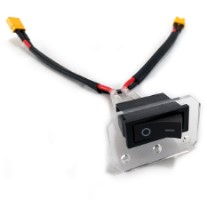
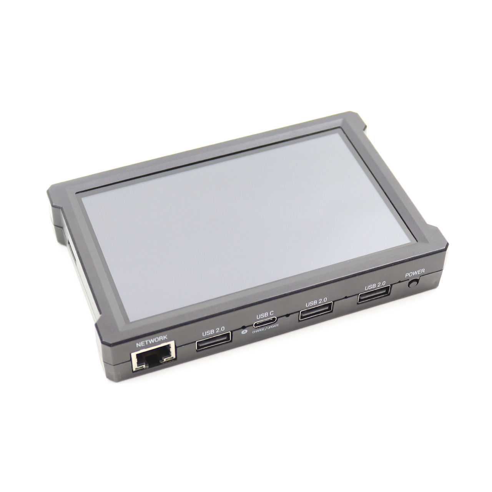

Required Materials
==================

This wiki contains tutorials that demonstrate how to configure, program, and
operate the *FIRST* Tech Challenge control system. In order to complete the
tutorials, you will need to have the following materials available:

.. |androidphones| image:: images/twoAndroidPhones.jpg
.. |chandphones| image:: images/ControlHubAndPhone.jpg

.. |wifi| image:: images/WiFiSymbol.jpg

.. |laptop| image:: images/Laptop.jpg

.. |chrome| image:: images/ChromeBrowser.jpg

.. |exhub| image:: images/ExpansionHub.jpg

.. |battery| image:: images/Battery.jpg
.. |slimbattery| image:: images/REVSlimBattery.jpg

.. |jst| image:: images/AndersonToJST.jpg

.. |servo| image:: images/HitecServo.jpg

.. |touch| image:: images/REVTouchSensor.jpg

.. |usba| image:: images/USBTypeACable.jpg

.. |otg| image:: images/OTGAdapter.jpg

.. |f310| image:: images/LogitechF310.jpg

.. list-table::
   :widths: 50 50
   :class: longtable
   :header-rows: 1

   * - Required Item(s)
     - Image

   * - A REV Robotics Control Hub to be used as a ROBOT CONTROLLER.
       Alternately, the Competition Manual does allow teams to instead
       use a REV Robotics Expansion Hub and a select list of Android
       phones. 
     - |chandphones| |exhub|
   
   * - A REV Robotics Driver Hub to be used as a DRIVER STATION device.
       Alternately, the Competition Manual does allow teams to instead
       use a select list of Android phones. See rule R901 for the full
       details.
     - |driverhub|

   * - Wireless Internet access.
     - |wifi|

   * - Laptop with Microsoft Windows 7, 8, 10 or 11 and Wi-Fi capability. Note that your laptop should have the most current service packs and system updates from Microsoft. If you are using a different type of machine (such as a Chromebook, Android Tablet, etc.) as your programming device, the steps might differ slightly on how to access the Programming Server on the Robot Controller. Refer to your device’s user documentation for details on how to connect to a Wi-Fi network.
     - |laptop|

   * - Javascript-enabled web browser (Google Chrome is the recommended browser).
     - |chrome|

   * - REV Robotics Switch, Cable, & Bracket (REV-31-1387).
     - |switch|
  
   * - *FIRST*-approved\* 12V Battery (such as Tetrix W39057 or REV Robotics REV-31-1302).\*\ **For a list of FIRST-approved 12V batteries, refer to the current Competition Manual.**\
     - |battery|   Or |slimbattery|

   * - *FIRST*-approved\* 12V DC Motor (such as Tetrix W39530, with power cable W41352).\*\ **For a list of FIRST-approved 12V motors, refer to the current Competition Manual.**\
     - |motor|

   * - If you are using an approved 12V battery that has a Tamiya connector (like the Tetrix W39057 battery) you will need a REV Robotics Tamiya to XT30 Adapter Cable (REV-31-1382). If you have a REV Robotics Slim Battery (REV-31-1302) then you will not need this adapter since the REV battery already has an XT30 connector.
     - |tamiya|
  
   * - REV Robotics Anderson to JST VH Cable (REV-31-1381).
     - |jst|

   * - 180-Degree Standard Scale Servo (such as Hitec HS-485HB).
     - |servo|

   * - REV Robotics Color Sensor with 4-Pin Cable (REV-31-1154).
     - |color|

   * - REV Robotics Touch Sensor with 4-Pin Cable( REV-31-1425).
     - |touch|
  
   * - Logitech F310 USB Gamepad.
     - |f310|

   * - If you are using a smartphone as your Robot Controller, you will need a USB Type A male to type mini-B male cable. Control Hub users do not need this cable.
     - |usba|

   * - If you are using a smartphone as your Robot Controller, you will need two (2) micro USB OTG adapters. If you are using a Control Hub as your Robot Controller, you will need one(1) micro USB OTG adapter.
     - |otg|   |otg|
