Creating and Running an Op Mode (Android-Studio)
================================================

TeamCode Module
~~~~~~~~~~~~~~~

If you successfully imported the Android Studio project folder, you
will see on the project browser an Android module named ``TeamCode``. The
Android Studio project folder will be used to build a version of the
Robot Controller app that includes the custom op modes that you will
write to control your competition robot.

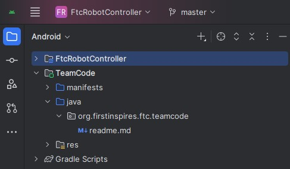

|

When you create your classes and op modes, you will to create them in
the ``org.firstinspires.ftc.teamcode`` package that resides in the TeamCode
module. This package is reserved for your use within the Android
Studio project folder.

Javadoc Reference Information
~~~~~~~~~~~~~~~~~~~~~~~~~~~~~

The Javadoc reference documentation for the SDK is available online.
Visit the following URL to view the SDK documentation:

*  https://javadoc.io/doc/org.firstinspires.ftc

Enabling Auto Import
~~~~~~~~~~~~~~~~~~~~

The auto import feature of Android Studio is a convenient function that
helps save time as you write your op mode. If you would like to enable
this feature, select the Editor->General->Auto Import item from the
Android Studio Settings screen. This will display the editor's auto
import settings.

Check the "Add unambiguous imports on the fly" so that Android Studio
will automatically add the required import statements for classes that
you would like to use in your op mode.

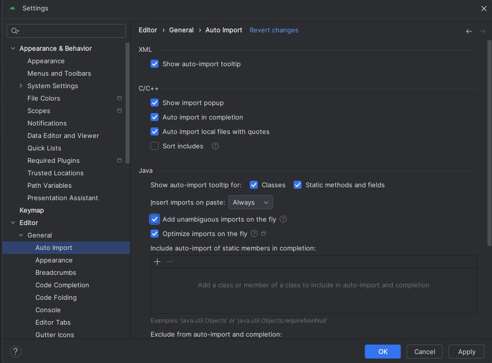

|

Sample Op Modes
~~~~~~~~~~~~~~~

A great way to learn how to program a robot is to examine the sample op
modes that are included with the Android Studio project folder. You
can locate these files in the FtcRobotController module in the package
``org.firstinspires.ftc.robotcontroller.external.samples``.

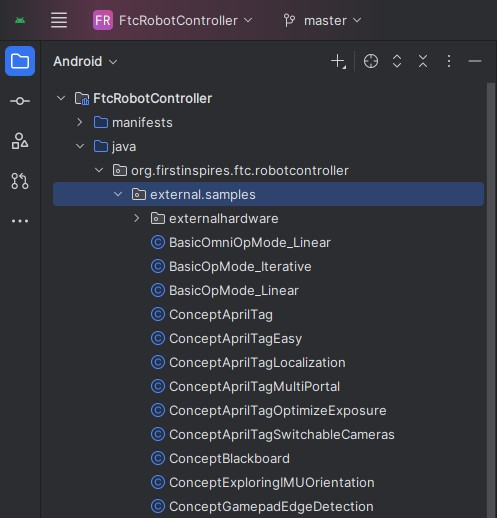

|

If you would like to use a sample op mode, copy it from the
``org.firstinspires.ftc.robotcontroller.external.samples`` package and
move it to the ``org.firstinspires.ftc.teamcode`` package.

In your newly copied op mode, look for the following annotation,

``@Disabled``

and comment out this line to enable the op mode and allow it to be run
on the Robot Controller:

``//@Disabled``

Creating Your FIRST Op Mode
~~~~~~~~~~~~~~~~~~~~~~~~~~~

Right mouse click on the ``org.firstinspires.ftc.teamcode`` package and
select New->Java Class from the pop-up menu. The Create New Class dialog
box appear. Specify the name of the new class as ``MyFIRSTJavaOpMode`` and
specify as its superclass the class LinearOpMode which is in the package
``com.qualcomm.robotcore.eventloop.opmode``.

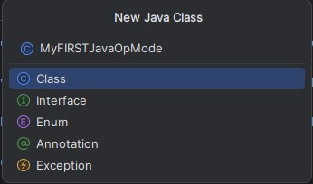

|

Press the OK button to create the new class. The source code for the new
class should appear in the editing pane of the Android Studio user
interface.

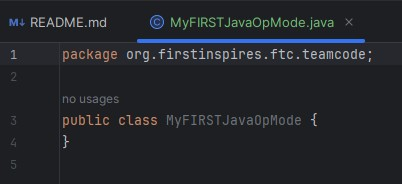

|

Modify the main portion of your op mode so that it looks like the
following code (note that the package definition and some import
statements have been omitted in the following source code):

.. code-block:: java

   @TeleOp

   public class MyFIRSTJavaOpMode extends LinearOpMode {
       private Gyroscope imu;
       private DcMotor motorTest;
       private DigitalChannel digitalTouch;
       private DistanceSensor sensorColorRange;
       private Servo servoTest;

       @Override
       public void runOpMode() {
           imu = hardwareMap.get(Gyroscope.class, "imu");
           motorTest = hardwareMap.get(DcMotor.class, "motorTest");
           digitalTouch = hardwareMap.get(DigitalChannel.class, "digitalTouch");
           sensorColorRange = hardwareMap.get(DistanceSensor.class, "sensorColorRange");
           servoTest = hardwareMap.get(Servo.class, "servoTest");

           telemetry.addData("Status", "Initialized");
           telemetry.update();
           // Wait for the game to start (driver presses PLAY)
           waitForStart();

           // run until the end of the match (driver presses STOP)
           while (opModeIsActive()) {
               telemetry.addData("Status", "Running");
               telemetry.update();

           }
       }
   }

We will use this source code as the framework for your first op mode.
Note that Android Studio automatically saves your source code as you are
editing it.

Congratulations! You've written an op mode. It does not do much, but we
will modify it to make it more useful.

Examining the Structure of Your Op Mode
~~~~~~~~~~~~~~~~~~~~~~~~~~~~~~~~~~~~~~~

It can be helpful to think of an op mode as a list of tasks for the
Robot Controller to perform. For a linear op mode, the Robot Controller
will process this list of tasks sequentially. Users can also use control
loops (such as a while loop) to have the Robot Controller repeat (or
iterate) certain tasks within a linear op mode.

.. image:: images/ExaminingStructurePic2.jpg
   :align: center

|

If you think about an op mode as a list of instructions for the robot,
this set of instructions that you created will be executed by the robot
whenever a team member selects the op mode called ``MyFIRSTJavaOpMode``
from the list of available op modes for this Robot Controller.

Let's look at the structure of your newly created op mode. Here's a copy
of the op mode text (minus some comments, the package definition, and
some import package statements):

.. code-block:: java

   @TeleOp

   public class MyFIRSTJavaOpMode extends LinearOpMode {
       private Gyroscope imu;
       private DcMotor motorTest;
       private DigitalChannel digitalTouch;
       private DistanceSensor sensorColorRange;
       private Servo servoTest;

       @Override
       public void runOpMode() {
           imu = hardwareMap.get(Gyroscope.class, "imu");
           motorTest = hardwareMap.get(DcMotor.class, "motorTest");
           digitalTouch = hardwareMap.get(DigitalChannel.class, "digitalTouch");
           sensorColorRange = hardwareMap.get(DistanceSensor.class, "sensorColorRange");
           servoTest = hardwareMap.get(Servo.class, "servoTest");

           telemetry.addData("Status", "Initialized");
           telemetry.update();
           // Wait for the game to start (driver presses PLAY)
           waitForStart();

           // run until the end of the match (driver presses STOP)
           while (opModeIsActive()) {
               telemetry.addData("Status", "Running");
               telemetry.update();

           }
       }
   }

At the start of the op mode there is an annotation that occurs before
the class definition. This annotation states that this is a
tele-operated (i.e., driver controlled) op mode:

``@TeleOp``

If you wanted to change this op mode to an autonomous op mode, you would
replace the ``@TeleOp`` with an ``@Autonomous`` annotation instead.

You can see from the sample code that an op mode is defined as a Java
class. In this example, the op mode name is called ``MyFIRSTJavaOpMode``
and it inherits characteristics from the LinearOpMode class.

.. code-block:: java

   public class MyFIRSTJavaOpMode extends LinearOpMode {

You can also see that the OnBot Java editor created five private member
variables for this op mode. These variables will hold references to the
five configured devices that the OnBot Java editor detected in the
configuration file of your Robot Controller.

.. code-block:: java

       private Gyroscope imu;
       private DcMotor motorTest;
       private DigitalChannel digitalTouch;
       private DistanceSensor sensorColorRange;
       private Servo servoTest;

Next, there is an overridden method called ``runOpMode``. Every op mode of
type ``LinearOpMode`` must implement this method. This method gets called
when a user selects and runs the op mode.

.. code-block:: java

       @Override
       public void runOpMode() {

At the start of the ``runOpMode`` method, the op mode uses an object named
``hardwareMap`` to get references to the hardware devices that are listed in
the Robot Controller's configuration file:

.. code-block:: java

           imu = hardwareMap.get(Gyroscope.class, "imu");
           motorTest = hardwareMap.get(DcMotor.class, "motorTest");
           digitalTouch = hardwareMap.get(DigitalChannel.class, "digitalTouch");
           sensorColorRange = hardwareMap.get(DistanceSensor.class, "sensorColorRange");
           servoTest = hardwareMap.get(Servo.class, "servoTest");

The ``hardwareMap`` object is available to use in the ``runOpMode`` method. It
is an object of type ``HardwareMap`` class.

Note that when you attempt to retrieve a reference to a specific device
in your op mode, the name that you specify as the second argument of the
``HardwareMap.get`` method must match the name used to define the device in
your configuration file. For example, if you created a configuration
file that had a DC motor named ``motorTest``, then you must use this same
name (it is case sensitive) to retrieve this motor from the ``hardwareMap``
object. If the names do not match, the op mode will throw an exception
indicating that it cannot find the device.

In the next few statements of the example, the op mode prompts the user
to push the start button to continue. It uses another object that is
available in the ``runOpMode`` method. This object is called telemetry and
the op mode uses the ``addData`` method to add a message to be sent to the
Driver Station. The op mode then calls the update method to send the
message to the Driver Station. Then it calls the ``waitForStart`` method, to
wait until the user pushes the start button on the driver station to
begin the op mode run.

.. code-block:: java

           telemetry.addData("Status", "Initialized");
           telemetry.update();
           // Wait for the game to start (driver presses PLAY)
           waitForStart();

Note that all linear op modes should have a ``waitForStart`` statement to
ensure that the robot will not begin executing the op mode until the
driver pushes the start button.

After a start command has been received, the op mode enters a while loop
and keeps iterating in this loop until the op mode is no longer active
(i.e., until the user pushes the stop button on the Driver Station):

.. code-block:: java

           // run until the end of the match (driver presses STOP)
           while (opModeIsActive()) {
               telemetry.addData("Status", "Running");
               telemetry.update();

           }

As the op mode iterates in the while loop, it will continue to send
telemetry messages with the index of "Status" and the message of
"Running" to be displayed on the Driver Station.

Building and Installing Your Op Mode
~~~~~~~~~~~~~~~~~~~~~~~~~~~~~~~~~~~~

Verify that the Robot Controller phone is connected to your laptop and
that the laptop has USB debugging permission for the phone.

.. image:: images/phoneUSBConnected.jpg
   :align: center

|

Or, if you are using a Control Hub, verify that the Control Hub is
powered by a freshly charged 12V battery, and that it is connected to
your laptop through its USB Type C port. Note that the Control Hub
should automatically have USB debugging permission enabled.

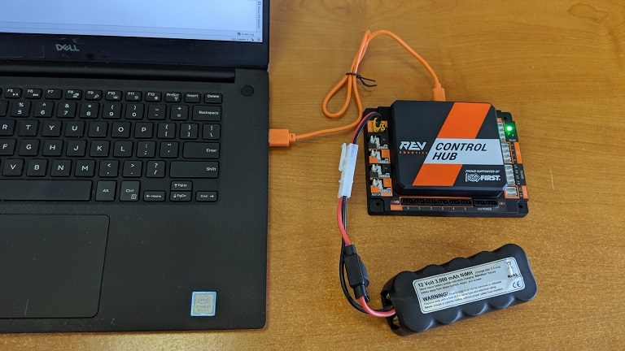

|

When using the Control Hub, please make sure you use the Type C port
(and not the USB Mini port) to connect the Control Hub to your
development laptop.

.. image:: images/typeC.jpg
   :align: center

|

Look towards the top of the Android Studio user interface and find the
little green Play or Run button (which is represented by a green
triangle) next to the words ``Team Code``. Press this green button to
build the Robot Controller app and to install it onto your phone.

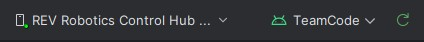

|

Android Studio should prompt you to select a target device to install
the Robot Controller app. Your screen might look something like the
image shown below.

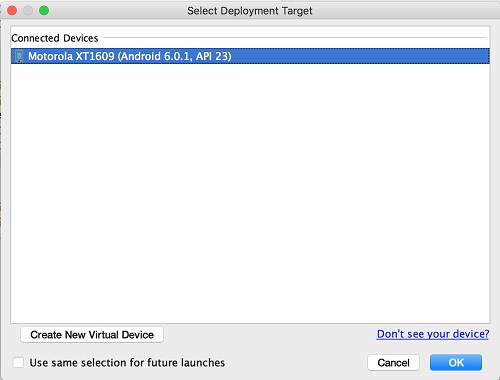

|

Make sure that you select the correct target device. In the figure above
the Motorola phone is selected as the target device. Hit OK to build the
APK file and install it on the target device.

Note that if you previously installed a copy of the Robot Controller
app from the Google Play store, the installation of your newly built app
will fail the first time you attempt to install it. This is because
Android Studio detects that the app that you just build has a different
digital signature than the official version of the Robot Controller
app that was installed from Google Play.

.. image:: images/ApplicationInstallFailed.jpg
   :align: center

|

If this happens, Android Studio will prompt you if it's OK to uninstall
the previous (official) version of the app from your device and replace
it with the updated version of the app. Select ``OK`` to uninstall the
previous version and to replace it with your newly created Robot
Controller App (see image above).

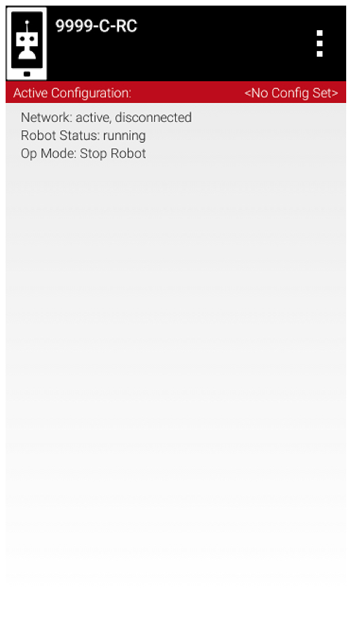

|

If the installation was successful, the Robot Controller app should be
launched on the target Android device. If you are using an Android phone
as your Robot Controller, you should see the main Robot Controller app
screen displayed on the phone.

Although the Control Hub lacks a built in screen, if you are Control Hub
user, you can verify that the app was installed onto your Control Hub
properly by looking at your Driver Station. If the Driver Station
indicates that it is successfully connected to the Control Hub (after
momentarily disconnecting while the update was occurring) then the app
was successfully updated.

Running Your Op Mode
~~~~~~~~~~~~~~~~~~~~

If you successfully built and installed your updated Android app with
your new op mode, then you are ready to run the op mode. Verify that
the Driver Station is still connected to the Robot Controller. Since
you designated that your example op mode is a tele-operated op mode,
it will be listed as a ``TeleOp`` op mode.

On the Driver Station, use the ``TeleOp`` dropdown list control to
display the list of available op modes. Select your op mode
("MyFIRSTJavaOpMode") from the list.

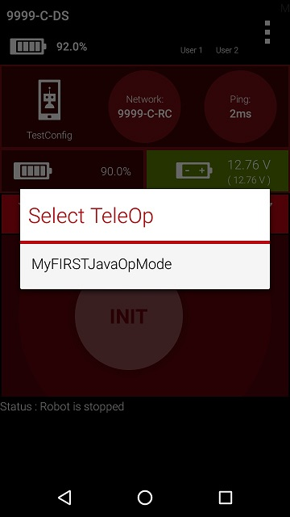

|

Press the "INIT" button to initialize the op mode.

.. image:: images/OnBotDoc_MyFIRSTPushInit.jpg
   :align: center

|

The op mode will execute the statements in the runOpMode method up to
the waitForStart statement. It will then wait until you press the start
button (which is represented by the triangular shaped symbol) to
continue.

.. image:: images/OnBotDoc_PressStart.jpg
   :align: center

|

Once you press the start button, the op mode will continue to iterate
and send the "Status: Running" message to the Driver Station. To stop
the op mode, press the square-shaped stop button.

.. image:: images/OnBotDoc_PressStop.jpg
   :align: center

|

Congratulations! You ran your first java op mode!

Modifying Your Op Mode to Control a Motor
~~~~~~~~~~~~~~~~~~~~~~~~~~~~~~~~~~~~~~~~~

Let's modify your op mode to control the DC motor that you connected and
configured for your REV Expansion Hub. Modify the code for the program
loop so that it looks like the following:

.. code-block:: java

   // run until the end of the match (driver presses STOP)
   double tgtPower = 0;
   while (opModeIsActive()) {
       tgtPower = -this.gamepad1.left_stick_y;
       motorTest.setPower(tgtPower);
       telemetry.addData("Target Power", tgtPower);
       telemetry.addData("Motor Power", motorTest.getPower());
       telemetry.addData("Status", "Running");
       telemetry.update();

   }

If you look at the code that was added, you will see that we defined a
new variable called target power before we enter the while loop.

.. code-block:: java

   double tgtPower = 0;

At the start of the while loop we set the variable tgtPower equal to the
negative value of the gamepad1's left joystick:

.. code-block:: java

   tgtPower = -this.gamepad1.left_stick_y;

The object ``gamepad1`` is available for you to access in the ``runOpMode``
method. It represents the state of gamepad #1 on your Driver Station.
Note that for the F310 gamepads that are used during the competition,
the Y value of a joystick ranges from -1, when a joystick is in its
topmost position, to +1, when a joystick is in its bottommost position.
In the example code above, you negate the ``left_stick_y`` value so that
pushing the left joystick forward will result in a positive power being
applied to the motor. Note that in this example, the notion of forwards
and backwards for the motor is arbitrary. However, the concept of
negating the joystick y value can be very useful in practice.

.. image:: images/OnBotDoc_left_stick_y.jpg
   :align: center

|

The next set of statements sets the power of motorTest to the value
represented by the variable tgtPower. The values for target power and
actual motor power are then added to the set of data that will be sent
via the telemetry mechanism to the Driver Station.

.. code-block:: java

       tgtPower = -this.gamepad1.left_stick_y;
       motorTest.setPower(tgtPower);
       telemetry.addData("Target Power", tgtPower);
       telemetry.addData("Motor Power", motorTest.getPower());

After you have modified your op mode to include these new statements,
press the build button and verify that the op mode was built
successfully.

Running Your Op Mode with a Gamepad Connected
~~~~~~~~~~~~~~~~~~~~~~~~~~~~~~~~~~~~~~~~~~~~~

Your op mode takes input from a gamepad and uses this input to control a
DC motor. To run your op mode, you will need to connect a Logitech F310
gamepad to the Driver Station.

Before you connect your gamepad to the phone, verify that the switch on
the bottom of the gamepad is set to the "X" (i.e., the "Xbox" mode)
position.

.. image:: images/RunningOpModeStep1.jpg
   :align: center

|

Connect the gamepad to the Driver Station using the Micro USB OTG
adapter cable.

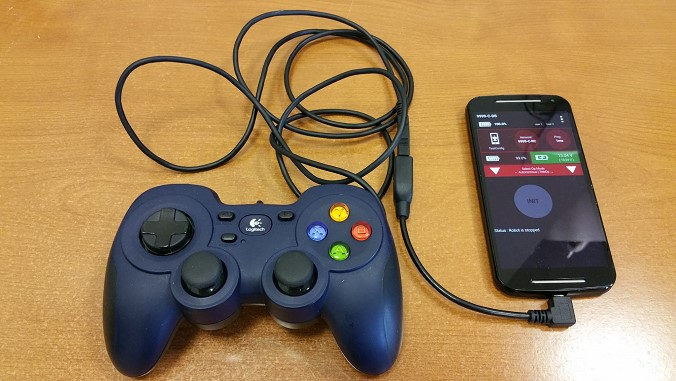

|

Your example op mode is looking for input from the gamepad designated as
the user or driver #1. Press the Start button and the A button
simultaneously on the Logictech F310 controller to designate your
gamepad as user #1. Note that pushing the Start button and the B button
simultaneously would designate the gamepad as user #2.

.. image:: images/RunningOpModeStep3.jpg
   :align: center

|

If you successfully designated the gamepad to be user #1, you should see
a little gamepad icon above the text "User 1" in the upper right hand
corner of the Driver Station Screen. Whenever there is activity on
gamepad #1, the little icon should be highlighted in green. If the icon
is missing or if it does not highlight in green when you use your
gamepad, then there is a problem with the connection to the gamepad.

Select, initialize and run your ``MyFIRSTJavaOpMode`` op mode.

If you configured your gamepad properly, then the left joystick should
control the motion of the motor. As you run your op mode, be careful and
make sure you do not get anything caught in the turning motor. Note that
the User #1 gamepad icon should highlight green each time you move the
joystick. Also note that the target power and actual motor power values
should be displayed in the telemetry area on the Driver Station.

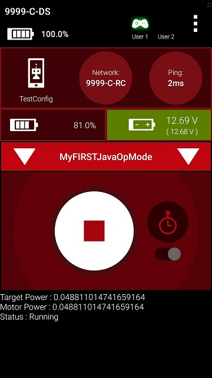

|

