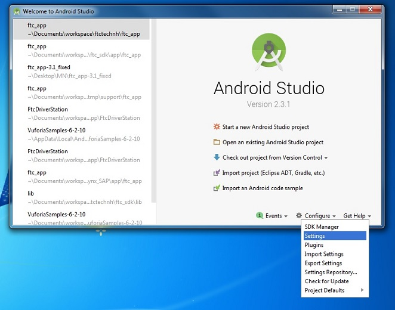
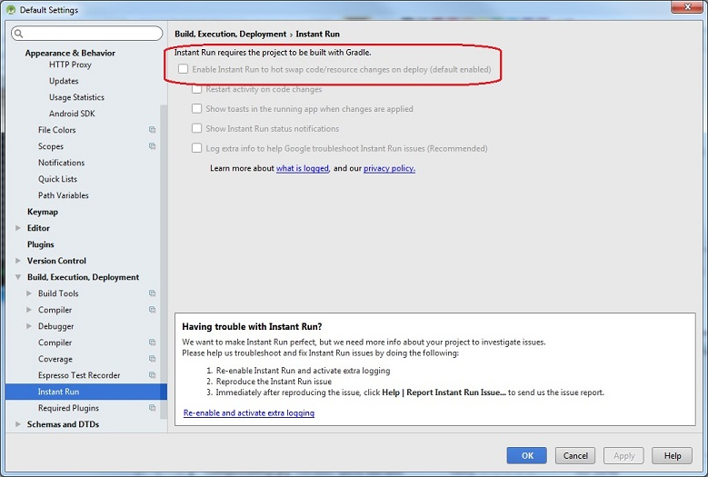

Disabling Android Studio Instant Run
====================================

.. attention::
   *Instant Run* was removed in Android version 3.5, and is no 
   longer an issue for versions of Android Studio that are 
   Android 3.5 or newer. However, this article remains for those
   using *FIRST* Tech Challenge Software Development Kit (SDK) 
   v7.1 and older with previous versions of Android Studio.

Introduction
~~~~~~~~~~~~

If you are an Android Studio user, one of **the most important steps to
take** is to disable Android Studio Instant Run. Instant Run is a
feature that is designed to streamline the development process by
reducing the time to apply code changes to your app. Unfortunately,
Instant Run is limited in function and when used with the *FIRST* Tech
Challenge Android Studio project folder, can cause **severe** and
**difficult-to-troubleshoot** problems.

Teams who use Android Studio **must** disable Instant Run.

Locating Instant Run Settings
~~~~~~~~~~~~~~~~~~~~~~~~~~~~~

When you first launch Android Studio a Welcome screen should appear. You
can navigate to the Instant Run Settings from this Welcome screen by
selecting the “Configure->Settings” item from the “Configure” dropdown
list in the lower right hand corner of the screen.

On the left hand side of the Settings window, there should be a category
called “Build, Execution, Deployment”. Within this category, click on
the “Instant Run” subcategory to display the Instant Run settings for
your Android Studio installation. By default, Instant Run is enabled
when you first install Android Studio. Uncheck the “Enable Instant Run
to hot swap code/resource changes on deploy (default enabled)” option
and then click on the “OK” button to disable Instant Run.

Additional Information
~~~~~~~~~~~~~~~~~~~~~~

The Google Android Developer website has additional information about
Instant Run. It also has instructions on how to disable this feature:

https://developer.android.com/studio/run
