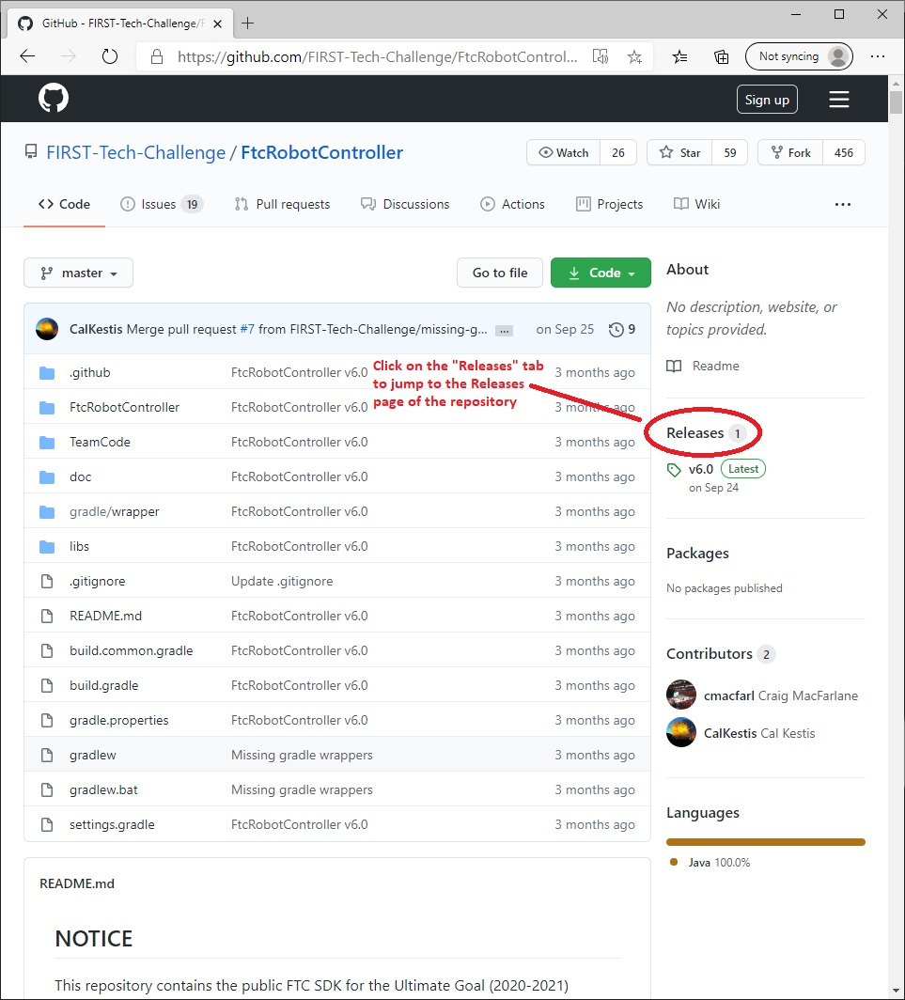
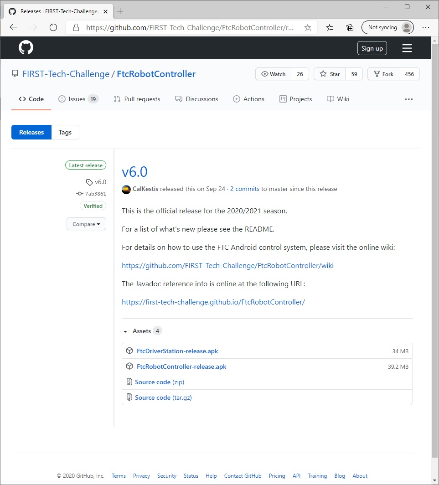
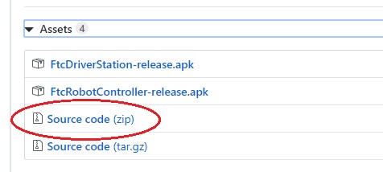
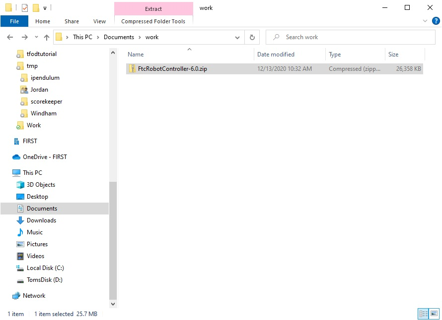
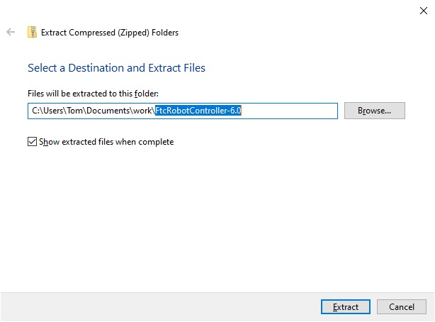
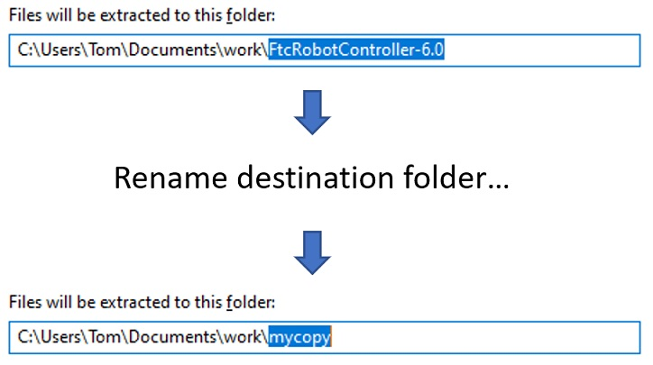
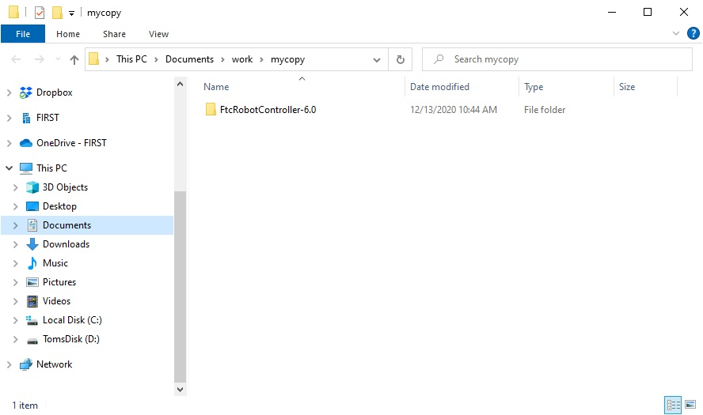
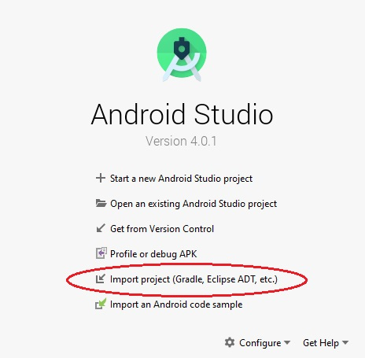
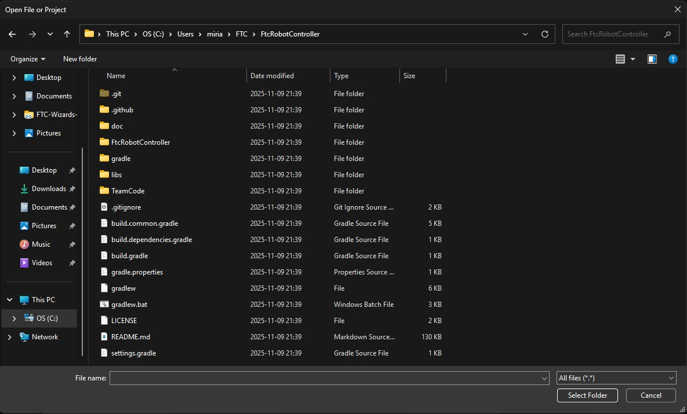
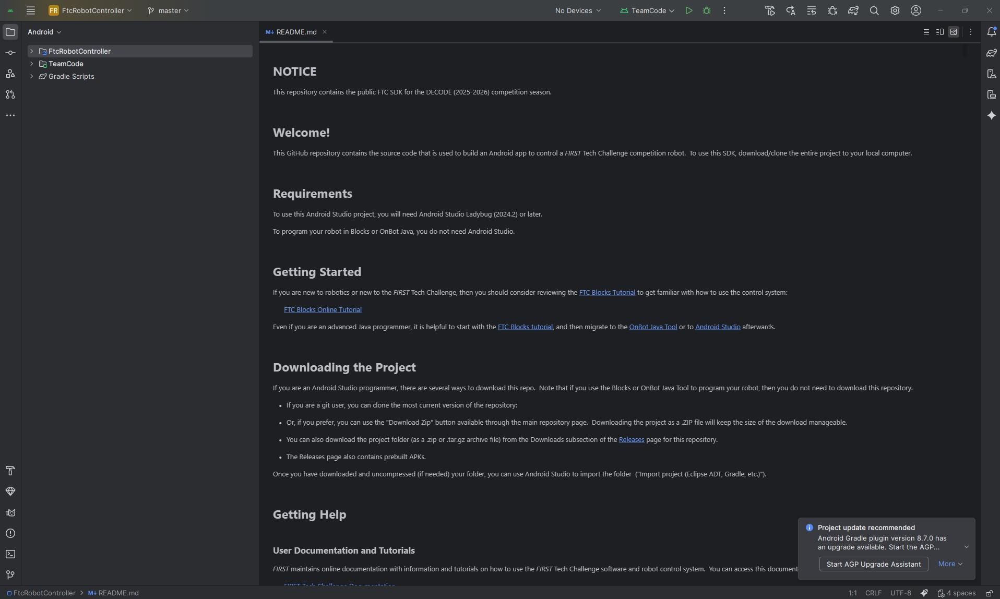

Downloading the Android Studio Project Folder
~~~~~~~~~~~~~~~~~~~~~~~~~~~~~~~~~~~~~~~~~~~~~

The FTC SDK can be downloaded from a GitHub repository. GitHub is a
web-based version control company that lets individuals and
organizations host content online. In order to access the FTC software,
you will need to have a GitHub account. You can create one for free by
visiting the GitHub website:

*  https://github.com/

The software is stored in a repository called "FtcRobotController" under
the *FIRST-Tech-Challenge* GitHub organization:

*  https://github.com/FIRST-Tech-Challenge/FtcRobotController

.. important:: **Advanced GitHub Users** - this tutorial assumes that
   the user is a novice with respect to using GitHub and the git version
   control software. If you are a GitHub power user, you can use git to
   *clone* a local copy of the public GitHub repository. This document,
   however, does not explain how to use git to access the repository. It
   provides instructions on downloading the repository as a .ZIP file
   instead.

|

From the main repository web page, click on the “releases” link to jump
to the Releases page for the repository. The Releases page should list
the available software releases for the repository. The latest release
should be displayed near the top of the page.

|

Each software release should include an **Assets** section that you can
use to download the software that you will need to program your robot.
Note that you might have to click on the triangular symbol to expand
this **Assets** section.

|

Click on the Source code (zip) link to download the compressed Android
Studio project folder.

Extracting the Contents of the Archived Project File
~~~~~~~~~~~~~~~~~~~~~~~~~~~~~~~~~~~~~~~~~~~~~~~~~~~~

Once you have downloaded the archived (.ZIP) project file
you can move this file to the location of your choice.

|

Before you can import the FTC project into Android Studio, you must
first extract the contents of the archived project file. For Windows
users, right mouse click on the file and select "Extract All" from the
pop up menu. Windows should prompt you to select a destination for the
extracted project folder. The dialog that appears should look similar to
the one show in the figure below.

|

Highlight the suggested name for the destination folder (in the figure
above, the suggested name is "FtcRobotController-6.0") and change the
destination folder name into something more user friendly. In this
example, we will change the name of the destination folder to "mycopy".

|

After you have renamed the destination folder, extract the contents of
the archive to the folder. After the extraction process is complete,
verify that the project folder was successfully extracted to its target
destination.

|

Once you have successfully extracted the contents of the archived file,
you are ready to import the FTC project into Android Studio.

Importing the FTC Project into Android Studio
~~~~~~~~~~~~~~~~~~~~~~~~~~~~~~~~~~~~~~~~~~~~~

In order to import the FTC Project, you will need to launch the Android
Studio software on your computer. On the main Android Studio Welcome
screen, select the option to "Import project (Gradle, Eclipse, ADT,
etc.)" to begin the import process.

|

Android Studio should prompt you to select the project folder that you
would like to import. Use the file browser in the pop up dialog box to
locate and then select the folder that you extracted in an earlier
section of this document. Make sure you select the extracted project
folder (and not the .ZIP file which might have a similar name to the
extracted folder). Hit the "OK" button to import the selected project
into Android Studio.

|

In the figure above the project folder called “FtcRobotController-6.0”
is selected to be imported into Android Studio. It might take Android
Studio several minutes to import the project. Once the project has been
successfully imported, the screen should look similar to the one
depicted in the image below.

|

