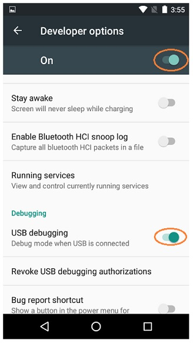
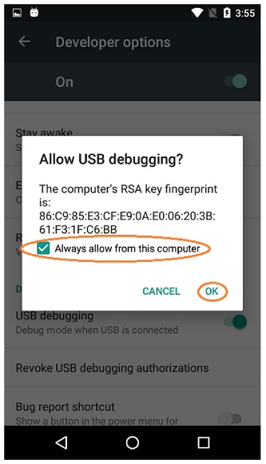

Enabling Developer Options
==========================

After you have configured your Android phone, you will also have to make
sure that your phone is in developer mode before you will be able to
install apps onto the phone using the tools that are included with
Android Studio.

.. important:: Control Hub Users - The Control Hub has Developer Options
   automatically enabled from the factory, so you do **NOT** need to do 
   this step for your Control Hub.

The Android Developer website contains information on how to enable
Developer Options onto your phone. If you visit the following link and
read the section entitled "Enabling On-device Developer Options" you
will see that you can enable Developer Options on your Android phone by
going to Settings->About phone on the phone, and then tapping the Build
number seven times.

*  https://developer.android.com/studio/run/device#setting-up

In order to be able to use the Android Studio tools to install apps onto
your phone, you will need to make sure that the Developer Options and
USB debugging are enabled for both of your phones.

|

When you first connect a phone to your computer with Android Studio
running, the phone might prompt you if it is OK to allow the computer to
have USB debugging access to the phone. If this happens, make sure that
you check the "Always allow from this computer" option and hit the OK
button to allow USB debugging.

|

