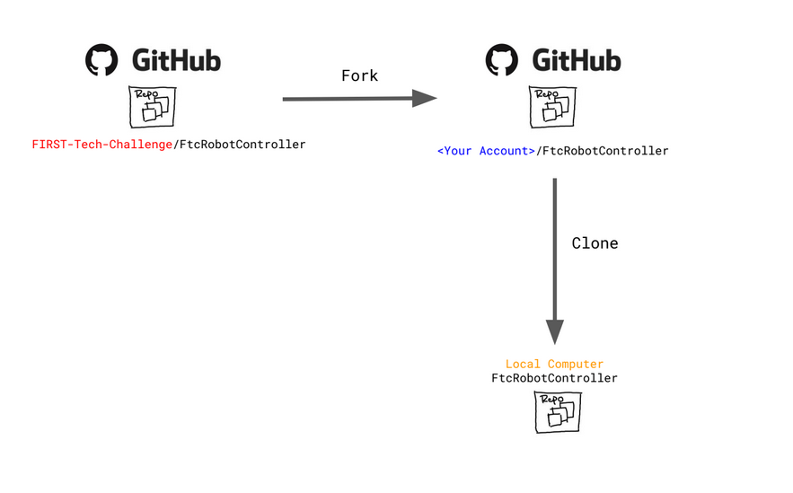

Fork and Clone from GitHub 
==========================

.. important:: 
   This approach assumes a basic familiarity with git and GitHub.  As with most
   things related to git there are many different ways to satisfy any
   objective.  This documentation describes one method for Windows users.
   Users not comfortable with command line tools and git should obtain the SDK
   via :doc:`Downloading the SDK as a zip archive
   <../downloading_as_project_folder/Downloading-the-Android-Studio-Project-Folder>`.

Forks vs. Clones 
----------------

A **Fork** on GitHub is a copy of another repository on GitHub from one account
to another account. The new forked repository retains a parent-child
relationship with the origin repository. Forks are typically used when software
will have an independent line of development, such as when FTC teams develop
their own team code using the FIRST-Tech-Challenge/FtcRobotController
repository as a basis.  FTC teams should create a Fork of the
FIRST-Tech-Challenge/FtcRobotController repository as a convenient way to
manage their software development process. Thanks to the parent-child
relationship, when changes are made to the parent repository those changes can
be easily tracked and fetched/merged into the forked repository, keeping the
forked repository up to date.

.. warning:: 
   Teams should not issue pull requests against the upstream parent, the
   FIRST-Tech-Challenge/FtcRobotContoller repository. Forks of the
   FIRST-Tech-Challenge/FtcRobotContoller repo may always fetch changes, but
   should never attempt to push changes up to the repo.

A **Clone** is a copy of a repository, typically on a local computer. A team
member creates a branch of the team's repository for feature development, and
clones the branch to a local computer. Software development and testing then
happens completely within their local clone. Once they're finished, or they've
reached a checkpoint, the changes within the local clone can then be pushed
from their local clone back to the team fork. That feature branch can then be
merged into the team's main repository branch once it has been accepted by the
team. Multiple different developers can work seamlessly using this process.

   The relationship between forks and clones.  The clone exists on your local
   laptop while the fork exists on GitHub servers.

Branch Strategies 
-----------------

A branch is a new/separate version of the main repository used to develop new
features for the repository. The default branch for the FtcRobotController
repository, and its forks and clones, is 'master' (though for all newer
repositories created by GitHub the default branch is called 'main').  Using
branches judiciously can help developers collaborate on a common set of
software by isolating changes, keeping the default branch clean, and providing
space for feature development to iterate independent of software that's been
deemed 'production ready'.

.. figure:: images/branches.*
   :align: center 
   :alt: branches

   A repository with 3 branches.

Each circle represents a commit, the different colors representing different
branches.  Each branch contains all of the commits of its parent branch prior
to the point in time when the branch was created, but all commits after that
point in time are independent of the parent.  Developers can experiment, make
changes, develop new features, all without disrupting the work of other team
members.  When a developer is satisfied that a branch is stable enough to be
shared, the branch can be merged back into the parent.

It can be useful to ensure that the default branch in team forks and clones
matches the default branch for FIRST-Tech-Challenge/FtcRobotController.
However a typical development pattern will have team developers committing team
software back to the master branch, whether via merges from feature branches,
or direct commits to master.

.. figure:: images/master-comparison.*
   :align: center 
   :alt: FTC master vs Team master

   FIRST-Tech-Challenge/FtcRobotController master vs. typical team repository
   master.

Team commits are represented by purple circles, while commits containing SDK
updates are represented by green circles.  In this instance team commits are
interleaved with SDK updates, which produces a situation where the two default
branches do not match.  While this is a perfectly acceptable, and a very common
branch management strategy, certain benefits can be obtained if we isolate the
default branch so that it always matches the parent.

.. figure:: images/clean-master.*
   :align: center 
   :alt: keeping branches in sync

   Team repository's master always matches
   FIRST-Tech-Challenge/FtcRobotController's master branch.

Following this model means that commit history for the master branch for the
team's repository will always match the commit history for the parent's master
branch.  All software that teams intend to compete with is merged into a
competition branch.  Features, new software, experiments, etc, are worked on in
child branches of the competition branch and merge back into the competition
branch, not the master branch.  SDK updates should always be conflict free,
updates can be done independent of merges into a competition branch, and if
something goes sideways when doing a merge of an SDK update into development it
can be more straightforward to recover as opposed to backing out of an update
straight into master where the branches do not match.

More detailed information on the mechanics of branching can be found here
`Using Branches <https://www.atlassian.com/git/tutorials/using-branches>`_

Getting Started (Quick-Start Guide) 
-----------------------------------

.. important:: 
   The following assumes all operations are done on the master branch of your
   local repository.

#. Obtain and install `GitForWindows <https://gitforwindows.org/>`_  This
   software contains a git client along with a bash shell.  All of the command
   line snippets below assume you are using a bash shell and that git is in
   your path.  GitForWindows is the easiest way to provide this for Windows
   machines.  Macs have a built in bash shell called terminal, but git must be
   installed separately.

#. Fork the `FIRST-Tech-Challenge/FtcRobotController
   <https://github.com/FIRST-Tech-Challenge/FtcRobotController>`_ repository
   into your account on GitHub.

   .. tip::
      This step requires you to have a GitHub account, and you need to be logged
      in to GitHub in order to Fork a repository.

   .. figure:: images/fork.png 
      :align: center 
      :width: 80% 
      :alt: Forking a repo

      Forking a GitHub repository.

   Forking the repository is as easy as clicking the ":octicon:`repo-forked;1em;sd-text-info` Fork"
   button shown in the image above. This will take you to the "Create a new fork" 
   page, and will auto-fill the "Owner" and "Repository name" fields. Just enter a 
   description (optional), leave the "Copy the ``master`` branch only" option checked,
   and click the green "Create fork" button.

   Once created, your new fork will be located at ``github.com/<username>/FtcRobotController`` 
   unless you edited the fork name.

#. Clone from your fork onto your local computer.  Note in the image below the
   account is FIRST-Tech-Challenge, but after your fork, the account should be
   your team account.  In all other respects the user interface will be
   identical.

   .. figure:: images/clone.png 
      :align: center 
      :width: 80% 
      :alt: Cloning a repo

      Cloning a forked repository.

   To clone your fork of the FtcRobotController, follow these steps:

   #. Click the green ":octicon:`code;1em;sd-text-info` Code" button shown in the image above.
   #. Ensure the "Local" and "HTTPS" sub-tabs are selected.
   #. Click the ":octicon:`copy;1em;sd-text-info`" button to copy the url in the text entry box.
   #. Open a "Git Bash" shell (via the Search bar in Windows)
   #. Within the Git Bash shell, execute the following command

      .. code-block:: bash

         git clone <copied-url>

#. Git will sync a clone of your repository. When it's done, Code away...

#. This is the point where you can create a branch for feature development, if
   desired. To create a branch, we can create and swap to a new branch via
   the following `git-checkout <https://git-scm.com/docs/git-checkout>`_ command:

   .. code-block:: bash

      git checkout -b <branchname>

   Using the ``-b`` option creates the new branch specified by ``<branchname>``
   and automatically swaps to that branch. Omitting the ``-b`` option will
   simply *swap* to an existing branch if one exists. If you create a new
   branch via the web or via another process, be sure to perform a ``git fetch
   origin`` and a ``git merge`` in order to fetch the and merge changes from
   the repository so that the ``git checkout`` command knows that the branch
   has been created.

Best Practices 
^^^^^^^^^^^^^^

- Do not make changes to software in the FtcRobotController directory within
  the repository.  SDK updates will be much easier if you do not change anything 
  within the FtcRobotController directory.  
- Limit the use of long-lived branches.  Branches should implement a feature.
  Branches should not track milestones.  For example a branch named
  'league-meet-1' is tracking a milestone.  It is much better if your branches
  track smaller units of development.  'detect-target', 'drive-to-parking',
  'drop-game-element'.  Break your software down into tasks for the robot to
  do, and use branches to implement those tasks.  This will allow for much
  easier collaborative development, much smaller change sets when merging, and
  much easier fetches and merges.  
- Try to keep your `git index
  <http://shafiul.github.io/gitbook/1_the_git_index.html>`_ clean.  This will
  make fetches and merges easier.  ``git status`` is your best friend here.  Use
  ``git status`` often to see what has changed in your local workspace.  Commit
  often in logical chunks so that it is easy to see the most recent changes.  
- Use short, meaningful, commit messages.  Do not use slang, offensive, or
  personal messaging in a commit message.  When you push your software to
  GitHub, those commit messages will be public.  If you plan to eventually
  become a professional software developer, and you retain your existing GitHub
  account any potential employer will be able to review your commit messages.
  Tread lightly here.

Updating your Fork and Local Clone.  
-----------------------------------

Updating the SDK involves pulling newly released software into both your local
clone's and your fork.  There are two ways to go about this.  Either directly
fetch and merge software from the parent into your fork on github, then fetch
and merge to your local, or fetch from the parent into your local clone, merge
locally and then push to your fork.

This author prefers the latter because it gives the developer the opportunity
test new software before pushing to the fork.  It also allows for merge
conflict resolution locally instead of through GitHub's UI.

Obtaining the Latest Software 
^^^^^^^^^^^^^^^^^^^^^^^^^^^^^

When describing how to update a repository many basic tutorials will use the
``git pull`` command.  The ``git pull`` command is actually doing a *fetch* and
*merge* for the user behind the scenes.  This can be fine, but it is useful to
understand the concepts of *fetching* and *merging* as independent operations.
If things go south, and you have a good concept of the underlying mechanics,
you are much more likely to be able to fix any subsequent problems.

Remotes 
"""""""

Git is fundamentally built around the idea that there can be many copies of a
repository floating about on the internet, or other people's machines, or
corporate file servers, or any number of locations.  And that these
repositories can linked to each other remotely.  A remote repository is simply
defined as a version of a repository hosted somewhere else.   In the preceding
examples, your fork of FtcRobotController is a remote of your local clone.

   .. figure:: images/origin-remote.*
      :align: center 
      :alt: remote named origin

      Illustration of FtcRobotController as remote named `origin`.

Remotes may be referenced in git commands and a repository can have any number
of remotes.  The default name for the remote of a repository that has been
cloned is 'origin'.  The conventional name of a remote that tracks the parent
of a fork is 'upstream'.

   .. figure:: images/two-remotes.*
      :align: center 
      :alt: repo with two remotes

      A local repository with two remotes.

To see what remote are established for a given repository

   .. code-block:: console

      $ git remote -v

To add the parent of your team's fork as a remote of your local clone

   .. code-block:: console

      $ git remote add upstream
      https://github.com/FIRST-Tech-Challenge/FtcRobotController.git

.. important::
   By locally setting the FIRST Tech Challenge FtcRobotController repository as
   an upstream remote on a branch clone, this allows you to be able to fetch
   and merge changes to the FIRST-Tech-Challenge/FtcRobotController within your
   branch clone.  This is very powerful. If the reason why this is important
   isn't immediately obvious, please re-read the two paragraphs under header
   marked ``Updating your Fork and Local Clone`` above.

**The rest of this tutorial assumes that you have added
FIRST-Tech-Challenge/FtcRobotController as an upstream in your local clone.**

Fetching 
""""""""

Fetching is the process of downloading software changes from a remote
repository.  Note specifically that fetching **does not** modify any of the
existing software in the repository that you are fetching into, git isolates
the changes in the local repository.

If you are working with a team, and a teammate has pushed software to your
FtcRobotController fork, you may fetch that software to a local clone by
running

   .. code-block:: console

      $ git fetch origin

This will download any changes in all branches on the remote named origin that
are not present in the local repository.

   .. figure:: images/fetch-from-origin.*
      :align: center 
      :alt: fetching changes from origin

      Fetching changes from origin.

Merging
"""""""

Merging is the process of merging fetched software into a branch, most commonly
the current branch of the repository.  A merge is where things are most likely
to get a bit confusing.  However, if you are simply merging from a remote
master into a local master, and your local master is always tracking the
remote, your merges should go smoothly.

   .. figure:: images/merge-from-origin.png 
      :align: center 
      :alt: merging fetched changes

      Merging fetched changes from the origin repository.

Ensure you are on the ``master`` branch and run the following:

   .. code-block:: console

      $ git merge origin/master

The ``master`` branch should be *clean* (i.e. ``git status`` on the ``master`` 
branch shows no files that are modified but uncommitted) when this operation is 
performed.  Team members should be doing development work in feature branches, 
not in the ``master`` branch.

Conflicts 
"""""""""

Conflicts, or "What happens when more than one change is pending for a given
piece of code."  It's best to read this great tutorial on 
`Git merge conflicts <https://www.atlassian.com/git/tutorials/using-branches/merge-conflicts>`_.
Merge conflicts are a normal part of working in teams, and only with experience
can you learn to effectively manage conflicts. Always approach with patience and 
a deep respect for the process.

Updating from the SDK 
"""""""""""""""""""""

To update from the SDK, we simply fetch from upstream,
FIRST-Tech-Challenge/FtcRobotController, the parent of your team fork, then
merge and push to origin to complete the update.

   .. figure:: images/fetch-from-upstream.*
      :align: center 
      :alt: Fetching changes from upstream

      Fetching changes from the upstream repository.

.. important::
   Remember to use ``git remote -v`` to ensure that the upstream has been set
   as a remote on your clone. If not, be sure to review the "Remotes" section 
   again to add the FtcRobotController repository to the upstream remote on
   your clone.

Instead of fetching from origin, fetch from upstream.

   .. code-block:: console

      $ git fetch upstream

   .. figure:: images/merge-from-upstream.*
      :align: center 
      :alt: Merging fetched changes

      Merging fetched changes from the upstream repository.

After fetching, merge the upstream/master branch into master

   .. code-block:: console

      $ git merge upstream/master

   .. figure:: images/push-to-origin.png 
      :align: center 
      :alt: Pushing fetched changes

      Pushing fetched and merged changes back to your team fork.

Test to ensure everything builds properly and then push back to origin so that
your fork has the new changes.

   .. code-block:: console

      $ git push origin master

If you were working in a feature branch and want to bring the new SDK changes
into that feature branch you merge from master into the branch by checking out
the branch and running the merge command.

   .. code-block:: console

      $ git checkout <feature-branch> 
      $ get merge master

