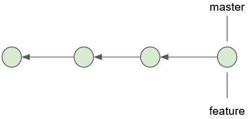
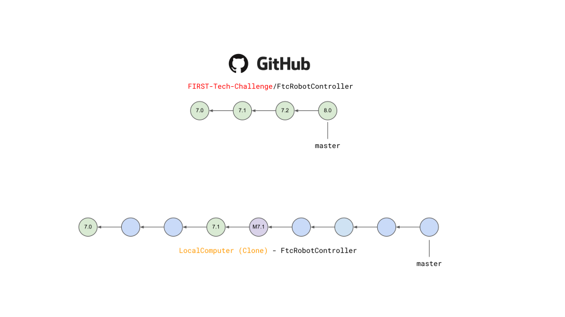
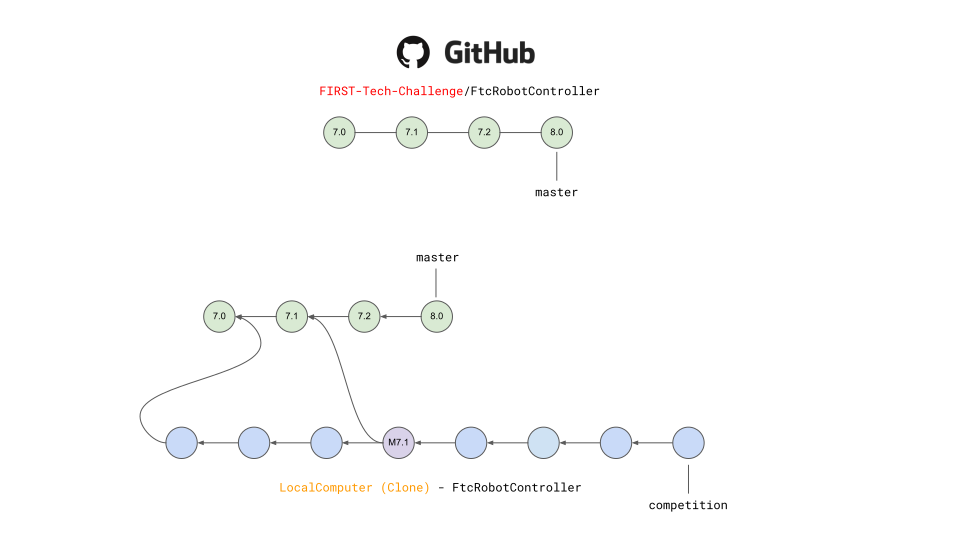

Fork and Clone from GitHub
~~~~~~~~~~~~~~~~~~~~~~~~~~

.. important::
   This approach assumes a basic familiarity with git and GitHub.  As with most things related
   to git there are many different ways to satisfy any objective.  This documentation describes
   one method for Windows users.  Users not comfortable with command line tools and git should obtain the SDK via
   :doc:`Downloading the SDK as a zip archive <../downloading_as_project_folder/Downloading-the-Android-Studio-Project-Folder>`.

Forks vs. Clones
++++++++++++++++

A fork on GitHub is a copy of another repository on GitHub from one account to another account.  The forked respository retains
a parent relationship with the origin repository.  Forks are typically used when software will have an independent line of
development.  In the case of FTC Team software, this typically comprises all of the team OpModes and supporting software.  A team
with multiple software developers may create a fork of FIRST-Tech-Challenge/FtcRobotController as a convenient way to manage
different development threads.

A clone is a copy of respository, typically on a local laptop.  A team member may develop and test software within
their local clone, and when satified that a feature is complete, or wants to checkpoint some work can push that software
from their local clone to the team fork.  Local work should typically be done on feature branches, pushed back to the fork
on GitHub and merged into the team fork's repository on GitHub.  Teams should not issue pull requests against the upstream
parent, the FIRST-Tech-Challenge/FtcRobotContoller repository, of the team fork.

.. figure:: images/fork-clone-diagram.PNG
   :align: center
   :width: 70%
   :alt: Diagram showing the relationship between forks and clones.

   The relationship between forks and clones.  The clone exists on your local laptop while the fork exists on GitHub servers.

Branch Strategies
+++++++++++++++++

A branch represents an independent line of development.  The default branch for the FtcRobotController repository, and
its forks and clones is 'master'.  Using branches judiciously can help developers collaborate on a common set of software by
isolating changes, keeping the default branch clean, and providing space for feature development to iterate independent of
software that's been deemed 'production ready'.

.. figure:: images/single-branch.png
   :align: center
   :alt: one branch

   A single branch with the default name of master

Each circle represents a commit.

A commit is a snapshot of the entire workspace at a point in time.  Git does not store diffs.  If you make a change to a file, and
create a new commit with the changed file, it stores the entire changed file in the commit.  To avoid unnecessary
duplication of files, if your repository consists of three files, and the other two were unchanged then the
snapshot points back to the unchanged files.

Note that each commit has a parent which allows git to determine reachability of commits from different
branches.  It also allows git to determine the common ancestor commit of any two branches, which is important
when merging branches.  More on that later.

So what is a branch?  A branch is simply a named pointer to a commit.  When a branch is created you are just
telling git to create a name, and point it at a commit.  Being on a branch simply means that when you add
a new commit, git moves the branch name to the new commit and the new commit's parent is the commit that the
branch name was pointing to previously. Since this creates a line of development independent of the parent, developers can experiment,
make changes, develop new features, all without disrupting the work of other team members.  When a developer is satisfied
that a branch is stable enough to be shared, the branch can be merged back into the parent.

   Two branches that point to the same commit.

Immediately after creating a branch the new branch name simply points to the latest commit from the branch that
the new branch was created from.

.. figure:: images/new-commit-on-feature.png
   :align: center
   :alt: two branches

   New commit on the feature branch.

Note how the new commit caused the name pointer of the feature branch to move to the new commit, while the
name pointer for the master branch remains on the prior commit, but the parent of the new commit is the
commit that the name pointer for master points to.  If a new commit is added to the master branch then the
parent of the new commit is also the commit that master is pointing to thereby creating independent lines
of development.

   Two independent lines of development.

It can be useful to ensure that the default branch in team forks and clones matches the default branch for
FIRST-Tech-Challenge/FtcRobotController.  However a typical development pattern will have team developers committing
team software back to the master branch, whether via merges from feature branches, or direct commits to master.

   FIRST-Tech-Challenge/FtcRobotController master vs. typical team repository master.

Team commits are represented by blue circles, while commits containing SDK updates are represented by green circles.  The
purple circle is a merge commit.  More on merges later. In this
instance team commits are interleaved with SDK updates (1), which produces a situation where the two default branches do not match.

(1) Not really, or maybe depending upon how the commit parentage lays out.
This is a vastly simplified view of things, but is sufficient to demonstrate the logical concept
and is the view of things you get if you simply execute `git log`.
For an in-depth, approachable, explanation of exactly what is happening with commits as they relate to
branches `see this tutorial <https://www.biteinteractive.com/picturing-git-conceptions-and-misconceptions/>`_

While this is a perfectly acceptable, and a very common branch management strategy, certain benefits can be obtained if we
isolate the default branch so that it always matches the parent.  The following figure demonstrates a clone whose master branch
is tracking the master branch from FIRST-Tech-Challenge/FtcRobotController.

   Team repository's master always matches FIRST-Tech-Challenge/FtcRobotController's master branch.

The purple commit is a merge of v7.1 into the competition branch.  In this diagram, v7.2 and v8.0 remain unmerged and the
competition branch will be building against v7.1 of the SDK.

Following this model means that commit history for the master branch for the team's repository will always match the commit
history for the FIRST-Tech-Challenge/FtcRobotController's master branch.  All software that teams intend to compete with is merged into a competition branch.
Features, new software, experiments, etc, are worked on in child branches of the competition branch and merge back into the
competition branch, not the master branch.  SDK updates to a team clone's master branch should always be conflict free,
updates can be done independent of merges into a competition branch, and if something goes sideways when doing a merge of
an SDK update into development it can be more straightforward to recover as opposed to backing out of an update straight into
master where the branches do not match.

More detailed information on the mechanics of branching can be found here `Using Branches <https://www.atlassian.com/git/tutorials/using-branches>`_

Getting Started
+++++++++++++++

.. important::
   The following assumes all operations are done on the master branch of your local repository.

#. Obtain and install `GitForWindows <https://gitforwindows.org/>`_  This software contains a git client along with a bash shell.
   All of the command line snippets below assume you are using a bash shell and that git is in your path.  GitForWindows is
   the easiest way to provide this for Windows machines.  Macs have a built in bash shell called terminal, but git must
   be installed separately.

#. Fork the `FIRST-Tech-Challenge/FtcRobotController <https://github.com/FIRST-Tech-Challenge/FtcRobotController>`_ repository into your account on GitHub.

   .. figure:: images/fork.PNG
      :align: center
      :width: 80%
      :alt: Click on the fork button in the upper right corner

      Forking a GitHub repository.

#. Clone from your fork onto your local computer.  Note in the image below the account is FIRST-Tech-Challenge, but after
   your fork, the account should be your team account.  In all other respects the user interface will be identical.

   .. figure:: images/clone.PNG
      :align: center
      :width: 80%
      :alt: Click on the fork button in the upper right corner

      Cloning a forked repository.

   Click the 'code' button, copy the url in the text entry box then open a git bash shell and execute

   .. code-block:: bash

      git clone <copied-url>

#. Code away...

Best Practices
--------------

  - Do not make changes to software in the FtcRobotController directory.  SDK updates will be much easier if you
    do not change anything in FtcRobotController.
  - Do not use long lived branches.  Branches should implement a feature.  Branches should not track milestones.
    For example a branch named 'league-meet-1' is tracking a milestone.  It is much better if your branches track
    smaller units of development.  'detect-target', 'drive-to-parking', 'drop-game-element'.  Break your software
    down into tasks for the robot to do, and use branches to implement those tasks.  This will allow for much
    easier collaborative development, much smaller change sets when merging, and much easier fetches and merges.
  - Try to keep your git index clean.  This will make fetches and merges easier.  git status is your best friend here.
    Use git status often to see what has changed in your local workspace.  Commit often in logical chunks so that it
    is easy to see the most recent changes.
  - Use short, meaningful, commit messages.  Do not use slang, offensive, or personal messaging in a commit message.
    When you push your software to GitHub, those commit messages will be public.  If you plan to eventually become
    a professional software developer, and you retain your existing GitHub account any potential employer will be
    able to review your commit messages.  Tread lightly here.

Updating your Fork and Local Clone.
+++++++++++++++++++++++++++++++++++

Updating the SDK involves pulling newly released software into both your local clone's and your fork.  There are
two ways to go about this.  Either directly fetch and merge software from the parent into your fork on github,
then fetch and merge to your local, or fetch from the parent into your local clone, merge locally and then push
to your fork.

This author prefers the latter because it gives the developer the opportunity test new software before pushing
to the fork.  It also allows for merge conflict resolution locally instead of through GitHub's UI.

Obtaining the Latest Software
-----------------------------

When describing how to update a repository many basic tutorials will use the git pull command.  The pull command
is actually doing a fetch and merge for the user behind the scenes.  This can be fine, but it is useful to understand
the concepts of fetching and merging as independent operations.  If things go south, and you have a good
concept of the underlying mechanics, you are much more likely to be able to fix any subsequent problems.

Remotes
.......

Git is fundamentally built around the idea that there can be many copies of a repository floating about on
the internet, or other people's machines, or corporate file servers, or any number of locations.  And that
these repositories can linked to each other remotely.  A remote repository is simply defined as a version
of a repository hosted somewhere else.   In the preceding examples, your fork of FtcRobotController is a
remote of your local clone.

   .. figure:: images/origin-remote.svg
      :align: center
      :alt: remotes

      Illustration of FtcRobotController as remote named origin.

Remotes may be referenced in git commands and a repository can have any number of remotes.  The default
name for the remote of a repository that has been cloned is 'origin'.  The conventional name of a remote
that tracks the parent of a fork is 'upstream'.

   .. figure:: images/two-remotes.svg
      :align: center
      :alt: remotes

      A local repository with two remotes.

To see what remote are established for a given repository

   .. code-block:: console

      $ git remote -v

To add the parent of your team's fork as a remote of your local clone

   .. code-block:: console

      $ git remote add upstream https://github.com/FIRST-Tech-Challenge/FtcRobotController.git

The rest of this tutorial assumes that you have added FIRST-Tech-Challenge/FtcRobotController as an upstream
in your local clone.

Fetching
........

Fetching is the process of downloading software changes from a remote repository.  Note specifically that fetching
**does not** modify any of the existing software in the repository that you are fetching into, git isolates the
changes in the local repository.

If you are working with a team, and a teammate has pushed software to your FtcRobotController fork, you may
fetch that software to a local clone by running

   .. code-block:: console

      $ git fetch origin

This will download any changes in all branches on the remote named origin that are not present in the local
repository.

   .. figure:: images/fetch-from-origin.svg
      :align: center
      :alt: remotes

      Fetching changes from origin.

Merging
.......

Merging is the process of merging fetched software into a branch, most commonly the current branch of the repository.
A merge is where things are most likely to get a bit confusing.  However, if you are simply merging from a remote master
into a local master, and your local master is always tracking the remote, your merges should go smoothly.

   .. figure:: images/merge-from-origin.PNG
      :align: center
      :alt: remotes

      Merging fetched changes from the origin repository.

Ensure you are on the master branch and run the following:

   .. code-block:: console

      $ git merge origin/master

The master branch should be clean when this operation is performed.  Team members should be doing development
work in feature branches.

Conflicts
.........

Conflicts, or "What happens when bad things happen."  I'm avoiding conflict discussion at present.

Updating the SDK to the Latest Version
......................................

To update the SDK, we simply fetch from upstream, FIRST-Tech-Challenge/FtcRobotController, the parent of your team fork,
then merge and push to origin to complete the update.

   .. figure:: images/fetch-from-upstream.svg
      :align: center
      :alt: remotes

      Fetching changes from the upstream repository.

Instead of fetching from origin, fetch from upstream.  This copies in any commits that you don't already have in your local clone.
In the diagram above that is the v8.0 commit.  Your local master is not changed.  It is still pointing to, and representing, the v7.2
commit.  Since a commit is a complete snapshot of a workspace at a point in time, nothing changes in your workspace, but your
repository has a new commit with the branch name upstream/master.

   .. code-block:: console

      $ git fetch upstream

   .. figure:: images/merge-from-upstream.png
      :align: center
      :alt: remotes

      Merging fetched changes from the upstream repository.

After fetching, merge the upstream/master branch into master.  If your local master matches your upstream master then a merge is as
simple as moving the master branch label to the commit that upstream/master is pointing to.  This is referred to as a fast-forward
merge.  And since a commit is a complete snapshot of a workspace at a point time, your local workspace now contains the snapshot
represented by v8.0.

   .. code-block:: console

      $ git merge upstream/master

   .. figure:: images/push-to-origin.png
      :align: center
      :alt: remotes

      Pushing fetched and merged changes back to your team fork.

Once you've merged the upstream/master into your local clone's master branch, push those changes to GitHub so that your GitHub clone
reflects the upstream respository.

   .. code-block:: console

      $ git push origin master

If you were working in a feature branch and want to bring the new SDK changes into that feature branch you
merge from master into the branch by checking out the branch and running the merge command.  This is where things might get dicey
as this is where you are most likely to encounter merge conflicts.

   .. code-block:: console

      $ git checkout <feature-branch>
      $ get merge master

Downgrading the SDK to a Previous Version
.........................................

Typically, the working branch of a local repository, whether it's master, or a competition branch will eventually contain a
series team commits interleaved with SDK update commits.  In this scenario a team can not simply roll back to a prior SDK
version without also rolling back all of their team commits.  Consider the following diagram.

   .. figure:: images/sample-rollback.png
      :align: center
      :alt: sample repository

      A repository with both team commits and SDK update commits.

If you just chopped off the branch at M7.2, you'd lose the three blue team commits.  In order to retain team work, instead create a
new merge commit that reverts the 8.0 commit.  Do not revert merge commits, e.g. M8.0.  The merge commit itself may contain work that
represents the divergence of the the two branches that were merged.  This is not what you want.  You want to revert the parent of the merge
commit that represents the new, old, SDK version.

Versions in the SDK follow a standard `semantic versioning <https://semver.org/>`_ scheme.  When a new SDK version is released, the FTC
engineering team pushes a release candidate branch to FIRST-Tech-Challenge/FtcRobotController, then merges that branch into master.  This
results in two commits, the new SDK version commit that contains all the good stuff, and a merge commit representing the merge from the
candidate branch into master.  The release is then formally cut, where a tag is then created, on the merge commit.  Tags always follow the
semantic versioning rules.  e.g. v7.0, v7.1, v7.2, v8.0, etc.

   .. figure:: images/revert.png
      :align: center
      :alt: demonstrating the revert

      A new merge commit representing the revert from v8.0 to v7.2.

Because the merge commit has two parents, and you want to reference the SDK version commit, use the tag name you want to roll back and append ^2.  For example to roll back v8.0, resulting in the SDK
compiling against v7.2 use.

   .. code-block:: console

      $ git revert -Xtheirs v8.0^2

