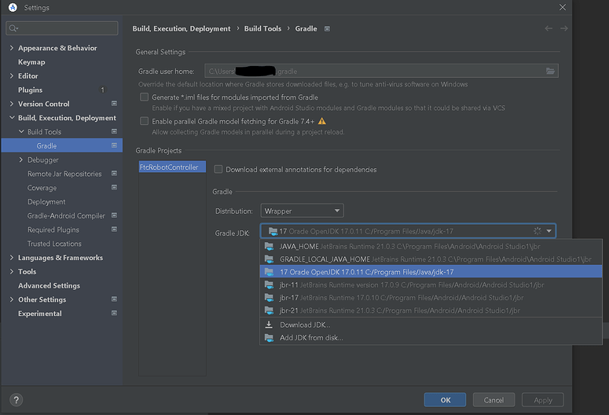
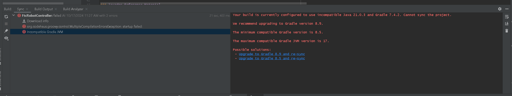
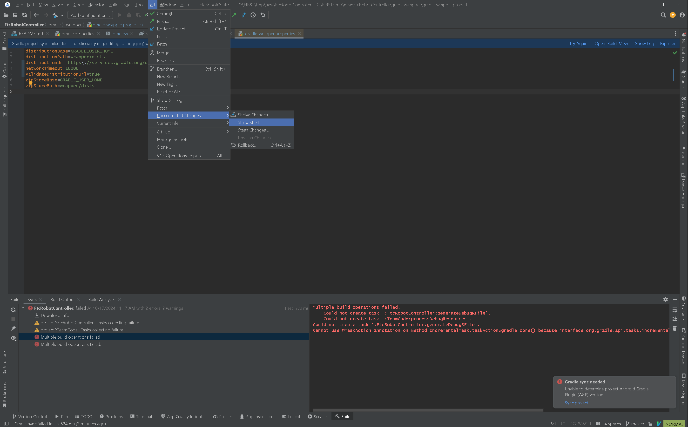
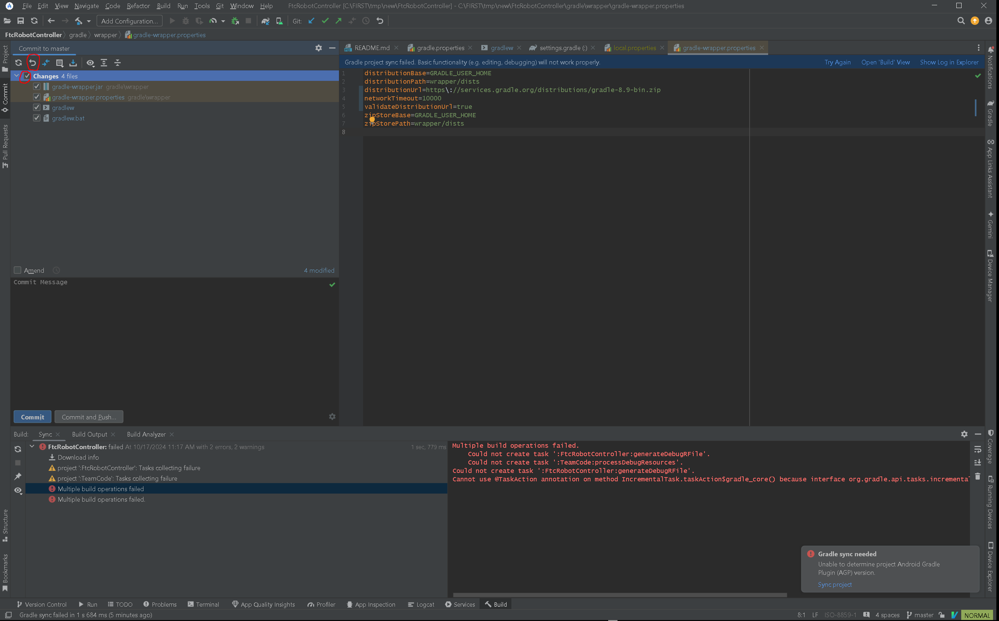

Installing Android Studio :bdg-success:`AS`
===========================================

Android Developer Website
~~~~~~~~~~~~~~~~~~~~~~~~~

Android Studio is distributed freely by Google, and the most up-to-date
reference for installing and using the Android Studio software can be
found on the Android developer website:

*  https://developer.android.com/studio

Android Studio is available on the Windows, MacOS, and Linux operating
systems.

System Requirements
~~~~~~~~~~~~~~~~~~~

Before you download and install the Android Studio you should first
check the list of system requirements on the Android developer's website
to verify that your system satisfies the list of minimum requirements:

*  `Windows <https://developer.android.com/codelabs/basic-android-kotlin-compose-install-android-studio#1>`__
*  `MacOS <https://developer.android.com/codelabs/basic-android-kotlin-compose-install-android-studio#3>`__
*  `Linux <https://developer.android.com/codelabs/basic-android-kotlin-compose-install-android-studio#5>`__

.. caution:: 

   With the introduction of **Android Studio Ladybug**, the JDK that is packaged with
   Android Studio is incompatible with the FtcRobotController workspace.  If you install
   or update an existing installation to Android Studio Ladybug, you will need to install
   JDK 17 separately.

   Upon initial load of the FtcRobotController workspace using Android Studio Ladybug, 
   an error will be displayed during the Gradle sync and Android Studio will recommend that
   you upgrade Gradle.  Do not upgrade Gradle.

   For more detailed instructions see: Configuring

Downloading and Installing Android Studio
~~~~~~~~~~~~~~~~~~~~~~~~~~~~~~~~~~~~~~~~~

Once you have verified that your laptop satisfies the minimum system
requirements, you can go to the Android developer's website to download
and install Android Studio:

*  https://developer.android.com/studio

Click on the green "DOWNLOAD ANDROID STUDIO" button to start the
download process.

.. image:: images/DownloadAndroidStudio.jpg
   :align: center

|

Accept the license terms and then push the blue "DOWNLOAD ANDROID
STUDIO" button on the Android Developer webpage to download the
software.

.. image:: images/AndroidStudioWelcomeSetup.jpg
   :align: center

|

Once the setup package has downloaded, launch the application and follow
the on-screen instructions to install Android Studio.

Configuring Android Studio (Ladybug and later)
~~~~~~~~~~~~~~~~~~~~~~~~~~~~~~~~~~~~~~~~~~~~~~

.. note:: 
   
   See the Caution above for why this is necessary.

.. note:: 
   
   Android Studio Ladybug updates the underlying JetBrains IntelliJ version such that 
   the interface is a VSCode look alike.  The screenshots in this documentation use the
   JetBrains/Android Studio Classic UI which is no longer supported natively by JetBrains.
   To follow along, users should install the `Classic UI <https://plugins.jetbrains.com/plugin/24468-classic-ui>`__ plugin.

#. `Install JDK 17 <https://www.oracle.com/java/technologies/javase/jdk17-archive-downloads.html>`__
   If you did not already have this installed independently of Android Studio. 
   e.g. If you were using Android Studio’s bundled JDK, then when Ladybug is installed Android Studio 
   will unhelpfully overwrite your old bundled JDK version. Note there’s a bug in the Settings → Build Tools → Gradle dialog 
   that may make you think your old version of the JDK is there, but it is not. You must use an unbundled version of the JDK.

#. Go to File -> Settings and under Build, Execution, Deployment -> Build Tools -> Gradle use the Add JDK from disk option 
   to select the newly installed JDK 17. In the image below take careful note of the directory paths 
   for the options labelled jbr-17 and jbr-21. Note that they are the same. This is the aforementioned UI bug, 
   and that is Android Studio overwriting your old JDK. In this image you’ll see I’ve selected the JDK that 
   was installed independently.

|

Do Not Upgrade Gradle
~~~~~~~~~~~~~~~~~~~~~

If you have upgraded Android Studio from an earlier version to Ladybug, or you did not install and
configure the JDK prior to loading a FtcRobotController workspace, then Android Studio may present an 
error and recommend that you upgrade Gradle.

|

Do not do this.  The FtcRobotController build is incompatible with upgraded Gradle.  If you do, you
will presented with another, even more, indecipherable error.

To recover, you need to rollback the changes that Android Studio made upon that click.
To do that select Git -> Uncommitted Changes -> Show Shelf

|

That will show the changes you have in your workspace. You want to rollback the 4 gradle files shown in the 
following image. You can either select the Changes checkbox to select all files, or individually select the 
gradle files. Note that if you have changes in your workspace that haven’t been committed, you want to be 
careful not to select those files or you may lose work.

|

Once you have the proper files selected, click the Rollback button.

Resync and that should revert you to the error that prompted you to upgrade Gradle in the first place. 
From there follow the instructions above to install JDK 17.

