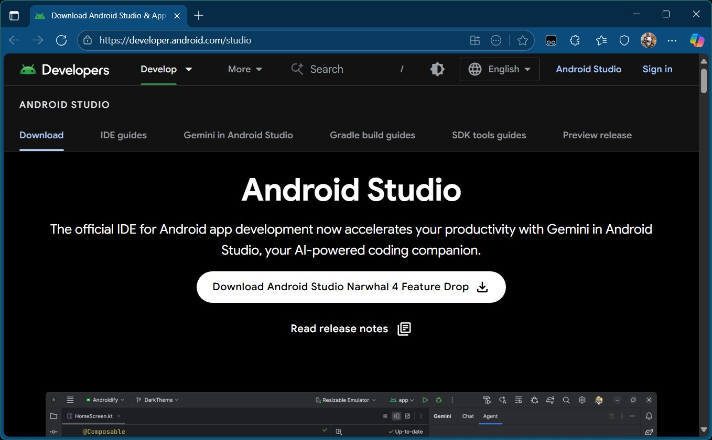
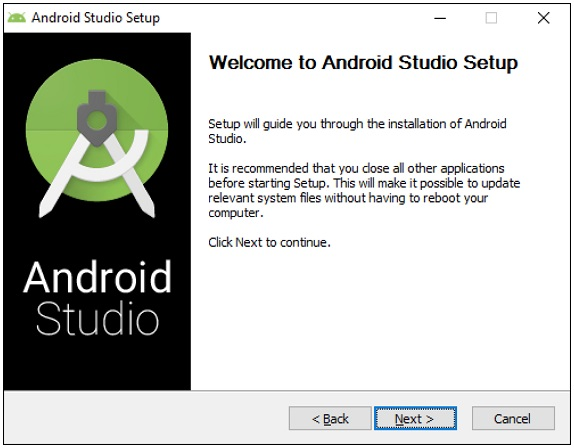

Installing Android Studio :bdg-success:`AS`
===========================================

Android Developer Website
~~~~~~~~~~~~~~~~~~~~~~~~~

Android Studio is distributed freely by Google, and the most up-to-date
reference for installing and using the Android Studio software can be
found on the Android developer website:

*  https://developer.android.com/studio

Android Studio is available on the Windows, MacOS, and Linux operating
systems.

System Requirements
~~~~~~~~~~~~~~~~~~~

Before you download and install the Android Studio you should first
check the list of system requirements on the Android developer's website
to verify that your system satisfies the list of minimum requirements:

*  `Windows <https://developer.android.com/codelabs/basic-android-kotlin-compose-install-android-studio#1>`__
*  `MacOS <https://developer.android.com/codelabs/basic-android-kotlin-compose-install-android-studio#3>`__
*  `Linux <https://developer.android.com/codelabs/basic-android-kotlin-compose-install-android-studio#5>`__

.. caution:: 

   With the introduction of **Android Studio Ladybug**, the JDK that is packaged with
   Android Studio is incompatible with the FtcRobotController workspace.  If you install
   or update an existing installation to Android Studio Ladybug, you will need to install
   JDK 17 separately.

   Upon initial load of the FtcRobotController workspace using Android Studio Ladybug, 
   an error will be displayed during the Gradle sync and Android Studio will recommend that
   you upgrade Gradle.  Do not upgrade Gradle.

   For more detailed instructions see: Configuring

Downloading and Installing Android Studio
~~~~~~~~~~~~~~~~~~~~~~~~~~~~~~~~~~~~~~~~~

Once you have verified that your laptop satisfies the minimum system
requirements, you can go to the Android developer's website to download
and install Android Studio:

*  https://developer.android.com/studio

Click on the white "Download Android Studio <latest version>" button to start the
download process.

|

Accept the license terms and then push the white "Download Android
Studio <latest version> for <operating system>" button on the Android
Developer webpage to download the software.

Once the setup package has downloaded, launch the application and follow
the on-screen instructions to install Android Studio.

|
