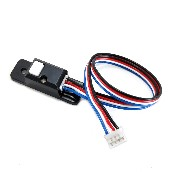

Using Sensors (Android Studio)
==============================

Color-Distance Sensor
~~~~~~~~~~~~~~~~~~~~~

A sensor is a device that lets the Robot Controller get information
about its environment. In this example, you will use a REV Robotics
Color-Distance sensor to display range (distance from an object) info to
the driver station.

The Color-Range sensor uses reflected light to determine the distance
from the sensor to the target object. It can be used to measure close
distances (up 5" or more) with reasonable accuracy. Note that at the
time this document was most recently edited, the REV Color-Range sensor
saturates around 2" (5cm). This means that for distances less than or
equal to 2", the sensor returns a measured distance equal to 2" or so.

Modify your op mode to add a telemetry statement that will send the
distance information (in centimeters) to the Driver Station.

::

   telemetry.addData("Servo Position", servoTest.getPosition());
   telemetry.addData("Target Power", tgtPower);
   telemetry.addData("Motor Power", motorTest.getPower());
   telemetry.addData("Distance (cm)", sensorColorRange.getDistance(DistanceUnit.CM));
   telemetry.addData("Status", "Running");
   telemetry.update();

After you have modified your op mode, build and install the updated
Robot Controller app, then run the op mode to verify that it now
displays distance on your Driver Station. Note that if the distance
reads "NaN" (short for "Not a Number") it probably means that your
sensor is too far from the target (zero reflection). Also note that the
sensor saturates at around 5 cm.

Touch Sensor
~~~~~~~~~~~~

The REV Robotics Touch Sensor can be connected to a digital port on the
Expansion Hub. The Touch Sensor is HIGH (returns TRUE) when it is not
pressed. It is pulled LOW (returns FALSE) when it is pressed.

|

The Expansion Hub digital ports contain two digital pins per port. When
you use a 4-wire JST cable to connect a REV Robotics Touch sensor to an
Expansion Hub digital port, the Touch Sensor is wired to the second of
the two digital pins within the port. The first digital pin of the
4-wire cable remains disconnected.

For example, if you connect a Touch Sensor to the "0,1" digital port of
the Expansion Hub, the Touch Sensor will be connected to the second pin
(labeled "1") of the port. The first pin (labeled "0") will stay
disconnected.

Modify the code in your op mode that occurs before the waitForStart
command to set the digital channel for input mode.

::

   // set digital channel to input mode.
   digitalTouch.setMode(DigitalChannel.Mode.INPUT);

   telemetry.addData("Status", "Initialized");
   telemetry.update();
   // Wait for the game to start (driver presses PLAY)
   waitForStart();

Also, modify the code in your while loop to add an if-else statement
that checks the state of the digital input channel. If the channel is
LOW (false), the touch sensor button is pressed and being pulled LOW to
ground. Otherwise, the touch sensor button is not pressed.

::

   // is button pressed?
   if (digitalTouch.getState() == false) {
       // button is pressed.
       telemetry.addData("Button", "PRESSED");
   } else {
       // button is not pressed.
       telemetry.addData("Button", "NOT PRESSED");
   }

   telemetry.addData("Status", "Running");
   telemetry.update();

Build and install the updated Robot Controller app, then reinitialize
and restart your op mode. The op mode should now display the state of
the button ("PRESSED" or "NOT PRESSED").

