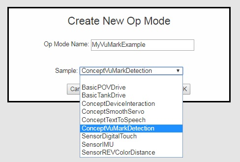

Blocks Reference Materials
==========================

Blocks Reference Manual
~~~~~~~~~~~~~~~~~~~~~~~

As you start to write more complicated op modes, you will need to use
more features of the FIRST Tech Challenge software development kit
(SDK). Bruce Schafer of the Oregon Robotics Tournament & Outreach
Program (ORTOP) created a useful reference document that describes the
programming blocks that are available with the Blocks Programming
Tool:

`Blocks Programming Tool Reference
Manual <http://www.ortop.org/ftc/BlocksProgramming/BlocksProgrammingReferenceManual.pdf>`__

Sample Op Modes
~~~~~~~~~~~~~~~

The Blocks Programming Tool has several built-in example op modes that
demonstrate how to do different tasks with the FIRST Tech Challenge
control system. As you create a new file, you can use the Sample
dropdown list control to display a list of available sample op modes or
templates:

|

Technology Forum
~~~~~~~~~~~~~~~~

Registered teams can create user accounts on the FIRST Tech Challenge
forum. Teams can use the forum to ask questions and receive support from
the FIRST Tech Challenge community.

The technology forum can be found at the following address:

https://ftcforum.firstinspires.org/forum/ftc-technology?156-FTC-Technology

REV Robotics Expansion Hub Documentation
~~~~~~~~~~~~~~~~~~~~~~~~~~~~~~~~~~~~~~~~

`REV Robotics Expansion Hub Getting Started
Guide <https://docs.revrobotics.com/duo-control/control-system-overview/expansion-hub-basics>`__
