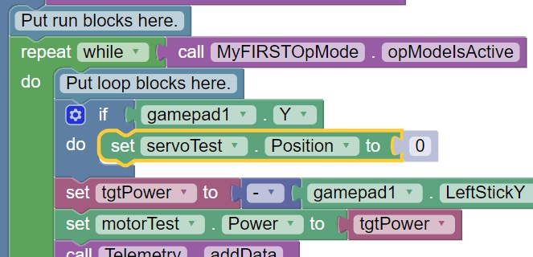

Controlling a Servo (Blocks)
----------------------------

In the section titled :doc:`Creating an Op Mode with 
Blocks <../creating_op_modes/Writing-an-Op-Mode-with-FTC-Blocks>` you learned how to use
the Blocks Programming Tool to write an op mode that controls a 12V
DC motor. In this section, you will learn how to write an op mode that
controls a servo motor.

What is a Servo Motor?
~~~~~~~~~~~~~~~~~~~~~~

A servo motor is a special type of motor that is designed for precise
motion. A typical servo motor has a limited range of motion.

In the figure below, a "standard scale" 180-degree servo is shown. This
type of servo is popular with hobbyists and with FIRST Tech Challenge
teams. This servo motor can rotate its shaft through a range of 180
degrees. Using an electronic module known as a servo controller you can
write an op mode that will move a servo motor to a specific position.
Once the motor reaches this target position, it will hold the position,
even if external forces are applied to the shaft of the servo.

|

Servo motors are useful when you want to do precise movements (for
example, sweep an area with a sensor to look for a target or move the
control surfaces on a remotely controlled airplane).

Modifying Your Op Mode to Control a Servo
~~~~~~~~~~~~~~~~~~~~~~~~~~~~~~~~~~~~~~~~~

Let's modify your op mode to add the logic required to control a servo
motor. For this example, you will use the buttons on the Logitech F310
gamepad to control the position of the servo motor.

With a typical servo, you can specify a target position for the servo.
The servo will turn its motor shaft to move to the target position, and
then maintain that position, even if moderate forces are applied to try
and disturb its position.

For the blocks Program & Manage server, you can specify a target
position that ranges from 0 to 1 for a servo. A target position of 0
corresponds to zero degrees of rotation and a target position of 1
corresponds to 180 degrees of rotation for a typical servo motor.

.. image:: images/servo0to80.jpg
   :align: center

|

In this example, you will use the colored buttons on the right side of
the F310 controller to control the position of the servo. Initially, the
op mode will move the servo to the midway position (90 degrees of its
180-degree range). Pushing the yellow "Y" button will move the servo to
the zero-degree position. Pushing the blue "X" button or the red "B"
button will move the servo to the 90-degree position. Pushing the green
"A" button will move the servo to the 180-degree position.

|

Modifying the Op Mode to Control a Servo Motor Instructions
-----------------------------------------------------------

1. Verify that your laptop is still connected to the Robot            
Controller's Program & Manage Wi-Fi network.                          

2. Verify that "MyFIRSTOpMode" is opened for editing. If it is not,   
you can click on the FIRST logo in the upper left-hand corner of the  
browser window on the laptop. This should take you to the main 
Blocks Development Tool project screen. 

.. image:: images/ControlServoStep2ControlHub.jpg
   :align: center

|

   Click on the "MyFIRSTOpMode" project to open it for editing if it is not already opened.

3. On the left-hand side of the screen click on the category called   
"Actuators" and look for the subcategory called "Servos".             

.. image:: images/ControlServoStep3ControlHub.jpg
   :align: center

|

4. Select the "set servoTest.Position to" block from the list of      
available Servo blocks.                                               

|

5. Drag the "set servoTest.Position to" block to the spot just under  
the comment block that reads "Put initialization blocks here." The    
block should click into place.                                        

|

6. Click on the number block "0" and change the block's value to      
"0.5".                                                                

|

   When a user selects this op mode, the servo position will initially be set to the midway point (90-degree position).

7. Click on the "Logic" category of the programming blocks and select 
the "if do" block from the list of available blocks. Drag the block   
to the position immediately after the comment block that reads "Put   
loop blocks here."                                                    

|

   The block should click into place.

8. Click on the "Gamepad" category of the programming blocks and      
select the "gamepad1.Y" block from the list of available blocks.      

|

   Note that this block is towards the bottom of the list of blocks.  You might have to scroll down to the bottom of the list before you can select this block.

9. Drag the "gamepad1.Y" block to the right side of the "if do"       
block. The block should click into place.                             

|

   The "if do" block will use the state of the gamepad1.Y value its test condition.  If the "Y" button is pressed, the statements within the "do" portion of the block will be executed.

10. On the left-hand side of the screen click on the category called  
"Actuators" and look for the subcategory called "Servos".             

|

11. Select the "set servoTest.Position to" block from the list of     
available Servo blocks.                                               

|

12. Drag the "set servoTest.Position to" block so that it snaps in    
place in the do portion of the "if do" block.                         

|

   If the "Y" button is pressed on gamepad #1, the op mode will move the servo's position to the 0-degree position.

13. Click on the blue and white Settings icon for the "if do" block.  
This will display a pop-up menu that lets you modify the "if do"      
block.                                                                

|

14. Drag an "else if" block from the left side of the pop-up menu and 
snap it into place under the "if" block.                              

|

   Drag a second "else if" block from the left side and snap it into place on the right side under the first "else if" block.

15. Click on the Settings icon to hide the pop-up menu for the "if    
do" block. The "if do" block should now have two "else if" test       
conditions added.                                                     

.. image:: images/ControlServoStep15ControlHub.jpg
   :align: center

|

16. Click on the "Logic" category and select the logical "and" block. 

|

17. Drag the "and" block so it clicks in place as the test condition  
for the first "else if" block.                                        

|

18. Click on the word "and" and select "or" from the pop-up menu to   
change the block to a logical "or" block.                             

.. image:: images/ControlServoStep18ControlHub.jpg
   :align: center

|

19. Click on the "Gamepad" category and select the "gamepad1.X"       
block. Drag the block so that it clicks in place as the first test    
condition of the logical "or" block.                                  

|

20. Click on the "Gamepad" category and select the "gamepad1.B"       
block. Drag the block so that it clicks in place as the second test   
condition of the logical "or" block.                                  

.. image:: images/ControlServoStep20ControlHub.jpg
   :align: center

|

21. Select a "set servoTest.Position to" block and place it into "do" 
clause of the first else-if block.                                    

|

22. Highlight the number "0" and change it to "0.5". With this        
change, if the user presses the "X" button or "B" button on gamepad   
#1, the op mode will move the servo to the midway (90-degree)         
position.                                                             

.. image:: images/ControlServoStep22ControlHub.jpg
   :align: center

|

23. Use a "gamepad1.A" block as the test condition for the second     
"else if" block. Drag a "set servoTest.position to" block to the do   
clause of the second "else if" block and modify the numeric value so  
that the servo's position will be set to a value of 1.                

|

   For this clause, if the "A" button is pressed on the #1 gamepad, the op mode will move the servo to the 180-degree position.

24. Insert a "call telemetry.addData" block (numeric) before the      
"call Telemetry.update" block. Rename the key field to "Servo         
Position" and insert a "servoTest.Position" block for the number      
field.                                                                

.. image:: images/ControlServoStep24ControlHub.jpg
   :align: center

|

   This set of blocks will send the current servo position value to the Driver Station while the op mode is running.

25. Save your op mode and verify that it was saved successfully to    
the Robot Controller.                                                 

.. image:: images/ControlServoStep25ControlHub.jpg
   :align: center

|

26. Follow the procedure outlined in the section titled :doc:`Running Your 
OpMode <../running_op_modes/Running-Your-Op-Mode>` 
to run your updated op mode. Also, make sure that your gamepad is     
designated as User #1 before running your op mode.                    

.. image:: images/ControlServoStep26ControlHub.jpg
   :align: center

|

   You should now be able to control the servo position with the colored buttons.  The servo position should be displayed on the Driver Station.

