Creating Op Modes (Blocks)
==============================

What's an Op Mode?
~~~~~~~~~~~~~~~~~~

During a typical *FIRST* Tech Challenge match, a team's robot must
perform a variety of tasks to score points. For example, a team might
want their robot to follow a white line on the competition floor and
then score a game element into a goal autonomously during a match. Teams
write programs called *op modes* (which stands for "operational modes")
to specify the behavior for their robot. These op modes run on the Robot
Controller after being selected on the Driver Station.

Teams who are participating in the *FIRST* Tech Challenge have a variety
of programming tools that they can use to create their own op modes.
This section of the wiki explains how to use the Blocks Programming
Tool to write an op mode for a robot.

The Blocks Programming Tool
~~~~~~~~~~~~~~~~~~~~~~~~~~~

The Blocks Programming Tool is a user-friendly programming tool that
is served up by the Robot Controller. A user can create custom op modes
for their robot using this tool and then save these op modes directly
onto the Robot Controller. Users drag and drop jigsaw-shaped programming
blocks onto a design "canvas" and arrange these blocks to create the
program logic for their op mode. The Blocks Programming Tool is
powered by Google's Blockly software and was developed with support from
Google.

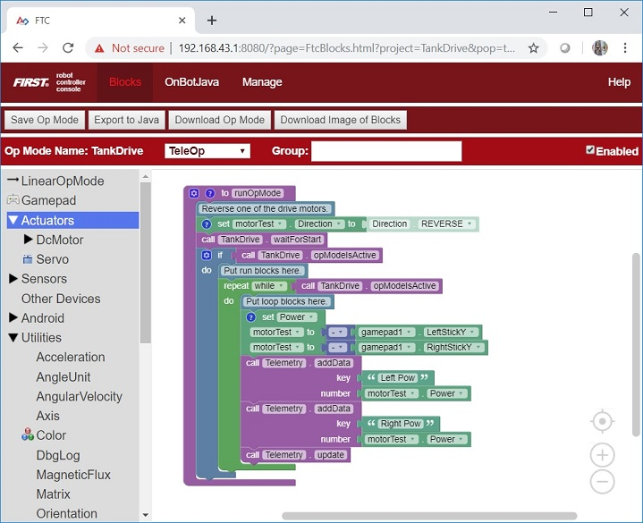

|

The examples in this section use a Windows laptop computer to connect to
the Robot Controller. This Windows laptop computer has a
Javascript-enabled web browser installed that is used to access the 
Blocks Programming Tool.

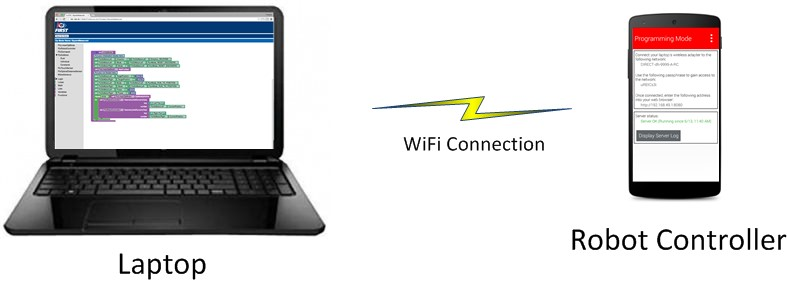

|

Note that the process used to create and edit an op mode is identical if
you are using a Control Hub as your Robot Controller.

.. image:: images/BlocksPicture2b.jpg
   :align: center

|

Note that if you prefer, you can use an alternate device, such as an
Apple Mac laptop, an Apple iPad, an Android tablet, or a Chromebook,
instead of a Windows computer to access the Blocks Programming Tool.
The instructions included in this document, however, assume that you are
using a Windows laptop.

Also note that this section of the wiki assumes that you have already
setup and configured your Android devices and robot hardware. It also
assumes that you have successfully connected your laptop to the Robot
Controller's Progam & Manage wireless network.

Creating Your First Op Mode
~~~~~~~~~~~~~~~~~~~~~~~~~~~

If you connected your laptop successfully to the Program & Manage
wireless network of the Robot Controller, then you are ready to create
your first op mode. In this section, you will use the Blocks
Programming Tool to create the program logic for your first op mode.

Note that it will take an estimated 10 minutes to create your first op
mode.

Creating Your First Op Mode Instructions
----------------------------------------

1. Launch the web browser on your laptop (FIRST recommends using      
Google Chrome) and find the web address that is displayed on the      
Program & Manage screen of the Robot Controller.

.. important:: If your Robot Controller is an Android smartphone, then the address to access the Program & Manage server is "192.168.49.1:8080".

.. image:: images/WritingFirstOpModeStep1a.jpg
   :align: center

|

.. important:: If your Robot Controller is a Control Hub, then the address to access the Program & Manage server is "192.168.43.1:8080".  Notice the difference in the third octet of the IP addresses (the Control Hub has a "43" instead of a "49").

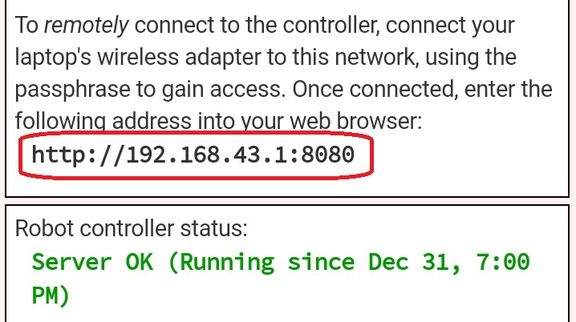

|

   Type this web address into the address field of your browser and press RETURN to navigate to the Program & Manage web server.

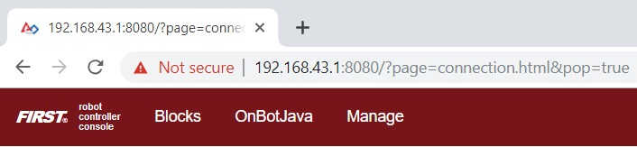

|

2. Verify that your web browser is connected to the programming mode  
server. If it is connected to the programming mode server             
successfully, the Robot Controller Console should be displayed.       

.. image:: images/WritingFirstOpModeStep2ControlHub.jpg
   :align: center

|

3. Press the **Blocks** link towards the top of the Console to        
navigate to the main Blocks Programming screen.                       

.. image:: images/WritingFirstOpModeStep3aControlHub.jpg
   :align: center

|

   The main Blocks Programming screen is where you create new op modes.  It is also the screen where you can see a list of existing Blocks Op Modes on a Robot Controller.  Initially this list will be empty until you create and save your first op mode.

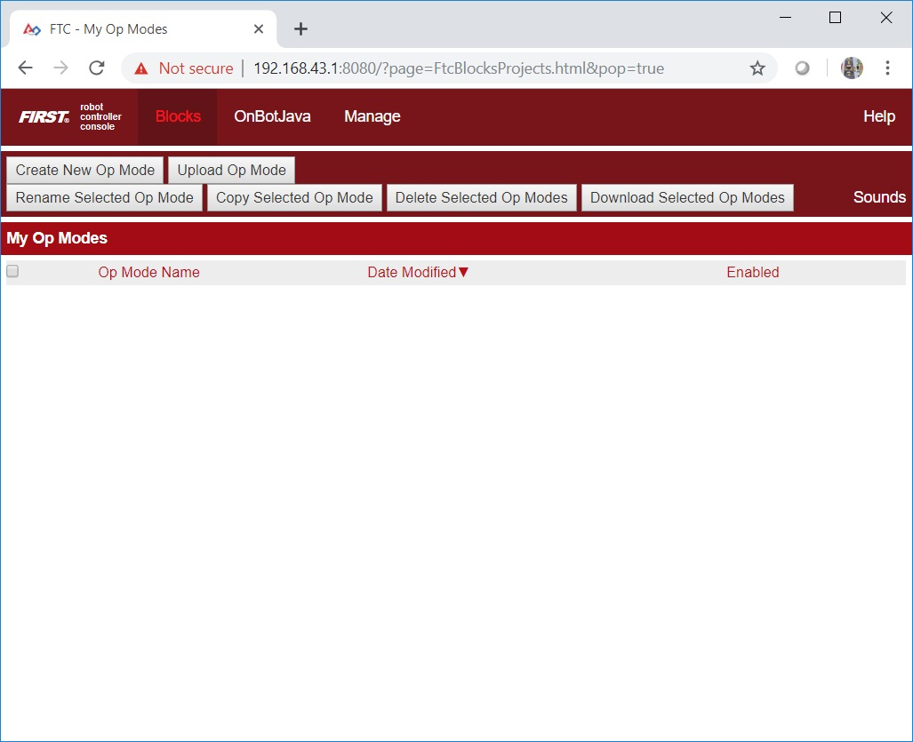

|

4. Press the "Create New Op Mode" button which should be visible      
towards the upper left hand corner of the browser window.             

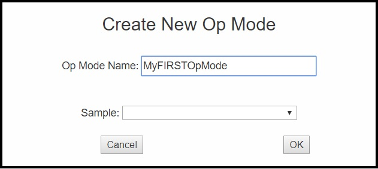

|

   When prompted, specify a name for the op mode and hit "OK" to continue.

5. Verify that you created the new op mode. You should see your newly 
created op mode opened for editing in your web browser's main screen. 

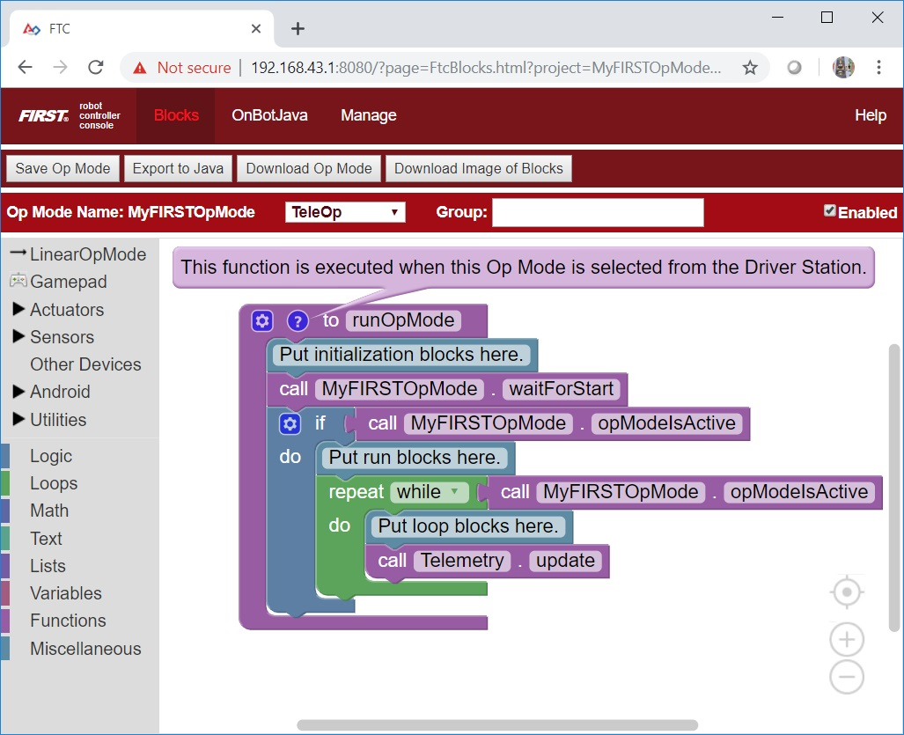

|

   Notice that the left-hand side of the browsers screen contains a list of categorized programming blocks.  If you click on a category, the browser will display a list of available related programming blocks.

   The right-hand side of the screen is where you arrange your programming blocks to create the logic for your op mode.

Examining the Structure of Your Op Mode
~~~~~~~~~~~~~~~~~~~~~~~~~~~~~~~~~~~~~~~

When you create a new op mode, there should already be a set of
programming blocks that are placed on the design canvas for your op
mode. These blocks are automatically included with each new op mode that
you create. They create the basic structure for your op mode.

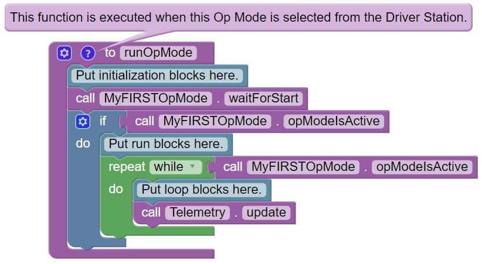

|

In the figure shown above, the main body of the op mode is defined by
the outer purple bracket that has the words "to runOpMode" at the top.
As the help tip indicates, this function is executed when this op mode
("MyFIRSTOpMode" in this example) is selected from the Driver Station.

It can be helpful to think of an op mode as a list of tasks for the
Robot Controller to perform. The Robot Controller will process this list
of tasks sequentially. Users can also use control loops (such as a while
loop) to have the Robot Controller repeat (or iterate) certain tasks
within an op mode.

|

If you think about an op mode as a list of instructions for the robot,
this set of instructions will be executed by the robot whenever a team
member selects the op mode called "MyFIRSTOpMode" from the list of
available op modes for this Robot Controller.

You can hide the help text by clicking on the blue button with the
question mark ("?") on it. Let's look at the flow of this basic op mode.
The blue colored block with the words "Put initialization blocks here"
is a comment. Comments are placed in an op mode for the benefit of the
human user. The robot will ignore any comments in an op mode.

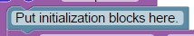

|

Any programming blocks that are placed after the "Put initialization
blocks here" comment (and before the "call MyFIRSTOpMode.waitForStart"
block) will be executed when the op mode is first selected by a user at
the Driver Station.

When the Robot Controller reaches the block labeled "call
MyFIRSTOpMode.waitForStart" it will stop and wait until it receives a
Start command from the Driver Station. A Start command will not be sent
until the user pushes the Start button on the Driver Station. Any code
after the "call MyFIRSTOpMode.waitForStart" block will get executed
after the Start button has been pressed.

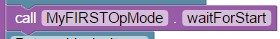

|

After the "call MyFIRSTOpMode.waitForStart", there is a conditional "if"
block ("if call MyFIRSTOpMode.isActive") that only gets executed if the
op mode is still active (i.e., a stop command hasn't been received).

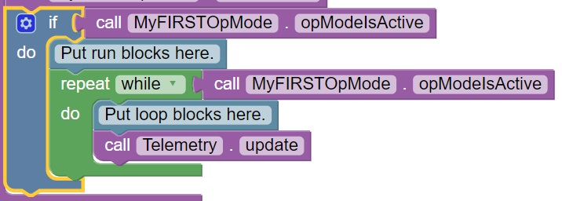

|

Any blocks that are placed after the "Put run blocks here" comment and
before the green block labeled "repeat while call
MyFirstOpMode.opModeIsActive" will be executed sequentially by the Robot
Controller after the Start button has been pressed.

The green block labeled "repeat while call MyFirstOpMode.opModeIsActive"
is an iterative or looping control structure.

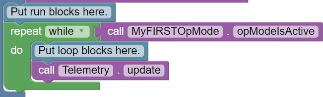

|

This green control block will perform the steps listed under the "do"
portion of the block as long as the condition "call
MyFIRSTOpMode.opModeIsActive" is true. What this means is that the
statements included in the "do" portion of the block will repeatedly be
executed as long as the op mode "MyFIRSTOpMode" is running. Once the
user presses the Stop button, the "call MyFIRSTOpMode.opModeIsActive"
clause is no longer true and the "repeat while" loop will stop repeating
itself.

Controlling a DC Motor
~~~~~~~~~~~~~~~~~~~~~~

In this section, you will add some blocks to your op mode that will
allow you to control a DC motor with a gamepad.

Note that you will need an estimated 15 minutes to complete this task.

.. important:: The programming blocks for user configured devices (motors, servos and sensors) will only be visible in the Blocks tool if there is an active configuration file with the configured devices included in the file. If a type of device is not included in the active configuration file, then its programming blocks will be missing from the palette of blocks.

If you did not :doc:`create and activate a configuration file yet </hardware_and_software_configuration/connecting_devices/index>` please follow :doc:`this link </hardware_and_software_configuration/connecting_devices/index>`  
to do so. After you created and activated your configuration file, 
you can close and then reopen your op mode so that the programming 
blocks for the newly configured devices will be visible.

Modifying Your Op Mode to Control a DC Motor Instructions
---------------------------------------------------------

1. On the left-hand side of the screen click on the category called   
"Variables" to display the list of block commands that are used to    
create and modify variables within your op mode.                      

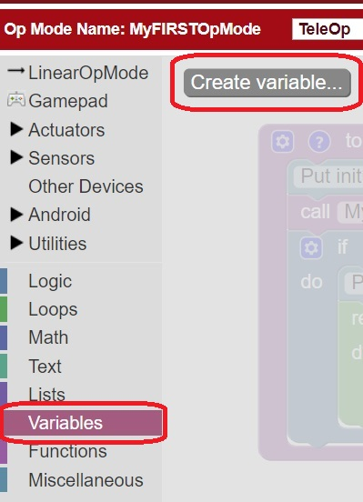

|

   Click on "Create variable..." to create a new variable that will represent the target motor power for our op mode.

2. When prompted, type in a name ("tgtPower") for your new variable.  

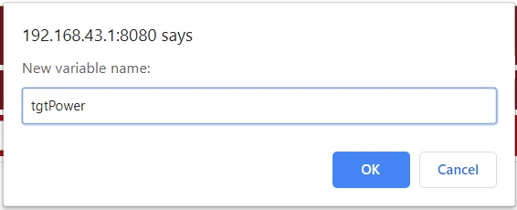

|

3. Once you have created your new variable, some additional           
programming blocks should appear under the "Variables" block          
category.                                                             

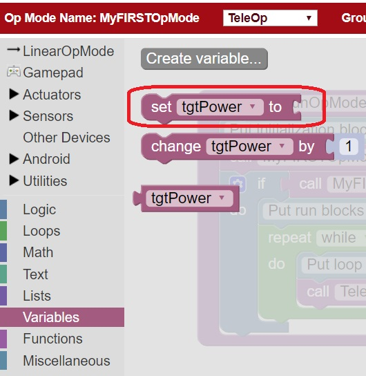

|

4. Click on the "set tgtPower to" programming block and then use the  
mouse to drag the block to the spot just after the "Put loop blocks   
here" comment block.                                                  

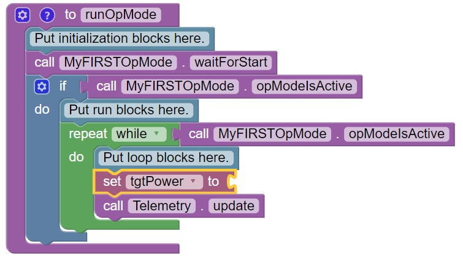

|

   The "set tgtPower to" block should snap right into position.

5. Click on the "Gamepad" category of the programming blocks and      
select the "gamepad1.LeftStickY" block from the list of available     
blocks.  

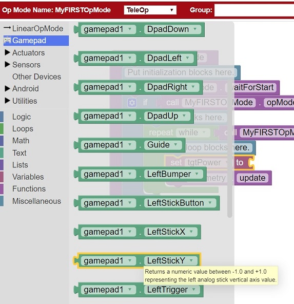

|

   Note that the control system lets you have up to two gamepads controlling a robot.  By selecting "gamepad1" you are telling the op mode to use the control input from the gamepad that is designated as driver #1.

6. Drag the "gamepad1.LeftStickY" block so it snaps in place onto the 
right side of the "set tgtPower to" block. This set of blocks will    
continually loop and read the value of gamepad #1's left joystick     
(the y position) and set the variable tgtPower to the Y value of the  
left joystick.  

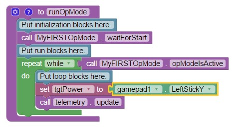

|

   Note that for the F310 gamepads, the Y value of a joystick ranges from -1, when a joystick is in its topmost position, to +1, when a joystick is in its bottommost position.

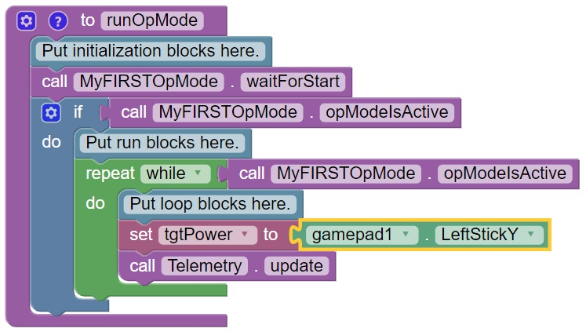

|

   This means that for the blocks shown in our example, if the left joystick is pushed to the top, the variable tgtPower will have a value of -1.

7. Click on the "Math" category for the programming blocks and select 
the negative symbol ("-").   

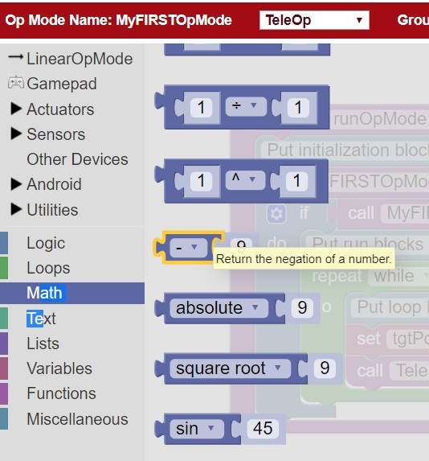

|

8. Drag the negative symbol (also known as a "negation operator") to  
the left of the "gamepad1.LeftStickY" block. It should click in place 
after the "set tgtPower to" block and before the                      
"gamepad1.LeftStickY" block.    

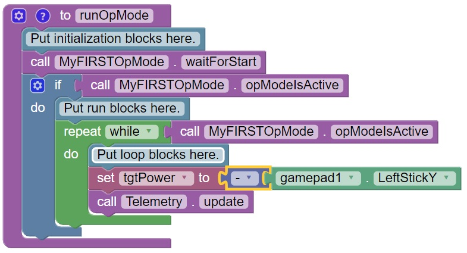

|

With this change, the variable tgtPower will be set to +1 if the left joystick is in its topmost position and will be set to -1 if the joystick is in its bottommost position.

9. Click on the "Actuators" category of blocks. Then click on the     
"DcMotor" category of blocks.   

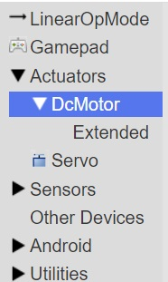

|

10. Select the "set motorTest.Power to 1" programming block.   

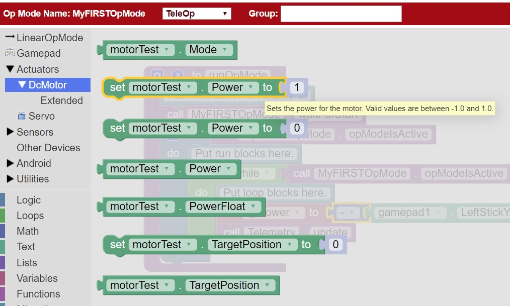

|    

11. Drag and place the "set motorTest.Power to 1" block so that it    
snaps in place right below the "set tgtPower to" block.               

.. image:: images/AddingDCMotorStep11ControlHub.jpg
   :align: center

|

12. Click on the "Variables" block category and select the "tgtPower" 
block.                                                                

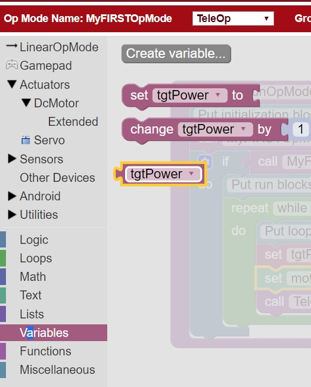

|

13. Drag the "tgtPower" block so it snaps in place just to the right  
of the "set motor1.Power to" block.                                   

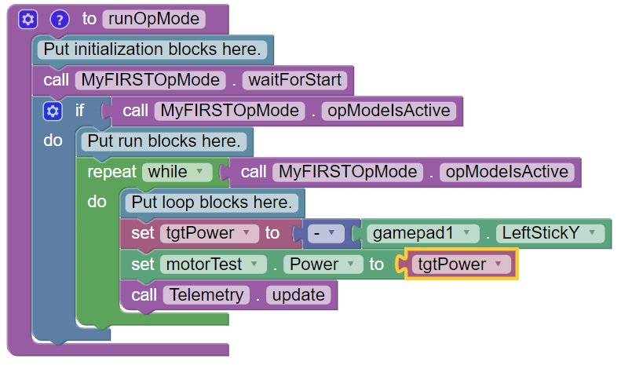

|

   The "tgtPower" block should automatically replace the default value of "1" block.

Inserting Telemetry Statements
~~~~~~~~~~~~~~~~~~~~~~~~~~~~~~

Your op mode is just about ready to run. However, before continuing, you
will add a couple of telemetry statements that will send information
from the Robot Controller to the Driver Station for display on the
Driver Station user interface. This telemetry mechanism is a useful way
to display status information from the robot on the Driver Station. You
can use this mechanism to display sensor data, motor status, gamepad
state, etc. from the Robot Controller to the Driver Station.

Note that you will need an estimated 15 minutes to complete this task.

Inserting Telemetry Statements Instructions
-------------------------------------------

1. Click on the "Utilities" category on the left-hand side of the     
browser window. Select the "Telemetry" subcategory and select the     
"call telemetry.addData(key, number)" block.                          

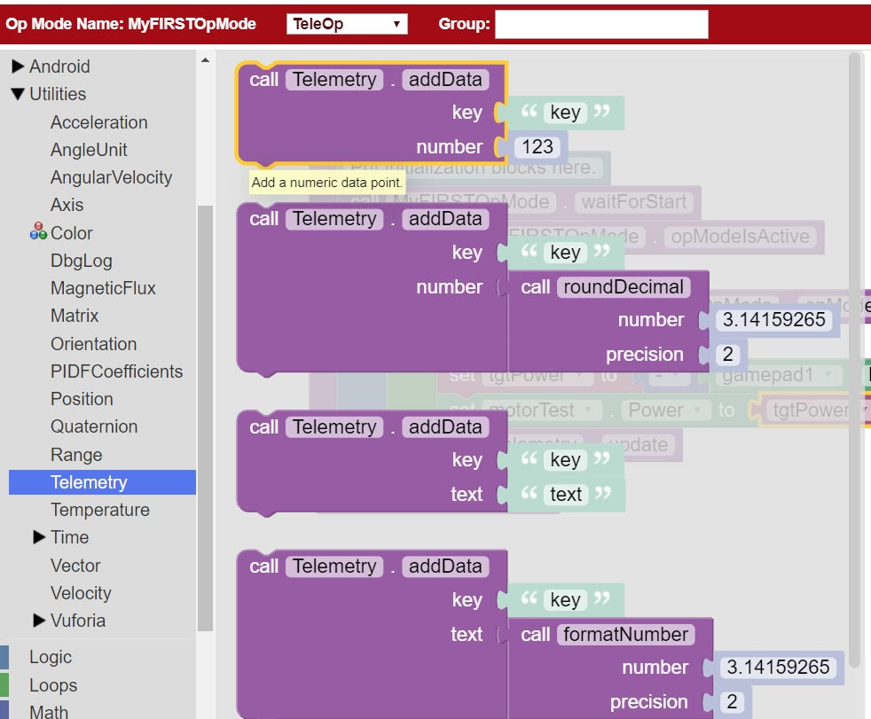

|

2. Drag the "call telemetry.addData(key, number)" block and place it  
below the "set motor1.Power to" block. Click on the green text block  
"key" and highlight the text and change it to read "Target Power".    

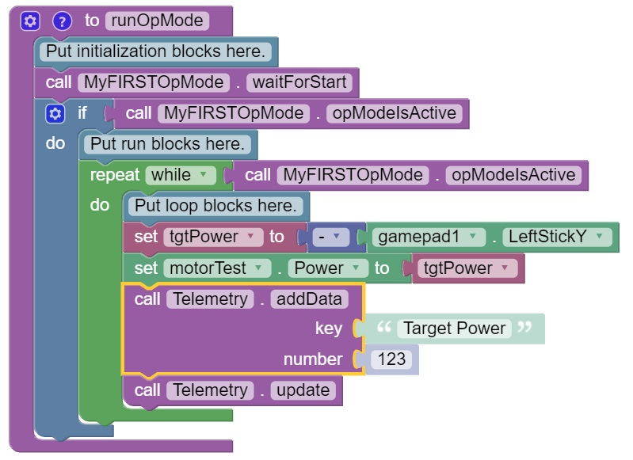

|

   Note that the "call telemetry.update" block is an important block.  Data that is added to the telemetry buffer will not be sent to the Driver Station until the "telemetry.update" method is called.

3. Click on the "Variables" block category and select the "tgtPower"  
block. Drag the block so it clicks into place next to the "number"    
parameter on the telemetry programming block.                         

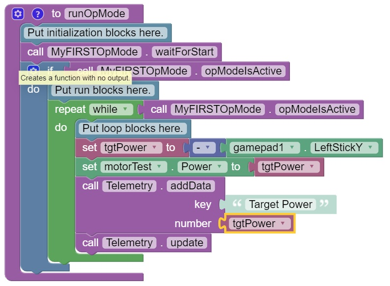

|

   The Robot Controller will send the value of the variable tgtPower to the Driver Station with a key or label of "Target Power".  The key will be displayed to the left of the value on the Driver Station.

4. Repeat this process and name the new key "Motor Power".            

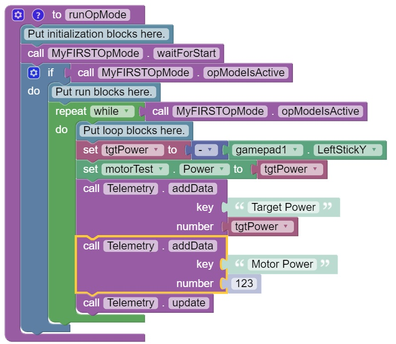

|

5. Find and click on the "DcMotor" subcategory. Look for the green    
programming block labeled "motorTest.Power".                          

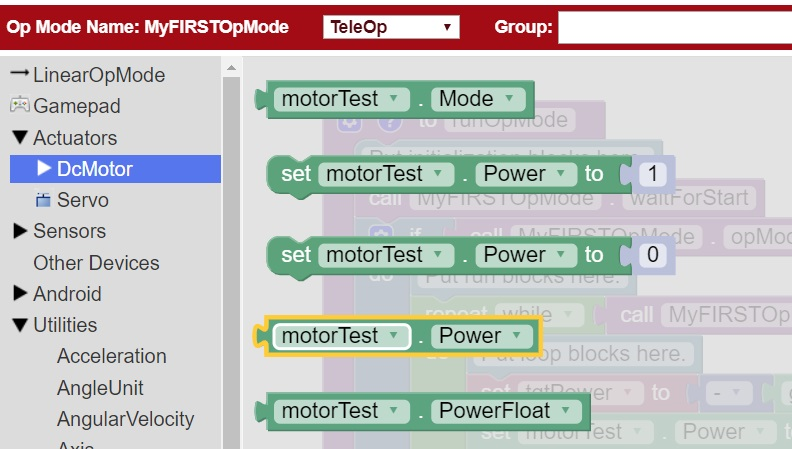

|

6. Drag the "motorTest.Power" block to the "number" parameter of the  
second telemetry block.                                               

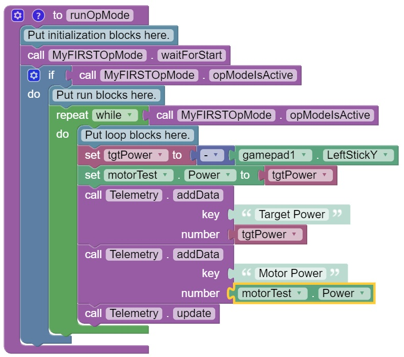

|

   Your op mode will now also send the motor power information from the Robot Controller to be displayed on the Driver Station.

Saving Your Op Mode
~~~~~~~~~~~~~~~~~~~

After you have modified your op mode, it is very important to save the
op mode to the Robot Controller.

Note it will take an estimated 1 minute to complete this task.

Saving Your Op Mode Instructions
--------------------------------

1. Press the "Save Op Mode" button to save the op mode to the Robot   
Controller. If your save was successful, you should see the words     
"Save completed successfully" to the right of the buttons.            

.. image:: images/SavingOpModeStep1ControlHub.jpg
   :align: center

|

Exiting Program & Manage Screen
~~~~~~~~~~~~~~~~~~~~~~~~~~~~~~~

After you have modified and saved your op mode, if your Driver Station
is still in the Program & Manage screen, then you should exit this
screen and return to the Main Driver Station screen.

Note it will take an estimated 1 minute to complete this task.

Exiting Programming Mode Instructions
-------------------------------------

1. Press the Android back arrow to exit the Program & Manage screen.  
You need to exit the Program & Manage screen before you can run your  
op mode.                                                              

.. image:: images/SavingOpModeStep1ControlHub.jpg
   :align: center

|

Congratulations! You wrote your first op mode using the Blocks
Programming Tool! You will learn how to run your op mode in the the
section entitled :doc:`Running Your Op Mode <../running_op_modes/Running-Your-Op-Mode>`.
