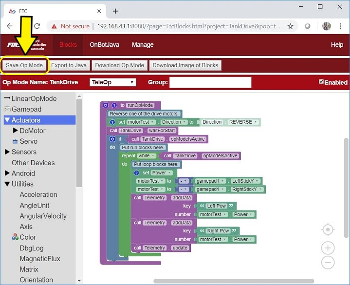
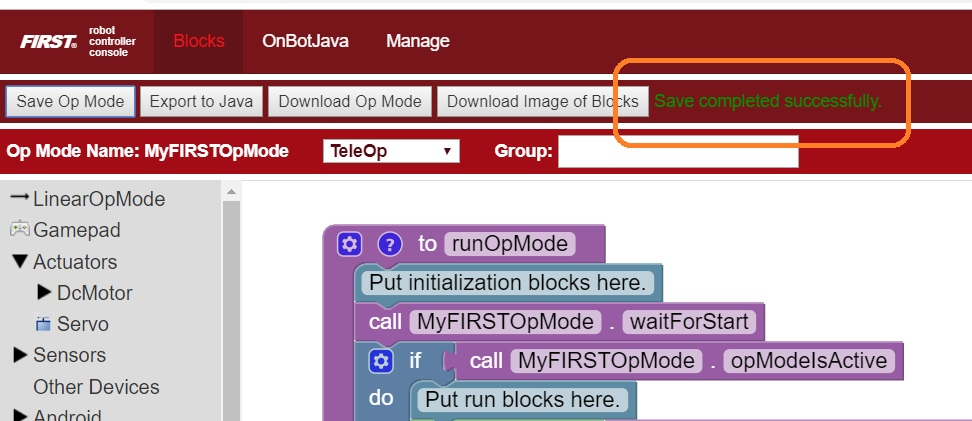
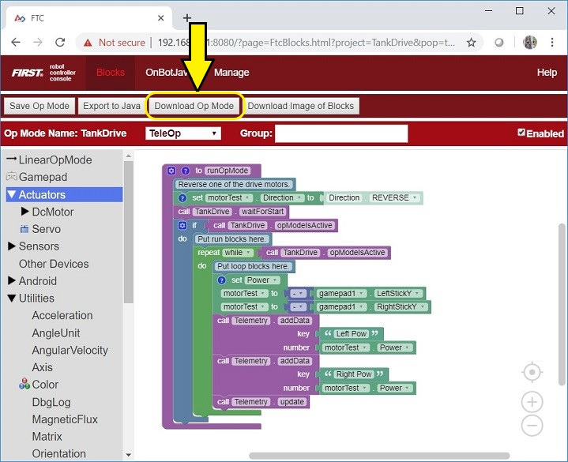
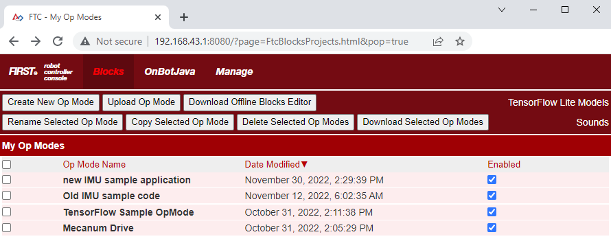
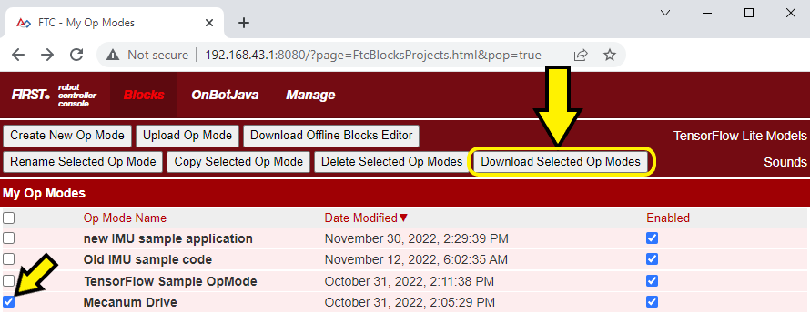
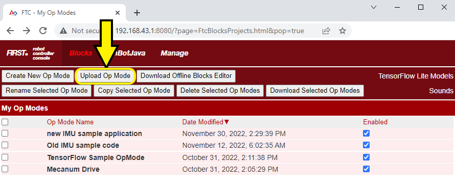

Managing OpModes in Blocks
==========================

Blocks is a programming language that uses graphical programming elements to
create programs. As such its file format is different than, say, a JAVA or
other text-based programming language file. Blocks programs are saved with a
**.blk** extension, but its contents are actually formatted as XML (Extensible
Markup Language).  The actual XML format in a Blocks program is beyond the
scope of this document, except to say that it's not intended to be
read/viewed/interpreted by any other program than Blocks. There is not a
general program on a MAC or a PC that can view or edit the Blocks program, it
must always be done through the Blocks interface within the Robot Controller
App (running on a REV Control Hub or legal Android SmartPhone) - that is, to
say, you cannot simply double-click on the file to open it up in an editor
program that lives on your computer.

Creating an OpMode
------------------

There is a :doc:`great tutorial for creating OpModes
<../creating_op_modes/Writing-an-Op-Mode-with-FTC-Blocks>` that also explains a
lot about the Blocks interface and helps you to understand what a Blocks
program does. It is recommended to check out this document for learning how to
work with Blocks OpModes. 

Saving an OpMode
----------------

It's important to understand what is meant by **"Saving"** an OpMode. When
programming/editing an OpMode, you're using either a web browser (Chrome, etc.)
or you are using a program *acting* as a web browser (REV Hardware Client,
etc.).  The program that you are creating/editing only *ephemerally* exists
within the web browser; there is no auto-save or feature to ensure that the
program is ultimately saved back onto the device (REV Control Hub or approved
SmartPhone) for use by a robot. Only the *SAVE* operation will actually
save the OpMode to a **.blk** file onto the device. Therefore, it's imperative
that Blocks programmers *SAVE* their work often, and especially once they have
completed their work. The mechanism by which you can *SAVE* an OpMode is via
the "**Save Op Mode**" button within the editing window of the software.

   Saving the OpMode within the Blocks Editor

Once a program is saved, a message will appear on the right-hand side of the 
same row to indicate that the program has been saved.

   Message indicating OpMode has been Saved

Downloading an OpMode
---------------------

Once an OpMode has been saved to a device, the OpMode can be selected via the
Driver Station or edited again via the programming interfaces. However, that
Blocks program only exists as a Blocks File (**.blk**) on the device. Often it
is desirable to save a copy of the program on your laptop (or on another
device, or in some other safe location) or provide the program for use by
others (teammates, another robot, other teams, provide online, etc.). 

In order to get a copy of the Blocks program from the device, you need to 
*download* the program from the device. You can do this in one of two ways, either 
through the editing interface or the main Blocks management interface.

Downloading an OpMode through the Editing Interface
^^^^^^^^^^^^^^^^^^^^^^^^^^^^^^^^^^^^^^^^^^^^^^^^^^^

While editing an OpMode, an OpMode can be *saved* and it can also be *downloaded*
(there are other options, but we're just going to focus on these two for the time
being). When an OpMode is saved, the program is saved **onto the device** into a
Blocks file (**.blk**). In order to save a copy of the program to your local computer
(for safe storage or for sharing) you need to *download* the program. Downloading the
program *does* issue a Save action on the current program, but this should not be
relied upon - programmers should always save their program before downloading.
Downloading an OpMode is performed via the "**Download Op Mode**" button within the Editing
Interface.

   Downloading a Blocks program

Pressing the "Download Op Mode" button makes the file available to the web
browser, so the web browser will manage the file in its usual way (e.g. with
Chrome the file is saved into the computer's "Downloads" folder).

Downloading an OpMode through the Management Interface
^^^^^^^^^^^^^^^^^^^^^^^^^^^^^^^^^^^^^^^^^^^^^^^^^^^^^^

By clicking on the "Blocks" menu item, you will be taken to the Blocks
management interface. This interface shows you all of the Blocks OpModes
currently on the device and provides you with options for managing those
OpModes.

   Blocks Management Interface

OpModes can be downloaded through this interface. Initially, the "**Download
Selected Op Modes**" button on this interface is grayed out. One or more Op Modes
can be selected in this interface, and then they can all be downloaded at once.
In the example below, the "Mecanum Drive" opmode is selected and then downloaded
via the "**Download Selected Op Modes**" button.

   Downloading Blocks via the Management Interface

Uploading Blocks
----------------

If you have a previously downloaded Blocks file, or you receive a Blocks file
from another source (like sample Blocks from REV, for example) you will want 
to *upload* the Blocks file (**.blk**) to the device (REV Control Hub or 
Android Smartphone). Within the Blocks Management interface, there is a button
on the top menu marked, "**Upload Op Mode**". 

Once you press "**Upload Op Mode**" a pop-up window will appear to allow you to 
choose the file you want to upload. Click the "**Choose File**" button to open a file
browser for your local computer to select the **.blk** Blocks file to upload.
Once uploaded, the Blocks program will open within the Blocks interface.

   Uploading Blocks Files via the Management Interface

Once a block is uploaded, it can be edited and modified like any other OpMode!

