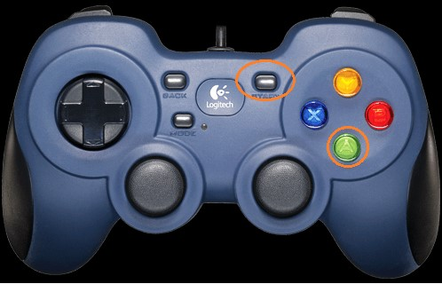

Running Your OpMode (All Languages)
-----------------------------------

If your OpMode requires input from a gamepad, then you will need to
connect a Logitech F310 or other approved gamepad to the DRIVER STATION. Note that you can
have up to two gamepads connected to a DRIVER STATION. If using a phone,
this will require a USB hub. However, in this example, we will only have
a solitary gamepad connected.

Note that you will need an estimated 10 minutes to complete this task.

Running Your OpMode Instructions
---------------------------------

1. Connect the gamepad to the DRIVER STATION. If using a phone, you will
need a Micro USB OTG adapter cable.                                                        

.. image:: images/GamepadDHConnection.jpg
   :align: center

|

.. image:: images/RunningOpModeStep2.jpg
   :align: center

|

2. For the examples in this wiki, the OpModes are looking for input  
from the gamepad designated as the user or driver #1. Press the Start 
button and the A button simultaneously on the Logitech F310          
controller to designate your gamepad as user #1. If using a PS4-style
gamepad, use the Options and Cross buttons to designate your gamepad
as user #1.

|

   Note that pushing the Start button and the B button simultaneously would designate the gamepad as user #2.

3. On the DRIVER STATION screen, touch the triangular-shaped,         
"TeleOp" dropdown list button to display a list available OpModes.   
You should see your recently saved OpMode among the list of          
available OpModes that reside on your Robot Controller.              

|

|

   Note that the word "TeleOp" is short for "Tele-Operated" and it implies a driver controlled OpMode (i.e. an OpMode that gets input from a human driver).

4. Select "MyFIRSTOpMode" to load your OpMode on the Robot           
Controller.                                                           

|

.. image:: images/RunningOpModeStep5.jpg
   :align: center

|

   Note that even though you are using the DRIVER STATION to select the OpMode, the actual OpMode instructions will be executed on the Robot Controller.

1. Press the INIT button to initialize your OpMode.                  

.. image:: images/InitDH.png
   :align: center

|

.. image:: images/RunningOpModeStep6.jpg
   :align: center

|

6. Push the Start button (designated by the triangular-shaped symbol) 
to start the OpMode run.                                             

.. image:: images/RunDH.png
   :align: center

|

.. image:: images/RunningOpModeStep7.jpg
   :align: center

|

7. Use the left joystick of the gamepad to control the operation of   
the DC motor. As you manipulate the left joystick up and down, the    
target power and the motor power should be displayed in the upper     
right hand corner of the screen.                                       

.. image:: images/TelemetryDH.png
   :align: center

|

.. image:: images/RunningOpModeStep8.jpg
   :align: center

|

   If you want to stop your OpMode, press the square-shaped Stop button on the DRIVER STATION.

