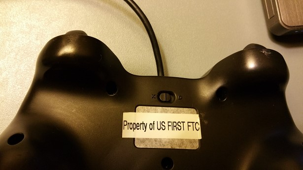

Running Your OpMode (All Languages)
-----------------------------------

If your op mode requires input from a gamepad, then you will need to
connect a Logitech F310 gamepad to the Operator Console. Note that you can
have up to two gamepads connected through a USB hub to an Operator Console.
However, in this example, we will only have a solitary gamepad
connected.

Note that you will need an estimated 10 minutes to complete this task.

Running Your Op Mode Instructions
---------------------------------

1. Before you connect your gamepad to the phone, verify that the      
switch on the bottom of the gamepad is set to the "X" position.       

|

2. Connect the gamepad to the Operator Console using the Micro USB OTG  
adapter cable.                                                        

.. image:: images/RunningOpModeStep2.jpg
   :align: center

|

3. For the examples in this wiki, the op modes are looking for input  
from the gamepad designated as the user or driver #1. Press the Start 
button and the A button simultaneously on the Logitech F310          
controller to designate your gamepad as user #1.                      

.. image:: images/RunningOpModeStep3.jpg
   :align: center

|

   Note that pushing the Start button and the B button simultaneously would designate the gamepad as user #2.

4. On the Operator Console screen, touch the triangular-shaped,         
"TeleOp" dropdown list button to display a list available op modes.   
You should see your recently saved op mode among the list of          
available op modes that reside on your Robot Controller.              

.. image:: images/RunningOpModeStep4.jpg
   :align: center

|

   Note that the word "TeleOp" is short for "Tele-Operated" and it implies a driver controlled op mode (i.e., an op mode that gets input from a human driver).

5. Select "MyFIRSTOpMode" to load your op mode on the Robot           
Controller.                                                           

|

   Note that even though you are using the Operator Console to select the op mode, the actual op mode instructions will be executed on the Robot Controller phone.

6. Press the INIT button to initialize your op mode.                  

|

7. Push the Start button (designated by the triangular-shaped symbol) 
to start the op mode run.                                             

|

8. Use the left joystick of the gamepad to control the operation of   
the DC motor. As you manipulate the left joystick up and down, the    
target power and the motor power should be displayed in the lower     
left hand corner of the screen.                                       

|

   If you want to stop your op mode, press the square-shaped Stop button on the Operator Console.

