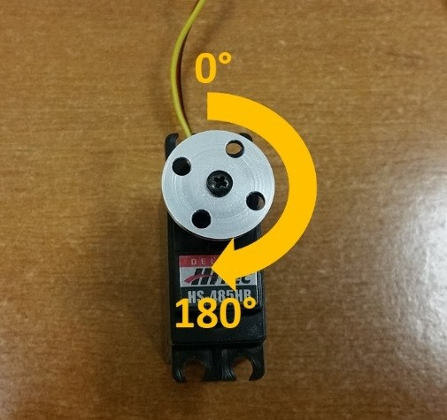

Controlling a Servo (OnBot Java)
================================

In this section, you will modify your op mode to control a servo motor
with the buttons of the gamepad.

What is a Servo Motor?
~~~~~~~~~~~~~~~~~~~~~~

A servo motor is a special type of motor. A servo motor is designed for
precise motion. A typical servo motor has a limited range of motion.

In the figure below, "standard scale" 180-degree servo is shown. This
type of servo is popular with hobbyists and with FIRST Tech Challenge
teams. This servo motor can rotate its shaft through a range of 180
degrees. Using an electronic module known as a servo controller you can
write an op mode that will move a servo motor to a specific position.
Once the motor reaches this target position, it will hold the position,
even if external forces are applied to the shaft of the servo.

.. image:: images/hs485hbServo.jpg
   :align: center

|

Servo motors are useful when you want to do precise movements (for
example, sweep an area with a sensor to look for a target or move the
control surfaces on a remotely controlled airplane).

Modifying Your Op Mode to Control a Servo
~~~~~~~~~~~~~~~~~~~~~~~~~~~~~~~~~~~~~~~~~

Let's modify your op mode to add the logic required to control a servo
motor. For this example, you will use the buttons on the Logitech F310
gamepad to control the position of the servo motor.

With a typical servo, you can specify a target position for the servo.
The servo will turn its motor shaft to move to the target position, and
then maintain that position, even if moderate forces are applied to try
and disturb its position.

For the FIRST Tech Challenge control system, you can specify a target
position that ranges from 0 to 1 for a servo. A target position of 0
corresponds to zero degrees of rotation and a target position of 1
corresponds to 180 degrees of rotation for a typical servo motor.

|

In this example, you will use the colored buttons on the right side of
the F310 controller to control the position of the servo. Initially, the
op mode will move the servo to the midway position (90 degrees of its
180-degree range). Pushing the yellow "Y" button will move the servo to
the zero-degree position. Pushing the blue "X" button or the red "B"
button will move the servo to the 90-degree position. Pushing the green
"A" button will move the servo to the 180-degree position.

.. image:: images/LogitechF310.jpg
   :align: center

|

Modify your op mode to add the following code:

::

   // run until the end of the match (driver presses STOP)
   double tgtPower = 0;
   while (opModeIsActive()) {
       tgtPower = -this.gamepad1.left_stick_y;
       motorTest.setPower(tgtPower);
       // check to see if we need to move the servo.
       if(gamepad1.y) {
           // move to 0 degrees.
           servoTest.setPosition(0);
       } else if (gamepad1.x || gamepad1.b) {
           // move to 90 degrees.
           servoTest.setPosition(0.5);
       } else if (gamepad1.a) {
           // move to 180 degrees.
           servoTest.setPosition(1);
       }
       telemetry.addData("Servo Position", servoTest.getPosition());
       telemetry.addData("Target Power", tgtPower);
       telemetry.addData("Motor Power", motorTest.getPower());
       telemetry.addData("Status", "Running");
       telemetry.update();

   }

This added code will check to see if any of the colored buttons on the
F310 gamepad are pressed. If the Y button is pressed, it will move the
servo to the 0-degree position. If either the X button or B button is
pressed, it will move the servo to the 90-degree position. If the A
button is pressed, it will move the servo to the 180-degree position.
The op mode will also send telemetry data on the servo position to the
Driver Station.

After you have modified your op mode, you can build it and then run it.
Verify that gamepad #1 is still configured and then use the colored
buttons to move the position of the servo.

