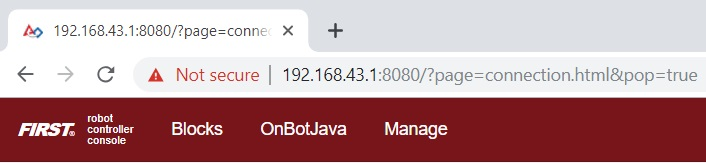
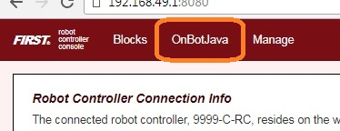
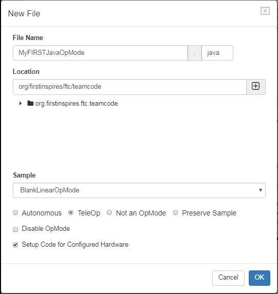
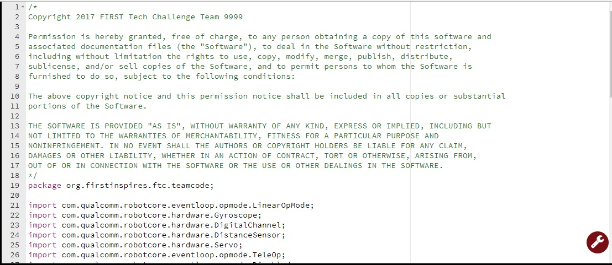

Creating and Running an Op Mode (OnBot Java)
============================================

The Java Programming Language
~~~~~~~~~~~~~~~~~~~~~~~~~~~~~

This tutorial assumes that you have a sound understanding of the Java
programming language. If you do not know Java, then you should consider
using the Blocks Programming Tool, which is a visual development
tool. Information about the Blocks Programming Tool can be found at
the following link:

:doc:`Blocks Tutorial <../../../blocks/Blocks-Tutorial>`

Or, you can learn the Java programming language by completing the Oracle
Java Tutorial, which is available at the following address:

https://docs.oracle.com/javase/tutorial/

What's an Op Mode?
~~~~~~~~~~~~~~~~~~

During a typical FIRST Tech Challenge match, a team's robot must perform
a variety of tasks to score points. For example, a team might want their
robot to follow a white line on the competition floor and then score a
game element into a goal autonomously during a match. Teams write
programs called *op modes* (which stands for "operational modes") to
specify the behavior for their robot. These op modes run on the Robot
Controller phone after being selected on the Driver Station phone.

Teams who are participating in the FIRST Tech Challenge have a variety
of programming tools that they can use to create their own op modes.
This document explains how to use the OnBot Java Programming Tool to
write an op mode for a robot.

The OnBot Java Programming Tool
~~~~~~~~~~~~~~~~~~~~~~~~~~~~~~~

The OnBot Java Programming Tool is a user-friendly programming tool
that is served up by the Robot Controller phone. A user can create
custom op modes for their robot using this tool and then save these op
modes directly onto the Robot Controller. Users write their op modes
using Java. The op modes are compiled very quickly on the Robot
Controller and then loaded dynamically by the Robot Controller during
run time.

.. image:: images/OnBotDoc001_MainScreen.jpg
   :align: center

|

The examples in this document use a Windows laptop computer to connect
to the Robot Controller. This Windows laptop computer has a
Javascript-enabled web browser installed that is used to access the 
OnBot Java Programming Tool.

.. image:: images/BlocksPicture2.jpg
   :align: center

|

Note that the process used to create and edit an op mode is identical if
you are using a Control Hub as your Robot Controller.

.. image:: images/BlocksPicture2b.jpg
   :align: center

|

Note that if you prefer, you can use an alternate device, such as an
Apple Mac laptop, Chromebook, or an iPad instead of a Windows computer
to access the OnBot Java Programming Tool. The instructions included in
this document, however, assume that you are using a Windows laptop.

Note that this section of the wiki assumes that you have already setup
and configured your Android devices and robot hardware. It also assumes
that you have successfully connected your laptop to the Progam & Manage
server on the Robot Controller device.

Creating Your First Op Mode
~~~~~~~~~~~~~~~~~~~~~~~~~~~

If you connected your laptop successfully to the Program & Manage
wireless network of the Robot Controller, then you are ready to create
your first op mode. In this section, you will use the OnBot Java
Programming Tool to create the program logic for your first op mode.

Creating Your First Op Mode Instructions
----------------------------------------

1. Launch the web browser on your laptop (FIRST recommends using      
Google Chrome) and find the web address that is displayed on the      
Program & Manage screen of the Robot Controller. 

|

.. important:: Note: If your Robot Controller is an Android smartphone, then the address to access the Program & Manage server is "192.168.49.1:8080". Notice the difference in the third octet of the IP addresses (the Control Hub has a "43" instead of a "49").

.. image:: images/WritingFirstOpModeStep1aControlHub.jpg
   :align: center

|

   Type this web address into the address field of your browser and press RETURN to navigate to the Program & Manage web server.

|

2. Verify that your web browser is connected to the programming mode  
server. If it is connected to the programming mode server             
successfully, the Robot Controller Console should be displayed.       

.. image:: images/WritingFirstOpModeStep2ControlHub.jpg
   :align: center

|

3. Click on the word *OnBotJava* towards the top of the screen. This  
will switch the browser to OnBot Java Programming mode.               

|

4. Take a look at the OnBot Java user interface. On the left hand     
side, there is the project browser pane. In the upper right hand      
corner, there is the source code editing pane. In the lower right     
hand corner, there is the message pane.  

.. image:: images/OnBotDoc_Step4_OnBotScreen.jpg
   :align: center

|

5. In the project browser pane, press the "+" symbol to create a new  
file. Pushing this button will launch the New File dialog box. This   
dialog box has several parameters that you can configure to customize 
your new file.                                                        

|

   For this example, specify "MyFIRSTJavaOpMode" as the File Name in the New File dialog box.

   Using the Sample dropdown list control, select "BlankLinearOpMode" from the list of available sample op modes (see image above).  By selecting "BlankLinearOpMode" the OnBot Java editor will automatically generate a basic LinearOpMode framework for you.

   Check the option labeled "TeleOp" to ensure that this new file will be configured as a tele-operated (i.e., driver controlled) op mode.
   
   Also, make sure you check the "Setup Code for Configured Hardware" option.  If this option is enabled, the OnBot Java editor will look at the hardware configuration file for your Robot Controller and automatically generate the code that you will need to access the configured devices in your op mode.

   Press the "OK" button to create your new op mode.

6. You should see your newly created op mode in the editing pane of   
the OnBot Java user interface.                                        

|

Congratulations, you created your first op mode! The op mode currently
does not do much, but you will eventually modify it to make it more
useful.

.. image:: images/OnBotDoc_Step6_ProjectBrowser.jpg
   :align: center

|

Note that when you create an OnBot op mode, you create a .java file that
is stored on the Robot Controller. You can access your saved op modes
using the project browser on the left side of the screen. You can also
organize your saved op modes by right mouse clicking on the project
browser to display a list of options to create, edit or delete files and
folders.

Also, note that the OnBot Java editor automatically saves your op mode
as you are editing it, provided that you are connected to the Program &
Manage server.

Examining the Structure of Your Op Mode
~~~~~~~~~~~~~~~~~~~~~~~~~~~~~~~~~~~~~~~

It can be helpful to think of an op mode as a list of tasks for the
Robot Controller to perform. For a linear op mode, the Robot Controller
will process this list of tasks sequentially. Users can also use control
loops (such as a while loop) to have the Robot Controller repeat (or
iterate) certain tasks within a linear op mode.

.. image:: images/ExaminingStructurePic2.jpg
   :align: center

|

If you think about an op mode as a list of instructions for the robot,
this set of instructions that you created will be executed by the robot
whenever a team member selects the op mode called "MyFIRSTJavaOpMode"
from the list of available op modes for this Robot Controller.

Let's look at the structure of your newly created op mode. Here's a copy
of the op mode text (minus some comments, the package definition, and
some import package statements):

.. code-block:: java

   @TeleOp

   public class MyFIRSTJavaOpMode extends LinearOpMode {
       private Gyroscope imu;
       private DcMotor motorTest;
       private DigitalChannel digitalTouch;
       private DistanceSensor sensorColorRange;
       private Servo servoTest;

       @Override
       public void runOpMode() {
           imu = hardwareMap.get(Gyroscope.class, "imu");
           motorTest = hardwareMap.get(DcMotor.class, "motorTest");
           digitalTouch = hardwareMap.get(DigitalChannel.class, "digitalTouch");
           sensorColorRange = hardwareMap.get(DistanceSensor.class, "sensorColorRange");
           servoTest = hardwareMap.get(Servo.class, "servoTest");

           telemetry.addData("Status", "Initialized");
           telemetry.update();
           // Wait for the game to start (driver presses PLAY)
           waitForStart();

           // run until the end of the match (driver presses STOP)
           while (opModeIsActive()) {
               telemetry.addData("Status", "Running");
               telemetry.update();

           }
       }
   }

At the start of the op mode there is an annotation that occurs before
the class definition. This annotation states that this is a
tele-operated (i.e., driver controlled) op mode:

.. code-block:: java

   @TeleOp

If you wanted to change this op mode to an autonomous op mode, you would
replace the ``@TeleOp`` with an ``@Autonomous`` annotation instead.

You can see from the sample code that an op mode is defined as a Java
class. In this example, the op mode name is called "MyFIRSTJavaOpMode"
and it inherits characteristics from the LinearOpMode class.

.. code-block:: java

   public class MyFIRSTJavaOpMode extends LinearOpMode {

You can also see that the OnBot Java editor created five private member
variables for this op mode. These variables will hold references to the
five configured devices that the OnBot Java editor detected in the
configuration file of your Robot Controller.

.. code-block:: java

       private Gyroscope imu;
       private DcMotor motorTest;
       private DigitalChannel digitalTouch;
       private DistanceSensor sensorColorRange;
       private Servo servoTest;

Next, there is an overridden method called runOpMode. Every op mode of
type LinearOpMode must implement this method. This method gets called
when a user selects and runs the op mode.

.. code-block:: java

       @Override
       public void runOpMode() {

At the start of the runOpMode method, the op mode uses an object named
hardwareMap to get references to the hardware devices that are listed in
the Robot Controller's configuration file:

.. code-block:: java

           imu = hardwareMap.get(Gyroscope.class, "imu");
           motorTest = hardwareMap.get(DcMotor.class, "motorTest");
           digitalTouch = hardwareMap.get(DigitalChannel.class, "digitalTouch");
           sensorColorRange = hardwareMap.get(DistanceSensor.class, "sensorColorRange");
           servoTest = hardwareMap.get(Servo.class, "servoTest");

The hardwareMap object is available to use in the runOpMode method. It
is an object of type HardwareMap class.

Note that when you attempt to retrieve a reference to a specific device
in your op mode, the name that you specify as the second argument of the
HardwareMap.get method must match the name used to define the device in
your configuration file. For example, if you created a configuration
file that had a DC motor named "motorTest", then you must use this same
name (it is case sensitive) to retrieve this motor from the hardwareMap
object. If the names do not match, the op mode will throw an exception
indicating that it cannot find the device.

In the next few statements of the example, the op mode prompts the user
to push the start button to continue. It uses another object that is
available in the runOpMode method. This object is called telemetry and
the op mode uses the addData method to add a message to be sent to the
Driver Station. The op mode then calls the update method to send the
message to the Driver Station. Then it calls the waitForStart method, to
wait until the user pushes the start button on the driver station to
begin the op mode run.

.. code-block:: java

           telemetry.addData("Status", "Initialized");
           telemetry.update();
           // Wait for the game to start (driver presses PLAY)
           waitForStart();

Note that all linear op modes should have a waitForStart statement to
ensure that the robot will not begin executing the op mode until the
driver pushes the start button.

After a start command has been received, the op mode enters a while loop
and keeps iterating in this loop until the op mode is no longer active
(i.e., until the user pushes the stop button on the Driver Station):

.. code-block:: java

           // run until the end of the match (driver presses STOP)
           while (opModeIsActive()) {
               telemetry.addData("Status", "Running");
               telemetry.update();

           }

As the op mode iterates in the while loop, it will continue to send
telemetry messages with the index of "Status" and the message of
"Running" to be displayed on the Driver Station.

Building Your Op Mode
~~~~~~~~~~~~~~~~~~~~~

When you create or edit an op mode the OnBot Java editor will auto-save
the .java file to the file system of the Robot Controller. However,
before you can execute your changes on the Robot Controller, you must
first build the op mode and convert it from a Java text file to a binary
that can be loaded dynamically into the Robot Controller app.

If you are satisfied with your op mode and are ready to build, press the
Build button (which is the button with the wrench symbol, see image
below) to start the build process. Note that the build process will
build **all of the .java files** on your Robot Controller.

|

You should see messages appear in the message pane, which is located in
the lower right hand side of the window. If your build was successful,
you should see a "Build succeeded!" message in the message pane.

|

Once you have built the binary files with your updated op modes, they
are ready to run on the Robot Controller. Before we run our example op
mode, let's see what happens if a problem occurs during the build
process.

Troubleshooting Build Messages
~~~~~~~~~~~~~~~~~~~~~~~~~~~~~~

In the previous section, the build process went smoothly. Let's modify
your op mode slightly to cause an error in the build process.

In the editing pane of the OnBot Java window, look for the line that
reads ``private Servo servoTest;``. This should appear somewhere near the
beginning of your op mode class definition. Change the word "Servo" to
the word "Zervo":

.. code-block:: java

   private Zervo servoTest;

Also, let's modify the telemetry statement that informs the user that
the op mode has been initialized, and let's remove one of the two
arguments so that the statement looks like this:

.. code-block:: java

   telemetry.addData("Status",);

Note that when you eliminate the second argument, a little "x" should
appear next to the line with the modified addData statement. This "x"
indicates that there is a syntax error in the statement.

.. image:: images/OnBotDoc_SyntaxError.jpg
   :align: center

|

After you have modified your op mode, you can press the build button and
see what error messages appear.

|

When you first attempt to build the op mode, you should get an "illegal
start of expression error". This is because the addData method is
missing its second argument. The OnBot Java system also directs you to
the file that has the error, and the location within the file where the
error occurs.

In this example, the problem file is called
"org/firstinspires/ftc/teamcode/MyFIRSTJavaOpMode.java" and the error
occurs at line 62, column 37. It is important to note that the build
process builds all of the .java files on the Robot Controller. If there
is an error in a different file (one that you are not currently editing)
you will need to look at the file name to determine which file is
causing the problem.

Let's restore this statement back to its original, correct form:

.. code-block:: java

   telemetry.addData("Status", "Initialized");

After you have corrected the addData statement, push the build button
again to see what happens. The OnBot Java system should complain that it
cannot find the symbol "Zervo" in a source file called
"org/firstinspires/ftc/teamcode/MyFIRSTJavaOpMode.java" at line 51,
column 13.

|

You should restore the statement back to its original form and then push
the build button and verify that the op mode gets built properly.

.. code-block:: java

   private Servo servoTest;

Running Your Op Mode
~~~~~~~~~~~~~~~~~~~~

*  If you successfully rebuilt your op mode, you are ready to run the op mode. Verify that the Driver Station is still connected to the Robot Controller. Since you designated that your example op mode is a tele-operated op mode, it will be listed as a "TeleOp" op mode.
*  On the Driver Station, use the "TeleOp" dropdown list control to display the list of available op modes. Select your op mode ("MyFIRSTJavaOpMode") from the list.

.. image:: images/OnBotDoc_SelectMyFIRSTOpMode.jpg
   :align: center

|

   Press the INIT button to initialize the op mode.

.. image:: images/OnBotDoc_MyFIRSTPushInit.jpg
   :align: center

|

The op mode will execute the statements in the runOpMode method up to
the waitForStart statement. It will then wait until you press the start
button (which is represented by the triangular shaped symbol) to
continue.

.. image:: images/OnBotDoc_PressStart.jpg
   :align: center

|

Once you press the start button, the op mode will continue to iterate
and send the "Status: Running" message to the Driver Station. To stop
the op mode, press the square-shaped stop button.

|

Congratulations! You ran your first java op mode!

Modifying Your Op Mode to Control a Motor
~~~~~~~~~~~~~~~~~~~~~~~~~~~~~~~~~~~~~~~~~

Let's modify your op mode to control the DC motor that you connected and
configured for your REV Expansion Hub. Modify the code for the program
loop so that it looks like the following:

.. code-block:: java

   // run until the end of the match (driver presses STOP)
   double tgtPower = 0;
   while (opModeIsActive()) {
       tgtPower = -this.gamepad1.left_stick_y;
       motorTest.setPower(tgtPower);
       telemetry.addData("Target Power", tgtPower);
       telemetry.addData("Motor Power", motorTest.getPower());
       telemetry.addData("Status", "Running");
       telemetry.update();

   }

If you look at the code that was added, you will see that we defined a
new variable called target power before we enter the while loop.

.. code-block:: java

   double tgtPower = 0;

At the start of the while loop we set the variable tgtPower equal to the
negative value of the gamepad1's left joystick:

.. code-block:: java

   tgtPower = -this.gamepad1.left_stick_y;

The object gamepad1 is available for you to access in the runOpMode
method. It represents the state of gamepad #1 on your Driver Station.
Note that for the F310 gamepads that are used during the competition,
the Y value of a joystick ranges from -1, when a joystick is in its
topmost position, to +1, when a joystick is in its bottommost position.
In the example code above, you negate the left_stick_y value so that
pushing the left joystick forward will result in a positive power being
applied to the motor. Note that in this example, the notion of forwards
and backwards for the motor is arbitrary. However, the concept of
negating the joystick y value can be very useful in practice.

|

The next set of statements sets the power of motorTest to the value
represented by the variable tgtPower. The values for target power and
actual motor power are then added to the set of data that will be sent
via the telemetry mechanism to the Driver Station.

.. code-block:: java

       tgtPower = -this.gamepad1.left_stick_y;
       motorTest.setPower(tgtPower);
       telemetry.addData("Target Power", tgtPower);
       telemetry.addData("Motor Power", motorTest.getPower());

After you have modified your op mode to include these new statements,
press the build button and verify that the op mode was built
successfully.

Running Your Op Mode with a Gamepad Connected
~~~~~~~~~~~~~~~~~~~~~~~~~~~~~~~~~~~~~~~~~~~~~

*  Your op mode takes input from a gamepad and uses this input to control
   a DC motor. To run your op mode, you will need to connect a Logitech
   F310 gamepad to the Driver Station.
*  Before you connect your gamepad to the phone, verify that the switch
   on the bottom of the gamepad is set to the "X" position.

.. image:: images/RunningOpModeStep1.jpg
   :align: center

|

Connect the gamepad to the Driver Station using the Micro USB OTG
adapter cable.

.. image:: images/RunningOpModeStep2.jpg
   :align: center

|

Your example op mode is looking for input from the gamepad designated as
the user or driver #1. Press the Start button and the A button
simultaneously on the Logictech F310 controller to designate your
gamepad as user #1. Note that pushing the Start button and the B button
simultaneously would designate the gamepad as user #2.

.. image:: images/RunningOpModeStep3.jpg
   :align: center

|

If you successfully designated the gamepad to be user #1, you should see
a little gamepad icon above the text "User 1" in the upper right hand
corner of the Driver Station Screen. Whenever there is activity on
gamepad #1, the little icon should be highlighted in green. If the icon
is missing or if it does not highlight in green when you use your
gamepad, then there is a problem with the connection to the gamepad.

Select, initialize and run your "MyFIRSTJavaOpMode" op mode. It is
important to note that whenever you rebuild an op mode, you must stop
the current op mode run and then restart it before the changes that you
just built take effect.

If you configured your gamepad properly, then the left joystick should
control the motion of the motor. As you run your op mode, be careful and
make sure you do not get anything caught in the turning motor. Note that
the User #1 gamepad icon should highlight green each time you move the
joystick. Also note that the target power and actual motor power values
should be displayed in the telemetry area on the Driver Station.

.. image:: images/OnBotDoc_RunOpModeDCMotor.jpg
   :align: center

|

