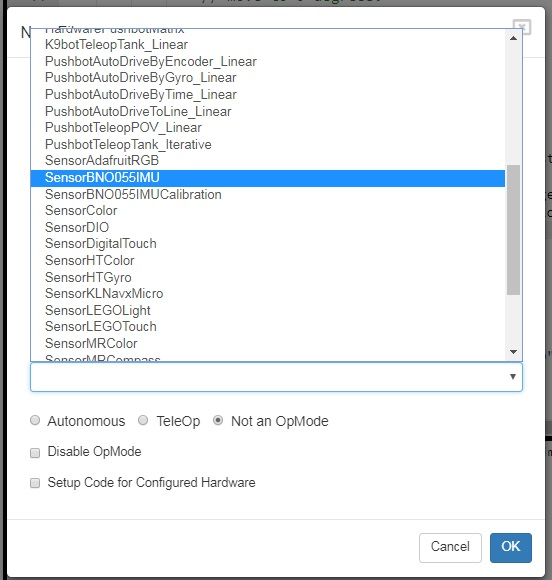

OnBot Java Reference Info :bdg-info:`OBJ`
=========================================

Javadoc Reference Pages
~~~~~~~~~~~~~~~~~~~~~~~

As you start to write more complicated op modes, you will need to use
more features of the FIRST Tech Challenge software development kit
(SDK). You can reference online Javadoc material that provide
descriptions of the available FIRST Tech Challenge-related classes and
methods, at the following web address:

https://javadoc.io/doc/org.firstinspires.ftc

Sample Op Modes
~~~~~~~~~~~~~~~

The OnBot Java Programming Tool has several built-in example op modes
that demonstrate how to do different tasks with the FIRST Tech Challenge
control system. As you create a new file, you can use the Sample
dropdown list control to display a list of available sample op modes or
templates. The comments in these examples help explain what the program
statements do.

Technology Forum
~~~~~~~~~~~~~~~~

Registered teams can create user accounts on the FIRST Tech Challenge
forum. Teams can use the forum to ask questions and receive support from
the FIRST Tech Challenge community.

The technology forum can be found at the following address:

https://ftcforum.firstinspires.org/forum/ftc-technology?156-FTC-Technology

REV Robotics Expansion Hub Documentation
~~~~~~~~~~~~~~~~~~~~~~~~~~~~~~~~~~~~~~~~

`REV Robotics Expansion Hub Getting Started
Guide <https://docs.revrobotics.com/duo-control/control-system-overview/expansion-hub-basics>`__

