Blocks Sample Op Mode for TensorFlow Object Detection
========================================================

Creating the Op Mode
~~~~~~~~~~~~~~~~~~~~

You can use the sample “ConceptTensorFlowObjectDetection” as a template
to create your own Blocks op mode that uses the TensorFlow technology to
“look for” any game elements, and determine the relative location of any
identified elements.

-  If you are using a **webcam** connected to the Robot Controller
   device, select “ConceptTensorFlowObjectDetectionWebcam” as the sample
   op mode from the dropdown list on the Create New Op Mode dialog box.
-  If you are using an Android smartphone’s **built-in camera**, select
   “ConceptTensorFlowObjectDetection” as the sample op mode from the
   dropdown list on the Create New Op Mode dialog box.

Press “OK” to create the new op mode.

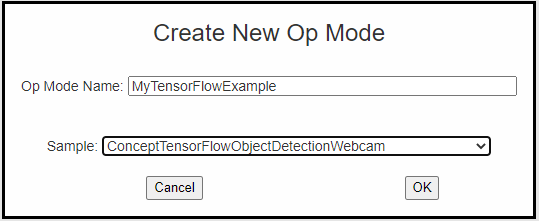

   Create an op mode with ConceptTensorFlowObjectDetection 
   as its template.

Your new op mode should appear in the editing pane of the Blocks
Development Tool screen.

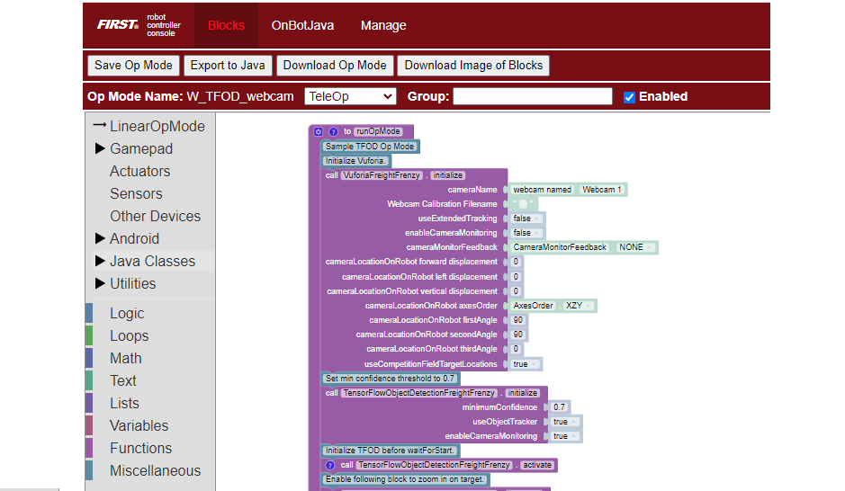

   Your newly created op mode will have the ConceptTensorFlowObjectDetection
   blocks included.

Initializing the System
~~~~~~~~~~~~~~~~~~~~~~~

Let’s take a look at the initial blocks in the op mode. The first block
in the op mode (excluding the comment blocks) initializes the Vuforia
library on the Android Robot Controller. This is needed because the
TensorFlow Lite library will receive image data from the Vuforia
library. Also, in the screenshot below, the Vuforia system will use an
externally connected webcam named “Webcam 1” (which should match the
camera name in your robot’s configuration file).

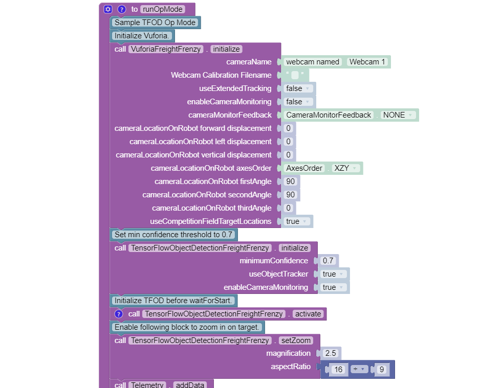

   Initialize the Vuforia and TensorFlow libraries.

You can initialize both the Vuforia and the TensorFlow libraries in the
same op mode. This is useful, for example, if you would like to use the
TensorFlow library to recognize the Duck and then use the Vuforia
library to help the robot autonomously navigate on the game field.

Note that in this example the ObjectTracker parameter is set to true for
this block, so an *object tracker* will be used, in addition to the
TensorFlow interpreter, to keep track of the locations of detected
objects. The object tracker *interpolates* object recognitions so that
results are smoother than they would be if the system were to solely
rely on the TensorFlow interpreter.

Also note that the Minimum Confidence level is set to 70%. This means
that the TensorFlow library needs to have a confidence level of 70% or
higher in order to consider an object as being detected in its field of
view. You can adjust this parameter to a higher value if you would like
the system to be more selective in identifying an object.

The confidence level for a detected target will be displayed near the
bounding box of the identified object (when the object tracker is
enabled) on the Robot Controller. For example, a value of “0.92”
indicates a 92% confidence that the object has been identified
correctly.

When an object is identified by the TensorFlow library, the op mode can
read the “Left”, “Right”, “Top” and “Bottom” values associated with the
detected object. These values correspond to the location of the left,
right, top and bottom boundaries of the detection box for that object.
These values are in pixel coordinates of the image from the camera.

The origin of the coordinate system is in the upper left-hand corner of
the image. The horizontal (x) coordinate value increases as you move
from the left to the right of the image. The vertical (y) coordinate
value increases as you move from the top to the bottom of the image.

.. figure:: images/landscapeCoordinate.png
   :align: center

   The origin of the image coordinate system is located in upper left hand
   corner.

In the landscape image above, the approximate coordinate values for the
Left, Top, Right, and Bottom boundaries are 455, 191, 808, and 547
respectively (pixel coordinates). The width and height for the landscape
image above is 1280 and 720 respectively.

Activating TensorFlow
~~~~~~~~~~~~~~~~~~~~~

In this example, the op mode activates the TensorFlow object detector
before waiting for the start command from the Driver Station. This is
done so that the user can access the “Camera Stream” preview from the
Driver Station menu while it waits for the start command. Also note that
in this example, the op mode does not activate the Vuforia tracking
feature, it only activates TensorFlow object detection. If you want to
incorporate Vuforia image detection and tracking you will also need to
activate (and later deactivate when you are done) the Vuforia tracking
feature.

   Activate TensorFlow Object Detection.

Setting the Zoom Factor
~~~~~~~~~~~~~~~~~~~~~~~

When TensorFlow receives an image from the robot’s camera, the library
downgrades the resolution of the image (presumably to achieve a higher
detection rate). As a result, if a target is at a distance of around 24”
(61cm) or more, the detection accuracy of the system tends to diminish.
This degradation can occur, even if you have a very accurate inference
model.

You can specify a zoom factor in your op mode to offset the effect of
this automatic scaling by the TensorFlow library. If you specify a zoom
factor, the image will be cropped by this factor and this artificially
magnified image will be passed to the TensorFlow library. The net result
is that the robot is able to detect and track an object at a
significantly larger distance. The webcams and built-in Android cameras
that are typically used by teams have high enough resolution to
allow TensorFlow to “see” an artificially magnified target clearly.

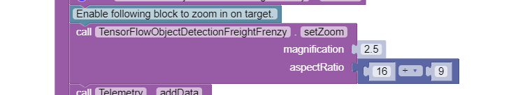

   Set Zoom Factor

If a zoom factor has been set, then the Camera Stream preview on the
Driver Station will show the cropped area that makes up the artificially
magnified image.

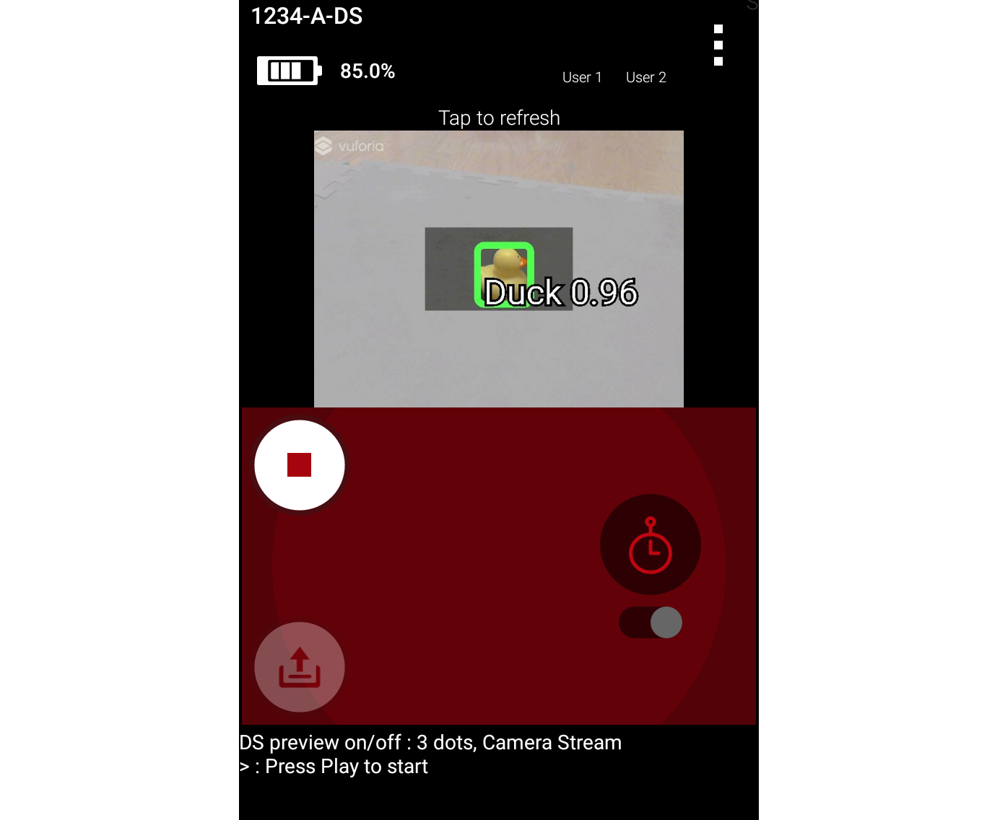
   
   Camera stream preview indicating magnified area (at a distance of about 4 feet or 1.2 meters).

Iterating and Processing List of Recognized Objects
~~~~~~~~~~~~~~~~~~~~~~~~~~~~~~~~~~~~~~~~~~~~~~~~~~~

The op mode will then iterate until a Stop command is received. At the
beginning of each iteration, the op mode will check with the object
detector to see how many objects it recognizes in its field of view. In
the screenshot below, the variable “recognitions” is set to a list of
objects that were recognized using the TensorFlow technology.

.. figure:: images/040_Blocks_TFOD_webcam_loop.png
   :align: center

   The op mode gets a list of recognized objects with each iteration of the
   while loop.

If the list is empty (i.e., if no objects were detected) the op mode
sends a telemetry message to the Driver Station indicating that no items
were detected.

If the list is not empty, then the op mode iterates through the list and
calls a function “displayInfo” to display information via telemetry
about each detected object.

Modifying the Sample Op Mode to Indicate Duck Detected
~~~~~~~~~~~~~~~~~~~~~~~~~~~~~~~~~~~~~~~~~~~~~~~~~~~~~~

This sample op mode uses TensorFlow blocks for the Freight Frenzy
season. Let’s modify the op mode so it will set a variable to indicate
whether a Duck was detected, and show a Telemetry message accordingly.
Using the Blocks editor, under Variables, create a new variable
“isDuckDetected”. Initialize it to “false”, just before the “for each
item” block that will examine the list of recognitions.

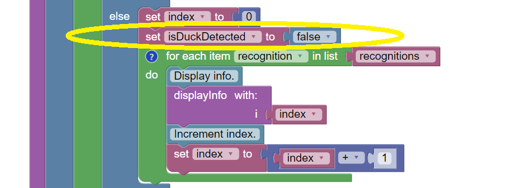

   Reset the variable to false with each cycle of the “while” loop.

Next, use the Blocks editor to modify the function “displayInfo” as
follows. If the label reads “Duck” then set the variable isDuckDetected
to “true”, and send a telemetry message to indicate a Duck has been
recognized. Otherwise, or ELSE, set the variable to “false” and don’t
display the message.

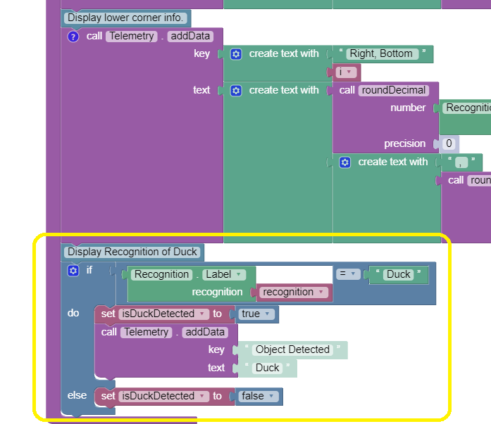

   Set variable and show message if Duck detected.

Save the op mode and re-run it. The op mode should display the new
message, if a Duck is detected. Note that if TensorFlow detects multiple
objects, the order of the detected objects can change with each
iteration of your op mode.

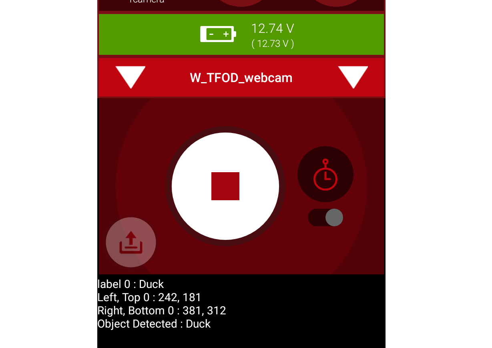

   The modified op mode should show a telemetry message if the Duck is detected.

You can continue modifying this sample op mode, to suit your team’s
autonomous strategy. For example, you might want to store (in a
Variable) which Barcode position had the Duck.

Also, you must decide how the loop should actually stop repeating,
assuming the Duck’s position is discovered. (It now loops until Stop is
pressed.) For example, the loop could stop after the camera has viewed
all 3 Barcode positions. Or, if the camera’s view includes more than one
Barcode position, perhaps the Duck’s bounding box location can provide
the info you need.

In any case, when the op mode exits the loop, your new Variable should
hold the location of the Duck, which tells you the preferred scoring
level on the Alliance Shipping Hub. You op mode can continue running,
using that information.

Important Note Regarding Image Orientation
~~~~~~~~~~~~~~~~~~~~~~~~~~~~~~~~~~~~~~~~~~

If you are using a webcam with your Robot Controller, then the camera
orientation is fixed in landscape mode. However, if you are using a
smartphone camera, the system will interpret images based on the phone’s
orientation (Portrait or Landscape) at the time that the TensorFlow
object detector is created and initialized.

Note that for Freight Frenzy, the default TensorFlow inference model is
optimized for a camera in landscape mode. This means that it is better
to orient your camera in landscape mode if you use this default
inference model because you will get more reliable detections.

If you execute the TensorFlowObjectDetection ``.initialize`` block while
the phone is in Portrait mode, then the images will be processed in
Portrait mode.

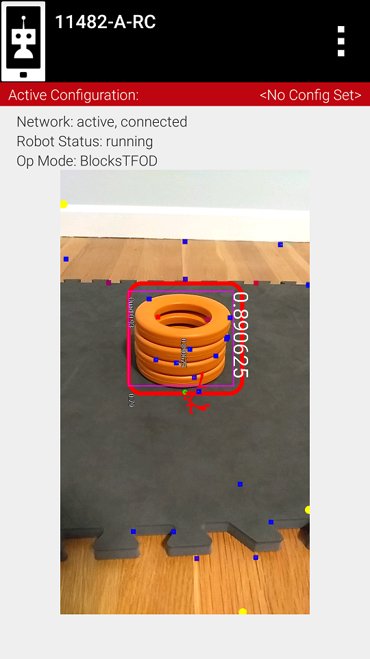

   If you initialize the detector in Portrait mode, then the images are
   processed in Portrait mode.

The “Left” and “Right” values of an object’s bounding box correspond to
horizontal coordinate values, while the “Top” and “Bottom” values of an
object’s bounding box correspond to vertical coordinate values.

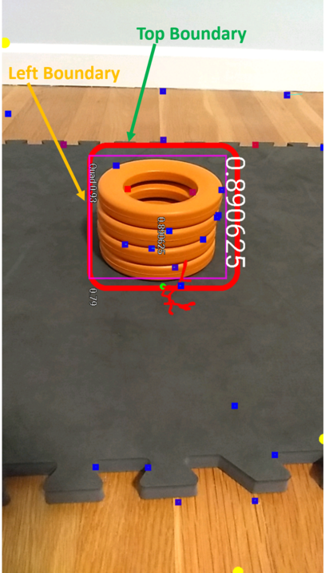

   The “Left” and “Top” boundaries of a detection box when the image is in
   Portrait mode.

If you want to use your smartphone in Landscape mode, then make sure
that your phone is in Landscape mode when the TensorFlow object detector
is initialized. You may find that the Landscape mode is preferable for
this season’s game since it offers a wider field of view.

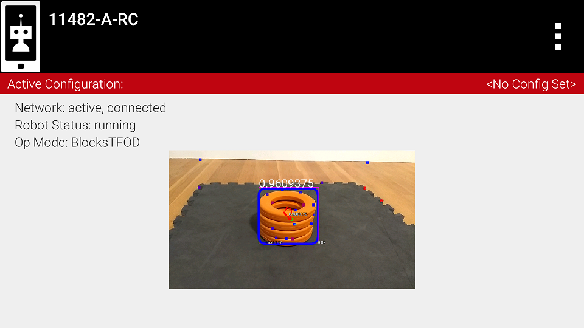

   The system can also be run in Landscape mode.

If the phone is in Landscape mode when the object detector is
initialized, then the images will be interpreted in Landscape mode.

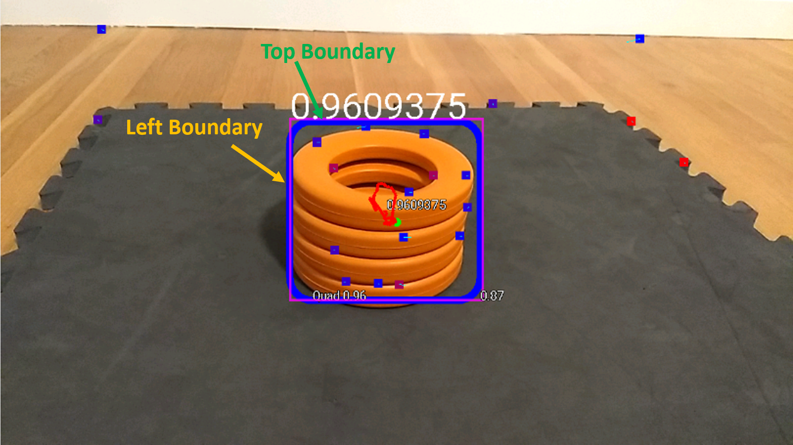

   The “Left” and “Top” boundaries of a detection box when the image is in Landscape mode.

Note that Android devices can be locked into Portrait Mode so that the
screen image will not rotate even if the phone is held in a Landscape
orientation. If your phone is locked in Portrait Mode, then the
TensorFlow object detector will interpret all images as Portrait images.
If you would like to use the phone in Landscape mode, then you need to
make sure your phone is set to “Auto-rotate” mode. In Auto-rotate mode,
if the phone is held in a Landscape orientation, then the screen will
auto rotate to display the contents in Landscape form.

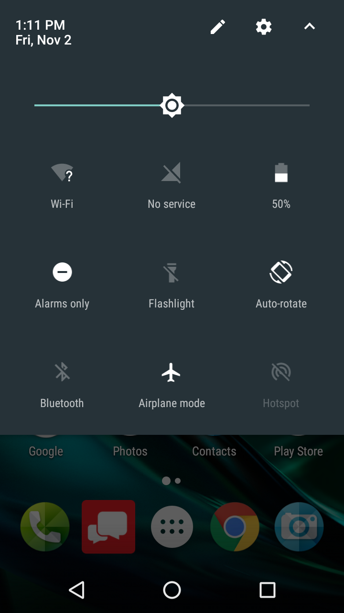

   Auto-rotate must be enabled in order to operate in Landscape mode.

Deactivating TensorFlow
~~~~~~~~~~~~~~~~~~~~~~~

When the example op mode is no longer active (i.e. when the user has
pressed the square Stop button on the Driver Station) the op mode will
attempt to deactivate the TensorFlow library before it’s done. It’s
important to deactivate the library to free up system resources.

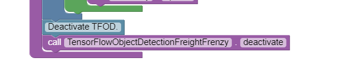

   Deactivate TensorFlow

===================

Updated 10/20/21
