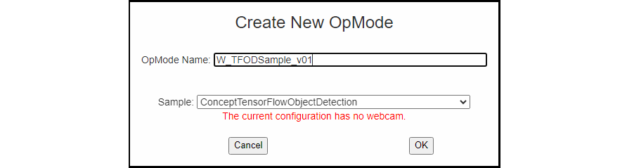
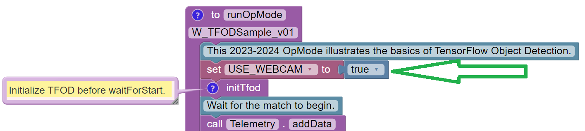
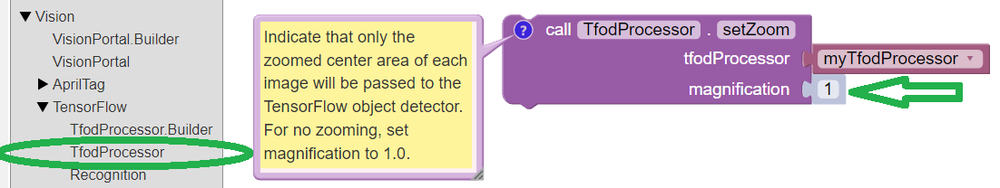
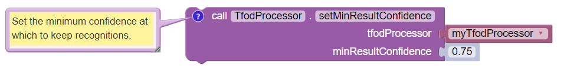
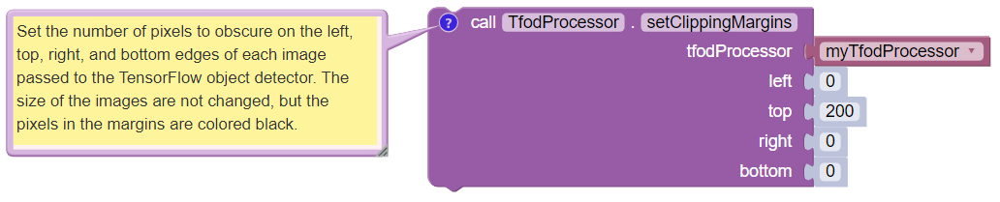
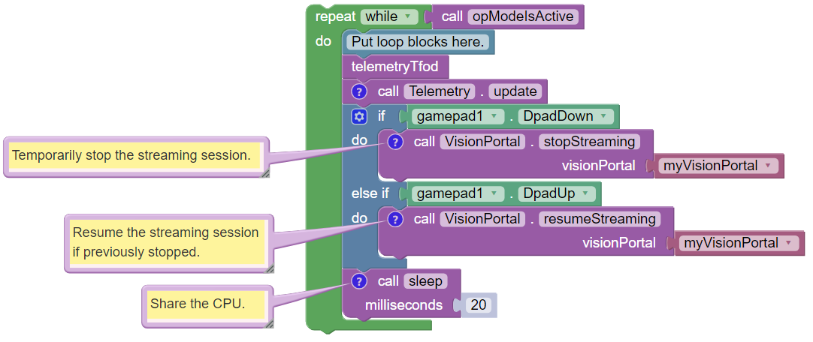
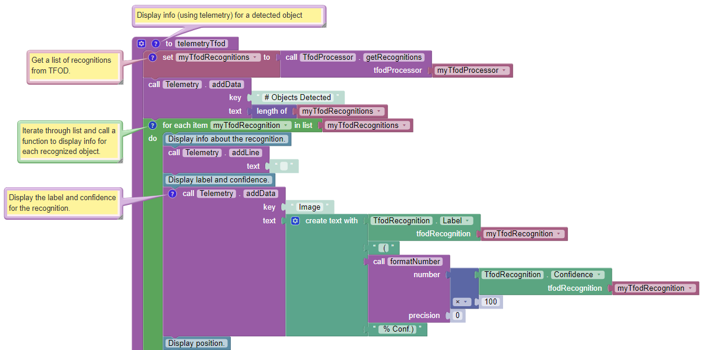
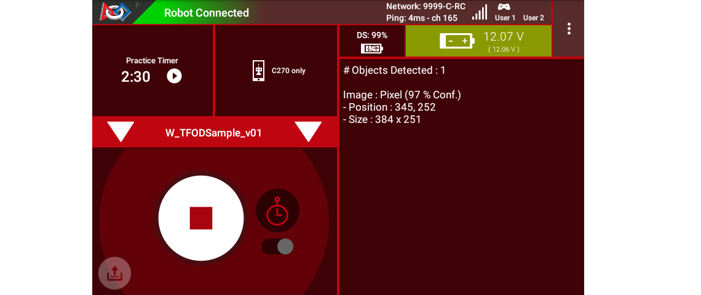
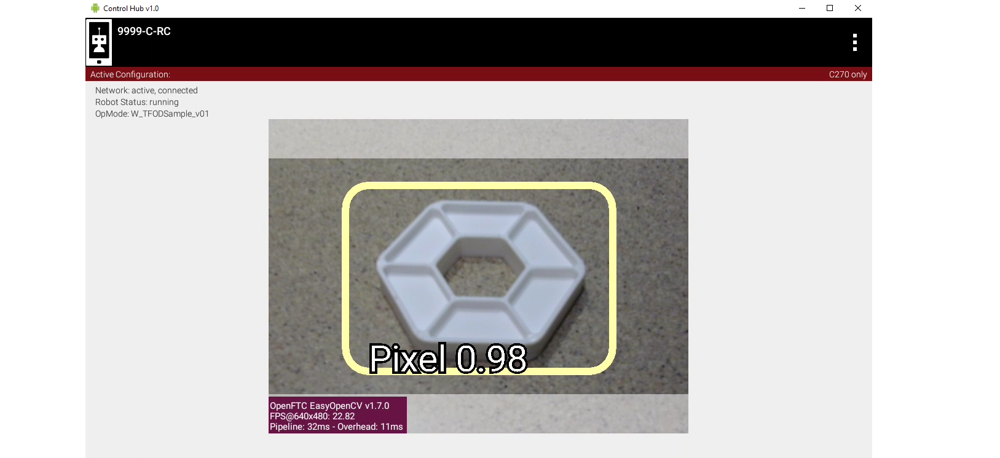
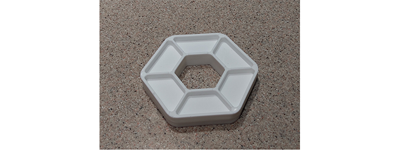

Blocks Sample OpMode for TFOD
=============================

Introduction
------------

This tutorial describes the FTC Blocks Sample OpMode for TensorFlow
Object Detection (TFOD). This Sample, called
“ConceptTensorFlowObjectDetection”, can recognize one or more official
game elements and provide their visible size and position.

For the 2023-2024 game CENTERSTAGE, the game element is a hexagonal
white **Pixel**. The FTC SDK software contains a TFOD model of this
object, ready for recognition. That model was created with the 
:doc:`Machine Learning Toolchain <../../../ftc_ml/index>`.

For extra points, teams may instead use their own custom TFOD models of
**Team Props**. That option is described
`here <https://github.com/FIRST-Tech-Challenge/FtcRobotController/wiki/Custom-TFOD-Model-with-Blocks>`__.

Creating the OpMode
-------------------

At the FTC Blocks browser interface, click on the “Create New OpMode”
button to display the Create New OpMode dialog box.

Specify a name for your new OpMode. Select
“ConceptTensorFlowObjectDetection” as the Sample OpMode that will be the
template for your new OpMode.

If no webcam is configured for your REV Control Hub, the dialog box will
display a warning message (shown here). You can ignore this warning
message if you will use the built-in camera of an Android RC phone.
Click “OK” to create your new OpMode.



   Creating a New OpMode

The new OpMode should appear in edit mode in your browser.



   Sample OpMode

By default, the Sample OpMode assumes you are using a webcam, configured
as “Webcam 1”. If you are using the built-in camera on your Android RC
phone, change the USE_WEBCAM Boolean from ``true`` to ``false`` (green
arrow above).

Adjusting the Zoom Factor
-------------------------

If the object to be recognized will be more than roughly 2 feet (61 cm)
from the camera, you might want to set the digital zoom factor to a
value greater than 1. This tells TensorFlow to use an artificially
magnified portion of the image, which may offer more accurate
recognitions at greater distances.



   Setting the Zoom Factor

Pull out the **``setZoom``** Block, found in the toolbox or palette
called “Vision”, under “TensorFlow” and “TfodProcessor” (see green oval
above). Change the magnification value as desired (green arrow).

On REV Control Hub, the “Vision” menu appears only when the active robot
configuration contains a webcam, even if not plugged in.

This ``setZoom`` Block can be placed in the INIT section of your OpMode,

-  immediately after the call to the ``initTfod`` Function, or
-  as the very last Block inside the ``initTfod`` Function.

This Block is **not** part of the Processor Builder pattern, so the Zoom
factor can be set to other values during the OpMode, if desired.

The “zoomed” region can be observed in the DS preview (Camera Stream)
and the RC preview (LiveView), surrounded by a greyed-out area that is
**not evaluated** by the TFOD Processor.

Other Adjustments
-----------------

The Sample OpMode uses a default **minimum confidence** level of 75%.
The TensorFlow Processor needs to have a confidence level of 75% or
higher, to consider an object as “recognized” in its field of view.

You can see the object name and actual confidence (as a **decimal**,
e.g. 0.75) near the Bounding Box, in the Driver Station preview (Camera
Stream) and Robot Controller preview (Liveview).



   Setting the Minimum Confidence

Pull out the **``setMinResultConfidence``** Block, found in the toolbox
or palette called “Vision”, under “TensorFlow” and “TfodProcessor”.
Adjust this parameter to a higher value if you would like the processor
to be more selective in identifying an object.

Another option is to define, or clip, a **custom area for TFOD
evaluation**, unlike ``setZoom`` which is always centered.



   Setting Clipping Margins

From the same Blocks palette, pull out the **``setClippingMargins``**
Block. Adjust the four margins as desired, in units of pixels.

These Blocks can be placed in the INIT section of your OpMode,

-  immediately after the call to the ``initTfod`` Function, or
-  as the very last Blocks inside the ``initTfod`` Function.

As with ``setZoom``, these Blocks are **not** part of the Processor
Builder pattern, so they can be set to other values during the OpMode,
if desired.

Command Flow in this Sample
---------------------------

After the ``waitForStart`` Block, this OpMode contains the main program
loop:



   OpMode Main Loop

This loop repeatedly calls a Blocks Function called
**``telemetryTfod``**. That Function is the heart of the OpMode, seeking
and evaluating recognized TFOD objects, and displaying DS Telemetry
about those objects. It will be discussed below, in the next section.

The main loop also allows the user to press the ``Dpad Down`` button on
the gamepad, to temporarily stop the streaming session. This
``.stopStreaming`` Block pauses the flow and processing of camera
frames, thus **conserving CPU resources**.

Pressing the ``Dpad Up`` button (``.resumeStreaming``) allows the
processing to continue. The on-and-off actions can be observed in the RC
preview (LiveView), described further below.

These two commands appear here in this Sample OpMode, to spread
awareness of one tool for managing CPU and bandwidth resources. The FTC
VisionPortal offers over 10 such controls, :ref:`described here 
<apriltag/vision_portal/visionportal_cpu_and_bandwidth/visionportal-cpu-and-bandwidth:visionportal cpu and bandwidth>`.

Processing TFOD Recognitions
----------------------------

The Function called **``telemetryTfod``** is the heart of the OpMode,
seeking and evaluating recognized TFOD objects, and displaying DS
Telemetry about those objects.



   Telemetry TFOD

The first Block uses the TFOD Processor to gather and store all
recognitions in a List, called ``myTfodRecognitions``.

The green “FOR Loop” iterates through that List, handling each item, one
at a time. Here the “handling” is simply displaying certain TFOD fields
to DS Telemetry.

For competition, you want to do more than display Telemetry, and you
want to exit the main loop at some point. These code modifications are
discussed in another section below.

Testing the OpMode
------------------

Click the “Save OpMode” button, then run the OpMode from the Driver
Station. The Robot Controller should use the CENTERSTAGE TFOD model to
recognize and track the white Pixel.

For a preview during the INIT phase, touch the Driver Station’s 3-dot
menu and select **Camera Stream**.

.. figure:: images/200-Sample-DS-Camera-Stream.png
   :align: center
   :width: 75%
   :alt: Sample DS Camera Stream

   Sample DS Camera Stream

Camera Stream is not live video; tap to refresh the image. Use the small
white arrows at lower right to expand or revert the preview size. To
close the preview, choose 3-dots and Camera Stream again.

After touching the DS START button, the OpMode displays Telemetry for
any recognized Pixel(s):



   Sample DS Telemetry

The above Telemetry shows the label name, and TFOD confidence level. It
also gives the **center location** and **size** (in pixels) of the
Bounding Box, which is the colored rectangle surrounding the recognized
object.

The pixel origin (0, 0) is at the top left corner of the image.

Before and after touching DS START, the Robot Controller provides a
video preview called **LiveView**.



   Sample RC LiveView

For Control Hub (with no built-in screen), plug in an HDMI monitor or
learn about ```scrcpy`` <https://github.com/Genymobile/scrcpy>`__. The
above image is a LiveView screenshot via ``scrcpy``.

If you don’t have a physical Pixel on hand, try pointing the camera at
this image:



   Sample Pixel

Modifying the Sample
--------------------

In this Sample OpMode, the main loop ends only upon touching the DS Stop
button. For competition, teams should **modify this code** in at least
two ways:

-  for a significant recognition, take action or store key information –
   inside the FOR loop

-  end the main loop based on your criteria, to continue the OpMode

As an example, you might set a Boolean variable ``isPixelDetected`` to
``true``, if a significant recognition has occurred.

You might also evaluate and store which randomized Spike Mark (red or
blue tape stripe) holds the white Pixel.

Regarding the main loop, it could end after the camera views all three
Spike Marks, or after your code provides a high-confidence result. If
the camera’s view includes more than one Spike Mark position, perhaps
the white Pixel’s **Bounding Box** size and location could be useful.
Teams should consider how long to seek an acceptable recognition, and
what to do otherwise.

In any case, the OpMode should exit the main loop and continue running,
using any stored information.

Best of luck this season!

============

Questions, comments and corrections to westsiderobotics@verizon.net

