Blocks Custom Model Sample OpMode for TFOD
==========================================

Introduction
------------

This tutorial uses an FTC Blocks Sample OpMode to load and recognize a
**custom TensorFlow inference model**.

- In this example, the “custom model” is actually the standard trained
  model of the 2023-2024 CENTERSTAGE game element called a **Pixel**. This
  does not affect the process described for a custom model.

Downloading the Model
---------------------

The Robot Controller allows you to load a trained inference model in the
form of a TensorFlow Lite (``.tflite``) file.

Here we use the standard FTC ``.tflite`` file from CENTERSTAGE
(2023-2024), available on GitHub at the following link:

- `CENTERSTAGE TFLite File <https://github.com/FIRST-Tech-Challenge/WikiSupport/blob/master/tensorflow/CenterStage.tflite>`__

.. note::
   Very advanced teams could use Google's TensorFlow Object Detection API 
   (https://github.com/tensorflow/models/tree/master/research/object_detection) 
   to create their own custom inference model.

Click the “Download Raw File” button to download the
``CenterStage.tflite`` file from GitHub to your local device
(e.g. laptop). See the green arrow.

.. figure:: images/012-Centerstage-public-repo.png
   :align: center
   :width: 85%
   :alt: Public Repo for CenterStage file

   Public repo for CenterStage tflite file

Uploading to the Robot Controller
---------------------------------

After downloading the file to your laptop, you need to upload it to the
Robot Controller. Connect your laptop to your Robot Controller’s
wireless network and navigate to the FTC “Manage” page:

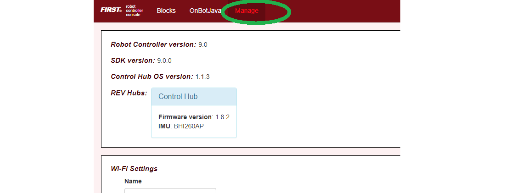

   Example of the Manage Page

Scroll down and click on “Manage TensorFlow Lite Models”.

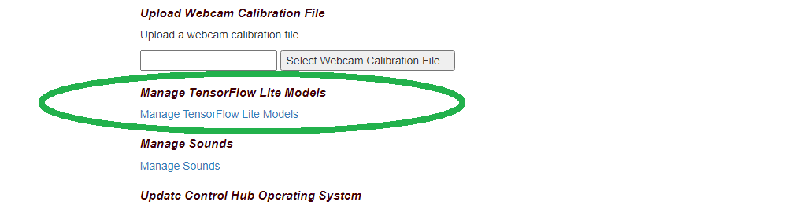

   Manage TFLITE Models Link

Now click the “Upload Models” button.

.. figure:: images/040-Upload-Models.png
   :align: center
   :width: 85%
   :alt: Upload TFLITE Model

   Upload TFLITE Models Button

Click “Choose Files”, and use the dialog box to find and select the
downloaded ``CenterStage.tflite`` file.

.. figure:: images/050-Choose-Files.png
   :align: center
   :width: 85%
   :alt: Upload TFLITE Model

   Upload TFLITE Models Button

Now the file will upload to the Robot Controller. The file will appear
in the list of TensorFlow models available for use in OpModes.

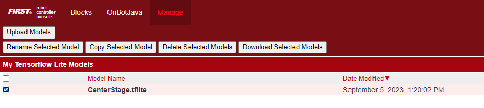

   TFLITE Model Listed

Creating the OpMode
-------------------

Click on the “Blocks” tab at the top of the screen to navigate to the
Blocks Programming page. Click on the “Create New OpMode” button to
display the Create New OpMode dialog box.

Specify a name for your new OpMode. Select
“ConceptTensorFlowObjectDetectionCustomModel” as the Sample OpMode that
will be the template for your new OpMode.

If no webcam is configured for your REV Control Hub, the dialog box will
display a warning message (shown here). You can ignore this warning
message if you will use the built-in camera of an Android RC phone.
Click “OK” to create your new OpMode.

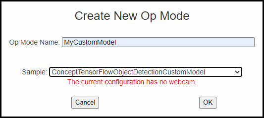

   Create New OpMode

The new OpMode should appear in edit mode in your browser.

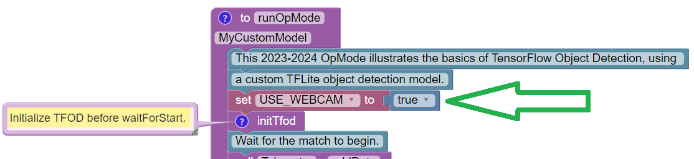

   Sample OpMode

By default, the Sample OpMode assumes you are using a webcam, configured
as “Webcam 1”. If you are using the built-in camera on your Android RC
phone, change the USE_WEBCAM Boolean from ``true`` to ``false`` (green
arrow above).

Loading the Custom Model
------------------------

Scroll down in the OpMode, to the Blocks Function called “initTfod”.

In the Block with “.setModelFileName”, change the filename from
“MyCustomModel.tflite” to ``CenterStage.tflite`` – or other filename
that you uploaded to the Robot Controller. The filename must be an exact
match. See green oval below.

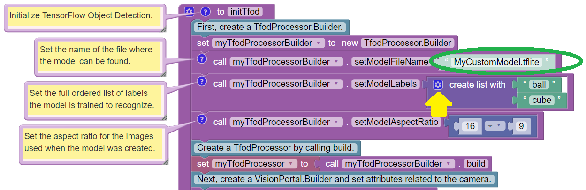

   Init TFOD Function

When loading an inference model, you must specify a list of **labels**
that describe the known objects in the model. This is done in the next
Block, with “.setModelLabels”.

This Sample OpMode assumes a default model with two known objects,
labeled “ball” and “cube”. The CENTERSTAGE model contains only one
object, labeled “Pixel”.

For competition, the **Team Prop** label names might be
``myTeamProp_Red`` and/or ``myTeamProp_Blue``.

The number of labels can be changed by clicking the small blue gear icon
for the “create list with” Block (see yellow arrow).

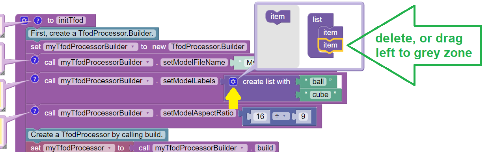

   Blue Gear Delete

In the pop-up layout balloon, click on one of the list items to select
it (green arrow above). Then remove it, by pressing Delete (on
keyboard), or by dragging it to the balloon’s left-side grey zone.

After editing that purple “list” structure, click the blue gear icon
again to close the layout balloon. Edit the remaining label to “Pixel”.

When complete, the edited Blocks should look like this:

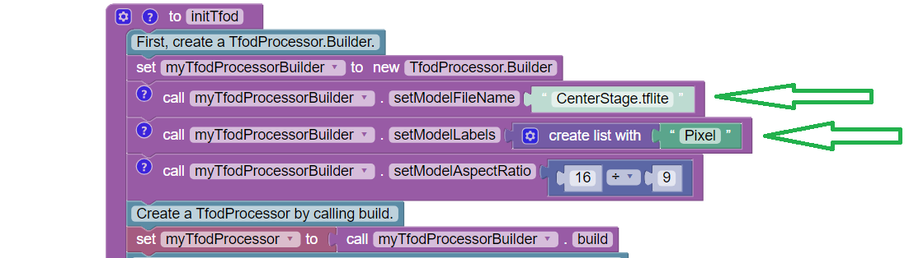

   Adding Pixel Label

Adjusting the Zoom Factor
-------------------------

If the object to be recognized will be more than roughly 2 feet (61 cm)
from the camera, you might want to set the digital zoom factor to a
value greater than 1. This tells TensorFlow to use an artificially
magnified portion of the image, which may offer more accurate
recognitions at greater distances.

.. figure:: images/150-setZoom.png
   :align: center
   :width: 85%
   :alt: Set Zoom

   Set Zoom

Pull out the **“setZoom” Block**, found in the toolbox or palette called
“Vision”, under “TensorFlow” and “TfodProcessor” (see green oval above).
Change the magnification value as desired (green arrow).

On REV Control Hub, the “Vision” menu appears only when the active robot
configuration contains a webcam, even if not plugged in.

Place this Block immediately after the Block
``set myTfodProcessor to call myTfodProcessorBuilder.build``. This Block
is **not** part of the Processor Builder pattern, so the Zoom factor can
be set to other values during the OpMode, if desired.

The “zoomed” region can be observed in the DS preview (Camera Stream)
and the RC preview (LiveView), surrounded by a greyed-out area that is
**not evaluated** by the TFOD Processor.

Testing the OpMode
------------------

Click the “Save OpMode” button, then run the OpMode from the Driver
Station. The Robot Controller should use the new CENTERSTAGE inference
model to recognize and track the Pixel game element.

For a preview during the INIT phase, touch the Driver Station’s 3-dot
menu and select **Camera Stream**.

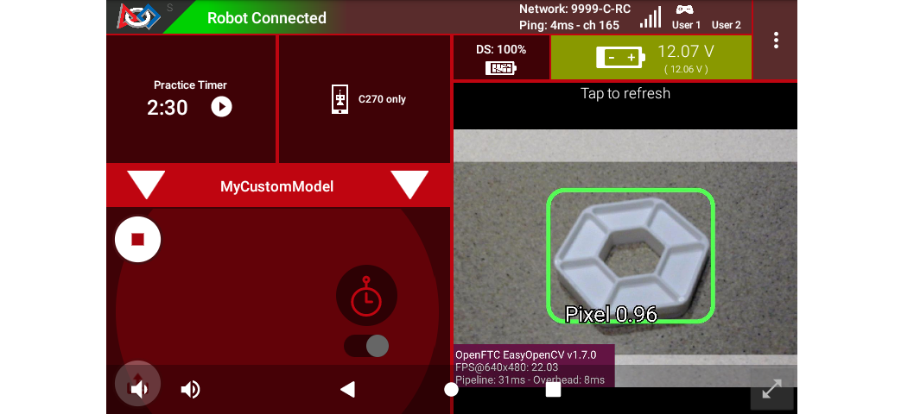

   DS Camera Stream

Camera Stream is not live video; tap to refresh the image. Use the small
white arrows at lower right to expand or revert the preview size. To
close the preview, choose 3-dots and Camera Stream again.

After touching the DS START button, the OpMode displays Telemetry for
any recognized Pixel(s):

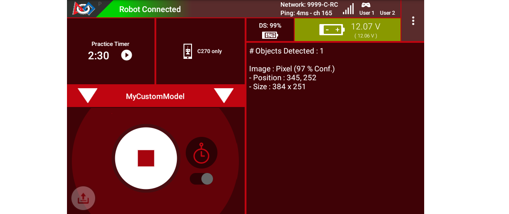

   DS Telemetry

The above Telemetry shows the label name, and TFOD confidence level. It
also gives the **center location** and **size** (in pixels) of the
Bounding Box, which is the colored rectangle surrounding the recognized
object.

The pixel origin (0, 0) is at the top left corner of the image.

Before and after touching DS START, the Robot Controller provides a
video preview called **LiveView**.

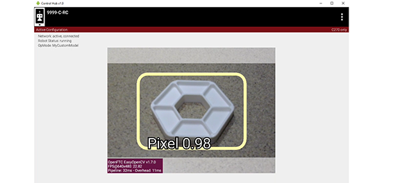

   RC LiveView

For Control Hub (with no built-in screen), plug in an HDMI monitor or
learn about ``scrcpy`` (https://github.com/Genymobile/scrcpy). The
above image is a LiveView screenshot via ``scrcpy``.

If you don’t have a physical Pixel on hand, try pointing the camera at
this image:

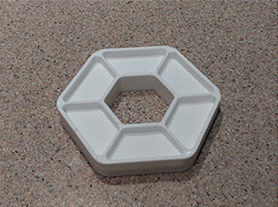

   Sample Pixel

Modifying the Sample
--------------------

In this Sample OpMode, the main loop ends only upon touching the DS Stop
button. For competition, teams should **modify this code** in at least
two ways:

-  for a significant recognition, take action or store key information –
   inside the FOR loop

-  end the main loop based on your criteria, to continue the OpMode

As an example, you might set a Boolean variable ``isTeamPropDetected``
to ``true``, if a significant recognition has occurred.

You might also evaluate and store which randomized Spike Mark (red or
blue tape stripe) holds the Team Prop.

Regarding the main loop, it could end after the camera views all three
Spike Marks, or after your code provides a high-confidence result. If
the camera’s view includes more than one Spike Mark position, perhaps
the Team Prop’s **Bounding Box** size and location could be useful.
Teams should consider how long to seek an acceptable recognition, and
what to do otherwise.

In any case, the OpMode should exit the main loop and continue running,
using any stored information.

Best of luck this season!

============

Questions, comments and corrections to westsiderobotics@verizon.net
