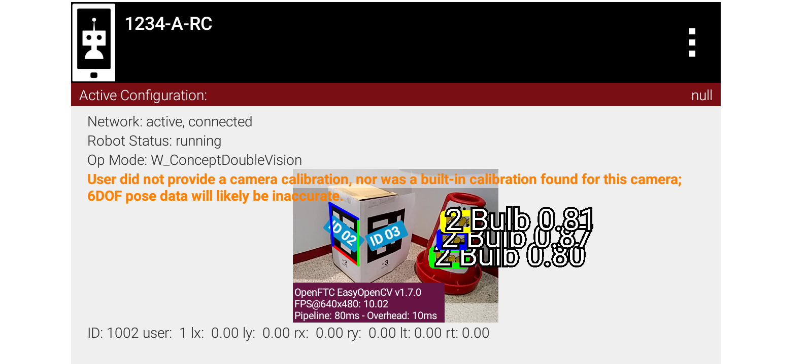
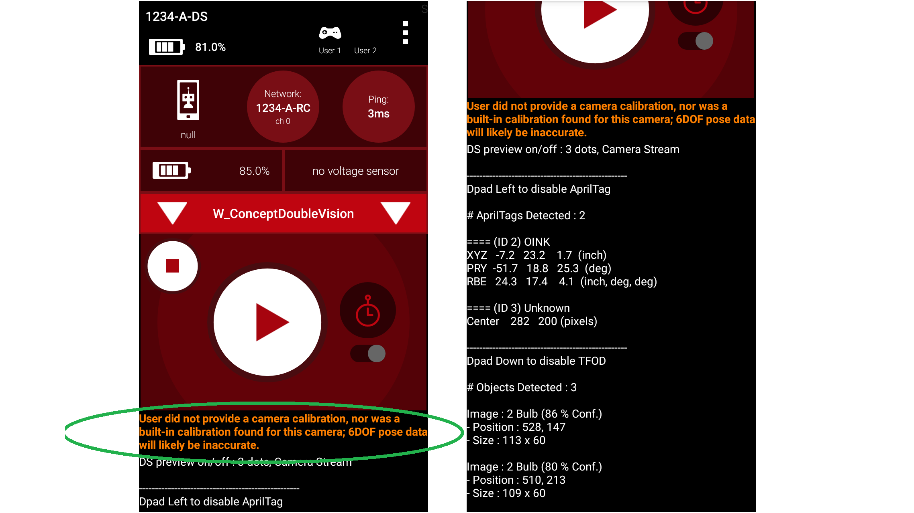
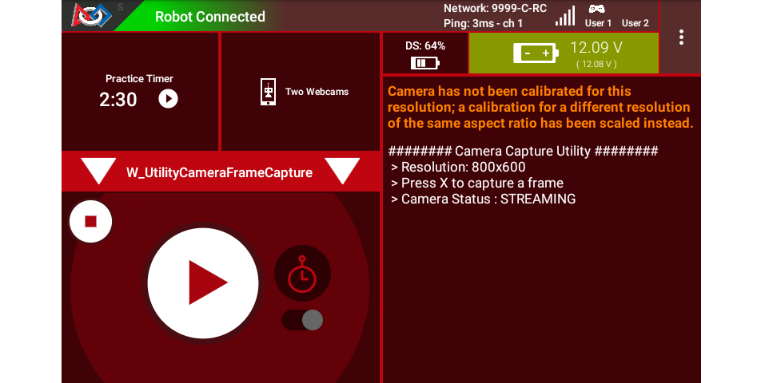

Camera Calibration
==================

What is a camera calibration and why is it needed?
--------------------------------------------------

Cameras are composed of many different components that can introduce variability
in the actual image that a camera ultimately "sees". Camera calibration is a
process that mathematically models how a camera & lens combination ultimately
sees the world, for example how wide the field of view is. Calibrating your camera
is a must if you desire to use it for high-precision tasks, such as performing
precision measurements using the camera or obtaining accurate 6DOF pose data from
fiducial marker systems like AprilTags.

   *"Without a camera calibration, the best you could achieve is being
   able to turn towards the target. Range information would be
   incorrect." -- FIRST Tech Challenge navigation expert @gearsincorg*

The calibration values are called **lens intrinsics**. It's important to note
that they are not only specific to the camera and lens, but also specific to the
resolution used on a particular camera as well! A webcam that offers 18
resolutions wants a separate calibration for each one.

Does your camera already have calibration data?
-----------------------------------------------

The SDK ships calibration data for a limited number of webcams and resolutions,
so check this list before calibrating anything yourself:

.. list-table::
   :header-rows: 1
   :widths: 40 60

   * - Webcam
     - Calibrated resolutions
   * - Logitech HD Webcam C270
     - 640x480
   * - Logitech HD Webcam C310
     - 640x480, 640x360
   * - Logitech HD Pro Webcam C920
     - 640x480, 800x600, 640x360, 800x448, 864x480, 1920x1080
   * - Microsoft Lifecam HD 3000 (v1 and v2)
     - 640x480
   * - goBILDA (SKU 3122-0003-0001)
     - 640x480, 800x600, 1280x720, 1920x1080

If your camera and resolution are both on this list, you do not need to
calibrate. If your camera is on the list but your resolution is not, you can
either switch to a calibrated resolution or generate your own values.

.. note::
   This table can fall behind the SDK. The authoritative source is the SDK file
   ``builtinwebcamcalibrations.xml``; in Android Studio, find it under the
   ``RobotCore``, ``res``, ``xml`` subfolders.

Android device cameras also need calibration data for good pose estimates. The
SDK provides no lens intrinsics for these cameras.

Capturing calibration frames
----------------------------

Every calibration tool works from a set of photographs taken by the camera you
are calibrating, at the resolution you are calibrating. The SDK provides a
utility OpMode to capture them.

Create an OpMode from the Java Sample ``UtilityCameraFrameCapture.java``.
Android Studio teams can find this utility program in the External Samples
folder; OnBot Java teams can copy it into their teamcode folder. Modify the
parameters at the top -- most importantly the resolution -- according to your
needs.

FTC Blocks teams can duplicate this OpMode, requiring a custom myBlock only for
the method ``saveNextFrameRaw()``. At some future time, this Java method may
become available as a regular Block, avoiding the need for a myBlock. Learn more
about myBlocks here:

- :ref:`MyBlocks Tutorial <programming_resources/shared/myblocks/index:custom blocks (myblocks)>`.

The OpMode captures a camera frame (image) and stores it on the Robot
Controller with each press of the gamepad button X (or Square). To illustrate,
it stores the first two captured images as:

- ``VisionPortal-CameraFrameCapture-000000.png``
- ``VisionPortal-CameraFrameCapture-000001.png``

The numbering restarts for each run of the OpMode. Move each set of frames to
its own folder on your computer, to avoid overwriting the previous run's
results.

To retrieve the images, connect your Robot Controller device to your computer
with a USB cable. The files are in the root of the USB storage, with names
prefixed by ``VisionPortal-``. Mac OSX users may need special software for
Android file transfer.

Choosing a calibration tool
---------------------------

There are many methods to calibrate cameras, including OpenCV, MATLAB, MRCAL
etc.

-  For advanced teams, using `MRCAL <https://mrcal.secretsauce.net/>`__ is
   likely the best option - it is a tool developed by NASA JPL that provides
   extensive data on how good your calibration is and what goes into the numerical
   optimization to arrive at the optimal parameters.
-  For the rest of us, the walkthrough below explains how to calibrate your
   camera using `3DF Zephyr <https://www.3dflow.net/3df-zephyr-free/>`__, which is
   extremely easy to use and can provide reasonable results.

.. warning::
   3DF Zephyr is a Microsoft Windows 64-bit application. It is not supported on
   32-bit versions of Windows, nor is it supported on Mac or on Linux platforms.
   Teams on those platforms will need MRCAL or another calibration program.

Calibrating with 3DF Zephyr
---------------------------

1. Download and install `3DF Zephyr Free Edition <https://www.3dflow.net/3df-zephyr-free/>`__.
2. In 3DF Zephyr, go to:

   - Utilities --> Images --> Camera Calibration

   and follow the instructions. Use the frame capture OpMode described above to
   take the pictures.
3. Press the *Add Images* button in 3DF Zephyr and point it to the images you
   copied from the Robot Controller.
4. Run the calibration target analysis in 3DF Zephyr; when it is complete, it
   will provide you with ``fx, fy, cx, cy`` which are the needed calibration
   parameters to be applied to your ``AprilTagProcessor``.

Calibration warnings from the SDK
---------------------------------

Running ``ConceptDoubleVision`` (or any AprilTag Sample OpMode) with an
uncalibrated camera gives the following error message on both devices:

   Warning of no camera calibration provided

|

   Right-hand image shows that the warning still allows detections.

The SDK gives a different warning that covers a **special case**, where the
OpMode uses:

- a camera model for which the SDK **does have** lens intrinsics, and
- a user-specified resolution for which

  - (a) the SDK **does not have** lens intrinsics, and
  - (b) the **aspect ratio** matches that of lens intrinsics that the SDK
    **does have** (for that camera model).

In such a case, the SDK **scales** the results in an attempt to estimate
AprilTag pose.

For example, changing the Logitech C270 resolution from 640x480 to
800x600 (also 4:3 aspect ratio), gives this warning on the RC preview
and the DS screen:

   Warning about no calibration at this resolution

The above warning advises the user of this situation, with the
opportunity to accept/adjust the scaled estimate or provide actual
calibration values.

Neither warning affects the function of capturing and storing camera frames.

====

*Questions, comments and corrections to westsiderobotics@verizon.net*
