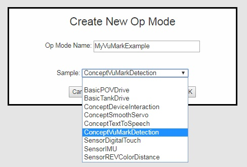
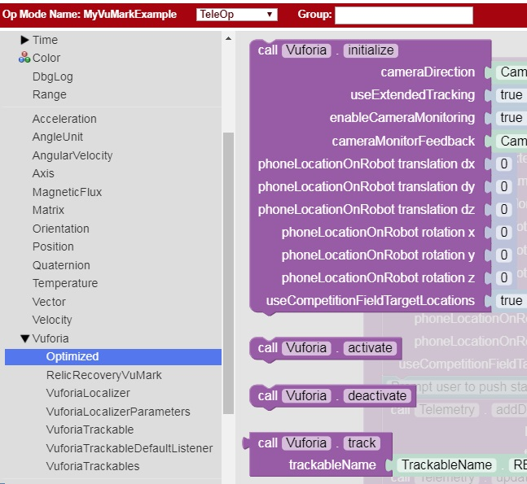
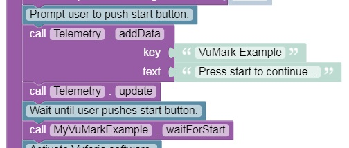
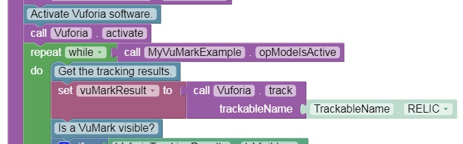
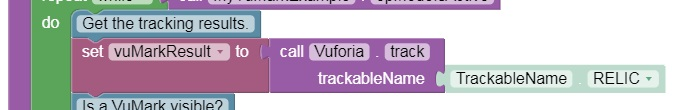
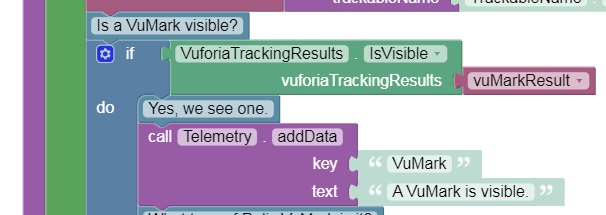
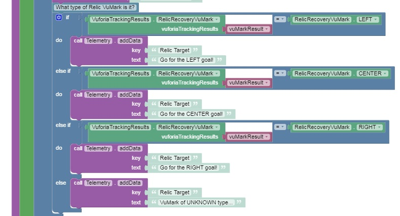
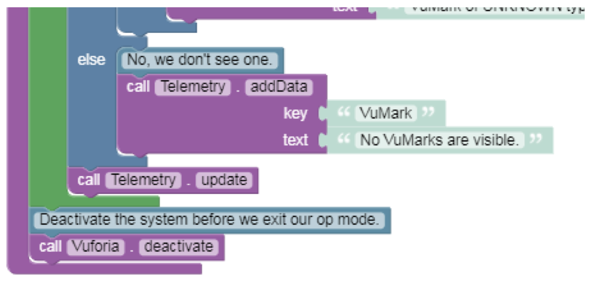
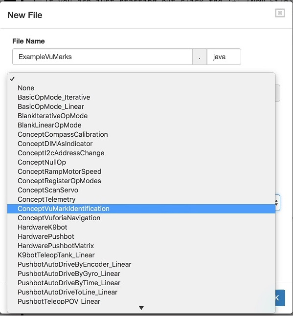
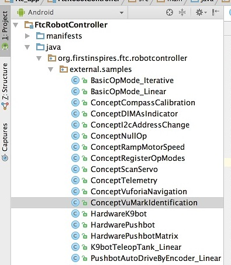

Identifying Vuforia VuMarks
============================

What is a VuMark?
~~~~~~~~~~~~~~~~~

The 2017-2018 FIRST Tech Challenge game includes special vision targets
that contain secret clues that can be used to score extra points during
the autonomous portion of a match. These special vision targets are
known as VuMarks. The VuMarks use PTC’s Vuforia computer vision
technology to encode hidden information within each picture. This
information isn’t easily noticeable to the casual human observer.
However, the FIRST Tech Challenge software for the 2017-2018 season
includes special functions that let a robot read the VuMarks using the
Robot Controller’s built-in camera.

   
   The VuMarks represent “LEFT”, “CENTER”, and “RIGHT” values.

The three images shown above represent “LEFT”, “CENTER” and “RIGHT”
values. If, for example, the “LEFT” image is displayed during a match,
then the robots should try and score their preloaded game elements into
the leftmost goal during the autonomous portion of that match.

Note that the VuMark-related features of the software are only available
with *version 3.3* of the SDK software (Robot Controller and Driver
Station) and higher.

Example Blocks VuMark Op Mode
~~~~~~~~~~~~~~~~~~~~~~~~~~~~~

Version 3.3 and higher of the Robot Controller app includes a sample
op mode that demonstrates how to check for VuMarks and extract the
hidden information when a VuMark is identified. To create an op mode
based on this VuMark Example, click on the “Create New Op Mode” button,
specify a name for your new op mode, and in the “Sample:” drop down
list, select the item named “ConceptVuMarkDetection”.

   Select “ConceptVuMarkDetection” from the “Sample” drop down list.

When you first look at the newly created example VuMark op mode, you
will see Vuforia-specific blocks included in the op mode. The
Vuforia-specific blocks that are used in this example op mode can be
found in the “Optimized” subcategory of the “Vuforia” collection of
programming blocks. Note that the “Vuforia” collection is a subcategory
of the “Utilities” collection of blocks:

   The Vuforia-related blocks can be found in the “Optimized”
   subcategory.

Let’s step through the blocks in the example op mode. The op mode first
uses the block “call Vuforia.initialize” to initialize the Vuforia
software. Note that the default values for the initialization parameters
are used.

   Initialize the Vuforia software (use default parameter values).

The op mode then prompts the user to push the start button to continue
and it waits to receive a start command from the Driver Station.

   Prompt user to push start button.

After the op mode receives the start command, it will activate the
vision tracking mechanism. It then will enter a while loop and will
continue to loop as long as the op mode is running.

   The op mode activates the tracking mechanism and starts 
   the main op mode loop.

At the start of the loop, the op mode will receive tracking information
from the Vuforia system:

   The op mode receives tracking information from the Vuforia system.

After the op mode has received the tracking results from the Vuforia
system, it checks to see if a VuMark is currently visible,

   Is a VuMark Visible?

If a VuMark is visible, the op mode will alert the user with a telemetry
statement. If a VuMark is visible, the op mode will also attempt to
identify which VuMark it is.

   The op mode checks to see which VuMark was detected.

If the target is identified, the op mode uses a telemetry statement to
inform the user which target (LEFT, CENTER or RIGHT) was detected.
Otherwise it tells the user that the VuMark is of an unknown type. If a
VuMark was not visible, the op mode sends a message to Driver Station to
inform the user that no VuMarks are currently visible.

   The Op Mode deactivates Vuforia before it exits.

When a user presses the stop button on the Driver Station, the op mode
will stop its main program loop. Before it exits, the op mode will
deactivate the Vuforia software.

Example Java VuMark Op Mode
~~~~~~~~~~~~~~~~~~~~~~~~~~~

If you are a Java Programmer, there is a sample op mode that
demonstrates how to check for and identify VuMarks in a Java op mode.
The sample op mode is named “ConceptVuMarkIdentification” and it’s
available through both the OnBot Java Programming Tool user
interface, and in the ftc_app Android Studio project. If you are an
OnBot Java user, when you create a new op mode, you should be able to
see the item “ConceptVuMarkIdentification” listed in the drop down list
of the sample op mode control. Select this example as you create your
new file.

   ConceptVuMarkIdentification is available through the OnBot
   Java UI.

If you are an Android Studio user, you can find a copy of the
ConceptVuMarkIdentification sample op mode in the external.samples
subfolder of the ftc_app Android project. Copy this op mode to your
teamcode op mode directory and comment out the @Disabled annotation to
enable this op mode.

   ConceptVuMarkIdentification is available in the Android
   Studio project folder.

Let’s take a look at the key statements in the example source code. In
the class definition for your op mode there is a member variable of type
VuforiaLocalizer:

::

   /** 
    * {@link #vuforia} is the variable we will use to store our instance of the Vuforia
    * localization engine.
    */ 
    VuforiaLocalizer vuforia;

This variable will be a reference to the instance of the Vuforia
localization/tracking engine.

In the method runOpMode() the first two statements are used to configure
the system to display a camera monitor window on the Robot
Controller app, as the op mode is running. The first statement (see
below) gets the id of the Android view that will be used to display
camera output as the op mode is running. The second statement creates a
variable called “parameters” that will hold the parameters that will be
used to initialize the Vuforia engine.

.. code-block:: java

   int cameraMonitorViewId = hardwareMap.appContext.getResources().getIdentifier("cameraMonitorViewId", "id", hardwareMap.appContext.getPackageName()); 
   VuforiaLocalizer.Parameters parameters = new VuforiaLocalizer.Parameters(cameraMonitorViewId); 

Note that if you want to disable the camera monitor window (for example,
to use less CPU and battery power on your smartphone) you can invoke the
VuforiaLocalizer.Parameters() constructor without any arguments.

In the next statement, the user must provide a Vuforia developer license
key in order to unlock the Vuforia-related functions. The sample op mode
does not include a valid license key. You must provide your own key to
enable the Vuforia functions.

.. code-block:: java

   parameters.vuforiaLicenseKey = "ATsODcD/////AAAAAVw2lR...d45oGpdljdOh5LuFB9nDNfckoxb8COxKSFX"; 

You can obtain a license key for free from the Vuforia Developer
website:

`      https://developer.vuforia.com/license-manager <https://developer.vuforia.com/license-manager>`__

The next two statements tell the Vuforia system to use the back-facing
camera on the Android device and then it creates a VuforiaLocalizer
using the initialization parameters that were set in the earlier
statements.

.. code-block:: java

   parameters.cameraDirection = VuforiaLocalizer.CameraDirection.BACK; 
   this.vuforia = ClassFactory.createVuforiaLocalizer(parameters); 

The next three statements load the Relic Recovery vision tracking
dataset.

.. code-block:: java

   /** 
    * Load the data set containing the VuMarks for Relic Recovery. There's only one trackable 
    * in this data set: all three of the VuMarks in the game were created from this one template, 
    * but differ in their instance id information. 
    * @see VuMarkInstanceId 
    */ 
    VuforiaTrackables relicTrackables = this.vuforia.loadTrackablesFromAsset("RelicVuMark"); 
    VuforiaTrackable relicTemplate = relicTrackables.get(0); 
    relicTemplate.setName("relicVuMarkTemplate"); // can help in debugging; otherwise not necessary 

The op mode then prompts the user to push the start button to continue.
When the op mode resumes after receiving a start command, it activates
the relicTrackables object to begin looking for and identifying this set
of VuMarks.

.. code-block:: java

   telemetry.addData(">", "Press Play to start"); 
   telemetry.update(); 
   waitForStart(); 
    
   relicTrackables.activate(); 

The op mode then enters a while loop, which runs as long as the op mode
is active (i.e., the user hasn’t pushed the stop button).

.. code-block:: java

   while (opModeIsActive()) { 

The op mode checks to see if one of the known VuMarks from the Relic
Recovery dataset is visible. If it is visible, then it sends a telemetry
message to indicate that the VuMark is visible.

If the VuMark associated with the “LEFT” goal is visible, the telemetry
message will read “LEFT is visible”. Similarly, if the “CENTER” VuMark
or the “RIGHT” VuMark is visible, the message will read “CENTER is
visible” or “RIGHT is visible”.

.. code-block:: java

   /** 
   * See if any of the instances of {@link relicTemplate} are currently visible. 
   * {@link RelicRecoveryVuMark} is an enum which can have the following values: 
   * UNKNOWN, LEFT, CENTER, and RIGHT. When a VuMark is visible, something other than 
   * UNKNOWN will be returned by {@link RelicRecoveryVuMark#from(VuforiaTrackable)}. 
   */ 
   RelicRecoveryVuMark vuMark = RelicRecoveryVuMark.from(relicTemplate); 
   if (vuMark != RelicRecoveryVuMark.UNKNOWN) { 
    
       /* Found an instance of the template. In the actual game, you will probably 
        * loop until this condition occurs, then move on to act accordingly depending 
        * on which VuMark was visible. */ 
       telemetry.addData("VuMark", "%s visible", vuMark); 

If a known VuMark is visible, the example op mode then retrieves the
pose information from the VuMark. The pose information provides the
relative location and orientation of the camera with respect to the
vision target. Note that these pose-related steps are NOT necessary to
be able to identify a VuMark. The example shows these optional steps in
case you are interested in knowing how to extract the pose information
for a detected VuMark.

.. code-block:: java

   /* For fun, we also exhibit the navigational pose. In the Relic Recovery game, 
   * it is perhaps unlikely that you will actually need to act on this pose information, but 
   * we illustrate it nevertheless, for completeness. */ 
   OpenGLMatrix pose = ((VuforiaTrackableDefaultListener)relicTemplate.getListener()).getPose(); 
   telemetry.addData("Pose", format(pose)); 
    
   /* We further illustrate how to decompose the pose into useful rotational and 
   * translational components */ 
   if (pose != null) { 
       VectorF trans = pose.getTranslation(); 
       Orientation rot = Orientation.getOrientation(pose, AxesReference.EXTRINSIC, AxesOrder.XYZ, AngleUnit.DEGREES); 
    
       // Extract the X, Y, and Z components of the offset of the target relative to the robot 
       double tX = trans.get(0); 
       double tY = trans.get(1); 
       double tZ = trans.get(2); 
    
       // Extract the rotational components of the target relative to the robot 
       double rX = rot.firstAngle; 
       double rY = rot.secondAngle; 
       double rZ = rot.thirdAngle; 
   } 

If a known VuMark is not visible, the op mode will let the user know.

Testing the Example VuMark Op Modes
~~~~~~~~~~~~~~~~~~~~~~~~~~~~~~~~~~~

If you’d like test the example VuMark op modes, you will need copies of
the VuMark image targets. You can download the image targets for the
2017-2018 game from the FIRSTInspires.org website. Visit the `FIRST Tech
Challenge Game & Season Materials webpage <https://www.firstinspires.org/resource-library/ftc/game-and-season-info>`__ 
for additional information.
