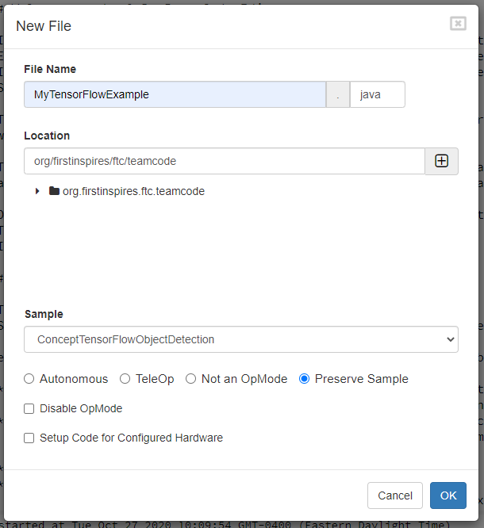
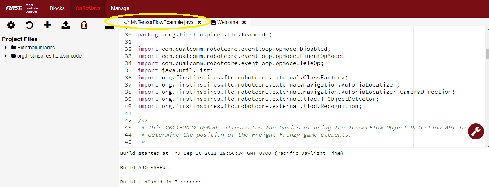
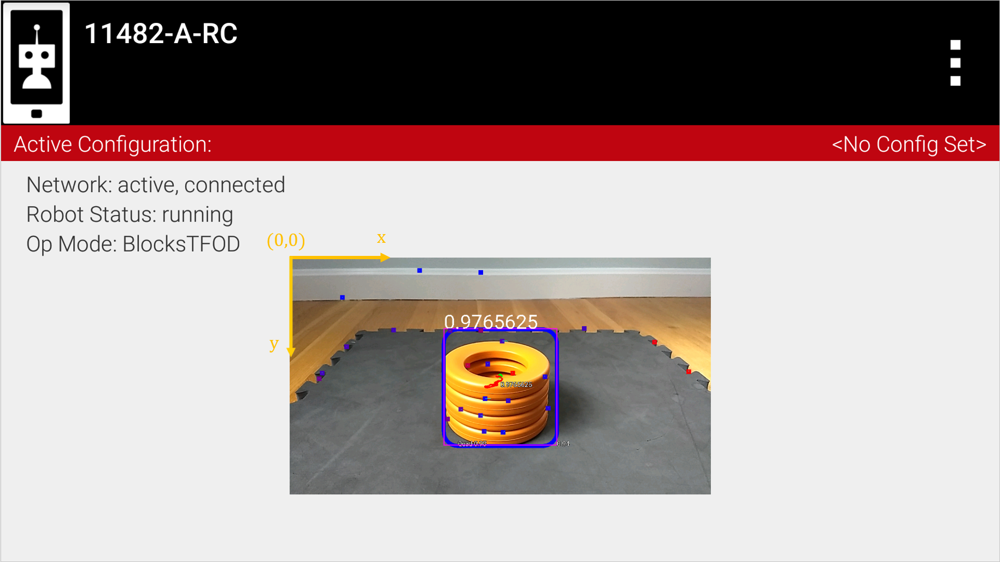
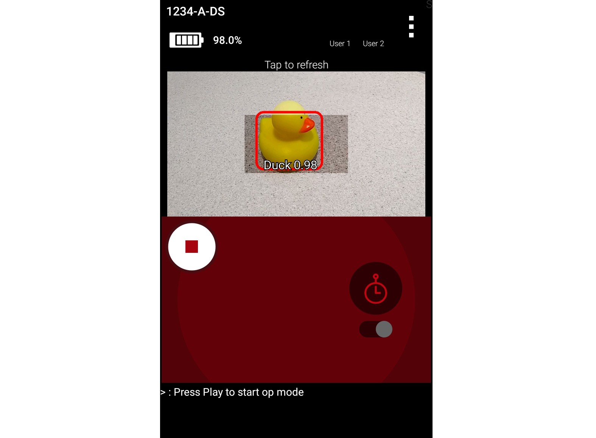
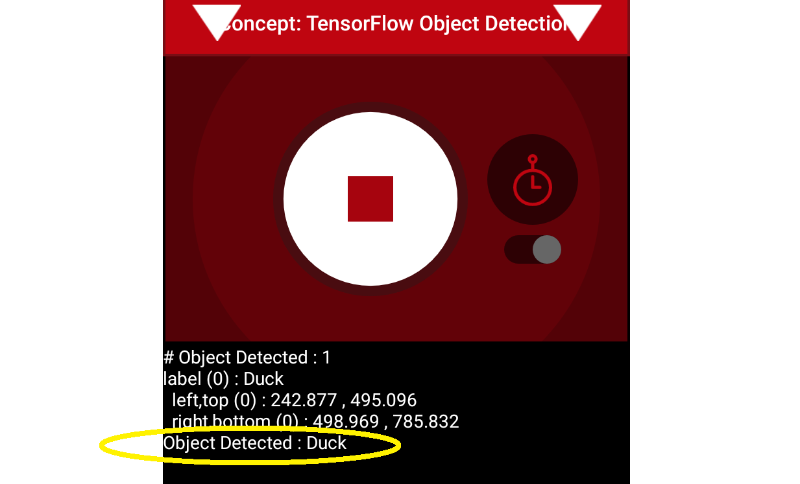
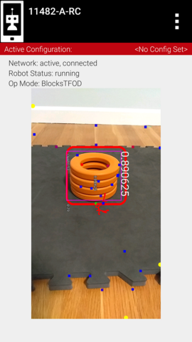
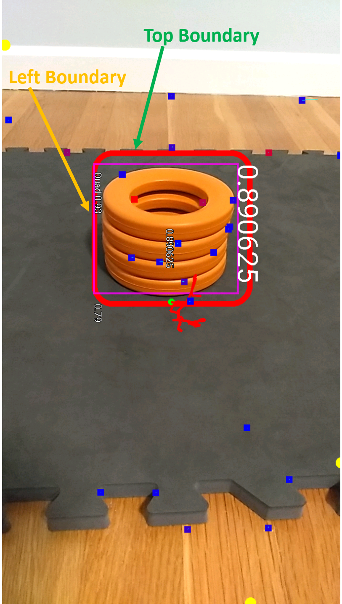
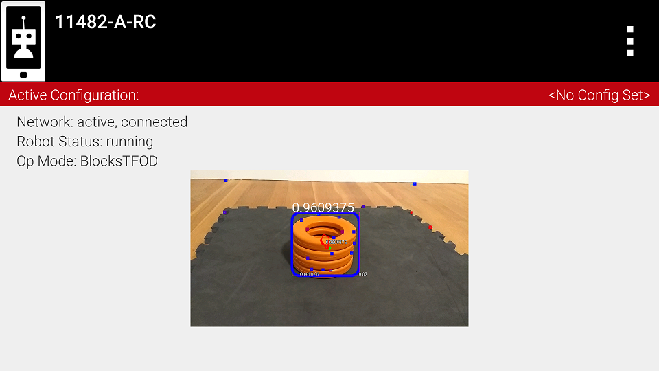
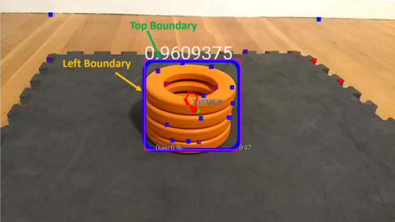
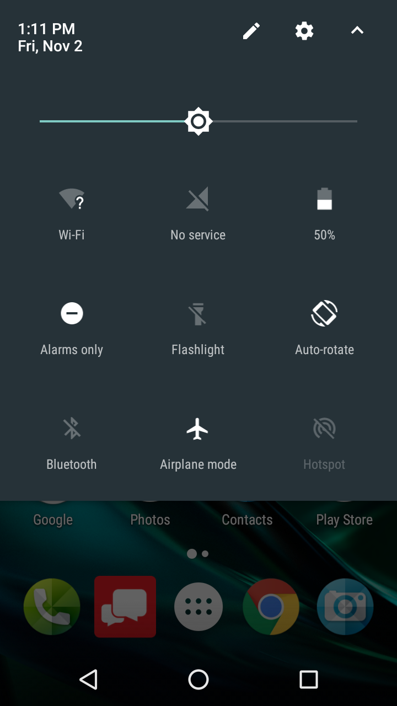

Java Sample Op Mode for TFOD
=============================

Creating the Op Mode
~~~~~~~~~~~~~~~~~~~~

You can use the sample “ConceptTensorFlowObjectDetection” as a template
to create your own Java op mode that uses the TensorFlow technology to
“look for” any game elements, and determine the relative location of any
identified elements.

-  If you are using a **webcam** connected to the Robot Controller
   device, select “ConceptTensorFlowObjectDetectionWebcam” as the sample
   op mode from the dropdown list in the New File dialog box.
-  If you are using an Android smartphone’s **built-in camera**, select
   “ConceptTensorFlowObjectDetection” as the sample op mode from the
   dropdown list in the New File dialog box.

Press “OK” to create the new op mode.

   Create an Op Mode with ConceptTensorFlowObjectDetection as its template.

Your new op mode should appear in the editing pane of the OnBot Java
screen.

   Your newly created op mode should be available for editing through OnBot Java

Initializing the System
~~~~~~~~~~~~~~~~~~~~~~~

Let’s take a look at the initial statements in the op mode. Before you
start, you must first make sure you have a valid Vuforia developer
license key to initialize the Vuforia software. You can obtain a key for
free from https://developer.vuforia.com/license-manager. Once you obtain
your key, replace the VUFORIA_KEY static String with the actual license
key so the Vuforia software will be able to initialize properly.

.. code-block:: java

       private static final String VUFORIA_KEY =
               " -- YOUR NEW VUFORIA KEY GOES HERE  --- ";

Also, by default the op mode is disabled. Comment out the “@Disabled”
annotation to enable your newly created op mode.

.. code-block:: java

   @TeleOp(name = "Concept: TensorFlow Object Detection", group = "Concept")
   //@Disabled
   public class MyTensorFlowExample extends LinearOpMode {

Since TensorFlow will receive image data from Vuforia, the op mode
attempts to create and initialize a VuforiaLocalizer object by calling
the function called “initVuforia()”:

.. code-block:: java

           // The TFObjectDetector uses the camera frames from the VuforiaLocalizer, so we create that
           // first.
           initVuforia();
           initTfod();

You can initialize both the Vuforia and the TensorFlow libraries in the
same op mode. This is useful, for example, if you would like to use the
TensorFlow library to recognize the Duck and then use the Vuforia
library to help the robot autonomously navigate on the game field.

In this example op mode, however, the initVuforia() function does not
load any trackable image targets.

.. code-block:: java

       /**
        * Initialize the Vuforia localization engine.
        */
       private void initVuforia() {
           /*
            * Configure Vuforia by creating a Parameter object, and passing it to the Vuforia engine.
            */
           VuforiaLocalizer.Parameters parameters = new VuforiaLocalizer.Parameters();

           parameters.vuforiaLicenseKey = VUFORIA_KEY;
           parameters.cameraDirection = CameraDirection.BACK;

           //  Instantiate the Vuforia engine
           vuforia = ClassFactory.getInstance().createVuforia(parameters);

           // Loading trackables is not necessary for the TensorFlow Object Detection engine.
       }

After the Vuforia localizer is initialized, the op mode calls a method
initTfod(). This method initializes the TensorFlow Object Detection
engine.

.. code-block:: java

       /**
        * Initialize the TensorFlow Object Detection engine.
        */
       private void initTfod() {
           int tfodMonitorViewId = hardwareMap.appContext.getResources().getIdentifier(
               "tfodMonitorViewId", "id", hardwareMap.appContext.getPackageName());
           TFObjectDetector.Parameters tfodParameters = new TFObjectDetector.Parameters(tfodMonitorViewId);
           tfodParameters.minResultConfidence = 0.8f;
           tfodParameters.isModelTensorFlow2 = true;
           tfodParameters.inputSize = 320;
           tfod = ClassFactory.getInstance().createTFObjectDetector(tfodParameters, vuforia);
           tfod.loadModelFromAsset(TFOD_MODEL_ASSET, LABELS);
       }

Note that by default, when you create a new TensorFlow object detector,
an *object tracker* is used, in addition to the TensorFlow interpreter,
to keep track of the locations of detected objects. The object tracker
*interpolates* object recognitions so that results are smoother than
they would be if the system were to solely rely on the TensorFlow
interpreter.

If you want to turn off the object tracker, then you can set the
useObjectTracker variable of the tfodParameters object to false before
you create the TensorFlow object detector.

.. code-block:: java

           // set useObjectTracker to false to disable object tracker.
           tfodParameters.useObjectTracker = false;

Also note that by default, the minimum detection confidence level is set
to 80%. This means that the TensorFlow library needs to have a
confidence level of 80% or higher in order to consider an object as
being detected in its field of view. You can adjust this parameter to a
higher value if you would like the system to be more selective in
identifying an object.

.. code-block:: java

           tfodParameters.minResultConfidence = 0.8f;

After the TensorFlow Object Detector is created it loads the TensorFlow
model data

.. code-block:: java

           tfod.loadModelFromAsset(TFOD_MODEL_ASSET, LABELS);

The arguments TFOD_MODEL_ASSET, LABELS are defined earlier in the op
mode and are season specific.

.. code-block:: java

      private static final String TFOD_MODEL_ASSET = "FreightFrenzy_BCDM.tflite";
       private static final String[] LABELS = {
         "Ball",
         "Cube",
         "Duck",
         "Marker"
       };

If a camera monitor window is enabled for the TensorFlow library, then
the confidence level for a detected target will be displayed near the
bounding box of the identified object (when the object tracker is
enabled). For example, a value of “0.92” indicates a 92% confidence that
the object has been identified correctly.

When an object is identified by the TensorFlow library, the op mode can
read the “Left”, “Right”, “Top” and “Bottom” values associated with the
detected object. These values correspond to the location of the left,
right, top and bottom boundaries of the detection box for that object.
These values are in pixel coordinates of the image from the camera.

The origin of the coordinate system is in the upper left-hand corner of
the image. The horizontal (x) coordinate value increases as you move
from the left to the right of the image. The vertical (y) coordinate
value increases as you move from the top to the bottom of the image.

   The origin of the image coordinate system is located in upper left hand corner

In the landscape image above, the approximate coordinate values for the
Left, Top, Right, and Bottom boundaries are 455, 191, 808, and 547
respectively (pixel coordinates). The width and height for the landscape
image above is 1280 and 720 respectively.

Activating TensorFlow
~~~~~~~~~~~~~~~~~~~~~

In this example, the op mode activates the TensorFlow object detector
before waiting for the start command from the Driver Station. This is
done so that the user can access the “Camera Stream” preview from the
Driver Station menu while it waits for the start command. Also note that
in this example, the op mode does not activate the Vuforia tracking
feature, it only activates TensorFlow object detection. If you want to
incorporate Vuforia image detection and tracking you will also need to
activate (and later deactivate when you are done) the Vuforia tracking
feature.

.. code-block:: java

           /**
            * Activate TensorFlow Object Detection before we wait for the start command.
            * Do it here so that the Camera Stream window will have the TensorFlow annotations visible.
            **/
           if (tfod != null) {
               tfod.activate();

               // The TensorFlow software will scale the input images from the camera to a lower resolution.
               // This can result in lower detection accuracy at longer distances (> 55cm or 22").
               // If your target is at distance greater than 50 cm (20") you can adjust the magnification value
               // to artificially zoom in to the center of image.  For best results, the "aspectRatio" argument
               // should be set to the value of the images used to create the TensorFlow Object Detection model
               // (typically 16/9).
               tfod.setZoom(2.5, 16.0/9.0);
           }

Setting the Zoom Factor
~~~~~~~~~~~~~~~~~~~~~~~

When TensorFlow receives an image from the robot’s camera, the library
downgrades the resolution of the image (presumably to achieve a higher
detection rate). As a result, if a target is at a distance of around 24”
(61cm) or more, the detection accuracy of the system tends to diminish.
This degradation can occur, even if you have a very accurate inference
model.

You can specify a zoom factor in your op mode to offset the effect of
this automatic scaling by the TensorFlow library. If you specify a zoom
factor, the image will be cropped by this factor and this artificially
magnified image will be passed to the TensorFlow library. The net result
is that the robot is able to detect and track an object at a
significantly larger distance. The webcams and built-in Android cameras
that are typically used by teams have high enough resolution to
allow TensorFlow to “see” an artificially magnified target clearly.

.. code-block:: java

               // The TensorFlow software will scale the input images from the camera to a lower resolution.
               // This can result in lower detection accuracy at longer distances (> 55cm or 22").
               // If your target is at distance greater than 50 cm (20") you can adjust the magnification value
               // to artificially zoom in to the center of image.  For best results, the "aspectRatio" argument
               // should be set to the value of the images used to create the TensorFlow Object Detection model
               // (typically 16/9).
               tfod.setZoom(2.5, 16.0/9.0);

If a zoom factor has been set, then the Camera Stream preview on the
Driver Station will show the cropped area that makes up the artificially
magnified image.

   Camera Stream preview indicating magnified area.

Iterating and Processing List of Recognized Objects
~~~~~~~~~~~~~~~~~~~~~~~~~~~~~~~~~~~~~~~~~~~~~~~~~~~

The op mode will then iterate until a Stop command is received. At the
beginning of each iteration, the op mode will check with the object
detector to see how many objects it recognizes in its field of view. In
the code section below, the variable “updatedRecognitions” is set to a
list of objects that were recognized using the TensorFlow technology.

.. code-block:: java

           if (opModeIsActive()) {
               while (opModeIsActive()) {
                   if (tfod != null) {
                       // getUpdatedRecognitions() will return null if no new information is available since
                       // the last time that call was made.
                       List<Recognition> updatedRecognitions = tfod.getUpdatedRecognitions();
                       if (updatedRecognitions != null) {
                         telemetry.addData("# Object Detected", updatedRecognitions.size());

                         // step through the list of recognitions and display boundary info.
                         int i = 0;
                         for (Recognition recognition : updatedRecognitions) {
                           telemetry.addData(String.format("label (%d)", i), recognition.getLabel());
                           telemetry.addData(String.format("  left,top (%d)", i), "%.03f , %.03f",
                                             recognition.getLeft(), recognition.getTop());
                           telemetry.addData(String.format("  right,bottom (%d)", i), "%.03f , %.03f",
                                   recognition.getRight(), recognition.getBottom());
                           i++;
                         }
                         telemetry.update();
                       }
                   }
               }
           }

If the list is not empty, then the op mode iterates through the list and
sends information via telemetry about each detected object.

Modifying the Sample to Indicate Duck Detected
~~~~~~~~~~~~~~~~~~~~~~~~~~~~~~~~~~~~~~~~~~~~~~

Let’s modify this sample Freight Frenzy op mode so it will set a
variable to indicate whether a Duck was detected, and show a Telemetry
message accordingly. Using the OnBot Java editor, modify the example
code so it looks like the following sample.

Specifically, one new line initializes a Boolean variable
“isDuckDetected”, just before the “for loop” that will examine the list
of recognitions.

Also, if the label reads “Duck” then set the variable isDuckDetected to
“true”, and send a telemetry message to indicate a Duck has been
recognized. Otherwise, or ELSE, set the variable to “false” and don’t
display the message.

.. code-block:: java

           if (opModeIsActive()) {
               while (opModeIsActive()) {
                   if (tfod != null) {
                       // getUpdatedRecognitions() will return null if no new information is available since
                       // the last time that call was made.
                       List<Recognition> updatedRecognitions = tfod.getUpdatedRecognitions();
                       if (updatedRecognitions != null) {
                         telemetry.addData("# Object Detected", updatedRecognitions.size());

                         // step through the list of recognitions and display boundary info.
                         int i = 0;
                         boolean isDuckDetected = false;     //  ** ADDED **
                         for (Recognition recognition : updatedRecognitions) {
                           telemetry.addData(String.format("label (%d)", i), recognition.getLabel());
                           telemetry.addData(String.format("  left,top (%d)", i), "%.03f , %.03f",
                                             recognition.getLeft(), recognition.getTop());
                           telemetry.addData(String.format("  right,bottom (%d)", i), "%.03f , %.03f",
                                   recognition.getRight(), recognition.getBottom());
                           i++;

                           // check label to see if the camera now sees a Duck         ** ADDED **
                           if (recognition.getLabel().equals("Duck")) {            //  ** ADDED **
                                isDuckDetected = true;                             //  ** ADDED **
                                telemetry.addData("Object Detected", "Duck");      //  ** ADDED **
                            } else {                                               //  ** ADDED **
                                isDuckDetected = false;                            //  ** ADDED **
                            }                                                      //  ** ADDED **
                         }
                         telemetry.update();
                       }
                   }
               }
           }

Rebuild the OnBot Java op mode and re-run it. The op mode should display
the new message, if a Duck is detected. Note that if you test this op
mode with multiple ring stacks, the order of the detected objects can
change with each iteration of your op mode.

   The modified op mode should show a telemetry message if the Duck is detected

You can continue modifying this sample op mode, to suit your team’s
autonomous strategy. For example, you might want to store (in a
variable) which Barcode position had the Duck.

Also, you must decide how the main “while loop” should actually stop
repeating, assuming the Duck’s position is discovered. (It now loops
until Stop is pressed.) For example, the loop could stop after the
camera has viewed all 3 Barcode positions. Or, if the camera’s view
includes more than one Barcode position, perhaps the Duck’s bounding box
location can provide the info you need.

In any case, when the op mode exits the “while loop”, your new variable
should hold the location of the Duck, which tells you the preferred
scoring level on the Alliance Shipping Hub. You op mode can continue
running, using that information.

Important Note Regarding Image Orientation
~~~~~~~~~~~~~~~~~~~~~~~~~~~~~~~~~~~~~~~~~~

If you are using a webcam with your Robot Controller, then the camera
orientation is fixed in landscape mode. However, if you are using a
smartphone camera, the system will interpret images based on the phone’s
orientation (Portrait or Landscape) at the time that the TensorFlow
object detector is created and initialized.

Note that for Freight Frenzy, the default TensorFlow inference model is
optimized for a camera in landscape mode. This means that it is better
to orient your camera in landscape mode if you use this default
inference model because you will get more reliable detections.

If you execute the TensorFlow initialize command ``initTfod()`` while
the phone is in Portrait mode, then the images will be processed in
Portrait mode.

   If you initialize the detector in Portrait mode, then the images are processed in Portrait mode.

The “Left” and “Right” values of an object’s bounding box correspond to
horizontal coordinate values, while the “Top” and “Bottom” values of an
object’s bounding box correspond to vertical coordinate values.

   The “Left” and “Top” boundaries of a detection box when the image is in
   Portrait mode.

If you want to use your smartphone in Landscape mode, then make sure
that your phone is in Landscape mode when the TensorFlow object detector
is initialized. You may find that the Landscape mode is preferable for
this season’s game since it offers a wider field of view.

   The system can also be run in Landscape mode.

If the phone is in Landscape mode when the object detector is
initialized, then the images will be interpreted in Landscape mode.

   
   The “Left” and “Top” boundaries of a detection box when the image is in Landscape mode

Note that Android devices can be locked into Portrait Mode so that the
screen image will not rotate even if the phone is held in a Landscape
orientation. If your phone is locked in Portrait Mode, then the
TensorFlow object detector will interpret all images as Portrait images.
If you would like to use the phone in Landscape mode, then you need to
make sure your phone is set to “Auto-rotate” mode. In Auto-rotate mode,
if the phone is held in a Landscape orientation, then the screen will
auto rotate to display the contents in Landscape form.

   Auto-rotate must be enabled in order to operate in Landscape mode

Deactivating TensorFlow
~~~~~~~~~~~~~~~~~~~~~~~

When the example op mode is no longer active (i.e., when the user has
pressed the stop button on the Driver Station) the op mode will attempt
to deactivate the TensorFlow library before it’s done. It’s important to
deactivate the library to free up system resources.

.. code-block:: java

           if (tfod != null) {
               tfod.shutdown();
           }

==================

Updated 10/21/21
