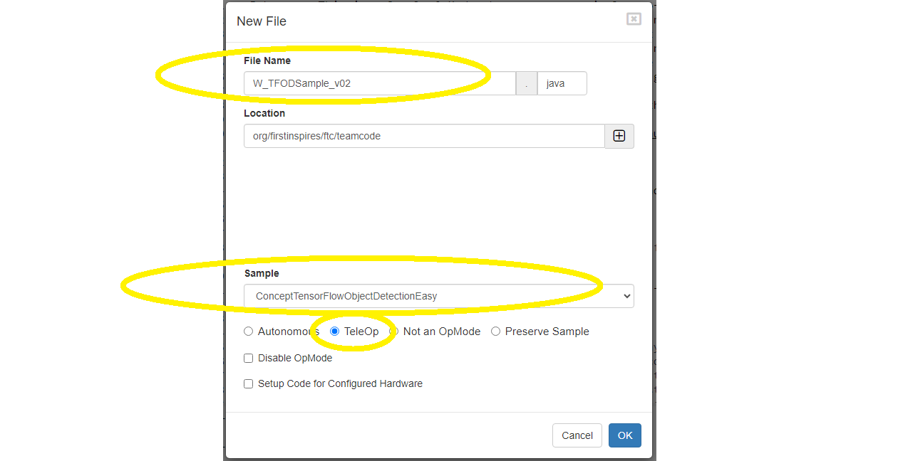
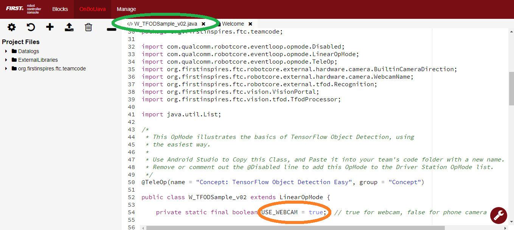
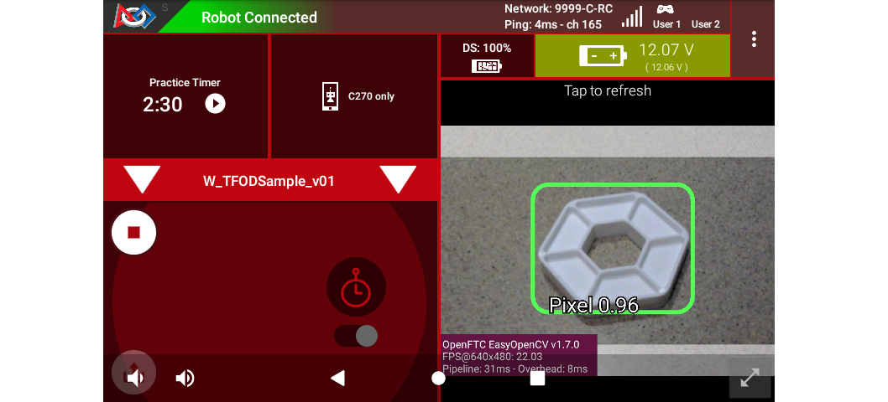
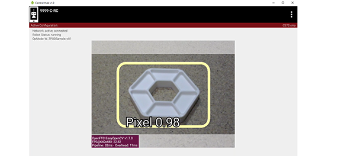
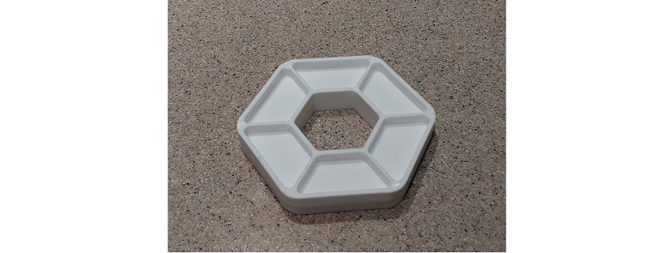

Java Easy Sample OpMode for TFOD
================================

Introduction
------------

This tutorial describes the “Easy” version of the FTC Java Sample OpMode
for TensorFlow Object Detection (TFOD).

This Sample, called “ConceptTensorFlowObjectDetectionEasy.java”, can
recognize official FTC game elements and provide their visible size and
position. It uses standard/default TFOD settings.

For the 2023-2024 game CENTERSTAGE, the game element is a hexagonal
white **Pixel**. The FTC SDK software contains a TFOD model of this
object, ready for recognition. That model was created with a Machine
Learning process described here:

- :ref:`FIRST Machine Learning Toolchain <ftc_ml/index:*first* machine learning toolchain>`.

.. figure:: images/010-TFOD-recognition.png
   :align: center
   :width: 85%
   :alt: TFOD Recognition

   Sample TFOD Recognition

For extra points, teams may instead use their own custom TFOD models of
**Team Props**. That option is not described here.

This tutorial shows **OnBot Java** screens. Users of **Android Studio**
can follow along, since the Sample OpMode is exactly the same.

A different Sample OpMode shows how to set **TFOD options**, unlike the
“Easy” version which uses only standard/default TFOD settings. That
version, called “ConceptTensorFlowObjectDetection.java” has good
commenting to guide users in the Java **Builder pattern** for custom
settings.

The “Easy” OpMode covered here does not require the user to work with
the Builder pattern, although the SDK does use it internally.

Creating the OpMode
-------------------

At the FTC OnBot Java browser interface, click on the large black
**plus-sign icon** “Add File”, to open the New File dialog box.



   New File Dialog

Specify a name for your new OpMode. Select
“ConceptTensorFlowObjectDetectionEasy” as the Sample OpMode that will be
the template for your new OpMode.

This Sample has optional gamepad inputs, so it could be designated as a
**TeleOp** OpMode (see above).

Click “OK” to create your new OpMode.

Android Studio users should follow the commented instructions to copy
this class from the Samples folder to the Teamcode folder, with a new
name. Also remove the ``@Disabled`` annotation, to make the OpMode
visible in the Driver Station list.

The new OpMode should appear in edit mode in your browser.



   Opening New Sample

By default, the Sample OpMode assumes you are using a webcam, configured
as “Webcam 1”. If you are using the built-in camera on your Android RC
phone, change the USE_WEBCAM Boolean from ``true`` to ``false`` (orange
oval above).

Preliminary Testing
-------------------

This OpMode is ready to use – it’s the “Easy” version!

Click the “Build Everything” button (wrench icon at lower right), and
wait for confirmation “BUILD SUCCESSFUL”.

If Build is prevented by some other OpMode having errors/issues, they
must be fixed before your new OpMode can run. For a quick fix, you could
right-click on that filename and choose “Disable/Comment”. This
“comments out” all lines of code, effectively removing that file from
the Build. That file can be re-activated later with “Enable/Uncomment”.

In Android Studio (or OnBot Java), you can open a problem class/OpMode
and type **CTRL-A** and **CTRL-/** to select and “comment out” all lines
of code. This is reversible with **CTRL-A** and **CTRL-/** again.

Now run your new OpMode from the Driver Station (on the TeleOp list, if
so designated). The OpMode should recognize any CENTERSTAGE white Pixel
within the camera’s view, based on the trained TFOD model in the SDK.

For a **preview** during the INIT phase, touch the Driver Station’s
3-dot menu and select **Camera Stream**.



   DS Camera Stream

Camera Stream is not live video; tap to refresh the image. Use the small
white arrows at lower right to expand or revert the preview size. To
close the preview, choose 3-dots and Camera Stream again.

After the DS START button is touched, the OpMode displays Telemetry for
any recognized Pixel(s):

.. figure:: images/210-Sample-DS-Telemetry.png
   :align: center
   :width: 85%
   :alt: DS Telemetry

   DS Telemetry Display

The above Telemetry shows the Label name, and TFOD recognition
confidence level. It also gives the **center location** and **size** (in
pixels) of the Bounding Box, which is the colored rectangle surrounding
the recognized object.

The pixel origin (0, 0) is at the top left corner of the image.

Before and after DS START is touched, the Robot Controller provides a
video preview called **LiveView**.



   Sample RC LiveView

For Control Hub (with no built-in screen), plug in an HDMI monitor or
learn about ```scrcpy`` <https://github.com/Genymobile/scrcpy>`__. The
above image is a LiveView screenshot via ``scrcpy``.

If you don’t have a physical Pixel on hand, try pointing the camera at
this image:



   Example of a Pixel


Program Logic and Initialization
--------------------------------

During the INIT stage (before DS START is touched), this OpMode calls a
**method to initialize** the TFOD Processor and the FTC VisionPortal.
After DS START is touched, the OpMode runs a continuous loop, calling a
**method to display telemetry** about any TFOD recognitions. The OpMode
also contains two optional features to remind teams about **CPU resource
management**, useful in vision processing.

Here’s the first method, to initialize the TFOD Processor and the FTC
VisionPortal.

.. code:: java

       /**
        * Initialize the TensorFlow Object Detection processor.
        */
       private void initTfod() {

           // Create the TensorFlow processor the easy way.
           tfod = TfodProcessor.easyCreateWithDefaults();

           // Create the vision portal the easy way.
           if (USE_WEBCAM) {
               visionPortal = VisionPortal.easyCreateWithDefaults(
                   hardwareMap.get(WebcamName.class, "Webcam 1"), tfod);
           } else {
               visionPortal = VisionPortal.easyCreateWithDefaults(
                   BuiltinCameraDirection.BACK, tfod);
           }

       }   // end method initTfod()

For the **TFOD Processor**, the method ``easyCreateWithDefaults()`` uses
standard default settings. Most teams don’t need to modify these,
especially for the built-in TFOD model (white Pixel).

For the **VisionPortal**, the method ``easyCreateWithDefaults()``
requires parameters for camera name and processor(s) used, but otherwise
uses standard default settings such as:

-  camera resolution 640 x 480

-  non-compressed streaming format YUY2

-  enable RC preview (called LiveView)

-  if TFOD and AprilTag processors are disabled, still display LiveView
   (without annotations)

These are good starting values for most teams.

Telemetry Method
----------------

After DS START is touched, the OpMode continuously calls this method to
display telemetry about any TFOD recognitions:

.. code:: java

       /**
        * Add telemetry about TensorFlow Object Detection (TFOD) recognitions.
        */
       private void telemetryTfod() {

           List<Recognition> currentRecognitions = tfod.getRecognitions();
           telemetry.addData("# Objects Detected", currentRecognitions.size());

           // Step through the list of recognitions and display info for each one.
           for (Recognition recognition : currentRecognitions) {
               double x = (recognition.getLeft() + recognition.getRight()) / 2 ;
               double y = (recognition.getTop()  + recognition.getBottom()) / 2 ;

               telemetry.addData(""," ");
               telemetry.addData("Image", "%s (%.0f %% Conf.)", recognition.getLabel(), recognition.getConfidence() * 100);
               telemetry.addData("- Position", "%.0f / %.0f", x, y);
               telemetry.addData("- Size", "%.0f x %.0f", recognition.getWidth(), recognition.getHeight());
           }   // end for() loop

       }   // end method telemetryTfod()

In the first line of code, **all TFOD recognitions** are collected and
stored in a List variable. The camera might “see” more than one game
element in its field of view, even if not intended (i.e. for CENTERSTAGE
with 1 game element).

The ``for() loop`` then iterates through that List, handling each item,
one at a time. Here the “handling” is simply processing certain TFOD
fields for DS Telemetry.

The ``for() loop`` calculates the pixel coordinates of the **center** of
each Bounding Box (the preview’s colored rectangle around a recognized
object).

Telemetry is created for the Driver Station, with the object’s name
(Label), recognition confidence level (percentage), and the Bounding
Box’s location and size (in pixels).

For competition, you want to do more than display Telemetry, and you
want to exit the main OpMode loop at some point. These code
modifications are discussed in another section below.

Resource Management
-------------------

Vision processing is “expensive”, using much **CPU capacity and USB
bandwidth** to process millions of pixels streaming in from the camera.

This Sample OpMode contains two optional features to remind teams about
resource management. Overall, the SDK provides :ref:`over 10
tools <apriltag/vision_portal/visionportal_cpu_and_bandwidth/visionportal-cpu-and-bandwidth:visionportal cpu and bandwidth>`
to manage these resources, allowing your OpMode to run effectively.

As the first example, streaming images from the camera can be paused and
resumed. This is a very fast transition, freeing CPU resources (and
potentially USB bandwidth).

.. code:: java


                   // Save CPU resources; can resume streaming when needed.
                   if (gamepad1.dpad_down) {
                       visionPortal.stopStreaming();
                   } else if (gamepad1.dpad_up) {
                       visionPortal.resumeStreaming();
                   }

Pressing the Dpad buttons, you can observe the off-and-on actions in the
RC preview (LiveView), described above. In your competition OpMode,
these streaming actions would be programmed, not manually controlled.

The second example: after exiting the main loop, the VisionPortal is
closed.

.. code:: java

           // Save more CPU resources when camera is no longer needed.
           visionPortal.close();

Teams may consider this at any point when the VisionPortal is no longer
needed by the OpMode, freeing valuable CPU resources for other tasks.

Adjusting the Zoom Factor
-------------------------

If the object to be recognized will be more than roughly 2 feet (61 cm)
from the camera, you might want to set the digital Zoom factor to a
value greater than 1. This tells TensorFlow to use an artificially
magnified portion of the image, which may offer more accurate
recognitions at greater distances.

.. code:: java

       // Indicate that only the zoomed center area of each
       // image will be passed to the TensorFlow object
       // detector. For no zooming, set magnification to 1.0.
       tfod.setZoom(2.0);

This ``setZoom()`` method can be placed in the INIT section of your
OpMode,

-  immediately after the call to the ``initTfod()`` method, or

-  as the very last command inside the ``initTfod()`` method.

This method is **not** part of the Processor Builder pattern (used in
other TFOD Sample OpModes), so the Zoom factor can be set to other
values during the OpMode, if desired.

The “zoomed” region can be observed in the DS preview (Camera Stream)
and the RC preview (LiveView), surrounded by a greyed-out area that is
**not evaluated** by the TFOD Processor.

Other Adjustments
-----------------

The Sample OpMode uses a default **minimum confidence** level of 75%.
This means the TensorFlow Processor needs a confidence level of 75% or
higher, to consider an object as “recognized” in its field of view.

You can see the object name and actual confidence (as a **decimal**,
e.g. 0.96) near the Bounding Box, in the Driver Station preview (Camera
Stream) and Robot Controller preview (Liveview).

.. code:: java

       // Set the minimum confidence at which to keep recognitions.
       tfod.setMinResultConfidence((float) 0.75);

Adjust this parameter to a higher value if you would like the processor
to be more selective in identifying an object.

Another option is to define, or clip, a **custom area for TFOD
evaluation**, unlike ``setZoom`` which is always centered.

.. code:: java

       // Set the number of pixels to obscure on the left, top,
       // right, and bottom edges of each image passed to the
       // TensorFlow object detector. The size of the images are not
       // changed, but the pixels in the margins are colored black.
       tfod.setClippingMargins(0, 200, 0, 0);

Adjust the four margins as desired, in units of pixels.

These methods can be placed in the INIT section of your OpMode,

-  immediately after the call to the ``initTfod()`` method, or

-  as the very last commands inside the ``initTfod()`` method.

As with ``setZoom``, these methods are **not** part of the Processor
Builder pattern (used in other TFOD Sample OpModes), so they can be set
to other values during the OpMode, if desired.

Modifying the Sample
--------------------

In this Sample OpMode, the main loop ends only when the DS STOP button
is touched. For competition, teams should **modify this code** in at
least two ways:

-  for a significant recognition, take action or store key information –
   inside the ``for() loop``

-  end the main loop based on your criteria, to continue the OpMode

As an example, you might set a Boolean variable ``isPixelDetected`` to
``true``, if a significant recognition has occurred.

You might also evaluate and store which randomized Spike Mark (red or
blue tape stripe) holds the white Pixel.

Regarding the main loop, it could end after the camera views all three
Spike Marks, or after your code provides a high-confidence result. If
the camera’s view includes more than one Spike Mark position, perhaps
the white Pixel’s **Bounding Box** size and location could be useful.
Teams should consider how long to seek an acceptable recognition, and
what to do otherwise.

In any case, the OpMode should exit the main loop and continue running,
using any stored information.

Best of luck this season!

============

Questions, comments and corrections to westsiderobotics@verizon.net
