Java Custom Model Sample OpMode for TFOD
========================================

Introduction
------------

This tutorial describes the regular, or **Builder**, version of the FTC
Java **Sample OpMode** for TensorFlow Object Detection (TFOD).

This Sample, called **“ConceptTensorFlowObjectDetection.java”**, can
recognize **official or custom** FTC game elements and provide their
visible size and position. It uses the Java **Builder pattern** to
customize standard/default TFOD settings.

This is **not the same** as the “Easy” version, which uses only default
settings and official/built-in TFOD model(s), described here:

-  :doc:`Java Easy Sample OpMode for TFOD <../java_tfod_opmode/java-tfod-opmode>`

For the 2023-2024 game CENTERSTAGE, the official game element is a
hexagonal white **Pixel**. The FTC SDK software contains a TFOD model of
this object, ready for recognition. That default model was created with
a Machine Learning process described here:

-  :ref:`FIRST Machine Learning Toolchain<ftc_ml/index:*FIRST* Machine Learning Toolchain>`

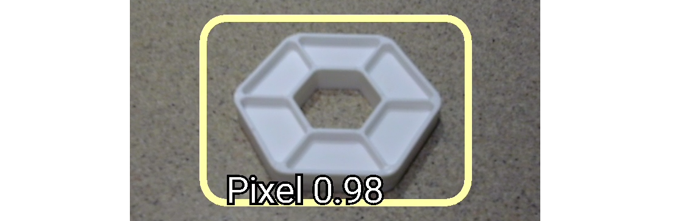

   Example Pixel Recognition using TFOD

For extra points, FTC teams may instead use their own custom TFOD models
of game elements, called **Team Props** in CENTERSTAGE. That option is
covered in this tutorial, after showing how to use the default model.
Custom TFOD models are created by teams using the same Machine
Learning process:

-  :ref:`FIRST Machine Learning Toolchain<ftc_ml/index:*FIRST* Machine Learning Toolchain>`

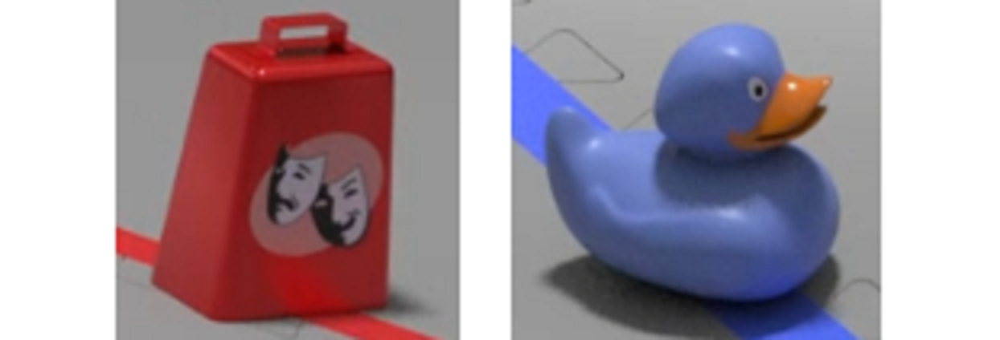

   Example Team Props

This tutorial shows **OnBot Java** screens. Users of **Android Studio**
can follow along with a few noted exceptions, since the Sample OpMode is
exactly the same.

Creating the OpMode
-------------------

At the FTC **OnBot Java** browser interface, click on the large black
**plus-sign icon** “Add File”, to open the New File dialog box.

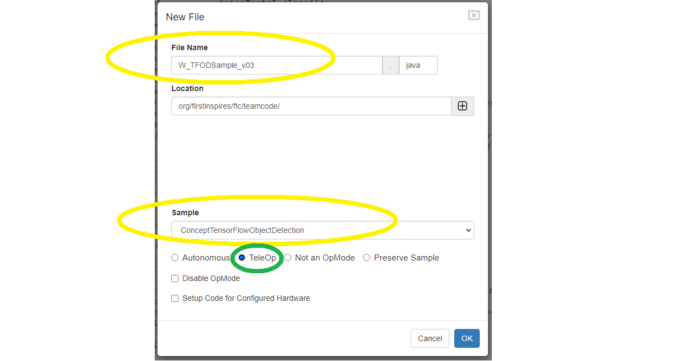

   Example New File Dialog

Specify a name for your new OpMode. Select
**“ConceptTensorFlowObjectDetection”** as the Sample OpMode to be the
template for your new OpMode.

This Sample has optional gamepad inputs, so it could be designated as a
**TeleOp** OpMode (see green oval above).

Click “OK” to create your new OpMode.

\ **Android Studio** users should follow the commented instructions to
copy this class from the Samples folder to the Teamcode folder, with a
new name. Also remove the ``@Disabled`` annotation, to make the OpMode
visible in the Driver Station list.

The new OpMode should appear in the editing window of OnBot Java.

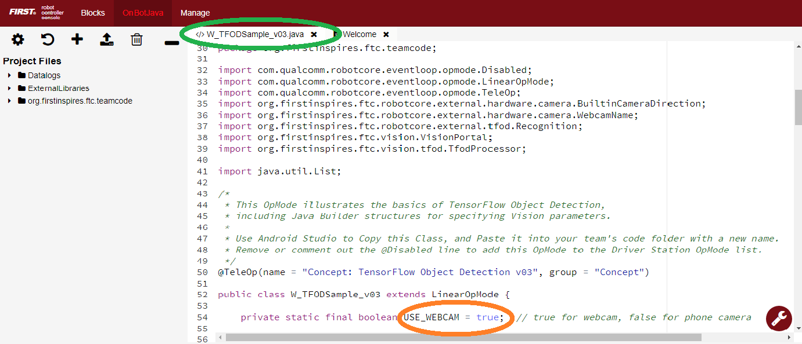

   Sample Open Dialog

By default, the Sample OpMode assumes you are using a webcam, configured
as “Webcam 1”. If instead you are using the built-in camera on your
Android RC phone, change the USE_WEBCAM Boolean from ``true`` to
``false`` (orange oval above).

Preliminary Testing
-------------------

This Sample OpMode is **ready to use**, for detecting the
default/built-in model (white Pixel for CENTERSTAGE).

If **Android Studio** users get a DS error message “Loading model from
asset failed”, skip to the next section “Downloading the Model”.

Click the “Build Everything” button (wrench icon at lower right), and
wait for confirmation “BUILD SUCCESSFUL”.

If Build is prevented by some other OpMode having errors/issues, they
must be fixed before your new OpMode can run. For a quick fix, you could
right-click on that filename and choose “Disable/Comment”. This
“comments out” all lines of code, effectively removing that file from
the Build. That file can be re-activated later with “Enable/Uncomment”.

In Android Studio (or OnBot Java), you can open a problem class/OpMode
and type **CTRL-A** and **CTRL-/** to select and “comment out” all lines
of code. This is reversible with **CTRL-A** and **CTRL-/** again.

Now run your new OpMode from the Driver Station (in the TeleOp list, if
so designated). The OpMode should recognize any CENTERSTAGE white Pixel
within the camera’s view, based on the trained TFOD model.

For a **preview** during the INIT phase, touch the Driver Station’s
3-dot menu and select **Camera Stream**.

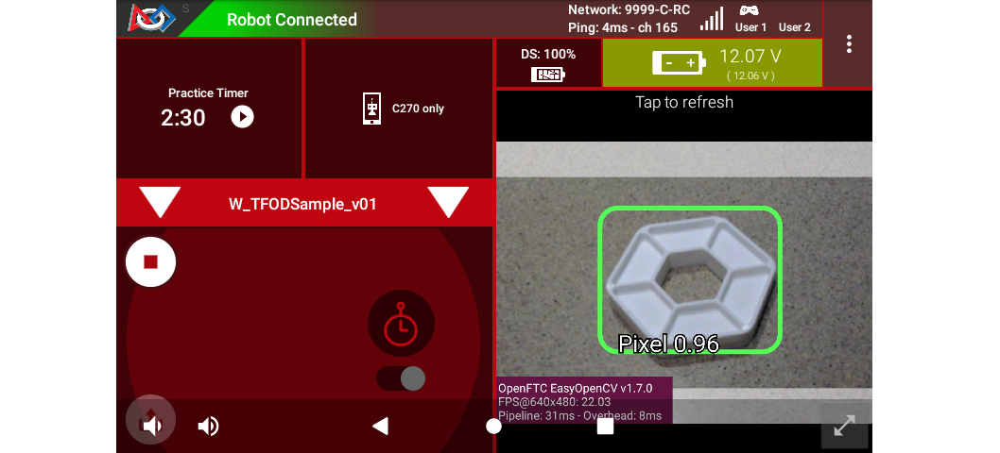

   Sample DS Camera Stream

Camera Stream is not live video; tap to refresh the image. Use the small
white arrows at bottom right to expand or revert the preview size. To
close the preview, choose 3-dots and Camera Stream again.

After the DS START button is touched, the OpMode displays Telemetry for
any recognized Pixel(s):

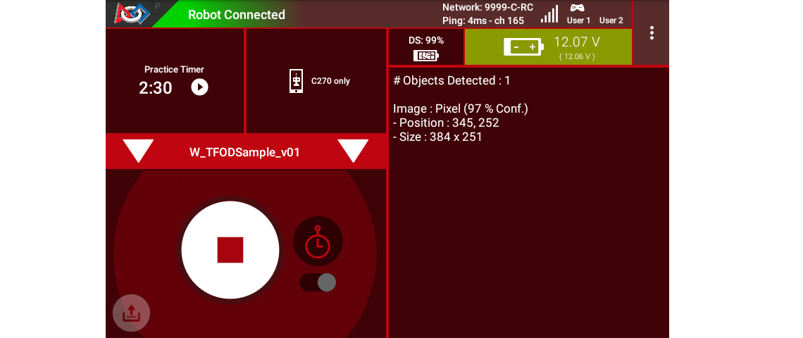

   Sample DS Telemetry

The above Telemetry shows the Label name, and TFOD recognition
confidence level. It also gives the **center location** and **size** (in
pixels) of the Bounding Box, which is the colored rectangle surrounding
the recognized object.

The pixel origin (0, 0) is at the top left corner of the image.

Before and after DS START is touched, the Robot Controller provides a
video preview called **LiveView**.

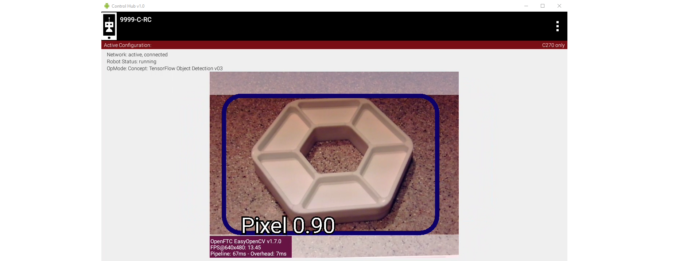

   Sample RC LiveView

For Control Hub (with no built-in screen), plug in an HDMI monitor or
learn about ``scrcpy`` (https://github.com/Genymobile/scrcpy). The
above image is a LiveView screenshot via ``scrcpy``.

If you don’t have a physical Pixel on hand, try pointing the camera at
this image:

.. figure:: images/300-Sample-Pixel.png
   :align: center
   :width: 85%
   :alt: Sample Pixel

   Sample Pixel

For a larger view, right-click the image to open in a new browser tab.

\ **Congratulations!**\  At this point the Sample OpMode and your camera
are working properly. Ready for a custom model?

Downloading the Model
---------------------

Now we describe how to load a trained inference model in the form of a
TensorFlow Lite (``.tflite``) file.

Instead of an **actual custom model**, here we use the standard FTC
model of the white Pixel from CENTERSTAGE (2023-2024). Later, your team
will follow this **same process** with your custom TFOD model,
specifying its filename and labels (objects to recognize).

The standard ``.tflite`` file (white Pixel) is available on GitHub at
the following link:

- CENTERSTAGE TFLite File (https://github.com/FIRST-Tech-Challenge/WikiSupport/blob/master/tensorflow/CenterStage.tflite)

.. note::
   For competition, teams can use the 
   :ref:`FIRST Machine Learning Toolchain<ftc_ml/index:*FIRST* Machine Learning Toolchain>`
   to train their own custom models of Team Props.  Then use the process
   described here; simply specify your custom model filename and labels.

   Very advanced teams could use Google's TensorFlow Object Detection
   API (https://github.com/tensorflow/models/tree/master/research/object_detection)
   to create their own custom inference model.

Click the “Download Raw File” button to download the
``CenterStage.tflite`` file from GitHub to your local device
(e.g. laptop). See the green arrow.

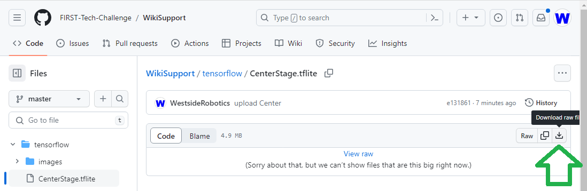

   Public Repo

Uploading to the Robot Controller
---------------------------------

Next, OnBot Java users will upload the TFOD model to the Robot
Controller. Connect your laptop to your Robot Controller’s wireless
network, open the Chrome browser, and navigate to the FTC “Manage” page:

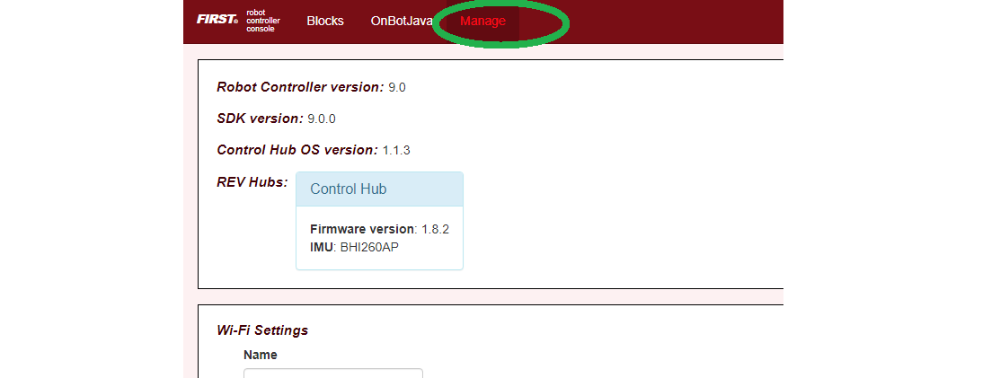

   Robot Controller Manage Page

\ **Android Studio** users should instead skip to the instructions at
the bottom of this section.

Scroll down and click on “Manage TensorFlow Lite Models”.

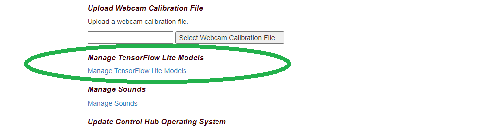

   TensorFlow Lite Model Management

Now click the “Upload Models” button.

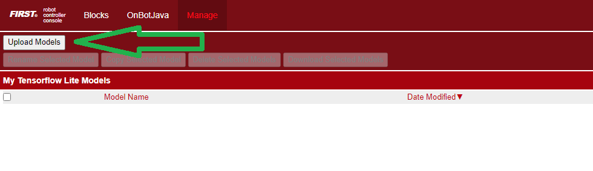

   Upload Models

Click “Choose Files”, and use the dialog box to find and select the
downloaded ``CenterStage.tflite`` file.


   Choose Files

Now the file will upload to the Robot Controller. The file will appear
in the list of TensorFlow models available for use in OpModes.

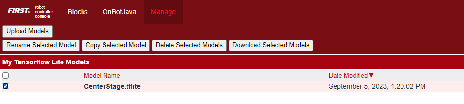

   CENTERSTAGE TFLITE File Uploaded

\ **Android Studio** users should instead store the TFOD model in the
project **assets** folder. At the left side, look under
``FtcRobotController`` for the folder ``assets``. If it’s missing,
right-click ``FtcRobotController``, choose ``New``, ``Directory`` and
``src\main\assets``. Right-click ``assets``, choose ``Open In`` and
``Explorer``, then copy/paste your ``.tflite`` file into that assets
folder.

Basic OpMode Settings
---------------------

This Sample OpMode can now be modified, to detect the uploaded TFOD
model.

Again, this tutorial uploaded the standard TFOD model (white Pixel for
CENTERSTAGE), just to demonstrate the process. Use the same steps for
your custom TFOD model.

First, change the filename here:

.. code:: java

   private static final String TFOD_MODEL_FILE = "/sdcard/FIRST/tflitemodels/myCustomModel.tflite";

to this:

.. code:: java

   private static final String TFOD_MODEL_FILE = "/sdcard/FIRST/tflitemodels/CenterStage.tflite";

Later, you can change this filename back to the actual name of your
custom TFOD model. Here we are using the default (white Pixel) model
just downloaded.

=========

**Android Studio** users should instead verify or store the TFOD model
in the project **assets** folder as noted above, and use:

.. code:: java

   private static final String TFOD_MODEL_ASSET = "CenterStage.tflite";

OR (for a custom model)

.. code:: java

   private static final String TFOD_MODEL_ASSET = "MyModelStoredAsAsset.tflite";

=========

For this example, the following line **does not** need to be changed:

.. code:: java

   // Define the labels recognized in the model for TFOD (must be in training order!)
   private static final String[] LABELS = {
      "Pixel",
   };

… because “Pixel” is the correct and only TFOD Label in the standard
model file.

Later, you might have custom Labels like “myRedProp” and “myBlueProp”
(for CENTERSTAGE). The list should be in alphabetical order and contain
the labels in the dataset(s) used to make the TFOD model.

==========

Next, scroll down to the Java method ``initTfod()``.

Here is the Java **Builder pattern**, used to specify various settings
for the TFOD Processor.

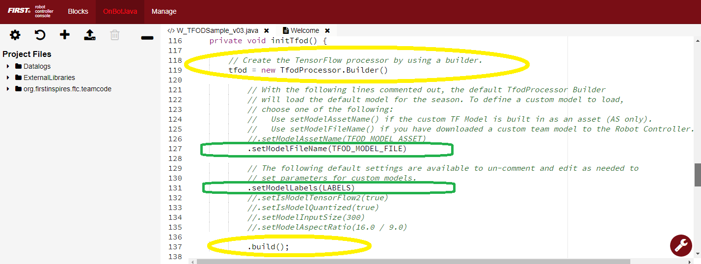

   Builder Pattern Settings

The **yellow ovals** indicate its distinctive features: **create** the
Processor object with ``new Builder()``, and **close/finalize** with the
``.build()`` method.

This is the streamlined version of the Builder pattern. Notice all the
``.set`` methods are “chained” to form a single Java expression, ending
with a semicolon after ``.build()``.

Uncomment two Builder lines, circled above in green:

.. code:: java

   .setModelFileName(TFOD_MODEL_FILE)
   .setModelLabels(LABELS)

\ **Android Studio** users should instead uncomment the lines
``.setModelAssetName(TFOD_MODEL_ASSET)`` and
``.setModelLabels(LABELS)``.

These Builder settings tell the TFOD Processor which model and labels to
use for evaluating camera frames.

\ **That’s it!**\  You are ready to test this Sample OpMode again, this
time using a “custom” (uploaded) TFOD model.

Testing with Custom Model
-------------------------

In OnBot Java, click the “Build Everything” button (wrench icon at lower
right), and wait for confirmation “BUILD SUCCESSFUL”.

Now run your updated OpMode from the Driver Station. The OpMode should
recognize objects within the camera’s view, based on the trained TFOD
model.

Test the **Camera Stream** preview during the INIT phase.


   Sample DS Camera Stream

Tap to refresh the image. Expand or revert the preview size as needed.
Close the preview, with 3-dots and Camera Stream again.

After the DS START button is touched, the OpMode displays Telemetry for
any recognized object(s):


   Sample DS Telemetry

The above Telemetry shows the Label name, and TFOD recognition
confidence level. It also gives the **center location** and **size** (in
pixels) of the Bounding Box, which is the colored rectangle surrounding
the recognized object.

Also test the RC’s video **LiveView**, using HDMI or
```scrcpy`` <https://github.com/Genymobile/scrcpy>`__:


   Sample RC LiveView 

For a large view of this standard model, right-click the image to open
in a new browser tab:

.. figure:: images/300-Sample-Pixel.png
   :align: center
   :width: 85%
   :alt: Sample Pixel

   Sample Pixel

When your team creates, uploads and specifies a custom model containing
**red and blue Team Props**, the OpMode will recognize and process those
– instead of the standard model shown here.

Program Logic and Initialization
--------------------------------

How does this simple OpMode work?

-  During the INIT stage (before DS START is touched), this OpMode calls
   a **method to initialize** the TFOD Processor and the FTC
   VisionPortal.

-  After DS START is touched, the OpMode runs a continuous loop, calling
   a **method to display telemetry** about any TFOD recognitions.

-  The OpMode also contains optional features to remind teams about
   **CPU resource management**, useful in vision processing.

You’ve already seen the first part of the method ``initTfod()`` which
uses a streamlined, or “chained”, sequence of Builder commands to create
the TFOD Processor.

The second part of that method uses regular, non-chained, Builder
commands to create the VisionPortal.

.. code:: java

   // Create the vision portal by using a builder.
   VisionPortal.Builder builder = new VisionPortal.Builder();

   // Set the camera (webcam vs. built-in RC phone camera).
   if (USE_WEBCAM) {
      builder.setCamera(hardwareMap.get(WebcamName.class, "Webcam 1"));
   } else {
      builder.setCamera(BuiltinCameraDirection.BACK);
   }

   // Choose a camera resolution. Not all cameras support all resolutions.
   builder.setCameraResolution(new Size(640, 480));

   // Enable the RC preview (LiveView).  Set "false" to omit camera monitoring.
   builder.enableLiveView(true);

   // Set the stream format; MJPEG uses less bandwidth than default YUY2.
   builder.setStreamFormat(VisionPortal.StreamFormat.YUY2);

   // Choose whether or not LiveView stops if no processors are enabled.
   // If set "true", monitor shows solid orange screen if no processors enabled.
   // If set "false", monitor shows camera view without annotations.
   builder.setAutoStopLiveView(false);

   // Set and enable the processor.
   builder.addProcessor(tfod);

   // Build the Vision Portal, using the above settings.
   visionPortal = builder.build();

All settings have been uncommented here, to see them more easily.

Here the ``new Builder()`` creates a separate ``VisionPortal.Builder``
object called ``builder``, allowing traditional/individual Java method
calls for each setting. For the streamlined “chained” TFOD process, the
``new Builder()`` operated directly on the TFOD Processor called
``tfod``, without creating a ``TfodProcessor.Builder`` object. Both
approaches are valid.

Notice the process again **closes** with a call to the ``.build()``
method.

Telemetry Method
----------------

After DS START is touched, the OpMode continuously calls this method to
display telemetry about any TFOD recognitions:

.. code:: java

   /**
     * Add telemetry about TensorFlow Object Detection (TFOD) recognitions.
     */
   private void telemetryTfod() {

       List<Recognition> currentRecognitions = tfod.getRecognitions();
       telemetry.addData("# Objects Detected", currentRecognitions.size());

       // Step through the list of recognitions and display info for each one.
       for (Recognition recognition : currentRecognitions) {
           double x = (recognition.getLeft() + recognition.getRight()) / 2 ;
           double y = (recognition.getTop()  + recognition.getBottom()) / 2 ;

           telemetry.addData(""," ");
           telemetry.addData("Image", "%s (%.0f %% Conf.)", recognition.getLabel(), recognition.getConfidence() * 100);
           telemetry.addData("- Position", "%.0f / %.0f", x, y);
           telemetry.addData("- Size", "%.0f x %.0f", recognition.getWidth(), recognition.getHeight());
       }   // end for() loop

   }   // end method telemetryTfod()

In the first line of code, **all TFOD recognitions** are collected and
stored in a List variable. The camera might “see” more than one game
element in its field of view, even if not intended (i.e. for CENTERSTAGE
with 1 game element).

The ``for() loop`` then iterates through that List, handling each item,
one at a time. Here the “handling” is simply processing certain TFOD
fields for DS Telemetry.

The ``for() loop`` calculates the pixel coordinates of the **center** of
each Bounding Box (the preview’s colored rectangle around a recognized
object).

Telemetry is created for the Driver Station, with the object’s name
(Label), recognition confidence level (percentage), and the Bounding
Box’s location and size (in pixels).

For competition, you want to do more than display Telemetry, and you
want to exit the main OpMode loop at some point. These code
modifications are discussed in another section below.

Resource Management
-------------------

Vision processing is “expensive”, using much **CPU capacity and USB
bandwidth** to process millions of pixels streaming in from the camera.

This Sample OpMode contains three optional features to remind teams
about resource management. Overall, the SDK provides 
:ref:`over 10 tools <apriltag/vision_portal/visionportal_cpu_and_bandwidth/visionportal-cpu-and-bandwidth:visionportal cpu and bandwidth>`
to manage these resources, allowing your OpMode to run effectively.

As the first example, **streaming images** from the camera can be paused
and resumed. This is a very fast transition, freeing CPU resources (and
potentially USB bandwidth).

.. code:: java


   // Save CPU resources; can resume streaming when needed.
   if (gamepad1.dpad_down) {
      visionPortal.stopStreaming();
   } else if (gamepad1.dpad_up) {
      visionPortal.resumeStreaming();
   }

Pressing the Dpad buttons, you can observe the off-and-on actions in the
RC preview (LiveView), described above. In your competition OpMode,
these streaming actions would be programmed, not manually controlled.

===========

The second example, commented out, similarly allows a vision processor
(TFOD and/or AprilTag) to be disabled and re-enabled:

.. code:: java

   //Disable or re-enable the TFOD processor at any time.
   visionPortal.setProcessorEnabled(tfod, true);

Simply set the Boolean to ``false`` (to disable), or ``true`` (to
re-enable).

===========

The third example: after exiting the main loop, the VisionPortal is
closed.

.. code:: java

   // Save more CPU resources when camera is no longer needed.
   visionPortal.close();

Teams may consider this at any point when the VisionPortal is no longer
needed by the OpMode, freeing valuable CPU resources for other tasks.

Adjusting the Zoom Factor
-------------------------

If the object to be recognized will be more than roughly 2 feet (61 cm)
from the camera, you might want to set the digital Zoom factor to a
value greater than 1. This tells TensorFlow to use an artificially
magnified portion of the image, which may offer more accurate
recognitions at greater distances.

.. code:: java

   // Indicate that only the zoomed center area of each
   // image will be passed to the TensorFlow object
   // detector. For no zooming, set magnification to 1.0.
   tfod.setZoom(2.0);

This ``setZoom()`` method can be placed in the INIT section of your
OpMode,

-  immediately after the call to the ``initTfod()`` method, or

-  as the very last command inside the ``initTfod()`` method.

This method is **not** part of the TFOD Processor Builder pattern, so
the Zoom factor can be set to other values during the OpMode, if
desired.

The “zoomed” region can be observed in the DS preview (Camera Stream)
and the RC preview (LiveView), surrounded by a greyed-out area that is
**not evaluated** by the TFOD Processor.

Other Adjustments
-----------------

This Sample OpMode contains another adjustment, commented out:

.. code:: java

   // Set confidence threshold for TFOD recognitions, at any time.
   tfod.setMinResultConfidence(0.75f);

The SDK uses a default **minimum confidence** level of 75%. This means
the TensorFlow Processor needs a confidence level of 75% or higher, to
consider an object as “recognized” in its field of view.

You can see the object name and actual confidence (as a **decimal**,
e.g. 0.96) near the Bounding Box, in the Driver Station preview (Camera
Stream) and Robot Controller preview (Liveview).

Adjust this parameter to a higher value if you want the processor to be
more selective in identifying an object.

===========

Another option is to define, or clip, a **custom area for TFOD
evaluation**, unlike ``setZoom`` which is always centered.

.. code:: java

   // Set the number of pixels to obscure on the left, top,
   // right, and bottom edges of each image passed to the
   // TensorFlow object detector. The size of the images are not
   // changed, but the pixels in the margins are colored black.
   tfod.setClippingMargins(0, 200, 0, 0);

Adjust the four margins as desired, in units of pixels.

These method calls can be placed in the INIT section of your OpMode,

-  immediately after the call to the ``initTfod()`` method, or

-  as the very last commands inside the ``initTfod()`` method.

As with ``setProcessorEnabled()`` and ``setZoom()``, these methods are
**not** part of the Processor or VisionPortal Builder patterns, so they
can be set to other values during the OpMode, if desired.

Modifying the Sample
--------------------

In this Sample OpMode, the main loop ends only when the DS STOP button
is touched. For CENTERSTAGE competition, teams should **modify this
code** in at least two ways:

-  for a significant recognition, take action or store key information –
   inside the ``for() loop``

-  end the main loop based on your criteria, to continue the OpMode

As an example, you might set a Boolean variable ``isPixelDetected`` (or
``isPropDetected``) to ``true``, if a significant recognition has
occurred.

You might also evaluate and store which randomized Spike Mark (red or
blue tape stripe) holds the white Pixel or Team Prop.

Regarding the main loop, it could end after the camera views all three
Spike Marks, or after your code provides a high-confidence result. If
the camera’s view includes more than one Spike Mark position, perhaps
the Pixel/Prop’s **Bounding Box** size and location could be useful.
Teams should consider how long to seek an acceptable recognition, and
what to do otherwise.

In any case, the OpMode should exit the main loop and continue running,
using any stored information.

Best of luck this season!

============

Questions, comments and corrections to westsiderobotics@verizon.net
