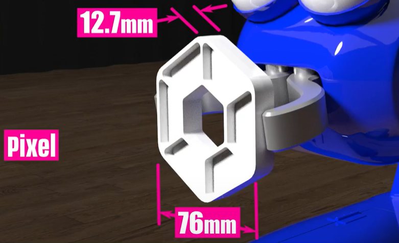

TensorFlow for CENTERSTAGE presented by RTX
===========================================

What is TensorFlow?
~~~~~~~~~~~~~~~~~~~

*FIRST* Tech Challenge teams can use `TensorFlow Lite
<https://www.tensorflow.org/lite/>`__, a lightweight version of Google’s
`TensorFlow <https://www.tensorflow.org/>`__ machine learning technology that
is designed to run on mobile devices such as an Android smartphone or the `REV
Control Hub <https://www.revrobotics.com/rev-31-1595/>`__.  A *trained
TensorFlow model* was developed to recognize the white ``Pixel`` game piece used in
the **2023-2024 CENTERSTAGE presented by RTX** challenge.

   This season’s TFOD model can recognize a white Pixel

TensorFlow Object Detection (TFOD) has been integrated into the control system
software to identify a white ``Pixel`` during a match. The SDK (SDK
version 9.0) contains TFOD Sample OpModes and Detection Models that can
recognize the white ``Pixel`` at various poses (but not all).

Also, *FIRST* Tech Challenge Teams can use the :doc:`Machine Learning Toolchain
<../../../ftc_ml/index>` tool to train their own TFOD models. This allows teams
to recognize custom objects they place on Spike Marks in place of white ``Pixels``
prior to the start of the match (also known as *Team Game Elements*). This
training should take into account certain conditions such as distance from
camera to target, angle, lighting, and especially backgrounds. Teams can
receive technical support using the Machine Learning Toolchain through the
`Machine Learning Forum <https://ftc-community.firstinspires.org/>`__.

How Might a Team Use TensorFlow this season?
~~~~~~~~~~~~~~~~~~~~~~~~~~~~~~~~~~~~~~~~~~~~

For this season’s challenge the field is randomized during the Pre-Match stage.
This randomization causes the white ``Pixel`` placed on Spike Marks to be placed on
either the Left, Center, or Right Spike Mark. During Autonomous, Robots must
independently determine which of the three Spike Marks (Left, Center, Right)
the white ``Pixel`` was placed on. To do this, robots using a Webcam or a camera on
a Robot Controller Smartphone can inspect Spike Mark locations to determine if
a white ``Pixel`` is present. Once the robot has correctly identified which Spike
Mark the white ``Pixel`` is present on, the robot can then perform additional
actions based on that position that will yield additional points.

Teams also have the opportunity to replace the white ``Pixel`` with an object of
their own creation, within a few guidelines specified in the Game Manual. This
object, or Team Game Element, can be optimized to help the team identify it
more easily and custom TensorFlow inference models can be created to facilitate
recognition. As the field is randomized, the team's Team Game Element will be
placed on the Spike Marks as the white ``Pixel`` would have, and the team must 
identify and use the Team Game Element the same as if it were a white ``Pixel`` on
a Spike Mark.

Sample OpModes
~~~~~~~~~~~~~~

Teams have the option of using a custom inference model with the *FIRST* Tech
Challenge software or to use the game-specific default model provided. As noted
above, the *FIRST* Machine Learning Toolchain is a streamlined tool for training
your own TFOD models. 

The FIRST Tech Challenge software (Robot Controller App and Android Studio
Project) includes sample op modes (Blocks and Java versions) that demonstrate
how to use **the default inference model**.  These tutorials show how to use
the sample op modes, using examples from previous *FIRST* Tech Challenge
seasons, but demonstrate the process for use in any season.

-  :doc:`Blocks Sample OpMode for TensorFlow Object Detection <../blocks_tfod_opmode/blocks-tfod-opmode>`
-  :doc:`Java Sample OpMode for TFOD <../java_tfod_opmode/java-tfod-opmode>`

Using the sample OpModes, teams can practice identifying white ``Pixels`` placed
on Spike Marks. The sample OpMode ``ConceptTensorFlowObjectDetectionEasy`` is
a simple OpMode to use to detect a ``Pixel`` - it is a very basic OpMode simplified
for beginner teams to perform basic ``Pixel`` detection.

.. figure:: images/easypixeldetect.png
   :align: center
   :alt: Pixel Detection
   :width: 75%

   Example Detection of a Pixel

It is important to note that if the detection of the object is below the
minimum confidence threshold, the detection will not be shown - it is important
to set the minimum detection threshold appropriately. 

.. note:: 
   The default minimum confidence threshold provided in the Sample OpMode (75%)
   is only provided as an example; depending on local conditions (lighting,
   image wear, etc...) it may be necessary to lower the minimum confidence in
   order to increase TensorFlow's likelihood to see all possible image
   detections. However, due to its simplified nature it is not possible to
   change the minimum confidence using the ``Easy`` OpMode. Instead, you will
   have to use the normal OpMode.

Notes on Training the CENTERSTAGE Model 
~~~~~~~~~~~~~~~~~~~~~~~~~~~~~~~~~~~~~~~

The ``Pixel`` game piece posed an interesting challenge for TensorFlow Object
Detection (TFOD). As is warned in the Machine Learning Toolkit documentation,
TFOD is not very good with recognizing and differentiating simple geometric
shapes, nor distinguishing between specific colors; instead, TFOD is good at
detecting *patterns*. TFOD needs to be able to recognize a unique *pattern*,
and while there is a small amount of patterning in the ribbing of the
``Pixel``, in various lighting conditions it's dubious how much the ribbing
will be able to be seen.  Even in the image at the top of this document, the
ribbing can only be seen due to the specific shadows that the game piece has
been provided. Even in optimal testing environments, it was difficult to
capture video of the object that nicely highlighted the ribbing enough for
TensorFlow to use for pattern recognition. This highlighted the inability to
guarantee optimal ``Pixel`` characteristics in unknown lighting environments
for TFOD.

Another challenge with training the model had to do with how the ``Pixel``
looks at different pose angles. When the camera is merely a scant few inches
from the floor, the ``Pixel`` can almost look like a solid object; at times
there may be sufficient shadows to see that there is a hole in the center of
the object, but not always. However, if the camera was several inches off the
floor the ``Pixel`` looked differently, as the mat or colored tape could be
seen through the hole in the middle of the object. This confused the neural
network and made it extremely difficult to train, and the resulting models
eventually recognized any "sufficiently light colored blob" as a ``Pixel``.
This was not exactly ideal. 

Even with the best of images, the Machine Learning algorithms had a difficult
time determining what *was* a ``Pixel`` and what wasn't. What ended up working
was providing NOT ONLY images of the ``Pixel`` in different poses, but also
several white objects that WERE NOT a ``Pixel``. This was fundamental to
helping TensorFlow train itself to understand that "All ``Pixels`` are White
Objects, but not all White Objects are ``Pixels``."

To provide some additional context on this, here are a few examples of labeled
frames that illustrate the challenges and techniques in dealing with the 
``Pixel`` game piece. 

.. only:: html

   .. grid:: 1 2 2 2
      :gutter: 2

      .. grid-item-card::
         :class-header: sd-bg-dark font-weight-bold sd-text-white
         :class-body: sd-text-left body

         Training Frame 1

         ^^^

         .. figure:: images/trainingblownout.png
            :align: center
            :alt: Pixel that's saturated
            :width: 100 %

         +++

         Pixel Saturation (No Ribs)

      .. grid-item-card::
         :class-header: sd-bg-dark font-weight-bold sd-text-white
         :class-body: sd-text-left body

         (Rejected) Training Frame 2

         ^^^

         .. figure:: images/lowanglepixel.png
            :align: center
            :alt: Pixel at low angle
            :width: 100 %

         +++

         Camera Too Low (White Blob)

      .. grid-item-card::
         :class-header: sd-bg-dark font-weight-bold sd-text-white
         :class-body: sd-text-left body

         Training Frame 3

         ^^^

         .. figure:: images/ribsexposed.png
            :align: center
            :alt: Rare good image
            :width: 100 %

         +++

         Actual Good Image with Ribbing (Rare)
         
      .. grid-item-card::
         :class-header: sd-bg-dark font-weight-bold sd-text-white
         :class-body: sd-text-left body

         Training Frame 4

         ^^^

         .. figure:: images/negatives.png
            :align: center
            :alt: Pixel with non-pixel objects
            :width: 100 %

         +++

         Pixel with non-Pixel Objects

.. only:: latex

   .. list-table:: Examples of Challenging Scenarios
      :class: borderless

      * - .. image:: images/trainingblownout.png
        - .. image:: images/lowanglepixel.png      
      * - .. image:: images/ribsexposed.png
        - .. image:: images/negatives.png

Using the Default CENTERSTAGE Model
~~~~~~~~~~~~~~~~~~~~~~~~~~~~~~~~~~~

In the previous section it's described how the height of the camera from the floor
has a huge effect on how the ``Pixel`` is seen; too low and the object can look
like a single "blob" of color, and too high and the object will look similar to
a white donut. When training the model, it was decided that the Donut approach was
the best - train the model to recognize the ``Pixel`` from above to provide a 
clear and consistent view of the ``Pixel``. Toss in some angled shots as well, along
with some additional extra objects just to give TensorFlow some perspective, and
a model is born. **But wait, how does that affect detection of the Pixel from the 
robot's starting configuration?**

In CENTERSTAGE, using the default CENTERSTAGE model, it is unlikely that a
robot will be able to get a consistent detection of a White ``Pixel`` from the
starting location. In order to get a good detection, the robot's camera needs
to be placed fairly high up, and angled down to be able to see the gray tile,
blue tape, or red tape peeking out of the center of the ``Pixel``. Thanks to
the center structure on the field this season, it's doubtful that a team will
want to have an exceptionally tall robot - likely no more than 14 inches tall,
but most will want to be under 12 inches to be safe (depending on your strategy
- please don't let this article define your game strategy!). The angle that
your robot's camera will have with the Pixel in the starting configuration
makes this seem unlikely.

Here are several images of detected and non-detected ``Pixels``. Notice that
the center of the object must be able to see through to what's under the
``Pixel`` in order for the object to be detected as a ``Pixel``.

.. only:: html

   .. grid:: 1 2 2 2
      :gutter: 2

      .. grid-item-card::
         :class-header: sd-bg-dark font-weight-bold sd-text-white
         :class-body: sd-text-left body

         Non-Detected Pixel #1

         ^^^

         .. figure:: images/pixelnodetect1.png
            :align: center
            :alt: Pixel Not Detected 1
            :width: 100 %

         +++

         Pixel Not Detected, Angle Too Low

      .. grid-item-card::
         :class-header: sd-bg-dark font-weight-bold sd-text-white
         :class-body: sd-text-left body

         Non-Detected Pixel #2

         ^^^

         .. figure:: images/pixelnodetect2.png
            :align: center
            :alt: Pixel Not Detected 2
            :width: 100 %

         +++

         Pixel Not Detected, Angle Too Low

      .. grid-item-card::
         :class-header: sd-bg-dark font-weight-bold sd-text-white
         :class-body: sd-text-left body

         Detected Pixel #1

         ^^^

         .. figure:: images/pixeldetect1.png
            :align: center
            :alt: Pixel Detected 1
            :width: 100 %

         +++

         Pixel Detected, Min Angle
         
      .. grid-item-card::
         :class-header: sd-bg-dark font-weight-bold sd-text-white
         :class-body: sd-text-left body

         Detected Pixel #2

         ^^^

         .. figure:: images/pixeldetect2.png
            :align: center
            :alt: Pixel Detected 2
            :width: 100 %

         +++

         Pixel Detected, Better Angle

      .. grid-item-card::
         :class-header: sd-bg-dark font-weight-bold sd-text-white
         :class-body: sd-text-left body

         Detected Pixel #3

         ^^^

         .. figure:: images/pixeldetect3.png
            :align: center
            :alt: Pixel Detected 3
            :width: 100 %

         +++

         Pixel Detected, Min Angle on Tape
         
      .. grid-item-card::
         :class-header: sd-bg-dark font-weight-bold sd-text-white
         :class-body: sd-text-left body

         Detected Pixel #4

         ^^^

         .. figure:: images/pixeldetect4.png
            :align: center
            :alt: Pixel Detected 4
            :width: 100 %

         +++

         Pixel Detected, Top-Down View

.. only:: latex

   .. list-table:: Examples of Detected and Non-Detected Pixels
      :class: borderless

      * - .. image:: images/pixelnodetect1.png
        - .. image:: images/pixelnodetect2.png
      * - .. image:: images/pixeldetect1.png
        - .. image:: images/pixeldetect2.png
      * - .. image:: images/pixeldetect3.png
        - .. image:: images/pixeldetect4.png

Therefore, there are two options for detecting the ``Pixel``:

1. The camera can be on a retractable/moving system, so that the camera is elevated to
   a desirable height during the start of Autonomous, and then retracts before moving
   around.

2. The robot will have to drive closer to the Spike Marks in order to be able to
   properly detect the ``Pixels``. 

For the second option (driving closer), the camera's field of view might pose a
challenge if it's desirable for all three Spike Marks to be always in view. If
using a Logitech C270 camera, perhaps using a Logitech C920 with a wider field
of view might help to some degree. This completely depends on the height of the
camera and how far the robot must be driven in order to properly recognize a
``Pixel``. Teams can also simply choose to point their webcam to the CENTER and
LEFT Spike Marks, for example, and drive closer to those targets, and if a
``Pixel`` is not detected then by process of elimination it must be on the
RIGHT Spike Mark.

Selecting objects for the Team Prop
~~~~~~~~~~~~~~~~~~~~~~~~~~~~~~~~~~~

Selecting objects to use for your custom Team Prop can seem daunting. Questions
swirl like "What shapes are going to be recognized best?", "If I cannot have 
multiple colors, how do I make patterns?", and "How do I make this easier on myself?".
Hopefully this section will help you understand a little more about TensorFlow
and how to get the most out of it.

First, it's important to note that TensorFlow has the following quirks/behaviors:

-  In order to run TensorFlow on mobile phones, *FIRST* Tech Challenge uses a very small core
   model resolution. This means the image is downscaled from the high definition
   webcam image to one that is only 300x300 pixels. This means that medium and
   small objects within the webcam images may be reduced to very small
   indistinguishable clusters of pixels in the target image. Keep the objects in
   the view of the camera large, and train for a wide range of image sizes.     
-  TensorFlow is not really good at differentiating simple geometric shapes. TensorFlow
   Object Detection is an object classifier, and similar geometric shapes will
   classify similarly. Humans are much better at differentiating geometric shapes than
   neural net algorithms, like TensorFlow, at the present.
-  TensorFlow is great at pattern detection, but that means that within the footprint
   of the object you need one or more repeating or unique patterns. The larger the
   pattern the easier it will be for TensorFlow to detect the pattern at a 
   distance.

So what kinds of patterns are good for TensorFlow? Let's explore a few examples:

1. Consider the shape of a `chess board Rook
   <https://www.sciencephoto.com/media/640239/view/rook-chess-piece-illustration>`__.
   The Rook itself is mostly uniform all around, no matter how you rotate the
   object it more or less looks the same. Not much patterning there. However,
   the top of the Rook is very unique and patterned.  Exaggerating the
   "battlements", the square-shaped parts of the top of the Rook, can provide
   unique patterning that TensorFlow can distinguish.

2. Consider the outline of a `chess Knight
   <https://fineartamerica.com/featured/knight-chess-pieces-ktsdesign.html?product=poster>`__,
   as the "head" of the Knight is facing to the right or to the left. That
   profile is very distinguishable as the head of a horse. That specific animal
   is one that `model zoos
   <https://ftc-community.firstinspires.org/t/tensorflow-model-zoo-models/159>`__
   have been optimized for, so it's definitely a shape that TensorFlow can be
   trained to recognize.

3. Consider the patterning in a fancy `wrought-iron fence
   <https://www.google.com/search?q=wrought+iron+fence+patterns>`__. If made
   thick enough, those repeating patterns can be recognized by a TensorFlow
   model. Like the Chess Board Rook, it might be wise to make the object round
   so that the pattern is similar and repeats now matter how the object is
   rotated. If allowed, having multiple shades of color can also help make a
   more-unique patterning on the object (e.g. multiple shades of red, likely
   must consult the `Q&A <https://ftc-qa.firstinspires.org>`__).

4. TensorFlow can be used to 
   `Detect Plants <https://github.com/KundanBalse/Plant-Detection-Using-TensorFlow#3a-collect-images>`__
   and all of the plants are a single color. Similar techniques can be reverse-engineered
   (make objects of different "patterns" similar to plants) to create an object that
   can be detected and differentiated from other objects on the game field.

Hopefully this gives you quite a few ideas for how to approach this challenge!

Using Custom TensorFlow models in Blocks and Java
~~~~~~~~~~~~~~~~~~~~~~~~~~~~~~~~~~~~~~~~~~~~~~~~~

Instructions on using Custom TensorFlow Models in 
:ref:`Blocks <ftc_ml/implement/blocks/blocks:blocks>`,  
:ref:`OnBot-Java <ftc_ml/implement/obj/obj:onbot java (obj)>`, 
and :ref:`Android Studio <ftc_ml/implement/android_studios/android-studios:android studio>` can be found
in the :doc:`FTC-ML documentation <../../../ftc_ml/index>`, in the 
:doc:`Implementing in Robot Code <../../../ftc_ml/implement/index>` section.

