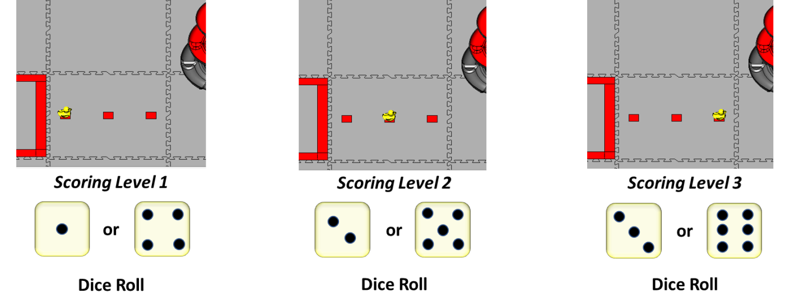
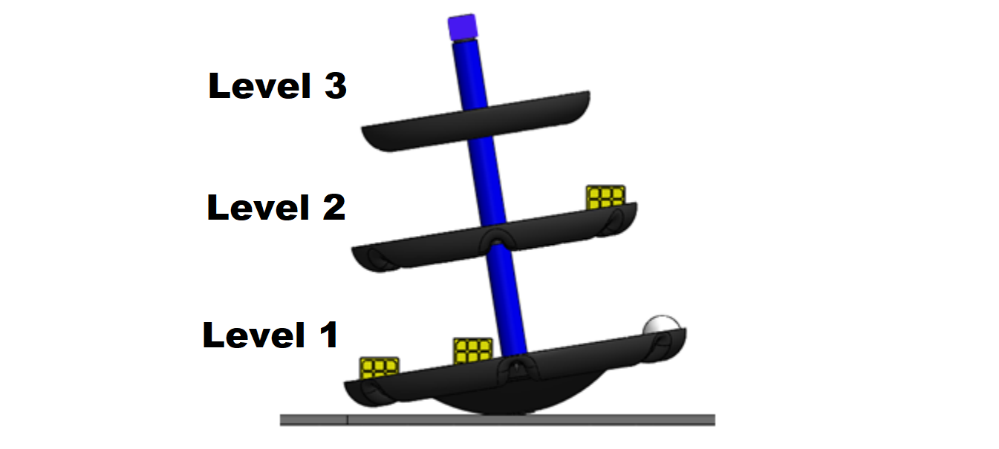
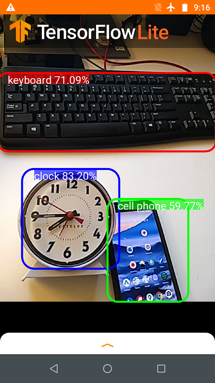

Using TensorFlow in Freight Frenzy
===================================

What is TensorFlow?
~~~~~~~~~~~~~~~~~~~

*FIRST* Tech Challenge teams can use `TensorFlow
Lite <https://www.tensorflow.org/lite/>`__, a lightweight version of
Google’s `TensorFlow <https://www.tensorflow.org/>`__ machine learning
technology that is designed to run on mobile devices such as an Android
smartphone. A *trained TensorFlow model* was developed to recognize game
elements for the 2021-2022 Freight Frenzy challenge.

.. figure:: images/010-TFOD-Cube-Duck-crop-2.png
   :align: center
   :alt: TFOD Cube Duck
   :height: 200px

   This season’s TFOD model can recognize Freight elements

TensorFlow Object Detection (TFOD) has been integrated into the 
control system software, to identify and track these game pieces during
a match. The software (SDK version 7.0) contains TFOD Sample Op
Modes that can recognize the Freight elements Duck, Box (or Cube), and
Cargo (or Ball).

Also, teams can use a new tool to train their own TFOD models, to
recognize their custom Team Shipping Element (TSE) and/or to improve
recognition of Freight elements. This training could take into account
certain conditions of distance, angle, lighting and background.

This new tool is the **Machine Learning Toolchain**, `announced
10/7/2021 <http://firsttechchallenge.blogspot.com/2021/10/new-machine-learning-tool-beta-testing.html>`__.
Learn more at these links: `[forum] <https://ftc-community.firstinspires.org/>`__
:doc:`[manual] <../../../ftc_ml/index>`

How Might a Team Use TensorFlow in Freight Frenzy?
~~~~~~~~~~~~~~~~~~~~~~~~~~~~~~~~~~~~~~~~~~~~~~~~~~

For this season’s challenge, during the pre-Match stage a single die is
rolled and the field is randomized.

   Randomization

At the beginning of the match’s Autonomous period, a robot can use
TensorFlow to “look” at the **Barcode** area and determine whether the
Duck or optional Team Shipping Element (TSE) is in position 1, 2 or 3.
This indicates the preferred scoring level on the **Alliance Shipping
Hub**. A bonus is available for using the TSE instead of a Duck.

   Alliance Shipping Hub

Important Note on Phone Compatibility
~~~~~~~~~~~~~~~~~~~~~~~~~~~~~~~~~~~~~

TensorFlow Lite runs on Android 6.0 (Marshmallow) or higher, a
requirement met by all currently allowed devices. If you are a
Blocks programmer using an older/disallowed Android device that is not
running Marshmallow or higher, TFOD Blocks will automatically be missing
from the Blocks toolbox or design palette.

Sample Op Modes
~~~~~~~~~~~~~~~

The software (SDK version 7.0 and higher) contains sample Blocks and
Java op modes that demonstrate TensorFlow **recognition** of Freight
elements Duck, Box (cube) and Cargo (ball). The sample op modes also
show **where** in the camera’s field of view a detected object is
located.

Click on the following links to learn more about these sample Op Modes.

-  :ref:`Blocks TensorFlow Object Detection
   Example <programming_resources/vision/blocks_tfod_opmode/blocks-tfod-opmode:blocks sample op mode for tensorflow object detection>`
-  :ref:`Java TensorFlow Object Detection
   Example <programming_resources/vision/java_tfod_opmode/java-tfod-opmode:java sample op mode for tfod>`

Using a Custom Inference Model
~~~~~~~~~~~~~~~~~~~~~~~~~~~~~~

Teams have the option of using a custom inference model with the FIRST
Tech Challenge software. As noted above, the **Machine Learning
toolchain** is a streamlined tool for training your own TFOD models. An
alternate would be to use the `TensorFlow Object Detection
API <https://github.com/tensorflow/models/tree/master/research/object_detection>`__
to create an enhanced model of the Freight elements or TSE, or to create
a custom model to detect other entirely different objects. Other teams
might also want to use an available pre-trained model to build a robot
that can detect common everyday objects (for demo or outreach purposes,
for example).

The software includes sample op modes (Blocks and Java versions)
that demonstrate how to use a **custom inference model**:

-  `Using a Custom TensorFlow Model with
   Blocks <https://github.com/FIRST-Tech-Challenge/FtcRobotController/wiki/Using-a-Custom-TensorFlow-Model-with-Blocks>`__
-  `Using a Custom TensorFlow Model with
   Java <https://github.com/FIRST-Tech-Challenge/FtcRobotController/wiki/Using-a-Custom-TensorFlow-Model-with-Java>`__

These tutorials use examples from a previous season (Skystone), but
the process remains generally valid for Freight Frenzy.

Detecting Everyday Objects
~~~~~~~~~~~~~~~~~~~~~~~~~~

You can use a pretrained TensorFlow Lite model to detect **everyday
objects**, such as a clock, person, computer mouse, or cell phone. The
following advanced tutorial shows how you can use a free, pretrained
model to recognize numerous everyday objects.

-  `Using a TensorFlow Pretrained Model to Detect Everyday
   Objects <https://github.com/FIRST-Tech-Challenge/FtcRobotController/wiki/Using-a-TensorFlow-Pretrained-Model-to-Detect-Everyday-Objects>`__

   TensorFlow can recognize everyday objects

============================

Updated 11/19/21
