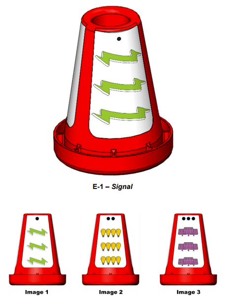

TensorFlow for POWERPLAY presented by Raytheon Technologies
===========================================================

What is TensorFlow?
~~~~~~~~~~~~~~~~~~~

*FIRST* Tech Challenge teams can use `TensorFlow Lite <https://www.tensorflow.org/lite/>`__, 
a lightweight version of
Google’s `TensorFlow <https://www.tensorflow.org/>`__ machine learning
technology that is designed to run on mobile devices such as an Android
smartphone. A *trained TensorFlow model* was developed to recognize the
three game-defined images on the Signal element used in the **2022-2023 
POWERPLAY presented by Raytheon Technologies** challenge.

   This season’s TFOD model can recognize Signal image elements

TensorFlow Object Detection (TFOD) has been integrated into the control system
software to identify these Signal images during a match. The SDK (SDK
version 8.0) contains TFOD Sample Op Modes and Detection Models that can
recognize and differentiate between the Signal images: Bolt (green lightning
bolt), Bulb (4 yellow light bulbs), and Panel (purple solar panels).

Also, *FIRST* Tech Challenge Teams can use the :doc:`Machine Learning Toolchain
<../../../ftc_ml/index>` tool to train their own TFOD models. This allows teams
to recognize custom images they place on their own customized Team Signal
Sleeve and place over the Signals to use instead of the default images. This
training should take into account certain conditions such as distance from
camera to target, angle, lighting, and especially backgrounds. Teams can
receive technical support using the Machine Learning Toolchain through the
`Machine Learning Forum <https://ftc-community.firstinspires.org/>`__.

.. note::
   TensorFlow Lite runs on Android 6.0 (Marshmallow) or higher, a requirement met
   by all currently allowed devices. If you are a Blocks programmer using an
   older/disallowed Android device that is not running Marshmallow or higher, TFOD
   Blocks will automatically be missing from the Blocks toolbox or design palette.

How Might a Team Use TensorFlow this season?
~~~~~~~~~~~~~~~~~~~~~~~~~~~~~~~~~~~~~~~~~~~~

For this season’s challenge, during the pre-Match stage a single die is rolled
and the field is randomized. The random value of the die determines how field
reset staff will rotate the Signal to show one of the three images on the
Signal to the robot - Signal images are offset 120 degrees on the Signal to
occlude all images other than the chosen one. Robots must independently
determine which of the three images (Image 1, Image 2, or Image 3, indicated by
the number of dots above the image either on the Signal stickers or on the Team
Specific Signal Sleeve) is showing. Once the robot has correctly identified the
Image being shown, the robot can then know in which zone to end the Autonomous
Period for additional points.

Sample Op Modes
~~~~~~~~~~~~~~~

Teams have the option of using a custom inference model with the *FIRST* Tech
Challenge software or to use the game-specific default model provided. As noted
above, the *FIRST* Machine Learning Toolchain is a streamlined tool for training
your own TFOD models. 

The FIRST Tech Challenge software (Robot Controller App and Android Studio
Project) includes sample op modes (Blocks and Java versions) that demonstrate
how to use **the default inference model**.  These tutorials show how to use
the sample op modes, using examples from previous *FIRST* Tech Challenge seasons, but demonstrate
the process for use in any season.

-  :doc:`Blocks Sample Op Mode for TensorFlow Object Detection <../blocks_tfod_opmode/blocks-tfod-opmode>`
-  :doc:`Java Sample Op Mode for TFOD <../java_tfod_opmode/java-tfod-opmode>`

Using the sample Op Modes, each of the Signal images can be detected. Here are 
a few examples of detecting the images.

.. grid:: 1 2 2 3
   :gutter: 2

   .. grid-item-card::
      :class-header: sd-bg-dark font-weight-bold sd-text-white
      :class-body: sd-text-left body

      Example Image 1

      ^^^

      .. figure:: images/bolt.png
         :align: center
         :alt: BoltDetection
         :width: 100%

      +++

      Example Detection of a Bolt

   .. grid-item-card::
      :class-header: sd-bg-dark font-weight-bold sd-text-white
      :class-body: sd-text-left body

      Example Image 2

      ^^^

      .. figure:: images/bulb.png
         :align: center
         :alt: BulbDetection
         :width: 100%

      +++

      Example Detection of a Bulb

   .. grid-item-card::
      :class-header: sd-bg-dark font-weight-bold sd-text-white
      :class-body: sd-text-left body

      Example Image 3

      ^^^

      .. figure:: images/panel.png
         :align: center
         :alt: PanelDetection
         :width: 100%

      +++

      Example Detection of a Panel

It is important to note that if the detection of the object is below the
minimum confidence threshold, the detection will not be shown - it is important
to set the minimum detection threshold appropriately. 

.. note:: 
   The default minimum confidence threshold provided in the Sample Op Mode is only
   provided as an example; depending on local conditions (lighting, image wear, 
   etc...) it may be necessary to lower the minimum confidence in order to increase
   TensorFlow's likelihood to see all possible image detections.

Default POWERPLAY Model Detection Notes
~~~~~~~~~~~~~~~~~~~~~~~~~~~~~~~~~~~~~~~

As shown in the previous examples, with the default POWERPLAY TensorFlow model
it is sometimes more common for TensorFlow to recognize/label partial image
areas (upper or lower portions of the images) than whole images themselves.
This is likely due to how the training set was developed during training of the
TensorFlow model.  

In order to try to ensure that there would be as many detections for a given
set of images as possible, the training set included frames that contained both
complete and partial images; it just happened that the way the frames were
developed there were more upper and lower partial images than whole images, and
it appears that TensorFlow's neural network seems to almost "prefer" to
recognize partial images rather than whole images. Such biases are common. 

To provide some additional context on this, here are a few examples of labeled
frames that were used to train the default TensorFlow model.

.. grid:: 1 2 2 3
   :gutter: 2

   .. grid-item-card::
      :class-header: sd-bg-dark font-weight-bold sd-text-white
      :class-body: sd-text-left body

      Example Training Frame 1

      ^^^

      .. figure:: images/bolt_label.png
         :align: center
         :alt: BoltLabel
         :width: 100 %

      +++

      Example Training for a Bolt

   .. grid-item-card::
      :class-header: sd-bg-dark font-weight-bold sd-text-white
      :class-body: sd-text-left body

      Example Training Frame 2

      ^^^

      .. figure:: images/bulb_label.png
         :align: center
         :alt: BulbLabel
         :width: 100 %

      +++

      Example Training for a Bulb

   .. grid-item-card::
      :class-header: sd-bg-dark font-weight-bold sd-text-white
      :class-body: sd-text-left body

      Example Training Frame 3

      ^^^

      .. figure:: images/panel_label.png
         :align: center
         :alt: PanelLabel
         :width: 100 %

      +++

      Example Training for a Panel

Understanding Backgrounds For Signal Sleeves
~~~~~~~~~~~~~~~~~~~~~~~~~~~~~~~~~~~~~~~~~~~~

When thinking about how to develop a custom Signal Sleeve, it's easy to
overlook one of the most important elements that may make or break your ability
to detect objects - your image background.  TensorFlow attempts to identify
common background material and "ignore" the backgrounds for detecting labeled
objects; a great example of this is the white background on the sticker.  It
should be known that the white background on the stickers posed quite a
challenge, one that teams should be aware of when/if attempting to develop
their own images for their Signal Sleeves.  

If the same background is always present, and always has similar
characteristics in the training data, TensorFlow may assume the background
isn't actually a background and is really a part of the image. TensorFlow may
then expect to see the specific background with the objects always. If the
background of the image then varies for whatever reason, TensorFlow may not
recognize the image with the new background. 

A great example of this occurred in 2021 Freight Frenzy; the duck model was
trained to recognize a rubber duck, and the rubber duck just happened to always
be present on a gray mat tile within the training frames. The model happened to
"expect" a gray mat tile in the background, and rubber ducks seen without the
gray mat tile had a significantly reduced detection rate.  

In POWERPLAY, the white sticker background is always present, except the white
color of the background can be unintentionally altered based on the lighting
being used in the room; warmer lights cause the white to turn yellow or orange,
cooler lights cause the white to turn more blue, and glare causes a gradient of
colors to appear across the white background. Sometimes algorithms can adjust
the color scheme to provide a "white balance" to adjust the colors correctly,
but requiring such tools and adjustments might be beyond the grasp for the
average user. (See :ref:`White Balance Control
<programming_resources/vision/webcam_controls/webcam-controls:white balance
control>` and :ref:`White Balance Control Mode
<programming_resources/vision/webcam_controls/webcam-controls:white balance
control mode>` for more information about adjusting white balance
programmatically within the SDK's Java language libraries). 

In order to get TensorFlow to become less sensitive to the need for "white
balance" within the frame, and ignore the white altogether, a suite of
different lighting scenarios were replicated and used to train the model with
the hopes that TensorFlow would eventually see the "areas of changing colors"
(due to the different lighting situations) as background and ignore it
altogether to focus more on the images themselves.  This is ultimately what was
successful for the default model. Below are some examples of the lighting
conditions used to train the model.

.. grid:: 1 2 2 3
   :gutter: 2

   .. grid-item-card::
      :class-header: sd-bg-dark font-weight-bold sd-text-white
      :class-body: sd-text-left body

      Lighting Scenario 1

      ^^^

      .. figure:: images/wb1.png
         :align: center
         :alt: White Balancing 1
         :width: 100 %

      +++

      Example Lighting Scenario #1

   .. grid-item-card::
      :class-header: sd-bg-dark font-weight-bold sd-text-white
      :class-body: sd-text-left body

      Lighting Scenario 2

      ^^^

      .. figure:: images/wb2.png
         :align: center
         :alt: White Balancing 2
         :width: 100 %

      +++

      Example Lighting Scenario #2

   .. grid-item-card::
      :class-header: sd-bg-dark font-weight-bold sd-text-white
      :class-body: sd-text-left body

      Lighting Scenario 3

      ^^^

      .. figure:: images/wb3.png
         :align: center
         :alt: White Balancing 3
         :width: 100 %

      +++

      Example Lighting Scenario #3

It is recommended that teams choose a background that is more resistant to
being "altered" by lighting conditions, and doesn't exist anywhere else on the
game field, or try adjusting the :ref:`White Balance
<programming_resources/vision/webcam_controls/webcam-controls:white balance
control>` via programming if you're a Java language user.

Selecting Images For Signal Sleeves
~~~~~~~~~~~~~~~~~~~~~~~~~~~~~~~~~~~

Selecting images to use for your custom Signal Sleeve can seem daunting. Questions
swirl like "What images are going to be recognized best?", "Why were the images 
used in the Default Model chosen?", and "How do I make this easier on myself?".
Hopefully this section will help you understand the image selection used for the
Default Model, and that will help inform your own decisions for your Signal Sleeve.

First, it's important to note that TensorFlow has the following quirks/behaviors:

-  In order to run TensorFlow on mobile phones, *FIRST* Tech Challenge uses a very small core
   model resolution. This means the image is downscaled from the high definition
   webcam image to one that is only 300x300 pixels. This means that medium and
   small objects within the webcam images may be reduced to very small
   indistinguishable clusters of pixels in the target image. Keep the objects in
   the view of the camera large, and train for a wide range of image sizes.     
-  TensorFlow is not really good at differentiating geometric shapes. TensorFlow
   Object Detection is an object classifier, and similar geometric shapes will
   classify similarly. Humans are much better at differentiating geometric shapes than
   neural net algorithms, like TensorFlow, at the present.
-  TensorFlow is great at pattern detection, color differentiation, and image
   textures. For instance, TensorFlow can be easily trained to recognize the
   difference between Zebras and Horses, but it would not be able to
   differentiate between specific Zebra patterns to be able to identify, for
   example, "Carl the Zebra."

The default images were chosen for several design factors:

-  Images needed to be vertically short and horizontally long. When setting the
   TensorFlow zoom factor above 1.0, the aspect ratio causes the zoom window to
   be wider horizontally than vertically; even at modest zoom factors the 
   zoom window shrinks to be vertically smaller than the sticker itself at 
   even the minimim distance from the robot (18 inches). In order to have
   more than one detection within the window, and to aid in providing wide margins
   for adjusting the camera during robot setup, images that are horizontally wide
   and vertically short were desired. Thanks to the season theme, the green 
   lightning bolt from the *FIRST* Energize season logo was chosen first. The green
   color and the zig-zag pattern on the top and bottom of the bolt were desired
   elements for TensorFlow.
-  TensorFlow's ability to detect patterns better than shapes was utilized in two
   ways in the "Bulb" image; first the repeated bulb image created a repeating pattern
   that TensorFlow could recognize, and the image itself was colored differently than
   other colors it may have seen on the sticker background, the cones themselves, or
   on the green lightning bolt. Yellow was selected as the color within the 
   repeating light bulbs. It helped that the light bulb had a similar art style
   to the lightning bolt and even fit the theme, even though that wasn't a hard
   requirement.
-  Finally, the solar panels were selected similarly to the bulbs. The grid pattern
   within the solar panels made for a unique pattern element not present in the other
   images, and the purple color helped offset it as well. 

With the images selected, there were only basic tweaks made to the images for use in
POWERPLAY. For example, the images were modified to have relatively similar aspect
ratios and sizes to aid in uniformity of setup, and it was determined that TensorFlow
could be trained to recognize elements of each image fairly well. 

When selecting images for use with TensorFlow, keep in mind the elements of pattern,
color, and size. For example, a donut can be a great image for use by TensorFlow;
not because of the circular shape, but because of the frosting and the sprinkles on 
top which creates a very unique pattern for TensorFlow to recognize. Be creative!

Using Custom TensorFlow models in Blocks and Java
~~~~~~~~~~~~~~~~~~~~~~~~~~~~~~~~~~~~~~~~~~~~~~~~~

Instructions on using Custom TensorFlow Models in 
:ref:`Blocks <ftc_ml/implement/blocks/blocks:blocks>`,  
:ref:`OnBot-Java <ftc_ml/implement/obj/obj:onbot java (obj)>`, 
and :ref:`Android Studio <ftc_ml/implement/android_studios/android-studios:android studio>` can be found
in the :doc:`FTC-ML documentation <../../../ftc_ml/index>`, in the 
:doc:`Implementing in Robot Code <../../../ftc_ml/implement/index>` section.

