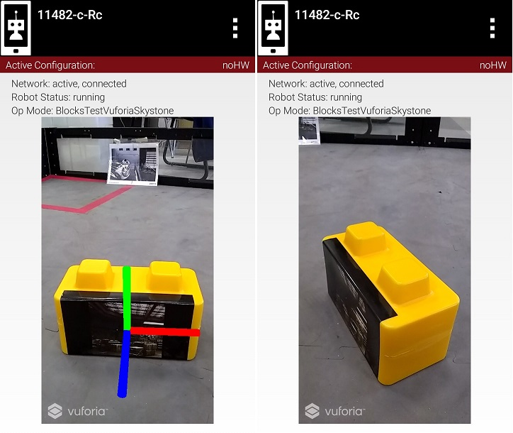
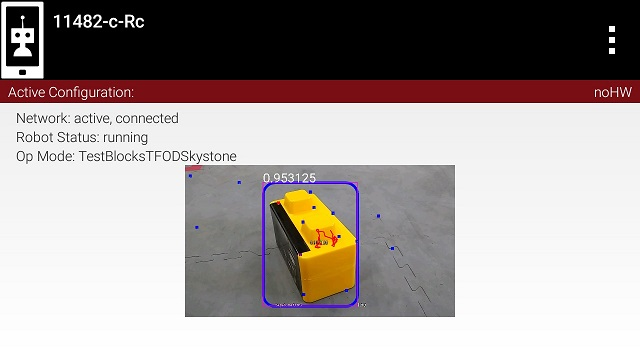
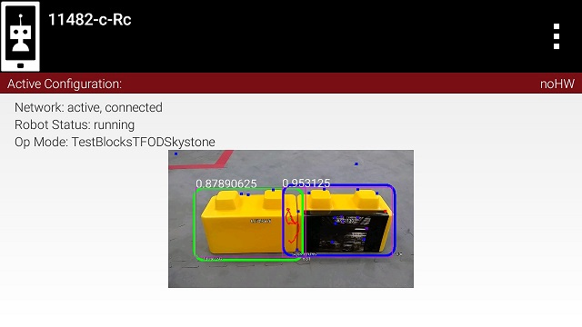

Computer Vision Overview
========================

Introduction
------------

The FTC control system software has built-in support for two computer
vision technologies:

1. Vuforia -
   `Vuforia <https://www.ptc.com/en/products/vuforia>`__
   is PTC’s *augmented reality* technology. Teams can use Vuforia to
   identify two-dimensional (2D) *image targets* and use these targets
   as reference points for autonomous navigation.

   -  Each season, FIRST provides 2D image tagets that can be used as
      navigational reference points.
   -  If Vuforia recognizes an image target, it provides very accurate
      information about the robot’s location relative to the target.
   -  A robot can use this information to navigate autonomously on the
      field.
   -  Special Vuforia image targets, known as *VuMarks*, can also be
      used to encode hidden game information on the field.

2. TensorFlow Lite - `TensorFlow
   Lite <https://www.tensorflow.org/lite/>`__ is a lightweight version
   of Google’s `TensorFlow <https://www.tensorflow.org>`__ *machine
   learning* technology that is designed to run on mobile devices such
   as an Android smartphone.

   -  Each season FIRST creates a TensorFlow *inference model* that can
      be used to “look” for specific game elements.
   -  If TensorFlow recognizes an object, it returns location info about
      the identified object.
   -  A robot can use this location information to navigate to the
      recognized object.
   -  Note that in the FTC control system, the TensorFlow software uses
      the Vuforia software to “grab” images from the camera while it is
      looking for or tracking game elements.

      -  TensorFlow only uses Vuforia to get the camera images.
      -  TensorFlow does all its own object detection and tracking
         independently, without any other help from Vuforia.

TensorFlow vs Vuforia
---------------------

Vuforia Advantages
~~~~~~~~~~~~~~~~~~

-  Very efficient with a fast detection rate (estimated 15 to 20
   detections per second).
-  Provides accurate, relative location of robot to target in field
   coordinates.

Vuforia Disadvantages
~~~~~~~~~~~~~~~~~~~~~

-  Only looks for 2D image targets.
-  Image targets must have a large amount of detail and uniqueness in
   order to be accurate and useful.
-  Vuforia must see the image target clearly in order to calculate
   location to the target.

   Vuforia provides accurate location info, but requires a clear view of
   the image target.

TensorFlow Advantages
~~~~~~~~~~~~~~~~~~~~~

-  TensorFlow learns how to recognize target objects, not just specific
   images.

   -  Recognizes objects in spite of different backgrounds.
   -  Recognizes objects in varied lighting conditions.
   -  Recognizes objects even when objects are oriented in different
      positions.

-  TensorFlow can be taught how to distinguish between similar looking
   (but still distinct) objects, such as a Stone and a Skystone from the
   2019-2020 challenge.

TensorFlow Disadvantages
~~~~~~~~~~~~~~~~~~~~~~~~

-  TensorFlow is computationally intensive and has a low detection rate
   (an estimated 1 to 2 detections per second).
-  If TensorFlow recognizes an object in its field of view, it only
   returns location information on where the target object is within its
   field of view.

   TensorFlow can recognize actual objects (and not just 2D image targets).

   TensorFlow can be taught to distinguish between similar looking objects.

Which Should I Use?
~~~~~~~~~~~~~~~~~~~

The choice of whether to use TensorFlow Lite or Vuforia will be
influenced by factors such as distance-to-target, lighting, accuracy
required, camera placement and etc..

In the 2019-2020 challenge, the Skystone game element can be identified
and tracked using either technology. Vuforia requires that the 2D image
target on the face of the Skystone be visible for detection and
tracking. TensorFlow can also recognize Stones in the 2019-2020
challenge in addition to the Skystone elements. Either can be used to
identify and track Skystones during a match.
