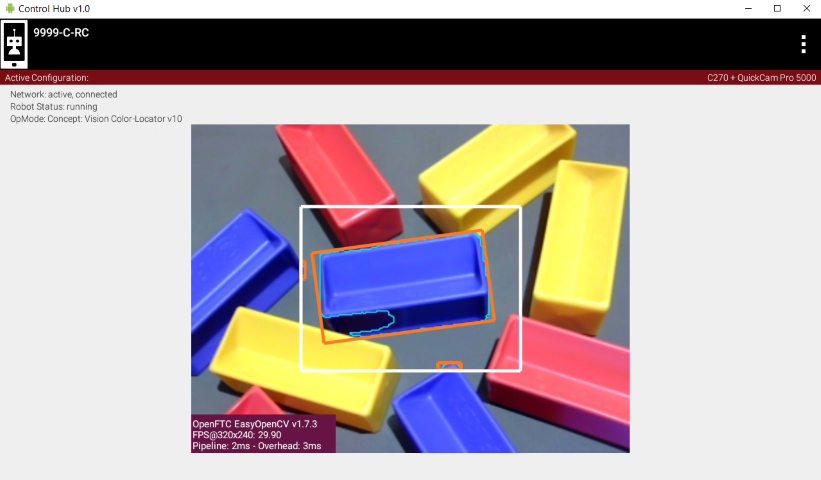
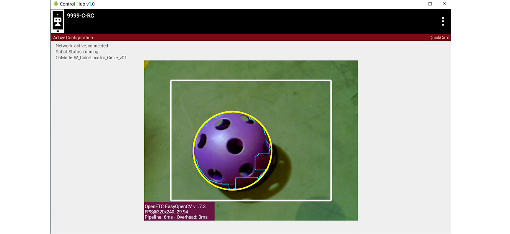

Computer Vision Overview
========================

Introduction
------------

The *FIRST* Tech Challenge control system software has built-in support for two
computer vision technologies:

1. AprilTags -
   :doc:`AprilTags <../../../apriltag/vision_portal/apriltag_intro/apriltag-intro>`
   are fiducial markers similar in design to a QR code that can be used
   for identification and localization. AprilTags are used as reference 
   points for autonomous navigation and for assisted navigation and
   identification of points of interest on a game field.

   -  Each season, *FIRST* provides 2D image tagets that can be used as
      navigational reference points.
   -  If the AprilTag system recognizes an AprilTag image, it provides 
      very accurate pose information (assuming the camera used has 
      calibration parameters for the working resolution) about the 
      robot’s position relative to the target.
   -  A robot can use this information to navigate autonomously on the
      field.

2. Color Processing - 
   :doc:`Color Processing </color_processing/index>` is a
   feature in the *FIRST* Tech Challenge SDK that provides the ability
   to process colors using `OpenCV <https://opencv.org/>`__.

   -  Color Sensor can detect the exact color in an image, which can
      help determine what is in front of a robot.
   -  Color Locator can look for a specific color and return information
      about the size, shape and location of the color in the camera frame.
   -  A robot can use this information to navigate to the
      recognized object.

AprilTags vs Color Processing
-----------------------------

AprilTag Advantages
~~~~~~~~~~~~~~~~~~~

-  Very efficient with a fast detection rate (estimated 15 to 20
   detections per second, depending on decimation and target size).
-  Provides accurate, relative pose information of camera to target 
   in field coordinates.
-  Is less prone to fluctuating or varied lighting conditions on 
   the field.

.. figure:: images/AprilTagTelemetry.jpg
   :align: center
   :width: 25%

   AprilTag can provide accurate pose information to target

AprilTag Disadvantages
~~~~~~~~~~~~~~~~~~~~~~

-  The entire AprilTag must be in the camera view in order to be 
   recognized, any occlusions render the object unprocessable.
-  AprilTags must be included in the tag library in order to 
   process pose information for the tag (tag size and value must
   be known to the AprilTag system in advance).
-  Cameras require calibration data for every resolution used 
   in order to process correct pose information.

.. figure:: images/AprilTagDual.png
   :align: center
   :width: 75%

   AprilTags not in Tag Library detected, but no pose data available

Color Processing Advantages
~~~~~~~~~~~~~~~~~~~~~~~~~~~

-  Color Processing looks for colors, not specific images.

   -  Recognizes objects in spite of different backgrounds.
   -  Recognizes objects both up close and further away.
   -  Recognizes objects even when objects are oriented in different
      positions.

-  Pre-defined colors are included in the *FIRST* Tech Challenge SDK
   that have already been tested on season-specific game elements.

Color Processing Disadvantages
~~~~~~~~~~~~~~~~~~~~~~~~~~~~~~

-  Color Processing can be sensitive to different lighting conditions.
-  If Color Processing recognizes an object in its field of view, it only
   returns location information on where the target object is within its
   field of view.

   Color Processing can recognize actual objects (and not just 2D image targets).

   Color Processing can recognize the shape of the object.

Which Should I Use?
~~~~~~~~~~~~~~~~~~~

The choice of whether to use AprilTags or Color Processing will be
influenced by factors such as distance-to-target, lighting, accuracy
required, camera placement and etc.. 

If the object and tag can always be guaranteed to be in a specific orientation
and the tag fully visible, AprilTags are likely the best solution. However,
if the object does not belong to you or a tag is not able to be physically 
placed on the object, Color Processing can be a good solution.

