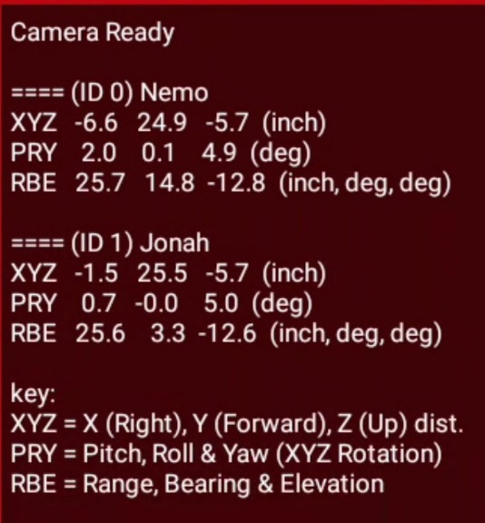

Computer Vision Overview
========================

Introduction
------------

The *FIRST* Tech Challenge control system software has built-in support for two
computer vision technologies:

1. AprilTags -
   :doc:`AprilTags <../../../apriltag/vision_portal/apriltag_intro/apriltag-intro>`
   are fiducial markers similar in design to a QR code that can be used
   for identification and localization. AprilTags are used as reference 
   points for autonomous navigation and for assisted navigation and
   identification of points of interest on a game field.

   -  Each season, FIRST provides 2D image tagets that can be used as
      navigational reference points.
   -  If the AprilTag system recognizes an AprilTag image, it provides 
      very accurate pose information (assuming the camera used has 
      calibration parameters for the working resolution) about the 
      robot’s position relative to the target.
   -  A robot can use this information to navigate autonomously on the
      field.

2. TensorFlow Lite - `TensorFlow
   Lite <https://ai.google.dev/edge/litert>`__ is a lightweight version
   of Google’s `TensorFlow <https://www.tensorflow.org>`__ *machine
   learning* technology that is designed to run on mobile devices such
   as an Android smartphone.

   -  Each season FIRST creates a TensorFlow *inference model* that can
      be used to “look” for specific game elements.
   -  If TensorFlow recognizes an object, it returns location info about
      the identified object.
   -  A robot can use this location information to navigate to the
      recognized object.

TensorFlow vs AprilTags
-----------------------

AprilTag Advantages
~~~~~~~~~~~~~~~~~~~

-  Very efficient with a fast detection rate (estimated 15 to 20
   detections per second, depending on decimation and target size).
-  Provides accurate, relative pose information of camera to target 
   in field coordinates.
-  Is less prone to fluctuating or varied lighting conditions on 
   the field.

   AprilTag can provide accurate pose information to target

AprilTag Disadvantages
~~~~~~~~~~~~~~~~~~~~~~

-  The entire AprilTag must be in the camera view in order to be 
   recognized, any occlusions render the object unprocessable.
-  AprilTags must be included in the tag library in order to 
   process pose information for the tag (tag size and value must
   be known to the AprilTag system in advance).
-  Cameras require calibration data for every resolution used 
   in order to process correct pose information.

.. figure:: images/AprilTagDual.png
   :align: center
   :width: 75%

   AprilTags not in Tag Library detected, but no pose data available

TensorFlow Advantages
~~~~~~~~~~~~~~~~~~~~~

-  TensorFlow learns how to recognize target objects, not just specific
   images.

   -  Recognizes objects in spite of different backgrounds.
   -  Recognizes objects in varied lighting conditions.
   -  Recognizes objects even when objects are oriented in different
      positions.

-  TensorFlow can be taught how to distinguish between similar looking
   (but still distinct) objects, such as a Stone and a Skystone from the
   2019-2020 challenge.

TensorFlow Disadvantages
~~~~~~~~~~~~~~~~~~~~~~~~

-  Training a TensorFlow model can be daunting at first. It requires a
   lot of understanding of the TensorFlow training metrics and behaviors.
-  TensorFlow is computationally intensive and has a low detection rate
   (an estimated 1 to 2 detections per second).
-  If TensorFlow recognizes an object in its field of view, it only
   returns location information on where the target object is within its
   field of view.

.. figure:: images/tfodIndirect.jpg
   :align: center
   :width: 75%

   TensorFlow can recognize actual objects (and not just 2D image targets).

   TensorFlow can be taught to distinguish between similar looking objects.

Which Should I Use?
~~~~~~~~~~~~~~~~~~~

The choice of whether to use TensorFlow Lite or AprilTags will be
influenced by factors such as distance-to-target, lighting, accuracy
required, camera placement and etc.. 

If the object and tag can always be guaranteed to be in a specific orientation
and the tag fully visible, AprilTags are likely the best solution. However,
if the object does not belong to you or a tag is not able to be physically 
placed on the object, TensorFlow can be a good solution.

