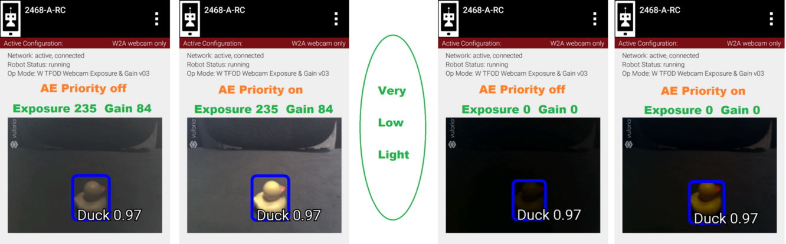

AE Priority
=============

Auto-Exposure Priority is a setting within the ExposureControl
interface. It’s listed here at the end, not likely to be needed in 
since it it operates in very low lighting.

What does it do? Imagine that the webcam is operating at its default
frame rate, for example 30 frames per second (fps). *Note that frame
rate is not covered in this basic tutorial.*

If the webcam’s built-in auto-exposure detects that the image is very
dark, AE Priority **allows the frame rate to decrease**. This slowdown,
or ‘undershoot’, allows more light per frame, which can ‘brighten’ the
image.

Its methods are: 

-  setAePriority(boolean priority) 
-  getAePriority()

These AE Priority methods are called on an ExposureControl object, as
described above.

   Two examples of AE Priority

Here are two pairs of previews, each with AE Priority off and on. In
both pairs, the ambient light level is very low. These results are from
a Logitech C270 webcam.

The Exposure=0 recognition here was made before reducing exposure and
gain. When testing ‘instant’ results, AE Priority could improve the
chance of recognition.

Again, this effect is triggered only in very low lighting, not expected in
competition. If the building loses all power, Duck recognition becomes… less
essential.