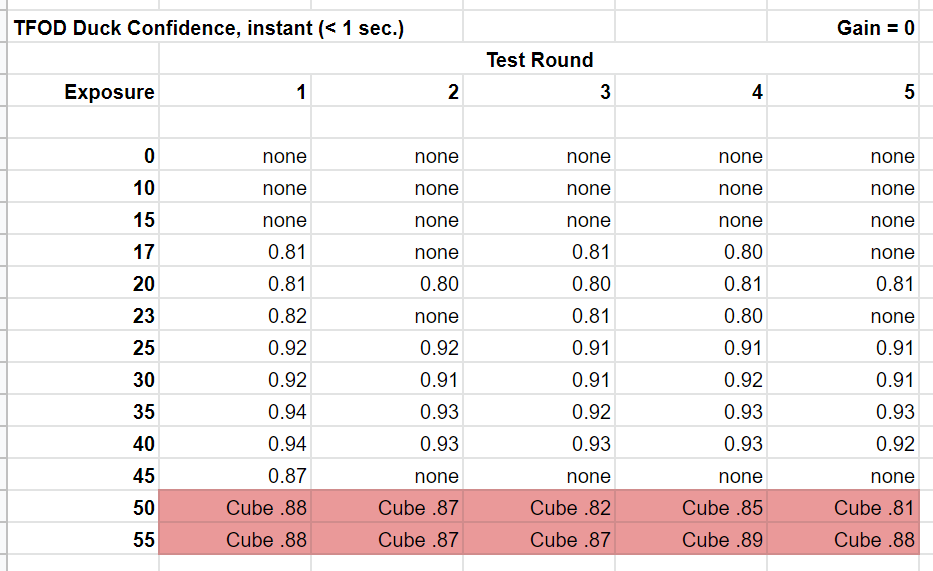

Example 1: Exposure’s effect on TFOD
------------------------------------

We interrupt this tutorial to demonstrate the two webcam interfaces
described so far: ExposureControl and GainControl.

These 2 examples assume you are already using TensorFlow Object
Detection (TFOD) in the Freight Frenzy game. Namely you have a TFOD
model and OpMode that are working reasonably well.
Here we will discuss only the Duck game element. **Can the exposure
and/or gain controls improve the chance of a fast, accurate TFOD
detection?**

Another way to frame this effort is: can these controls simulate the
lighting conditions used for TFOD model training? Namely, if the
competition field has different lighting that affects recognition, can
you achieve close to **your original (trained) TFOD performance**?

We first try exposure alone. Setting gain to zero, we apply TFOD to
webcam images at various exposure values.

.. figure:: images/200-Gain0Exp00-to-20.png
   :align: center

   Gain 0, Exp 0 -> 20

.. figure:: images/210-Gain0Exp23-to-40.png
   :align: center

   Gain 0, Exp 23 - > 40

.. figure:: images/220-Gain0Exp45-to-55.png
   :align: center

   Gain 0, Exp 45 -> 55

**Five fresh readings** were taken at each exposure setting. Namely the
test OpMode was opened (INIT) each time for a new TFOD initialization
and webcam image processing.

This chart shows TFOD confidence levels; ‘instant’ is defined here as
recognition within 1 second.

   Five readings at each exposure level

Higher exposure does improve recognition, then performance suddenly
drops. Then at higher levels, this TFOD model begins to “see” a Cube,
not a Duck. Not good!

So, there does seem to be a range of exposure values that gives better
results. Note the sharp drop-off at both ends of the range: below 25 and
above 40. In engineering, a **robust** solution can withstand variation.
Using a value in the middle of the improved range, can reduce the
effects of unforeseen variation. But this range varies with ambient
lighting conditions, which may be quite different at the tournament
venue.

This data is the result of a very particular combination of: webcam
model (Logitech C270), distance (12 inches), lookdown angle (30
degrees), TFOD model (SDK 7.0 default), ambient lighting,
background, etc. **Your results will vary, perhaps significantly.**