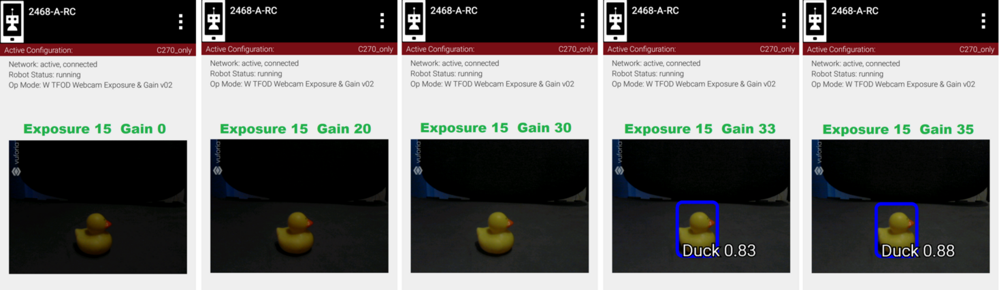
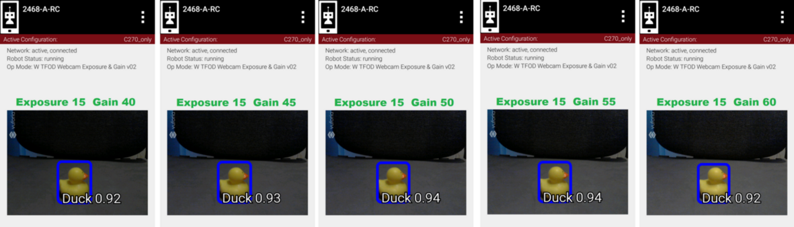
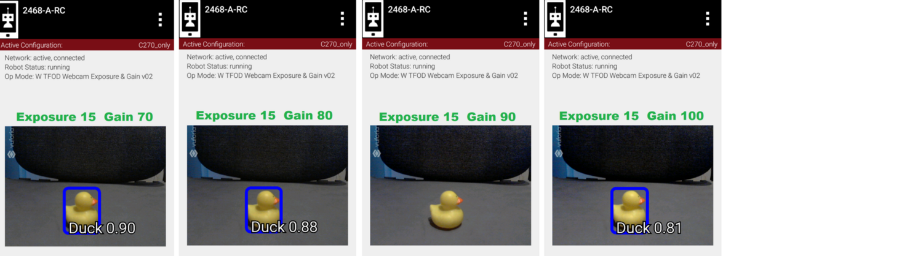
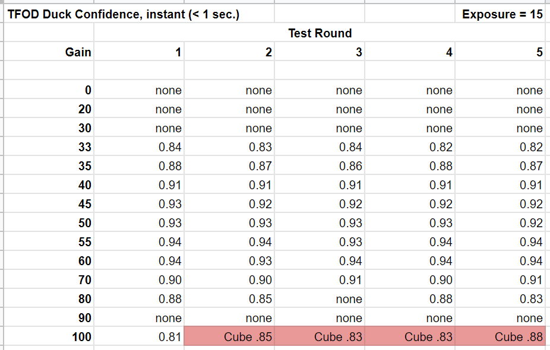

Example 2: Gain’s effect on TFOD
--------------------------------

Now we adjust only gain. We set Exposure to a fixed value of 15,
selected because it was a poor performer in Example 1. **Can gain
help?**

   Exp 15, Gain 000 -> 035

   Exp 15, Gain 040 -> 060

   Exp 15, Gain 070 -> 100

Five fresh readings were taken at each gain setting.

   Five readings at each gain level

Higher gain does improve recognition, then performance declines. Then at
higher levels, this TFOD model begins to “see” a Cube, not a Duck. The
gain effect was similar to the exposure effect.

These two charts suggest that TFOD results are affected by, and can
perhaps be optimized by, setting specific values for exposure and gain.
A team should compare this with the default or automatic performance of
their robot and webcam, in the full range of expected match conditions.