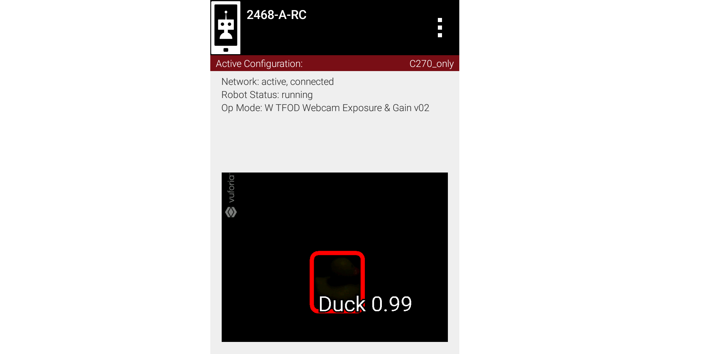

Example 3: An odd preview
-------------------------

   Did TFOD make this recognition?

How can this be? Answer: this image was not an ‘instant’ result.
Exposure was reduced very low, **after** TFOD had recognized the Duck.

The implementations of TensorFlow Lite (and Vuforia) are good at
**tracking** a currently-identified object (or image) through
translation, rotation, partial blockage, and even extreme changes in
exposure.