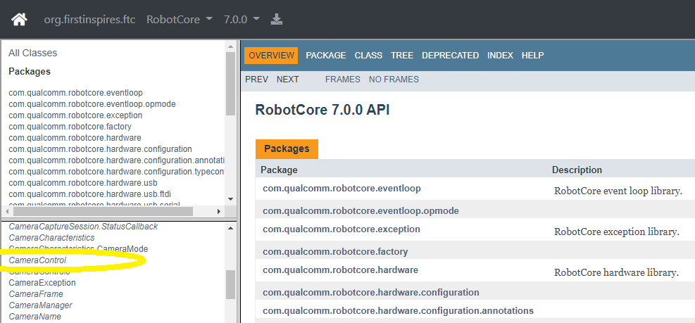

Software Overview
-----------------

The SDK contains a superinterface called CameraControl, which
contains 5 interfaces: 

- :doc:`ExposureControl </programming_resources/vision/webcam_controls/exposure/index>`
- :doc:`GainControl </programming_resources/vision/webcam_controls/gain/index>` 
- :doc:`WhiteBalanceControl </programming_resources/vision/webcam_controls/white_balance/index>` (new for SDK 7.1) 
- :doc:`FocusControl </programming_resources/vision/webcam_controls/focus/index>`
- :doc:`PtzControl </programming_resources/vision/webcam_controls/ptz/index>`

Similar to Java classes, Java interfaces provide methods. A webcam can
be controlled using methods of these 5 interfaces.

PtzControl allows control of 3 related features: virtual pan, tilt and
zoom. ExposureControl also contains a feature called auto-exposure
priority, or AE Priority. Together there are **8 webcam controls**
discussed in this tutorial.

The official documentation is found in the `Javadocs <https://javadoc.io/doc/org.firstinspires.ftc>`__. Click the
link for **RobotCore**, then click the **CameraControl** link in the
left column.

   RobotCore Javadoc API

That page provides links to the 5 interfaces listed above.

The methods described here can be used in Android Studio or OnBot Java.
They can also be provided to Blocks programmers by creating
myBlocks, covered in a separate :ref:`Blocks programming Tutorial <programming_resources/blocks/blocks-tutorial:blocks programming tutorial>`.

You will see Vuforia mentioned here, and in the `sample OpModes
<#sample-opmodes>`__ below. **Why Vuforia?** The *FIRST* Tech Challenge
implementation of Google’s TensorFlow Lite receives camera images from a
Vuforia video stream. The SDK already includes and uses Vuforia for
navigation, so it’s a convenient tool for passing camera streams to TFOD.

These CameraControl interfaces allow some control of the webcam, within
requirements or settings of Vuforia for its own performance. Such
settings include resolution and frame rate, not covered here.