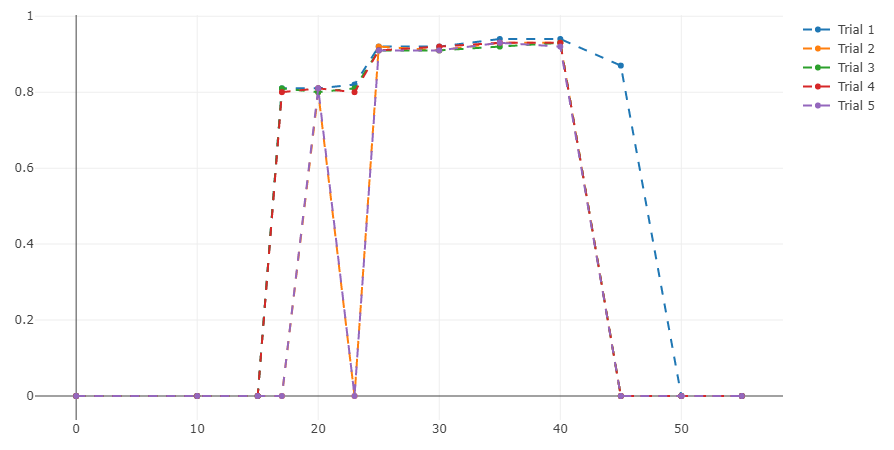
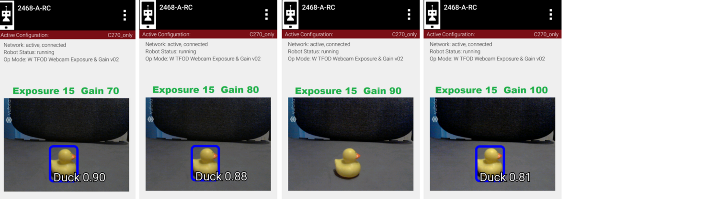

Webcam Controls
===============

Introduction
------------

This basic tutorial describes 8 webcam controls available in the 
SDK. It includes an example, using 2 of these controls to potentially
improve TensorFlow recognition in Freight Frenzy.

Hats off to `rgatkinson <https://github.com/rgatkinson>`__ and
`Windwoes <https://github.com/Windwoes>`__ who developed these 
webcam controls.

Software Overview
-----------------

The SDK contains a superinterface called CameraControl, which
contains 5 interfaces: 

- :ref:`ExposureControl <programming_resources/vision/webcam_controls/webcam-controls:exposure control>`
- :ref:`GainControl <programming_resources/vision/webcam_controls/webcam-controls:gain control>` 
- :ref:`WhiteBalanceControl <programming_resources/vision/webcam_controls/webcam-controls:white balance control>` (new for SDK 7.1) 
- :ref:`FocusControl <programming_resources/vision/webcam_controls/webcam-controls:focus control>`
- :ref:`PtzControl <programming_resources/vision/webcam_controls/webcam-controls:ptz support>`

Similar to Java classes, Java interfaces provide methods. A webcam can
be controlled using methods of these 5 interfaces.

PtzControl allows control of 3 related features: virtual pan, tilt and
zoom. ExposureControl also contains a feature called auto-exposure
priority, or AE Priority. Together there are **8 webcam controls**
discussed in this tutorial.

The official documentation is found in the `Javadocs <https://javadoc.io/doc/org.firstinspires.ftc>`__. Click the
link for **RobotCore**, then click the **CameraControl** link in the
left column.

.. figure:: images/020-RobotCore.png
   :align: center

   RobotCore Javadoc API

That page provides links to the 5 interfaces listed above.

The methods described here can be used in Android Studio or OnBot Java.
They can also be provided to Blocks programmers by creating
myBlocks, covered in a separate :ref:`Blocks programming Tutorial <programming_resources/blocks/blocks-tutorial:blocks programming tutorial>`.

You will see Vuforia mentioned here, and in the `sample OpModes
<#sample-opmodes>`__ below. **Why Vuforia?** The *FIRST* Tech Challenge
implementation of Google’s TensorFlow Lite receives camera images from a
Vuforia video stream. The SDK already includes and uses Vuforia for
navigation, so it’s a convenient tool for passing camera streams to TFOD.

These CameraControl interfaces allow some control of the webcam, within
requirements or settings of Vuforia for its own performance. Such
settings include resolution and frame rate, not covered here.

Exposure Control
----------------

Exposure is the amount of light that reaches the webcam sensor. It is an
important part of how bright or dark your image appears.

Exposure varies directly with the amount of time that the shutter is
open, allowing light to enter and reach the sensor. So, the 
interface ExposureControl uses a single value of **duration**, in units
of time that you specify, typically ``TimeUnit.MILLISECONDS``.

For example, at a frame rate of 60 frames per second (fps), exposure
duration is 1/60 of a second, or 1/60 x 1000 = 16 milliseconds. This
basic tutorial does not address frame rate.

Here are the methods to manage exposure: 

- setExposure() has two parameters: duration and time unit 
- getExposure() has one parameter: time unit

The webcam may support minimum and maximum allowed values of exposure.
These can be retrieved with: 

- getMinExposure(TimeUnit.MILLISECONDS) 
- getMaxExposure(TimeUnit.MILLISECONDS)

There are no ``set()`` methods for min and max exposure; these are
hard-coded in the webcam’s firmware. Note that firmware settings may
vary among different versions of the same webcam model.

These and other exposure methods are called on an ExposureControl
object; sample code is shown below, after Exposure Control Mode.

Exposure Control Mode
---------------------

:java:extdoc:`org.firstinspires.ftc.robotcore.external.hardware.camera.controls`

A webcam may operate in one of various exposure modes.

Many common webcams offer only some of these modes. To directly
control the exposure, set the webcam to Manual mode.

The SDK supports these values of ExposureControl.Mode: 

- `AperturePriority`
- `Auto` 
- `ContinuousAuto`
- `Manual` 
- `ShutterPriority` 
- `Unknown`

Mode is managed with these ExposureControl methods: 

- setMode(ExposureControl.Mode._mode_) 
- getMode()

The Logitech C920 and C270 models offer two exposure modes:
AperturePriority and Manual.

Exposure Control code samples
-----------------------------

1. Import the interface. This line is automatically added by OnBot Java
   when the interface is used (coded).

-  ``import org.firstinspires.ftc.robotcore.external.hardware.camera.controls.ExposureControl;``

2. Declare the ExposureControl object, before ``runOpMode()``.

-  ``ExposureControl myExposureControl;``

3. Assign the Vuforia/TFOD video stream control to your control object,
   in ``runOpMode()``.

-  ``myExposureControl = vuforia.getCamera().getControl(ExposureControl.class);``

4. Set the mode to Manual, for direct control.

-  ``myExposureControl.setMode(ExposureControl.Mode.Manual);``

5. Set the exposure duration, in this case to 30 milliseconds.

-  ``myExposureControl.setExposure(30, TimeUnit.MILLISECONDS);``

See far below for these and other exposure controls illustrated in
`Sample OpModes <#sample-opmodes>`__.

Gain Control
------------

:java:extdoc:`org.firstinspires.ftc.robotcore.external.hardware.camera.controls`

Gain is a digital camera setting that controls the amplification of the
signal from the webcam sensor. This amplifies the whole signal,
including any associated background noise.

Gain can be managed in coordination with exposure. Raising exposure and
keeping gain low, can provide a bright image and low noise. On the other
hand, longer exposure can cause motion blur, which may affect target
tracking performance. In some cases, reducing exposure duration and
increasing gain may provide a sharper image, although with more noise.

The interface GainControl uses a single value to control gain. It’s
used for amplification, and thus has no units – it’s just a number of
type integer. Its methods are: 

- setGain(int gain) 
- getGain()

As with exposure, the webcam may support minimum and maximum allowed
values of gain. These can be retrieved with: 

- getMinGain() 
- getMaxGain()

There are no ``set()`` methods for min and max gain; these are
hard-coded in the webcam’s firmware. Note that firmware settings may
vary among different versions of the same webcam model.

These and other gain methods are called on a GainControl object, as
described above for exposure.

Example 1: Exposure’s effect on TFOD
------------------------------------

We interrupt this tutorial to demonstrate the two webcam interfaces
described so far: ExposureControl and GainControl.

These 2 examples assume you are already using TensorFlow Object
Detection (TFOD) in the Freight Frenzy game. Namely you have a TFOD
model and OpMode that are working reasonably well. The model may have
been supplied with the SDK, or created with the **Machine
Learning toolchain** `[forum] <https://ftc-community.firstinspires.org/>`__
:ref:`[manual] <ftc_ml/index:*first* machine learning toolchain>`

Here we will discuss only the Duck game element. **Can the exposure
and/or gain controls improve the chance of a fast, accurate TFOD
detection?**

Another way to frame this effort is: can these controls simulate the
lighting conditions used for TFOD model training? Namely, if the
competition field has different lighting that affects recognition, can
you achieve close to **your original (trained) TFOD performance**?

We first try exposure alone. Setting gain to zero, we apply TFOD to
webcam images at various exposure values.

.. figure:: images/200-Gain0Exp00-to-20.png
   :align: center

   Gain 0, Exp 0 -> 20

.. figure:: images/210-Gain0Exp23-to-40.png
   :align: center

   Gain 0, Exp 23 - > 40

   Gain 0, Exp 45 -> 55

**Five fresh readings** were taken at each exposure setting. Namely the
test OpMode was opened (INIT) each time for a new TFOD initialization
and webcam image processing.

This chart shows TFOD confidence levels; ‘instant’ is defined here as
recognition within 1 second.

   Five readings at each exposure level

Higher exposure does improve recognition, then performance suddenly
drops. Then at higher levels, this TFOD model begins to “see” a Cube,
not a Duck. Not good!

So, there does seem to be a range of exposure values that gives better
results. Note the sharp drop-off at both ends of the range: below 25 and
above 40. In engineering, a **robust** solution can withstand variation.
Using a value in the middle of the improved range, can reduce the
effects of unforeseen variation. But this range varies with ambient
lighting conditions, which may be quite different at the tournament
venue.

This data is the result of a very particular combination of: webcam
model (Logitech C270), distance (12 inches), lookdown angle (30
degrees), TFOD model (SDK 7.0 default), ambient lighting,
background, etc. **Your results will vary, perhaps significantly.**

Example 2: Gain’s effect on TFOD
--------------------------------

Now we adjust only gain. We set Exposure to a fixed value of 15,
selected because it was a poor performer in Example 1. **Can gain
help?**

   Exp 15, Gain 000 -> 035

.. figure:: images/310-Exp15Gain040-to-060.png
   :align: center

   Exp 15, Gain 040 -> 060

   Exp 15, Gain 070 -> 100

Five fresh readings were taken at each gain setting.

.. figure:: images/350-chart-exposure=15.png
   :align: center

   Five readings at each gain level

Higher gain does improve recognition, then performance declines. Then at
higher levels, this TFOD model begins to “see” a Cube, not a Duck. The
gain effect was similar to the exposure effect.

These two charts suggest that TFOD results are affected by, and can
perhaps be optimized by, setting specific values for exposure and gain.
A team should compare this with the default or automatic performance of
their robot and webcam, in the full range of expected match conditions.

Example 3: An odd preview
-------------------------

   Did TFOD make this recognition?

How can this be? Answer: this image was not an ‘instant’ result.
Exposure was reduced very low, **after** TFOD had recognized the Duck.

The implementations of TensorFlow Lite (and Vuforia) are good at
**tracking** a currently-identified object (or image) through
translation, rotation, partial blockage, and even extreme changes in
exposure.

White Balance Control
---------------------

:java:extdoc:`org.firstinspires.ftc.robotcore.external.hardware.camera.controls.WhiteBalanceControl`

Continuing with other interfaces, the SDK (new for version 7.1)
provides methods for white balance control.

White balance is a digital camera setting that balances the **color
temperature** in the image. Color temperature is measured in units of
degrees Kelvin (K) and is a physical property of light.

For example, sunlight at noon measures between 5200-6000 K. An
incandescent light bulb (warm/orange) has a color temperature of around
3000 K, while shade (cool/blue) measures around 8000 K.

When performed automatically, white balance adds the opposite color to
the image in an attempt to bring the color temperature back to neutral.
This interface WhiteBalanceControl allows the color temperature to be
directly programmed by a user.

A single value is used here to control white balance temperature, in
units of degrees Kelvin, of Java type integer. Here are the methods:

-  setWhiteBalanceTemperature(int temperature)
-  getWhiteBalanceTemperature()

As with exposure and gain, the webcam may support minimum and maximum
allowed values of white balance temperature. These can be retrieved
with:

-  getMinWhiteBalanceTemperature()
-  getMaxWhiteBalanceTemperature()

There are no ``set()`` methods for min and max temperature values; these
are hard-coded in the webcam’s firmware. Note that firmware settings may
vary among different versions of the same webcam model.

The Logitech C920 webcam has a min value of 2000 and a max value of
6500.

White Balance Control Mode
--------------------------

:java:extdoc:`org.firstinspires.ftc.robotcore.external.hardware.camera.controls.WhiteBalanceControl.Mode`

This interface supports 3 values of WhiteBalanceControl.Mode:

-  AUTO
-  MANUAL
-  UNKNOWN

To directly control the color balance temperature, set the webcam to
Manual mode. Mode is managed with these WhiteBalanceControl methods:

-  setMode(WhiteBalanceControl.Mode.MODE)
-  getMode()

The Logitech C920 defaults to Auto mode for white balance control, and
even reverts to Auto in a fresh session, after being set to Manual in a
previous session. For other CameraControl settings, some webcams revert
to a default value and some preserve their last commanded value.

Focus Control
-------------

:java:extdoc:`org.firstinspires.ftc.robotcore.external.hardware.camera.controls.FocusControl`

At a distance called “focus length”, a subject’s image (light rays)
converge from the lens to form a clear image on the webcam sensor.

If supported by the webcam, focus can be managed with these FocusControl
methods: 

-  setFocusLength(double focusLength) 
-  getFocusLength()

Distance units are not specified here; they may be undimensioned values
within an allowed range. For example, the Logitech C920 allows values
from 0 to 250, with **higher** values focusing on **closer** objects.

The webcam may support minimum and maximum allowed values of focus
length. These can be retrieved with: 

-  getMinFocusLength() 
-  getMaxFocusLength()

There are no ``set()`` methods for min and max focus length; these are
hard-coded in the webcam’s firmware. Note that firmware settings may
vary among different versions of the same webcam model.

These and other focus methods are called on a FocusControl object, as
described above for exposure.

Focus Control Mode
------------------

:java:extdoc:`org.firstinspires.ftc.robotcore.external.hardware.camera.controls.FocusControl.Mode`

A webcam may operate in one of various focus modes. To directly control
the focus length, set the webcam to Fixed mode.

The SDK supports these values of FocusControl.Mode: 

-  `Auto` 
-  `ContinuousAuto` 
-  `Fixed` 
-  `Infinity` 
-  `Macro` 
-  `Unknown`

Mode is managed with these FocusControl methods: 

-  setMode(ExposureControl.Mode._mode_) 
-  getMode()

The Logitech C920 webcam offers two modes: ContinuousAuto and Fixed,
which does respond to FocusControl methods. The Logitech C270 (older
model) offers only Fixed mode, but does not allow programmed control.

Full details are described in the `FocusControl
Javadoc <https://javadoc.io/doc/org.firstinspires.ftc/RobotCore/latest/org/firstinspires/ftc/robotcore/external/hardware/camera/controls/FocusControl.html>`__.

Pan-Tilt-Zoom Control
---------------------

:java:extdoc:`org.firstinspires.ftc.robotcore.external.hardware.camera.controls.PtzControl`

The SDK provides methods for virtual pan (horizontal motion), tilt
(vertical motion), and zoom (enlargement and reduction of image size).
This is **virtual** PTZ since the actions are digitally simulated,
within the full original image captured by the webcam. Pan and tilt are
possible only to the extent that zoom has provided extra image space to
move in that direction.

Pan and Tilt
~~~~~~~~~~~~

A webcam does not typically express pan and tilt values in *pixels*, the
smallest unit of image capture by the webcam sensor. For example, the
Logitech C920 and the Microsoft LifeCam VX-5000 have a range of
+/-36,000 units, far greater than the pixel count in each axis.

The webcam accepts pan and tilt as a pair of (x, y) values. Thus the 
SDK pan and tilt methods handle these values **only as a pair**, in a
special class named PanTiltHolder. This class has two fields, named pan
and tilt, of type integer.

Here’s an example to illustrate using the basic methods:

.. code:: java

   myHolder.pan = 5;                  // assign the pan field
   myHolder.tilt = 10;                // assign the tilt field
   myPtzControl.setPanTilt(myHolder);         // command the webcam with (x, y) pair

To retrieve values from the webcam:

.. code:: java

   newHolder = myPtzControl.getPanTilt();      // retrieve (x, y) pair from webcam
   int currentPanValue = newHolder.pan;        // access the pan value
   int currentTiltValue = newHolder.tilt;      // access the tilt value

The above examples assume these objects already exist:

.. code:: java

   PtzControl myPtzControl = vuforia.getCamera().getControl(PtzControl.class); // create PTZ webcam control object
   PtzControl.PanTiltHolder myHolder = new PtzControl.PanTiltHolder();         // instantiate input holder object
   PtzControl.PanTiltHolder newHolder;                                 // declare output holder object

The webcam may support minimum and maximum allowed pan/tilt paired
values. Subject to the control object guidelines shown above, these can
be retrieved as follows: 

-  ``minPanTiltHolder = getMinPanTilt();`` 
-  ``maxPanTiltHolder = getMaxPanTilt();``

There are no ``set()`` methods for min and max pan/tilt values; these
are hard-coded in the webcam’s firmware. Note that firmware settings may
vary among different versions of the same webcam model.

These pan and tilt methods are called on a PtzControl object, as
described above for exposure.

Zoom
~~~~

Virtual zoom is described with a single dimensionless value of type
integer. Similar to the interfaces described above, virtual zoom can be
managed with these methods: 

-  setZoom(int zoom) 
-  getZoom() 
-  getMinZoom() 
-  getMaxZoom()

The Logitech C920 allows zoom values ranging from 100 to 500, although
values higher than 250-280 have no further effect on the preview image
(influenced by Vuforia).

These zoom methods are called on a PtzControl object, as described above
for exposure.

AE Priority
-----------

Auto-Exposure Priority is a setting within the ExposureControl
interface. It’s listed here at the end, not likely to be needed in 
since it it operates in very low lighting.

What does it do? Imagine that the webcam is operating at its default
frame rate, for example 30 frames per second (fps). *Note that frame
rate is not covered in this basic tutorial.*

If the webcam’s built-in auto-exposure detects that the image is very
dark, AE Priority **allows the frame rate to decrease**. This slowdown,
or ‘undershoot’, allows more light per frame, which can ‘brighten’ the
image.

Its methods are: 

-  setAePriority(boolean priority) 
-  getAePriority()

These AE Priority methods are called on an ExposureControl object, as
described above.

.. figure:: images/500-AE-Priority.png
   :align: center

   Two examples of AE Priority

Here are two pairs of previews, each with AE Priority off and on. In
both pairs, the ambient light level is very low. These results are from
a Logitech C270 webcam.

The Exposure=0 recognition here was made before reducing exposure and
gain. When testing ‘instant’ results, AE Priority could improve the
chance of recognition.

Again, this effect is triggered only in very low lighting, not expected in
competition. If the building loses all power, Duck recognition becomes… less
essential.

Evaluating Your Webcam
----------------------

The firmware of a specific webcam may or may not support certain
features described here. The SDK provides some methods to query the
webcam and/or return values that indicate whether a valid response was
available.

Exposure Support
~~~~~~~~~~~~~~~~

Here are two methods to query exposure and a specific exposure mode:

-  isExposureSupported()
-  isModeSupported(ExposureControl.Mode._mode_)

   -  for *mode*, enter the specific mode name you are testing

For the following methods, a field called ``unknownExposure`` of type
long is returned if exposure unavailable: 

-  getExposure(TimeUnit.MILLISECONDS) 
-  getMinExposure(TimeUnit.MILLISECONDS) 
-  getMaxExposure(TimeUnit.MILLISECONDS)

The methods that set the exposure and mode can also return a Boolean,
presumably indicating whether the operation was successful or not. As
optional examples: 

- ``wasExposureSet =  setExposure(25);`` 
- ``wasExposureModeSet = setMode(ExposureControl.Mode.Manual)``

Likewise the AE Priority feature can return a Boolean. For example: 

- ``wasAEPrioritySet =  setAePriority(true);``

Gain Support
~~~~~~~~~~~~

The method that sets the gain can also return a Boolean indicating
whether the operation was successful or not. As an optional example: 

- ``wasGainSet =  setGain(25);``

White Balance Support
~~~~~~~~~~~~~~~~~~~~~

The methods that set temperature and mode can also return a Boolean,
indicating whether the operation was successful or not. As optional
examples:

-  ``wasTemperatureSet = setWhiteBalanceTemperature(3000);``
-  ``wasWhiteBalanceModeSet = setMode(WhiteBalanceControl.Mode.MANUAL);``

Focus Support
~~~~~~~~~~~~~

Here are two methods to query focus and and a specific focus mode: 

- isFocusLengthSupported() 
- isModeSupported(FocusControl.Mode._mode_)

The following methods return a **negative value** if the requested focus
value is unavailable. For example, -1 is returned by the Logitech C270
and the Microsoft LifeCam VX-5000. The Javadoc also mentions a field
``unknownFocusLength`` of type double. 

- getFocusLength() 
- getMinFocusLength() 
- getMaxFocusLength()

The methods that set the focus length and mode can also return a
Boolean, presumably indicating whether the operation was successful or
not. As optional examples: 

- ``wasFocusSet =  setFocusLength(25);`` 
- ``wasFocusModeSet = setMode(FocusControl.Mode.Fixed)``

PTZ Support
~~~~~~~~~~~

The methods that set the pan/tilt pair and zoom value can also return a
Boolean, presumably indicating whether the operation was successful or
not. As optional examples: 

- ``wasPanTiltSet =  setPanTilt(myHolder);``
- ``wasZoomSet = setZoom(3)``

For PTZ get() methods, some webcams simply **return zero** for
unsupported values.

Some Caveats
------------

-  the SDK supports webcams conforming to the `UVC
   standard <https://en.wikipedia.org/wiki/USB_video_device_class>`__

   -  many non-UVC webcams work well in competition, despite lacking UVC
      certification
   -  some non-UVC webcams can be listed in Configure Robot, but crash
      the RC app at runtime

-  webcams may retain an assigned Exposure Mode or Focus Mode, even if
   unplugged

   -  always verify the current mode

-  for a given exposure value, one mode’s preview may look very
   different than another mode’s preview
-  some webcams **accept** / ``set()`` and **confirm** / ``get()`` a
   **non-supported mode**
-  Logitech C270 preview becomes **lighter** up to exposure 655, then
   rolls over to **dark** at 656

   -  this webcam’s Min is 0, Max is 1000.

-  Logitech V-UAX16 preview looks normal at exposure = 0, becomes
   **darker** up to 30-40
-  Logitech C920 **gain** value (0-255) greatly influences preview
   quality, comparable to **exposure** (0-204)
-  restarting the RC app is sometimes needed after a webcam OpMode
   crashes
-  firmware versions may vary among webcams of the same model number

Lastly, some features here may be implemented or enhanced with the help
of an external library such as `OpenCV <https://opencv.org/>`__ or
`EasyOpenCV <https://github.com/OpenFTC/EasyOpenCV>`__. That potential
is not covered in this basic tutorial. A separate tutorial covers the
general use of `External
Libraries <https://github.com/FIRST-Tech-Challenge/FtcRobotController/wiki/External-Libraries-in-OnBot-Java-and-Blocks>`__
in Blocks and OnBot Java.

Sample OpModes
--------------

The intent of this tutorial is to describe the available webcam
controls, allowing programmers to **develop their own solutions** guided
by the SDK API (Javadoc).

The following sample OpModes are linked here for reference only. These
rudimentary OpModes may not apply to your webcam and may not meet your
needs in general.

.. dropdown:: Adjust exposure, gain and AE Priority

   :download:`W_WebcamControls_Exp_Gain.java <opmodes/W_WebcamControls_Exp_Gain.java>`

   .. literalinclude:: opmodes/W_WebcamControls_Exp_Gain.java
      :language: java

.. dropdown:: Adjust exposure and gain with TFOD (test OpMode for Examples 1, 2, 3)

   :download:`W_TFOD_WebcamExpGain.java <opmodes/W_TFOD_WebcamExpGain.java>`

   .. literalinclude:: opmodes/W_TFOD_WebcamExpGain.java
      :language: java

.. dropdown:: Adjust white balance temperature, if supported

   :download:`W_WebcamControls_WhiteBalance.java <opmodes/W_WebcamControls_WhiteBalance.java>`

   .. literalinclude:: opmodes/W_WebcamControls_WhiteBalance.java
      :language: java

.. dropdown:: Adjust focus, if supported

    :download:`W_WebcamControls_Focus.java <opmodes/W_WebcamControls_Focus.java>`

   .. literalinclude:: opmodes/W_WebcamControls_Focus.java
      :language: java

.. dropdown:: Adjust virtual pan, tilt and zoom, if supported

   :download:`W_WebcamControls_PTZ.java <opmodes/W_WebcamControls_PTZ.java>`

   .. literalinclude:: opmodes/W_WebcamControls_PTZ.java
      :language: java

Summary
-------

Some webcam controls in the SDK could potentially improve TFOD
recognitions. Exposure, gain and other values could be pre-programmed in
team autonomous OpModes. It’s also possible to manually enter such
values before a match begins, based on anticipated lighting, starting
position and other game-time factors.

You are encouraged to submit other webcam reports and examples that
worked for you.

====================================================================

Questions, comments and corrections to westsiderobotics@verizon.net
