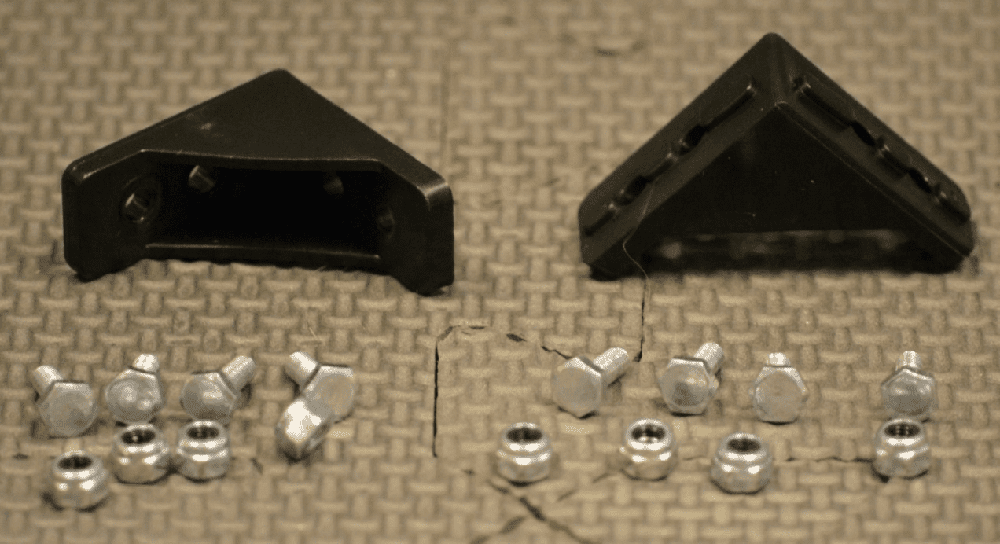
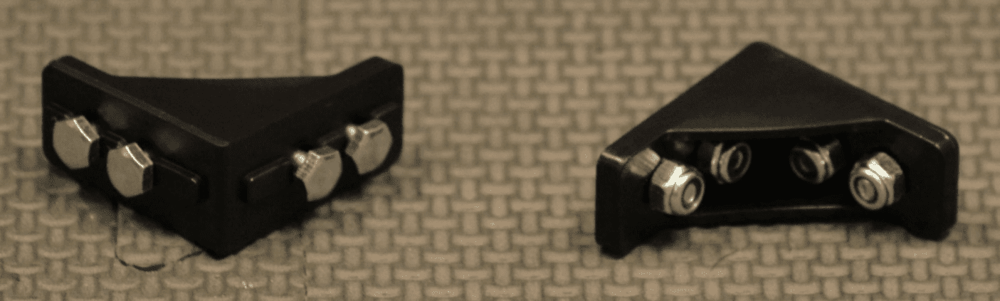
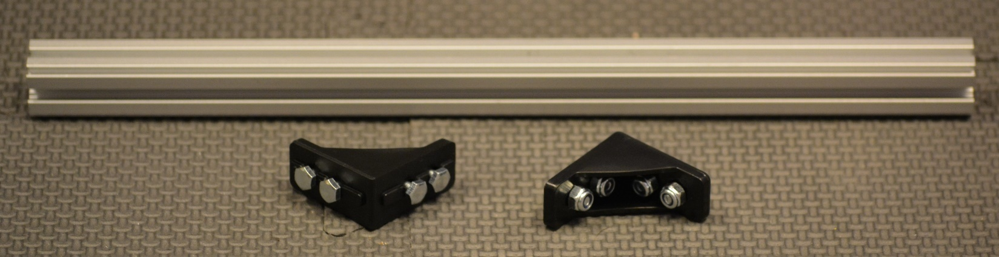
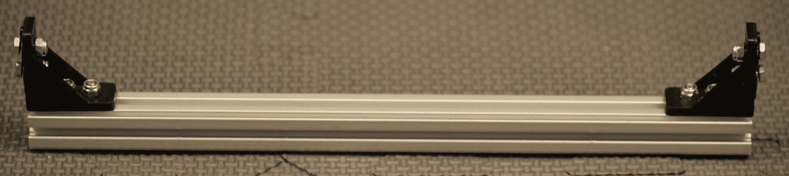
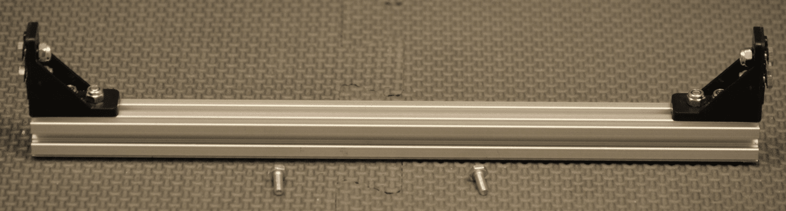
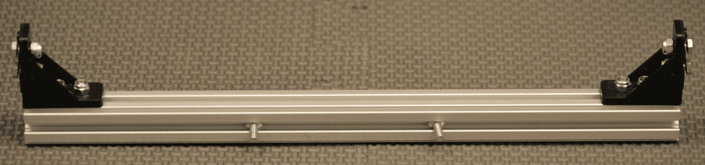
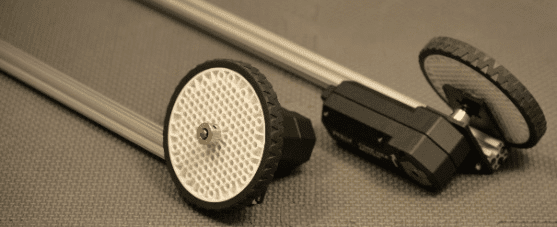
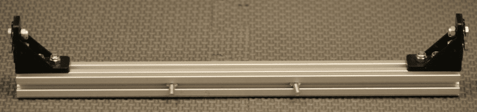
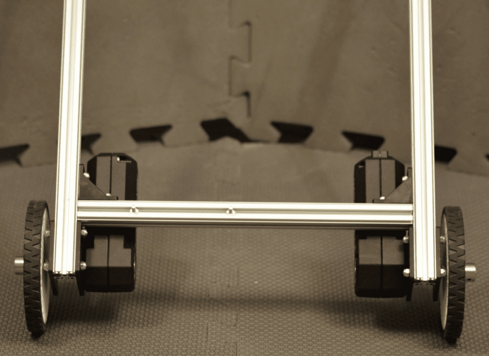

Back Support Beam
=================

Step 1: Add Screws to Corner Brackets
-------------------------------------

Parts Needed: 
^^^^^^^^^^^^^^

- REV-41-1320 – Bracket, Inside Corner (2)

- REV-41-1359 – Screw, Hex Cap, M3, 8mm (8)

- REV-41-1361 – Nut, Locking, M3 (8)

   
   *Figure 9- Unassembled view*

   *Figure 10- Assembled view*

.. hint::

   -  Screw the nuts onto the screws just until it’s difficult to turn
      them; just so that the nuts don’t fall off.

   -  The screw heads will need to slide along the center of an extrusion
      in a later step.

Step 2: Add Corner Brackets to Beam
-----------------------------------

Parts Needed: 
^^^^^^^^^^^^^^

- REV-41-1431 – Extrusion, 225mm, 90-90 Degree (1)

- Corner Bracket Assemblies (2 - from step 1)

   
   *Figure 11- Unassembled view*

   *Figure 12- Assembled view*

.. hint::

   -  Slide the head of the screws down the center of the extrusion.

Step 3: Add Floating Screws to Beam
-----------------------------------

Parts Needed: 
^^^^^^^^^^^^^^

- Back Support Assembly (1 - from step 2)

- REV-41-1359 – Screw, Hex Cap, M3, 8mm (2)

   *Figure 13- Unassembled view*

   
   *Figure 14- Assembled view*

.. hint::

   -  The two 8mm screws are loaded onto what will become the top face of
      the beam.

Step 4: Add Back Support Beam
-----------------------------

Parts Needed: 
^^^^^^^^^^^^^^

- Chassis (from Drive Assemblies and Frame, step 4)
- Back Support Beam Assembly (from the previous step)

   *Figure 15- Unassembled view*
   

   *Figure 16- Unassembled view*

   *Figure 17- Assembled view*

.. hint::

   -  The beam should touch the drive wheel brackets.
