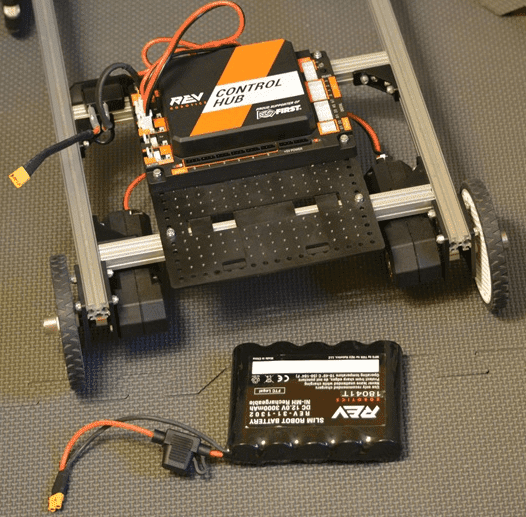
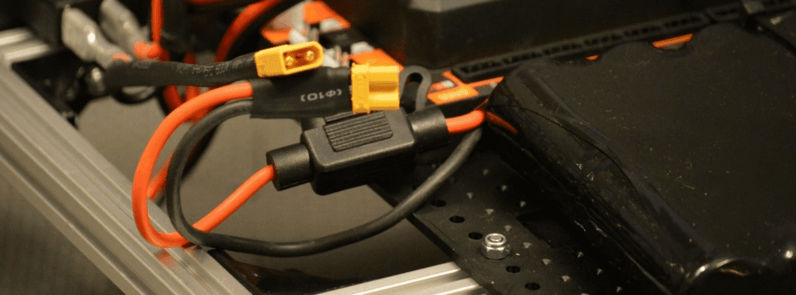
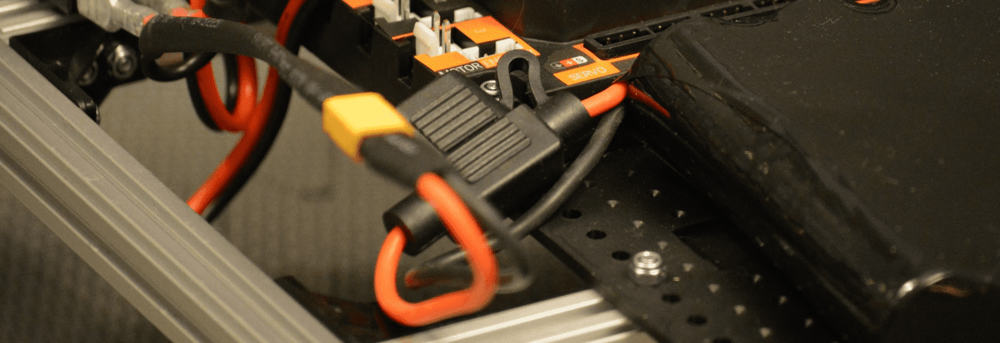

Battery
=======

Step 1: Add the Battery
-----------------------

Parts Needed: 
^^^^^^^^^^^^^^

- REV-31-1302 – Slim Battery, 3000mAh (1)

- REV-41-1161 – Zip Tie, 160mm (2)

   *Figure 49- Unassembled view*

.. figure:: images/BasicB046.png
   :align: center
   :width: 3.9653in	

   *Figure 50- Assembled view*

Step 2: Connect the Battery to the Switch
-----------------------------------------

   
   *Figure 51- Unconnected view*

   *Figure 52- Connected view*