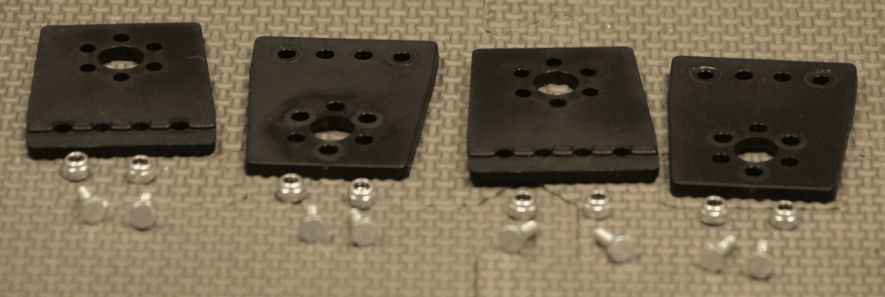
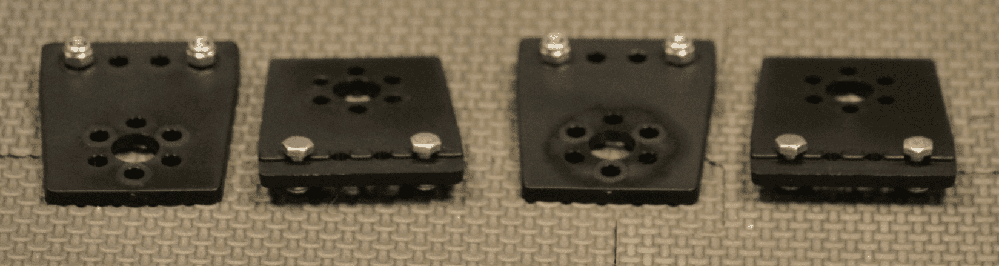
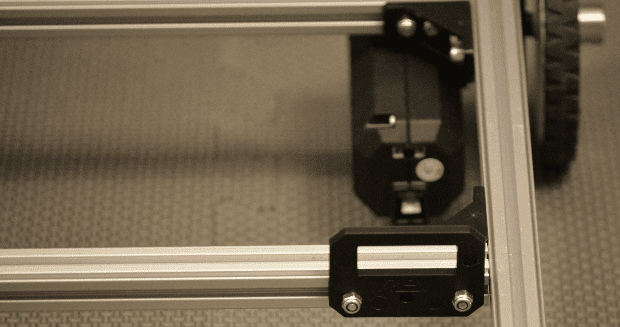
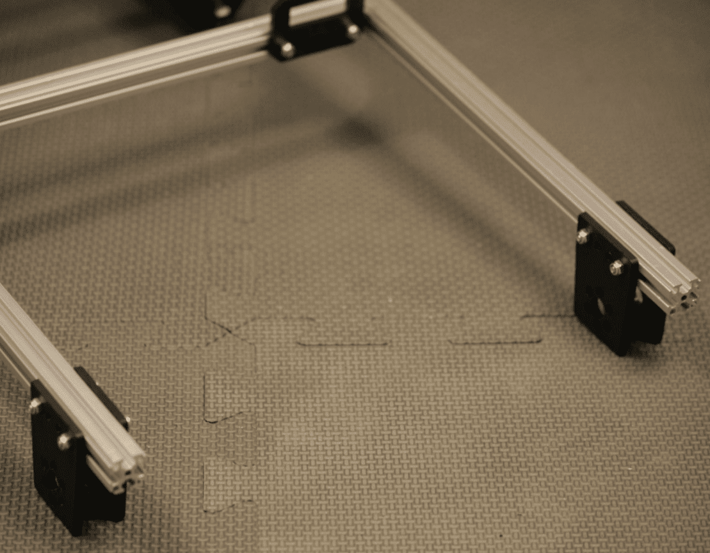
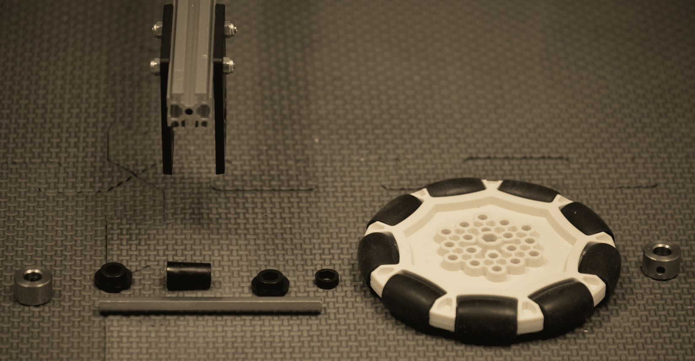
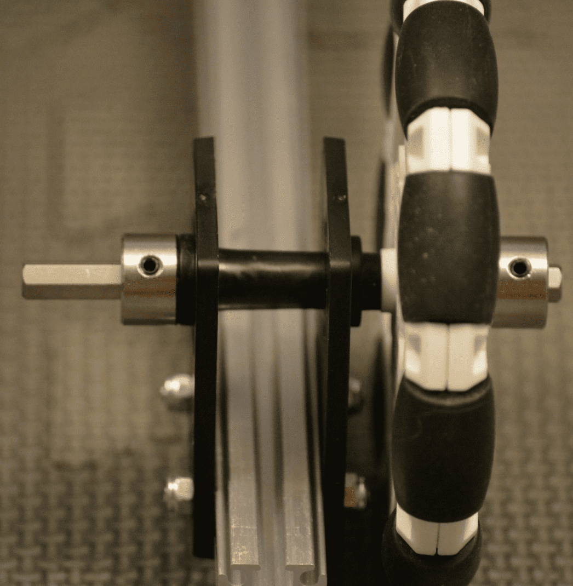
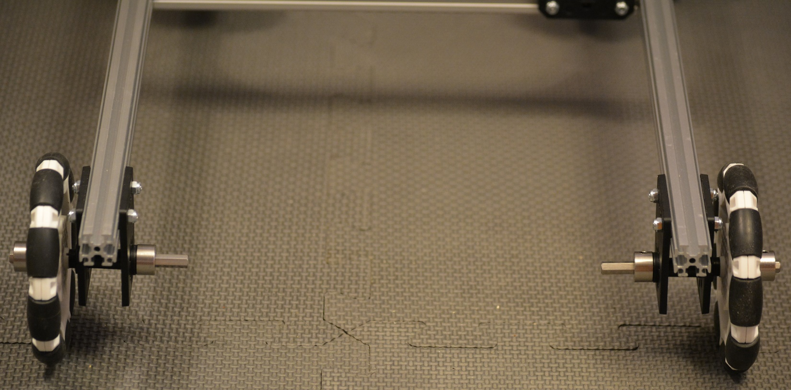

Caster Wheels
=============

Step 1: Build Caster Brackets
-----------------------------

Parts Needed: 
^^^^^^^^^^^^^^

- REV-41-1303 – Bracket, Motion (2 per side, 4 total)

- REV-41-1361 – Nut, Locking, M3 (2 per bracket, 4 per side, 8 total)

- REV-41-1359 – Screw, Hex Cap, M3, 8mm (2 per bracket, 4 per side, 8 total)

   
   *Figure 29- Unassembled view*

   
   *Figure 30- Assembled view*

.. hint::

   -  Screw the nuts onto the screws just until it’s difficult to turn
      them; just so that the nuts don’t fall off.

   -  The screw heads will need to slide along the center of an extrusion
      in a later step.

Step 2: Add Caster Brackets to Chassis
~~~~~~~~~~~~~~~~~~~~~~~~~~~~~~~~~~~~~~

Parts Needed: 
^^^^^^^^^^^^^^

Caster Bracket Assemblies

(4 – from the previous step)

   *Figure 31- Unassembled view*
   

   *Figure 32- Unassembled view*

   
   *Figure 33- Assembled view*

.. hint::

   -  Brackets must be installed 2 cm from the end of the extrusion, if
      used for competition, to fit within the sizing cube.

   -  Ensure that the pair of brackets on the same extrusion are the same
      distance from the end of the extrusion or the wheels will not rotate
      properly.

Step 3: Add the Omni Wheels
---------------------------

Parts Needed: 
^^^^^^^^^^^^^^

- REV-41-1327 – Shaft Collar (2 per side – 4 total)

- REV-41-1326 – Bearing, Through Bore, Short (2 per side – 4 total)

- REV-41-1323 – Spacer, 15mm (1 per side – 2 total)

- REV-41-1324 – Spacer, 3mm (1 per side – 2 total)

- REV-41-1347 – Shaft, 5mm Hex, 75mm (1 per side – 2 total)

- REV-41-1190 – Wheel, Omni 90mm (1 per side – 2 total)

   
   *Figure 34- Unassembled view of left wheel*

[Continued on the next page, so detail can be seen more easily.]

   
   *Figure 35- Assembled view of right wheel*

.. hint::

   -  Order from the outside in: collar, omni wheel, 3mm spacer, bearing,
      bracket, 15mm spacer, bracket, bearing, collar.

   -  Adjust axle length, so it is flush with the collar.

[Continued on the next page, so detail can be seen more easily.]

   
   *Figure 36- Assembled view*