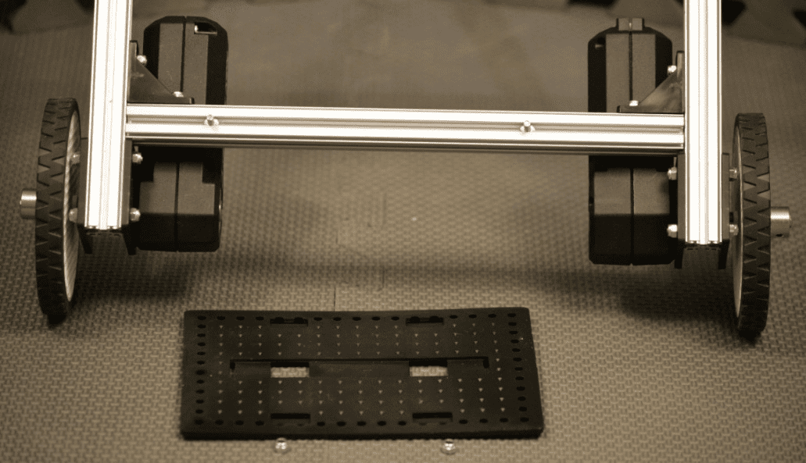
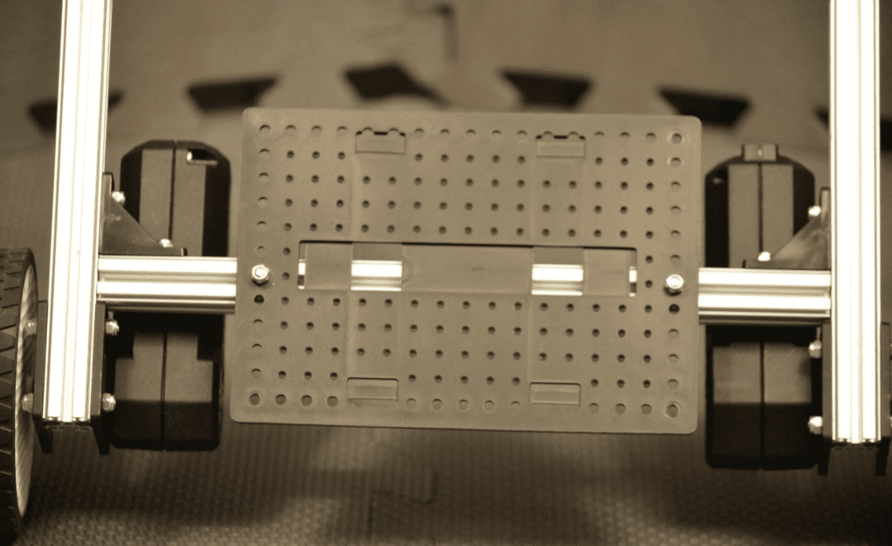
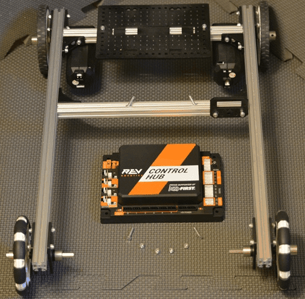
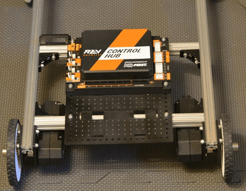
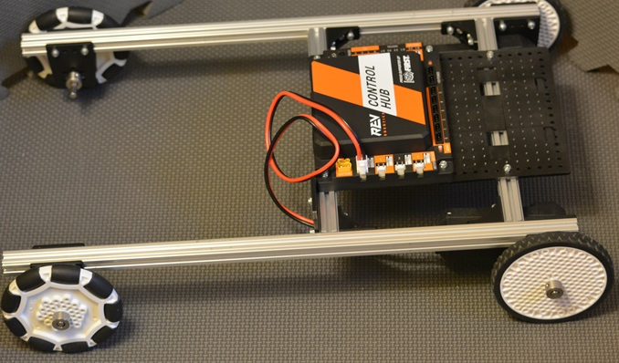
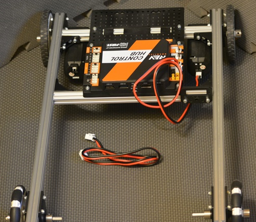
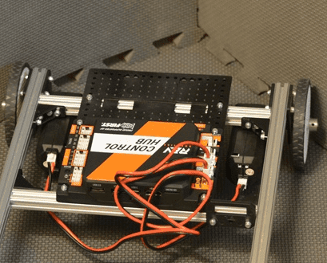

Control Hub
===========

Step 1: Add the Support Plate
-----------------------------

Parts Needed: 
^^^^^^^^^^^^^^

- REV-41-1166 – Battery Holder Plate (1)

- REV-41-1361 – Nut, Locking, M3 (2)

   
   *Figure 37- Unassembled view*

   
   *Figure 38- Assembled view*

Step 2: Add the Rev Robotics Control Hub
----------------------------------------

Parts Needed: 
^^^^^^^^^^^^^^

- REV-31-1153 – Control Hub (1)

- REV-41-1360 – Screw, Hex Cap, M3, 16mm (2) (two other screws are already in the extrusion from an earlier step)

- REV-41-1361 – Nut, Locking, M3 (4)

   
   *Figure 39- Unassembled view*

   *Figure 40- Assembled view*

.. hint::

   -  Reposition the front support beam, if necessary, to accomplish the
      proper spacing – the two floating screws on the front beam need to be
      at the corners of the control hub.

Step 3: Add the Left Drive Motor Power Cable
--------------------------------------------

Parts Needed: 
^^^^^^^^^^^^^^

Motor Power Cable (1 – comes with the core hex motor – REV-41-1300)

.. figure:: images/BasicB037.png
   :align: center
   :width: 3.84104in

   *Figure 41- Unconnected view*

   
   *Figure 42- Connected view*

Step 4: Add the Right Drive Motor Power Cable
---------------------------------------------

Parts Needed\ **:** 
^^^^^^^^^^^^^^^^^^^^

Motor Power Cable (1 – comes with the core hex motor – REV-41-1300)

   *Figure 43-Unconnected view*

