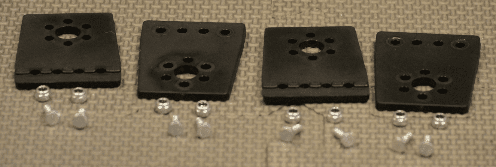
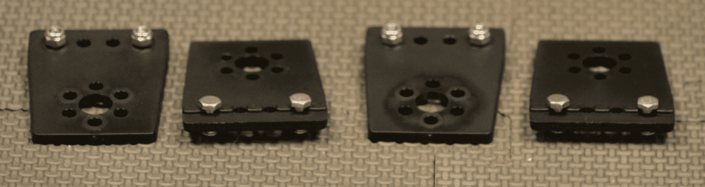
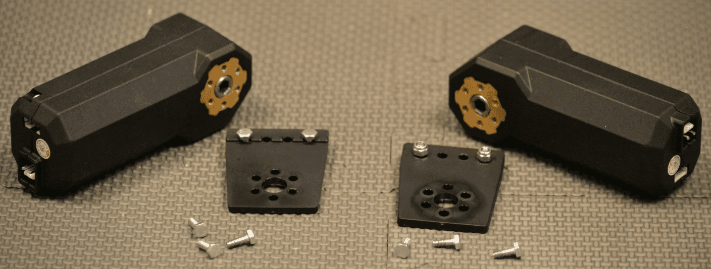
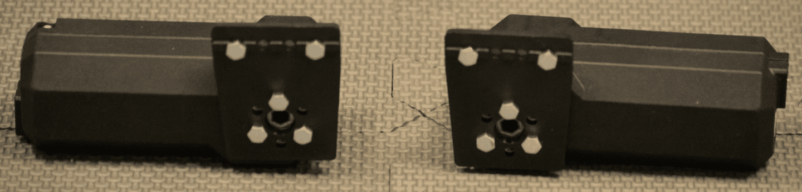
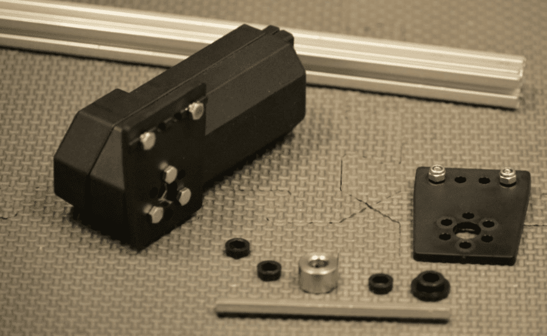
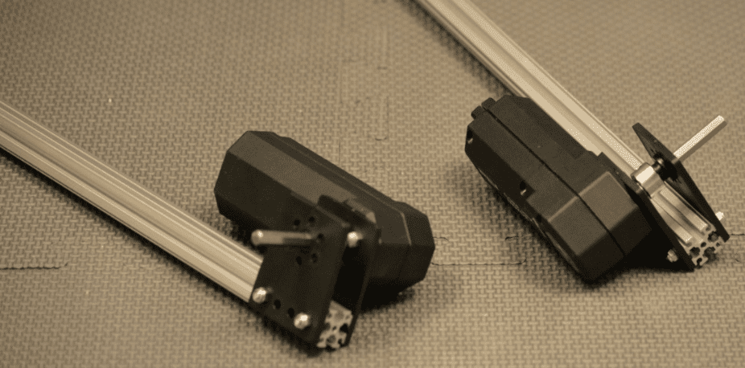
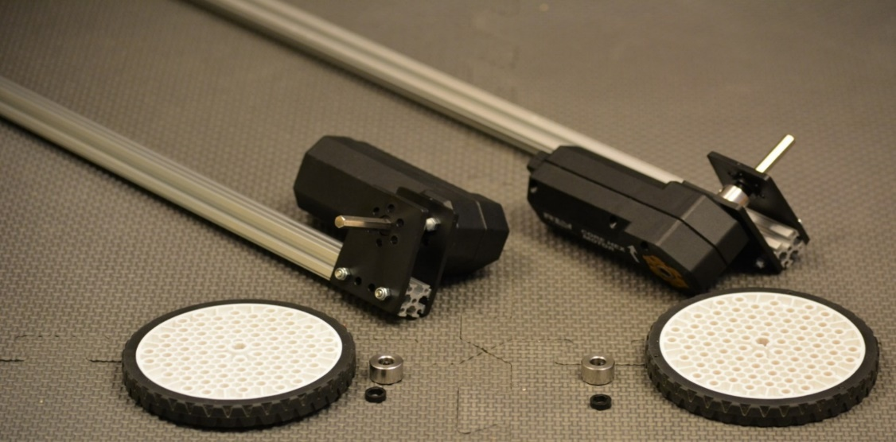
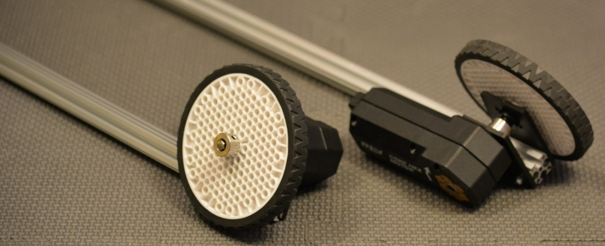

Drive Assemblies and Frame
==========================

Step 1: Build Drive Brackets
----------------------------

Parts Needed
^^^^^^^^^^^^

- REV-41-1303 – Bracket, Motion (4)

- REV-41-1361 – Nut, Locking, M3 (8)

- REV-41-1359 – Screw, Hex Cap, M3, 8mm (8)

   *Figure 1- Unassembled view*

   *Figure 2- Assembled view*

.. hint::

   -  Screw the nuts onto the screws just until it’s difficult to turn
      them; just so that the nuts don’t fall off. The screw heads will need
      to slide along the center of an extrusion in a later step.

Step 2: Build Motor Assemblies
------------------------------

Parts Needed: 
^^^^^^^^^^^^^^

- REV-41-1300 – Core Hex Motor w/cables (2; do not plug cables into the motors yet)

- Drive Bracket Assemblies (1 per motor, 2 total – use only two of the assemblies from step 1)

- REV-41-1359 – Screw, Hex Cap, M3, 8mm (3 per motor, 6 total)

   
   *Figure 3- Unassembled view*

   *Figure 4- Assembled view*

.. note::

   -  Make sure that the brackets are facing the correct direction; the
      alignment ribs should be on the side away from the motor.

   -  Note that motor directions are reversed – the power plug of the motor
      pictured on the left is on the bottom; the plug of the motor on the
      right is on the top.

Step 3: Build the Right and Left Rail
-------------------------------------

Parts Needed: 
^^^^^^^^^^^^^^

- REV-41-1432 – Extrusion, 420mm, 90-90 degree (1 per side, 2 total)

- Motor Assemblies (1 per side, 2 total – from step 2)

- Drive Bracket assemblies (1 per side, 2 total –the two remaining from step 1)

- REV-41-1327 – Shaft Collar (1 per side, 2 total)

- REV-41-1326 – Bearing, Through Bore, Short (1 per side, 2 total)

- REV-41-1347 – Shaft, 5mm Hex, 75mm (1 per side, 2 total)

   *Figure 5- Unassembled view*

	

   *Figure 6- Assembled view*

.. hint::

   -  Slide the head of the screws down the center of the extrusions.

   -  The brackets should be flush with the end of the extrusions.

   -  bracket, bearing, spacer, collar, two spacers, bracket with attached
      motor. (Order from the outside in.)

Step 4: Add Drive Wheels
------------------------

Parts Needed:
^^^^^^^^^^^^^

Rail Assemblies (1 per side, 2 total – from step 3)

- REV-41-1354 – Wheel, Traction 90mm (1 per side, 2 total)

- REV-41-1327 – Shaft Collar (1 per side, 2 total)

- REV-41-1324 – Spacer, 3mm (1 per side, 2 total)

   
   *Figure 7- Unassembled View*

   
   *Figure 8- Assembled view*

.. hint::

   -  Order from the outside in. (Collar, wheel, spacer, rail assembly.)

   -  Make sure that the wheels do not rub the nuts. If they do, then
      revisit previous steps to make sure the construction is accurate.

   -  Adjust axle length, so it is flush with the collar.