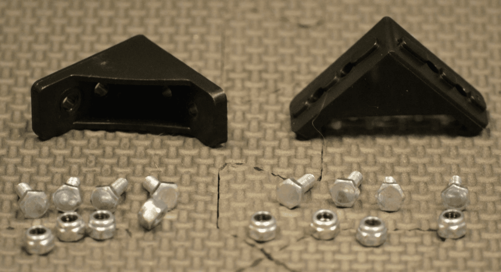
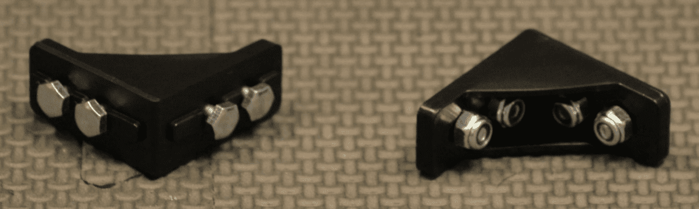
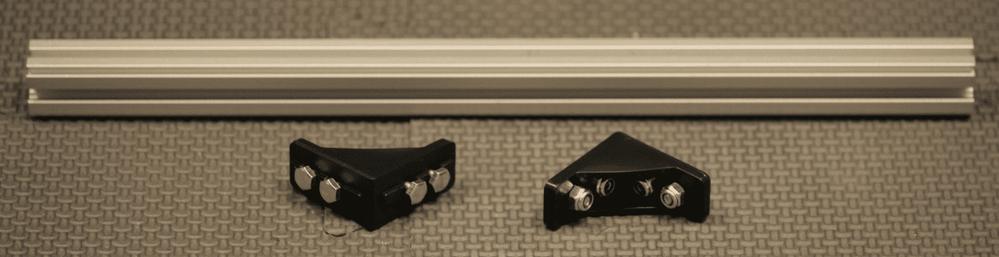
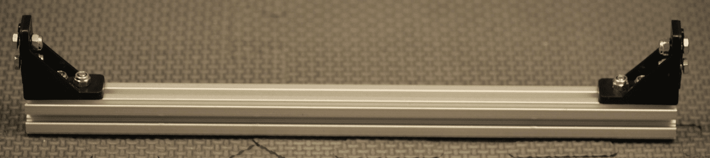
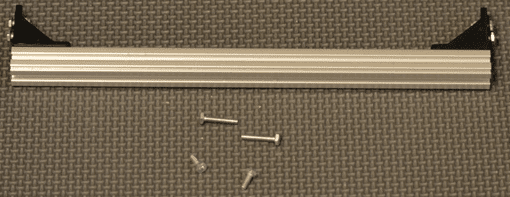
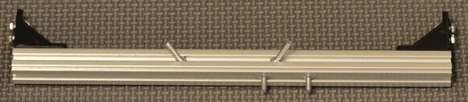
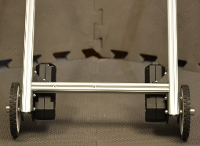
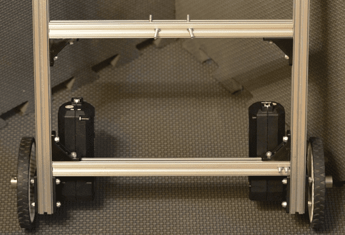
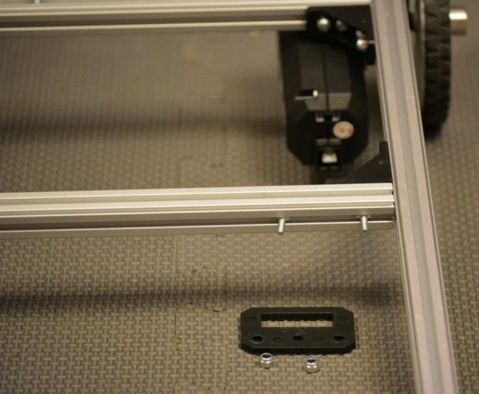
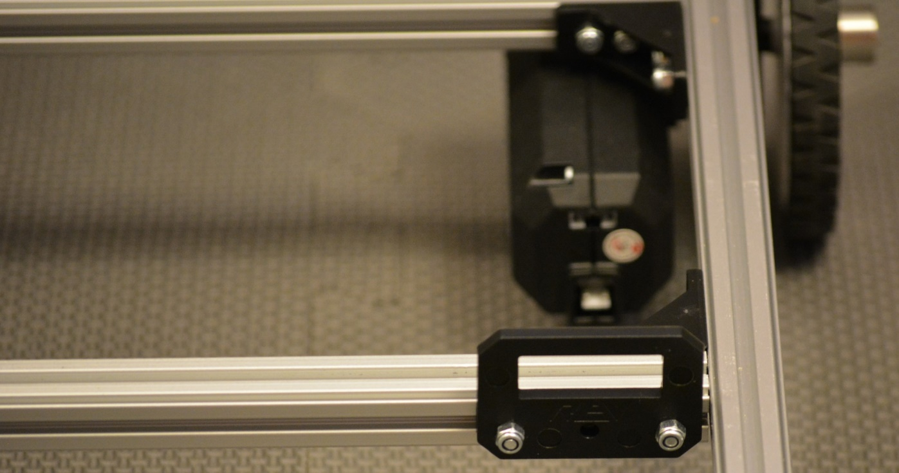

Front Support Beam
==================

Step 1: Add Screws to Corner Brackets
-------------------------------------

Parts Needed: 
^^^^^^^^^^^^^^

- REV-41-1320 – Bracket, Inside Corner (2)

- REV-41-1359 – Screw, Hex Cap, M3, 8mm (8)

- REV-41-1361 – Nut, Locking, M3 (8)

   
   *Figure 18- Unassembled view*

   
   *Figure 19- Assembled view*

.. hint::

   -  Screw the nuts onto the screws just until it’s difficult to turn
      them; just so that the nuts don’t fall off. The screw heads will need
      to slide along the center of an extrusion in a later step.

Step 2: Add Corner Brackets to Beam
-----------------------------------

Parts Needed: 
^^^^^^^^^^^^^^

- REV-41-1431 – Extrusion, 225mm, 90-90 Degree (1)

Corner Bracket Assemblies (2 - from step 1)

   
   *Figure 20- Unassembled view*

   *Figure 21- Assembled view*

Step 3: Add Floating Screws to Beam
-----------------------------------

Parts Needed: 
^^^^^^^^^^^^^^

Front Beam Assembly (1 - from step 2)

- REV-41-1359 – Screw, Hex Cap, M3, 8mm (2)

- REV-41-1360 – Screw, Hex Cap, M3, 16mm (2)

   
   *Figure 22- Unassembled view*

   *Figure 23- Assembled view*

.. hint::

   -  Two of the 8mm screws are loaded onto what will become the front face
      of the beam.

   -  One of the 8mm and two of the 16mm screws are loaded onto what will
      become the top face of the beam

Step 4: Add Front Support Beam
------------------------------

Parts Needed: 
^^^^^^^^^^^^^^

Chassis (from Back Support Beam, step 4)

Front Support beam assembly (1 - from step 3)

   
   *Figure 24- Unassembled view*

   *Figure 25- Unassembled view*

   
   *Figure 26- Assembled view*

.. hint::

   -  There should be 121mm between the back support beam and the front
      support beam (there will be 136mm center to center).

   -  If a ruler is not available, the position may need to be adjusted in
      a later step.

Step 5: Add Switch Bracket
--------------------------

Parts Needed: 
^^^^^^^^^^^^^^

Chassis Switch Plate (part of REV-31-1387)

- REV-41-1361 – Nut, Locking, M3 (2)

   
   *Figure 27- Unassembled view*

   
   *Figure 28- Assembled view*