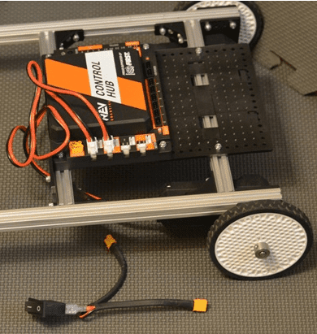
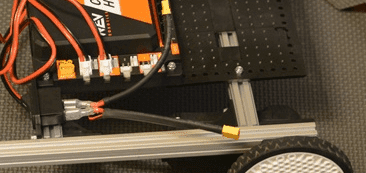
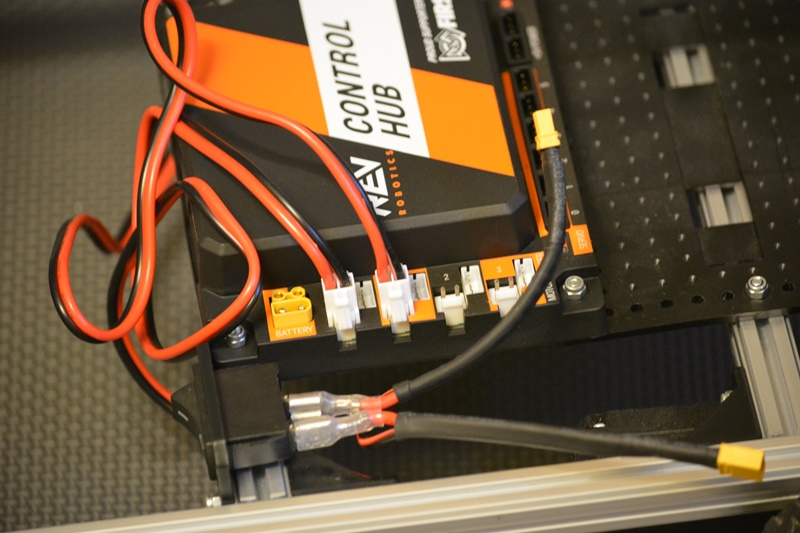
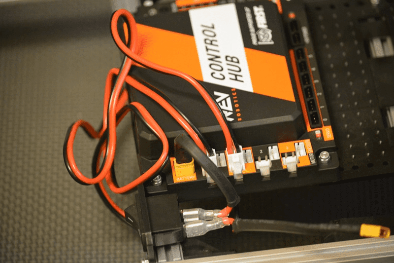

Power Switch
============

Step 1: Add the Switch
----------------------

Parts Needed: 
^^^^^^^^^^^^^^

- REV-41-1303 – Bracket, Motion (4)

- REV-41-1361 – Nut, Locking, M3 (8)

- REV-41-1359 – Screw, Hex Cap, M3, 8mm (8)

   
   *Figure 45- Unconnected view*

   *Figure 46- Connected view*

Step 2: Connect the Switch to the Control Hub
---------------------------------------------

   
   *Figure 47- Unconnected view*

   *Figure 48- Connected view*