Introduction to this Guide 
===========================

About this Guide
----------------

The Basic ‘Bot Guide was created as a resource for teams looking for a
step-by-step instructional guide to learn how to build a basic chassis
and structure. There are multiple versions of this guide, previously
called the “Push Bot Guide”, this version the **Basic ‘Bot Guide for REV
Part 1** has been created to use the new and differing parts in the
2020-2021 season’s REV kit of parts.

Parts
-----

-  REV FTC Competition Set

   -  Tools included with this kit

-  Electronics Modules and Sensors Set

-  Control & Communication Set 1 or 2

-  (Optional) A ruler is not needed to build this robot, but it is
   necessary to make sure that the robot is competition ready.

Tips and Tricks
---------------

-  Secure the screws/nuts just enough, so parts do not slide/move
   relative to each other. Overtightening the screws will damage the
   aluminum extrusions.

-  Make sure that set screws are installed in every axle hub, motor hub,
   and axle collar.

-  Refer to the legend provided in the Kit of Parts, if any parts are
   unfamiliar.

-  Make sure that all assemblies are square. It is hard to drive a
   crooked robot straight!

-  The drive wheels are powered by two DC motors, which are relatively
   heavy. The drive wheels are on the back of the robot, because that is
   where the most weight is. This weight is needed to help the wheels
   grip the surface better.

-  Omni wheels are on the front of the robot, which allows the robot to
   turn more easily. The omni wheels can slide sideways with very little
   friction due to the rollers.

-  Unless otherwise noted, the top image in each step shows the
   necessary parts; the lower image shows the completed assembly.

Drive Assemblies and Frame
==========================

Step 1: Build Drive Brackets
----------------------------

Parts Needed
^^^^^^^^^^^^

- REV-41-1303 – Bracket, Motion (4)

- REV-41-1361 – Nut, Locking, M3 (8)

- REV-41-1359 – Screw, Hex Cap, M3, 8mm (8)

.. figure:: images/BasicB003.png
   :align: center
   :figwidth: 7.5in

   *Figure 1- Unassembled view*

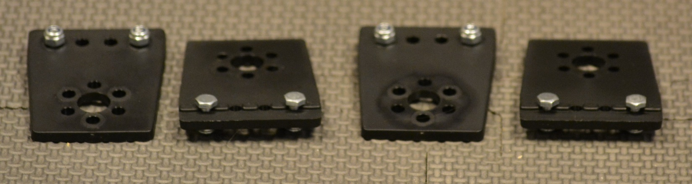

   *Figure 2- Assembled view*

.. hint::

   -  Screw the nuts onto the screws just until it’s difficult to turn
      them; just so that the nuts don’t fall off. The screw heads will need
      to slide along the center of an extrusion in a later step.

Step 2: Build Motor Assemblies
------------------------------

Parts Needed: 
^^^^^^^^^^^^^^

- REV-41-1300 – Core Hex Motor w/cables

   (2; do not plug cables into the motors yet)

- Drive Bracket Assemblies

   (1 per motor, 2 total – use only two of the assemblies from step 1)

- REV-41-1359 – Screw, Hex Cap, M3, 8mm

   (3 per motor, 6 total)

.. figure:: images/BasicB005.png
   :align: center
   :figwidth: 6.38421in
   
   *Figure 3- Unassembled view*

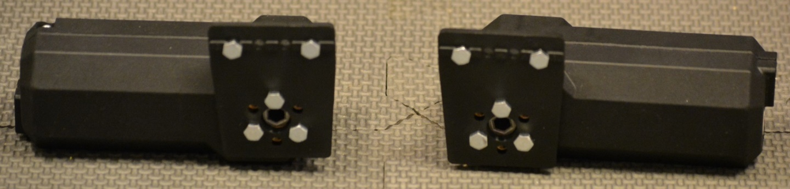

   *Figure 4- Assembled view*

.. note::

   -  Make sure that the brackets are facing the correct direction; the
      alignment ribs should be on the side away from the motor.

   -  Note that motor directions are reversed – the power plug of the motor
      pictured on the left is on the bottom; the plug of the motor on the
      right is on the top.

Step 3: Build the Right and Left Rail
-------------------------------------

Parts Needed: 
^^^^^^^^^^^^^^

- REV-41-1432 – Extrusion, 420mm, 90-90 degree (1 per side, 2 total)

   Motor Assemblies (1 per side, 2 total – from step 2)

   Drive Bracket assemblies (1 per side, 2 total –the two remaining from
   step 1)

- REV-41-1327 – Shaft Collar (1 per side, 2 total)

- REV-41-1326 – Bearing, Through Bore, Short (1 per side, 2 total)

- REV-41-1347 – Shaft, 5mm Hex, 75mm (1 per side, 2 total)

.. figure:: images/BasicB007.png
   :width: 4.03009in
   :align: center

   *Figure 5- Unassembled view*

.. figure:: images/BasicB008.png
   :width: 4.18056in
   :align: center
	

   *Figure 6- Assembled view*

.. hint::

   -  Slide the head of the screws down the center of the extrusions.

   -  The brackets should be flush with the end of the extrusions.

   -  bracket, bearing, spacer, collar, two spacers, bracket with attached
      motor. (Order from the outside in.)

Step 4: Add Drive Wheels
------------------------

Parts Needed:
^^^^^^^^^^^^^

Rail Assemblies (1 per side, 2 total – from step 3)

- REV-41-1354 – Wheel, Traction 90mm (1 per side, 2 total)

- REV-41-1327 – Shaft Collar (1 per side, 2 total)

- REV-41-1324 – Spacer, 3mm (1 per side, 2 total)

.. figure:: images/BasicB009.png
   :align: center
   :figwidth: 5.07292in
   
   *Figure 7- Unassembled View*

.. figure:: images/BasicB010.png
   :align: center
   :figwidth: 5.75697in
   
   *Figure 8- Assembled view*

.. hint::

   -  Order from the outside in. (Collar, wheel, spacer, rail assembly.)

   -  Make sure that the wheels do not rub the nuts. If they do, then
      revisit previous steps to make sure the construction is accurate.

   -  Adjust axle length, so it is flush with the collar.

Back Support Beam
=================

Step 1: Add Screws to Corner Brackets
-------------------------------------

Parts Needed: 
^^^^^^^^^^^^^^

- REV-41-1320 – Bracket, Inside Corner (2)

- REV-41-1359 – Screw, Hex Cap, M3, 8mm (8)

- REV-41-1361 – Nut, Locking, M3 (8)

   
   *Figure 9- Unassembled view*

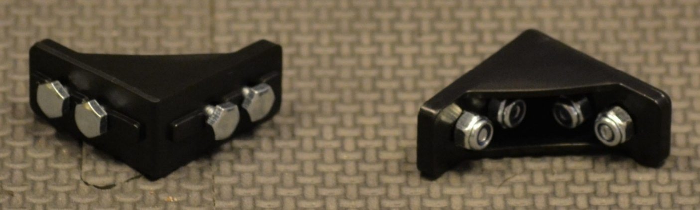

   *Figure 10- Assembled view*

.. hint::

   -  Screw the nuts onto the screws just until it’s difficult to turn
      them; just so that the nuts don’t fall off.

   -  The screw heads will need to slide along the center of an extrusion
      in a later step.

Step 2: Add Corner Brackets to Beam
-----------------------------------

Parts Needed: 
^^^^^^^^^^^^^^

- REV-41-1431 – Extrusion, 225mm, 90-90 Degree (1)

Corner Bracket Assemblies (2 - from step 1)

.. figure:: images/BasicB013.png
   :align: center
   :width: 7.01738in
   
   *Figure 11- Unassembled view*

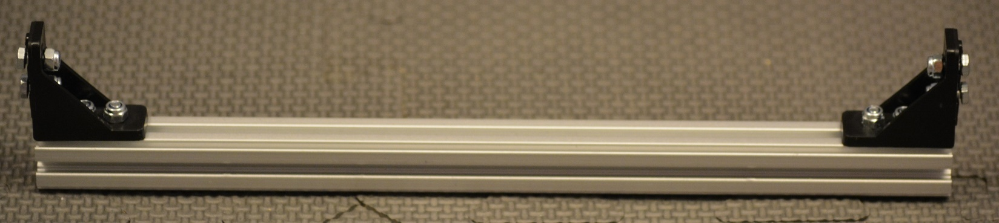

   *Figure 12- Assembled view*

.. hint::

   -  Slide the head of the screws down the center of the extrusion.

Step 3: Add Floating Screws to Beam
-----------------------------------

Parts Needed: 
^^^^^^^^^^^^^^

Back Support Assembly (1 - from step 2)

- REV-41-1359 – Screw, Hex Cap, M3, 8mm (2)

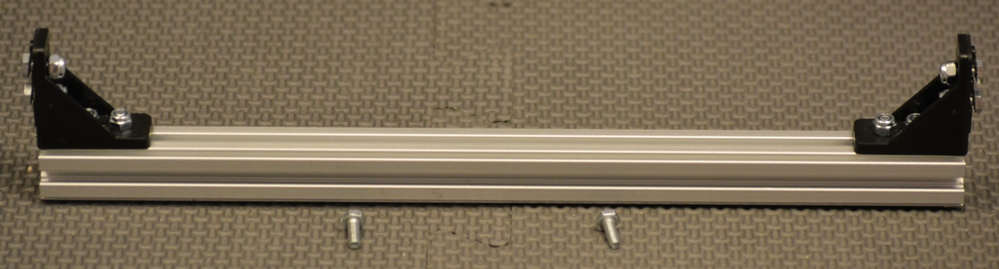

   *Figure 13- Unassembled view*

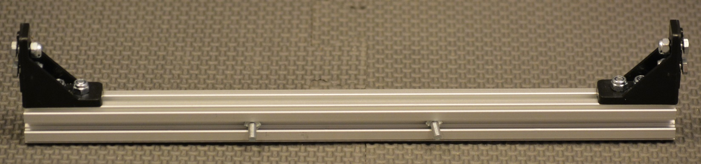
   
   *Figure 14- Assembled view*

.. hint::

   -  The two 8mm screws are loaded onto what will become the top face of
      the beam.

Step 4: Add Back Support Beam
-----------------------------

Parts Needed: 
^^^^^^^^^^^^^^

Chassis (from Drive Assemblies and Frame, step 4)

Back Support Beam Assembly (from the previous step)

figure:: images/BasicB049.png
   :align: center
   :width: 2.49212in

   *Figure 15- Unassembled view*
   
figure:: images/BasicB050.png
   :width: 4.11732in

   *Figure 16- Unassembled view*

.. figure:: images/BasicB017.png
   :align: center
   :width: 5.81759in

   *Figure 17- Assembled view*

.. hint::

   -  The beam should touch the drive wheel brackets.

Front Support Beam
==================

Step 1: Add Screws to Corner Brackets
-------------------------------------

Parts Needed: 
^^^^^^^^^^^^^^

- REV-41-1320 – Bracket, Inside Corner (2)

- REV-41-1359 – Screw, Hex Cap, M3, 8mm (8)

- REV-41-1361 – Nut, Locking, M3 (8)

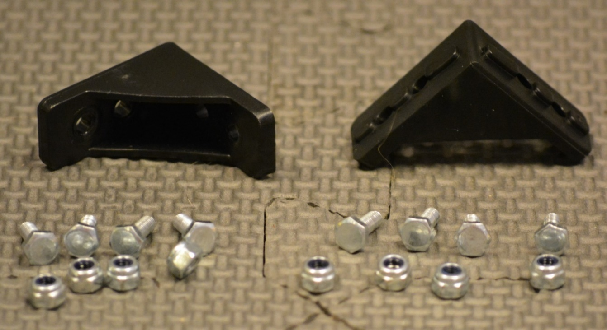
   
   *Figure 18- Unassembled view*

.. figure:: images/BasicB019.png
   :align: center
   :width: 5.57566in
   
   *Figure 19- Assembled view*

.. hint::

   -  Screw the nuts onto the screws just until it’s difficult to turn
      them; just so that the nuts don’t fall off. The screw heads will need
      to slide along the center of an extrusion in a later step.

Step 2: Add Corner Brackets to Beam
-----------------------------------

Parts Needed: 
^^^^^^^^^^^^^^

- REV-41-1431 – Extrusion, 225mm, 90-90 Degree (1)

Corner Bracket Assemblies (2 - from step 1)

.. figure:: images/BasicB020.png
   :align: center
   :width: 7.49612in
   
   *Figure 20- Unassembled view*

.. figure:: images/BasicB021.png
   :align: center
   :width: 7.49741in

   *Figure 21- Assembled view*

-  

Step 3: Add Floating Screws to Beam
-----------------------------------

Parts Needed: 
^^^^^^^^^^^^^^

Front Beam Assembly (1 - from step 2)

- REV-41-1359 – Screw, Hex Cap, M3, 8mm (2)

- REV-41-1360 – Screw, Hex Cap, M3, 16mm (2)

.. figure:: images/BasicB022.png
   :align: center
   :width: 6.91736in
   
   *Figure 22- Unassembled view*

.. figure:: images/BasicB023.png
   :align: center
   :width: 7.09583in

   *Figure 23- Assembled view*

.. hint::

   -  Two of the 8mm screws are loaded onto what will become the front face
      of the beam.

   -  One of the 8mm and two of the 16mm screws are loaded onto what will
      become the top face of the beam

Step 4: Add Front Support Beam
------------------------------

Parts Needed: 
^^^^^^^^^^^^^^

Chassis (from Back Support Beam, step 4)

Front Support beam assembly (1 - from step 3)

.. figure:: images/BasicB051.png
   :align: center
   :width: 2.06398in
   
   *Figure 24- Unassembled view*

.. figure:: images/BasicB023.png
   :align: center
   :width: 3.68929in

   *Figure 25- Unassembled view*

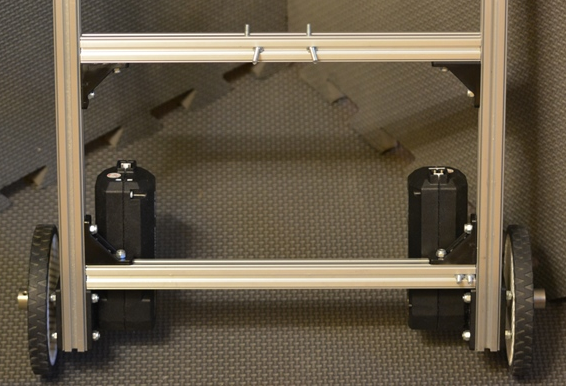
   
   *Figure 26- Assembled view*

.. hint::

   -  There should be 121mm between the back support beam and the front
      support beam (there will be 136mm center to center).

   -  If a ruler is not available, the position may need to be adjusted in
      a later step.

Step 5: Add Switch Bracket
--------------------------

Parts Needed: 
^^^^^^^^^^^^^^

Chassis Switch Plate (part of REV-31-1387)

- REV-41-1361 – Nut, Locking, M3 (2)

.. figure:: images/BasicB025.png
   :align: center
   :width: 3.05683in
   
   *Figure 27- Unassembled view*

.. figure:: images/BasicB026.png
   :align: center
   :width: 6.3416in
   
   *Figure 28- Assembled view*

Caster Wheels
=============

Step 1: Build Caster Brackets
-----------------------------

Parts Needed: 
^^^^^^^^^^^^^^

- REV-41-1303 – Bracket, Motion (2 per side, 4 total)

- REV-41-1361 – Nut, Locking, M3 (2 per bracket, 4 per side, 8 total)

- REV-41-1359 – Screw, Hex Cap, M3, 8mm (2 per bracket, 4 per side, 8
total)

.. figure:: images/BasicB027.png
   :align: center
   :width: 7.5in
   
   *Figure 29- Unassembled view*

.. figure:: images/BasicB028.png
   :align: center
   :width: 7.5in
   
   *Figure 30- Assembled view*

.. hint::

   -  Screw the nuts onto the screws just until it’s difficult to turn
      them; just so that the nuts don’t fall off.

   -  The screw heads will need to slide along the center of an extrusion
      in a later step.

**
**

Step 2: Add Caster Brackets to Chassis
~~~~~~~~~~~~~~~~~~~~~~~~~~~~~~~~~~~~~~

Parts Needed: 
^^^^^^^^^^^^^^

Caster Bracket Assemblies

(4 – from the previous step)

.. figure:: images/BasicB052.png
   :align: center
   :width: 2.81667in

   *Figure 31- Unassembled view*
   
.. figure:: images/BasicB028.png
   :align: center
   :width: 2.81667in

   *Figure 32- Unassembled view*

.. figure:: images/BasicB029.png
   :align: center
   :width: 5.04074in
   
   *Figure 33- Assembled view*

.. hint::

   -  Brackets must be installed 2 cm from the end of the extrusion, if
      used for competition, to fit within the sizing cube.

   -  Ensure that the pair of brackets on the same extrusion are the same
      distance from the end of the extrusion or the wheels will not rotate
      properly.

Step 3: Add the Omni Wheels
---------------------------

Parts Needed: 
^^^^^^^^^^^^^^

- REV-41-1327 – Shaft Collar (2 per side – 4 total)

- REV-41-1326 – Bearing, Through Bore, Short (2 per side – 4 total)

- REV-41-1323 – Spacer, 15mm (1 per side – 2 total)

- REV-41-1324 – Spacer, 3mm (1 per side – 2 total)

- REV-41-1347 – Shaft, 5mm Hex, 75mm (1 per side – 2 total)

- REV-41-1190 – Wheel, Omni 90mm (1 per side – 2 total)

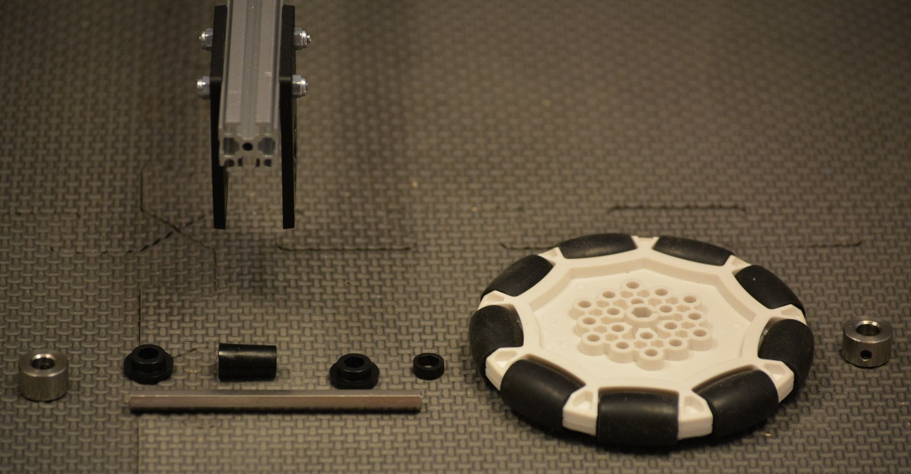
   
   *Figure 34- Unassembled view of left wheel*

[Continued on the next page, so detail can be seen more easily.]

.. figure:: images/BasicB031.png
   :align: center
   :width: 4.74532in
   
   *Figure 35- Assembled view of right wheel*

.. hint::

   -  Order from the outside in: collar, omni wheel, 3mm spacer, bearing,
      bracket, 15mm spacer, bracket, bearing, collar.

   -  Adjust axle length, so it is flush with the collar.

[Continued on the next page, so detail can be seen more easily.]

.. figure:: images/BasicB032.png
   :align: center
   :width: 7.5in
   
   *Figure 36- Assembled view*

Control Hub
===========

Step 1: Add the Support Plate
-----------------------------

Parts Needed: 
^^^^^^^^^^^^^^

- REV-41-1166 – Battery Holder Plate (1)

- REV-41-1361 – Nut, Locking, M3 (2)

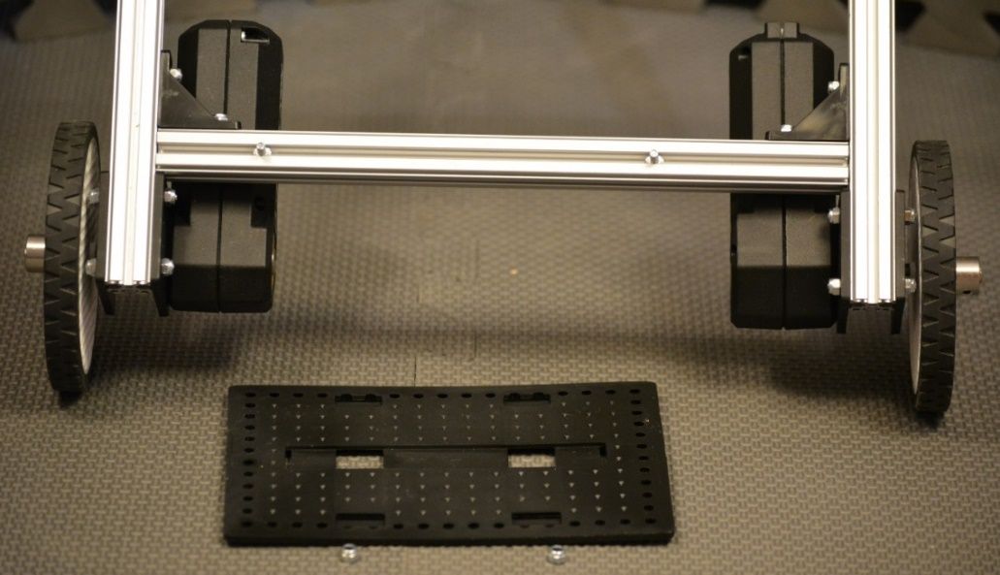
   
   *Figure 37- Unassembled view*

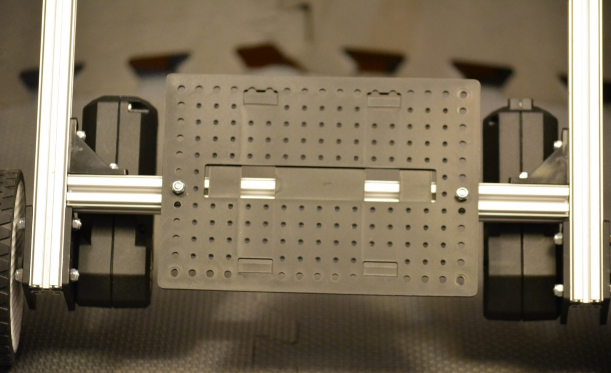
   
   *Figure 38- Assembled view*

Step 2: Add the Rev Robotics Control Hub
----------------------------------------

Parts Needed: 
^^^^^^^^^^^^^^

- REV-31-1153 – Control Hub (1)

- REV-41-1360 – Screw, Hex Cap, M3, 16mm (2) (two other screws are already in the extrusion from an earlier step)

- REV-41-1361 – Nut, Locking, M3 (4)

.. figure:: images/BasicB035.png
   :align: center
   :width: 3.29132in
   
   *Figure 39- Unassembled view*

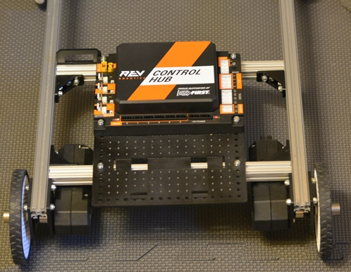

   *Figure 40- Assembled view*

.. hint::

   -  Reposition the front support beam, if necessary, to accomplish the
      proper spacing – the two floating screws on the front beam need to be
      at the corners of the control hub.

Step 3: Add the Left Drive Motor Power Cable
--------------------------------------------

Parts Needed: 
^^^^^^^^^^^^^^

Motor Power Cable (1 – comes with the core hex motor – REV-41-1300)

.. figure:: images/BasicB037.png
   :align: center
   :width: 3.84104in

   *Figure 41- Unconnected view*

.. figure:: images/BasicB038.png
   :align: center
   :width: 5.2767in
   
   *Figure 42- Connected view*

Step 4: Add the Right Drive Motor Power Cable
---------------------------------------------

Parts Needed\ **:** 
^^^^^^^^^^^^^^^^^^^^

Motor Power Cable (1 – comes with the core hex motor – REV-41-1300)

.. figure:: images/BasicB039.png
   :align: center
   :width: 3.37295in

   *Figure 43-Unconnected view*

.. figure:: images/BasicB040.png
   :align: center
   :width: 4.5301in

Power Switch
============

Step 1: Add the Switch
----------------------

Parts Needed: 
^^^^^^^^^^^^^^

- REV-41-1303 – Bracket, Motion (4)

- REV-41-1361 – Nut, Locking, M3 (8)

- REV-41-1359 – Screw, Hex Cap, M3, 8mm (8)

.. figure:: images/BasicB041.png
   :align: center
   :width: 2.31558in
   
   *Figure 45- Unconnected view*

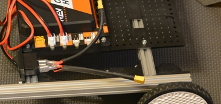

   *Figure 46- Connected view*

Step 2: Connect the Switch to the Control Hub
---------------------------------------------

.. figure:: images/BasicB043.png
   :align: center
   :width: 4.8075in
   
   *Figure 47- Unconnected view*

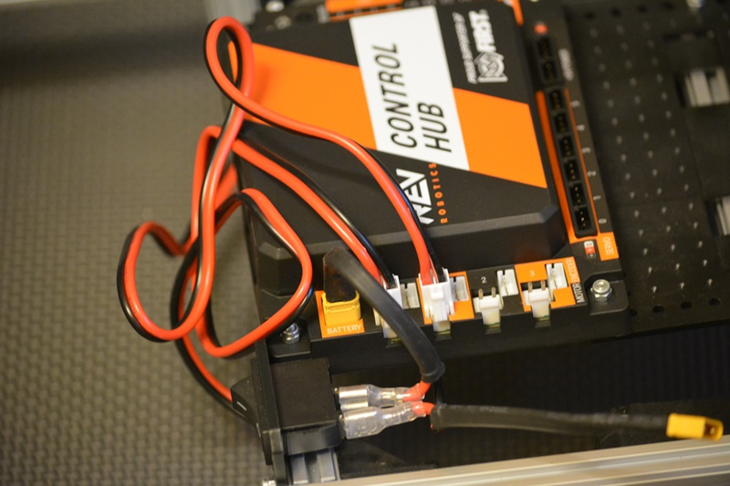

   *Figure 48- Connected view*

Battery
=======

Step 1: Add the Battery
-----------------------

Parts Needed: 
^^^^^^^^^^^^^^

- REV-31-1302 – Slim Battery, 3000mAh (1)

- REV-41-1161 – Zip Tie, 160mm (2)

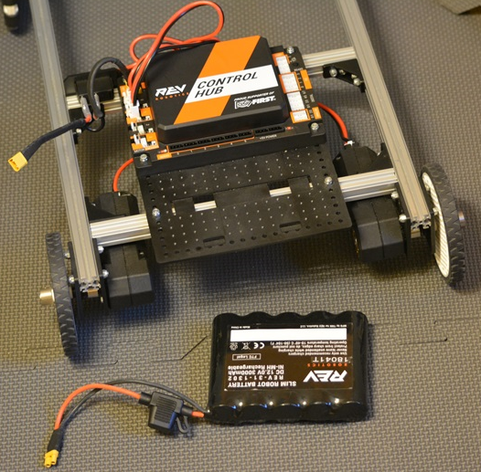

   *Figure 49- Unassembled view*

.. figure:: images/BasicB046.png
   :align: center
   :width: 3.9653in	

   *Figure 50- Assembled view*

Step 2: Connect the Battery to the Switch
-----------------------------------------

.. figure:: images/BasicB047.png
   :align: center
   :width: 5.52071in
   
   *Figure 51- Unconnected view*

.. figure:: images/BasicB048.png
   :align: center
   :width: 7.5in

   *Figure 52- Connected view*

Final Steps
===========

What’s Next? 
-------------

-  You have now constructed the frame of your Basic ‘Bot, however,
   programming will be needed to make the robot functional.

-  Testing should be done to determine whether anything needs to be
   changed or optimized for the season’s game rules. Testing will also
   show whether more cables need to be secured or re-routed.

-  Check the game rules for all the applicable stickers

-  Make sure to also go over the robot checklists:

   -  `Robot Self-Inspection
      Checklist <https://www.firstinspires.org/sites/default/files/uploads/resource_library/ftc/robot-inspection-checklist.pdf>`__

   -  `Robot Reliability
      Checklist <https://www.firstinspires.org/sites/default/files/uploads/resource_library/ftc/robot-reliability-checklist.pdf>`__