.. meta::
   :title: Robot Wiring Guide
   :description: Best practices for wiring a FIRST Tech Challenge robot, including strain relief, wire management, battery security, power distribution, and connector adapting.
   :keywords: FTC Docs, FIRST Tech Challenge, FTC, wiring, strain relief, wire management, battery security, power distribution, Anderson Powerpole, XT30, level shifter

Robot Wiring Guide
===================

Introduction to Robot Wiring
----------------------------

The wiring of a robot serves two primary purposes. The first purpose is to
provide electrical power to the devices on a robot. The second is to
provide a communication network for the many devices that make up a
robot's control system.

Teams should follow best practices when wiring their robots. This will
help to ensure that the placement, connections, and security of their
wires will lead to improved robot performance, eliminate intermittent
electrical problems, and allow for easy troubleshooting and resolution of
electrical and/or signal-related problems.

.. important:: If you redesign the footprint of your robot, leave enough space for the wiring required.

This guide shows the basics of properly wiring a robot, how to improve
wiring reliability, and how to handle hardware issues associated with
wiring.

As always, the `FTC Q&A Forum <https://ftc-qa.firstinspires.org/>`__ and
`Competition Manual <https://www.firstinspires.org/resource-library/ftc/game-and-season-info>`__
rules take precedence over recommendations made here. Please refer to
these sources before embarking on the electrical wiring task.

.. note:: This guide primarily uses the REV Robotics Expansion Hub in its examples, but the guidelines
   apply equally well to the REV Robotics Control Hub. These Hubs provide electronic input/output
   (or "I/O") ports that are used to "talk" to a robot's motors, servos, and sensors. The layout of
   I/O ports is the same for both the Expansion Hub and Control Hub.

One of the important differences between the Expansion Hub and the
Control Hub is the external Android device used with the Expansion Hub,
compared to the internal Android device built into the Control Hub, to
accomplish the same task of wireless communication with the driver
station. Sample wiring diagrams can be found in the
:doc:`Robot Controller Overview </control_hard_compon/rc_components/index>`.

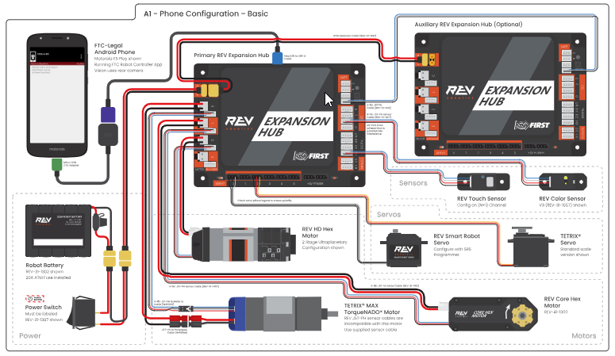

   Smartphone/Expansion Hub Configuration

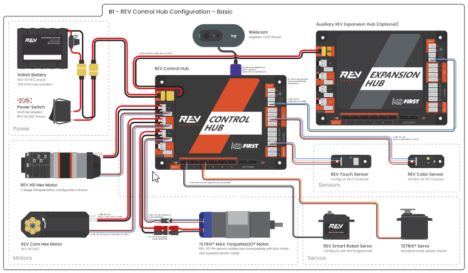

   Control Hub/Expansion Hub Configuration

Here is a list of items that can improve the security and organization of
a robot's wiring system. None of these are included in the FTC Kit of
Parts, but each one addresses a specific best practice covered later in
this guide.

.. list-table::
   :header-rows: 1

   * - Item
     - Example Source
     - Cost
     - Qty
   * - Grounding wire (REV Resistive Grounding Strap, REV-31-1269)
     - REV Robotics
     - $5.00
     - 1
   * - Ferrite chokes (REV Ferrite Cable Clips, REV-39-1224)
     - REV Robotics
     - $4.50
     - 4
   * - Spiral wire sheath (Spiral Sleeving, 7378K43)
     - McMaster-Carr
     - $6.00
     - 10 ft.
   * - XT30 power distribution block (REV-31-1293)
     - REV Robotics
     - $13.50
     - 1
   * - Rubber grommets (Grommet Assortment, 9600K25)
     - McMaster-Carr
     - $27.00
     - 100
   * - Hook and loop fasteners (Velcro), 94985K41
     - McMaster-Carr
     - $2.00
     - per ft.
   * - Snap-together fasteners (3M Dual Lock), 94935K17
     - McMaster-Carr
     - $3.65
     - per ft.

Best Practices
--------------

Appropriate Tools
^^^^^^^^^^^^^^^^^^

Using the correct tools will make wiring tasks easier, and the result
will be more reliable.

If you are not making your own custom cables and connectors, the only
tool you might need is a small pair of wire snippers or diagonal
cutters. These are useful for trimming zip ties. Poorly trimmed zip ties
present a sharp point and can be a hazard.

When changing or remaking crimped connections, you will need a pair of
wire strippers and possibly a dedicated crimping tool. Wire strippers
allow you to strip the insulation off different wire gauges while
ensuring that none of the copper strands are cut. Generic crimping tools
are suitable for common spade lugs, but for custom connectors (like
Anderson Powerpoles) a dedicated crimper may be required.

When shortening or extending wires, or when making a power distribution
bus, a soldering iron and heat gun are useful tools. For electronics
work, a temperature-controlled iron is recommended, and a small heat gun
can be used for typical diameter heat shrink.

When running multiple wires (like several servo wires), it can be a
future time-saver to apply simple labels to wires at the point where
they plug in. These can be as simple as pieces of tape folded over the
wire and named with a marker.

.. list-table::

   * - .. figure:: images/wire-snippers.png
          :alt: Yellow-handled diagonal wire cutters.

          Wire snippers
     - .. figure:: images/small-nippers.png
          :alt: Small yellow-handled wire strippers.

          Small nippers for cutting zip ties
     - .. figure:: images/ferrule-crimpers.png
          :alt: Blue-handled ferrule crimping tool.

          Ferrule crimpers
   * - .. figure:: images/needle-nose-pliers.jpg
          :alt: Red-handled needle nose pliers.

          Needle nose pliers
     - .. figure:: images/powerpole-crimpers.png
          :alt: Orange-handled Anderson Powerpole crimping tool.

          Anderson Powerpole crimpers
     - .. figure:: images/heat-gun.jpg
          :alt: A black handheld heat gun with hi, off, and lo switch positions.

          Heat gun for shrink wrap insulation
   * - .. figure:: images/soldering-iron.jpg
          :alt: A temperature-controlled soldering station with an iron and stand next to a coil of solder.

          Temperature-controlled soldering iron/station
     -
     -

Strain Relief
^^^^^^^^^^^^^

Strain relieving is the technique used to reduce the amount of stress at
a wire connection. In our case, this connection is typically a two-part
connector. Proper strain relief will prevent the connector from
becoming unplugged, or from having the wires break loose from the
connector itself. In general, all connections should be properly strain
relieved.

Immobilize the wire an inch or two from the connector and leave a
little slack on the connector side. This prevents unintended tension on
the wire from damaging the connector and allows the connector to be
unplugged, if desired, for testing or module replacement. This can
easily be done with a few zip ties. It may be acceptable to mount the
connector more rigidly, but only if all parts involved are also mounted
solidly on a rigid panel.

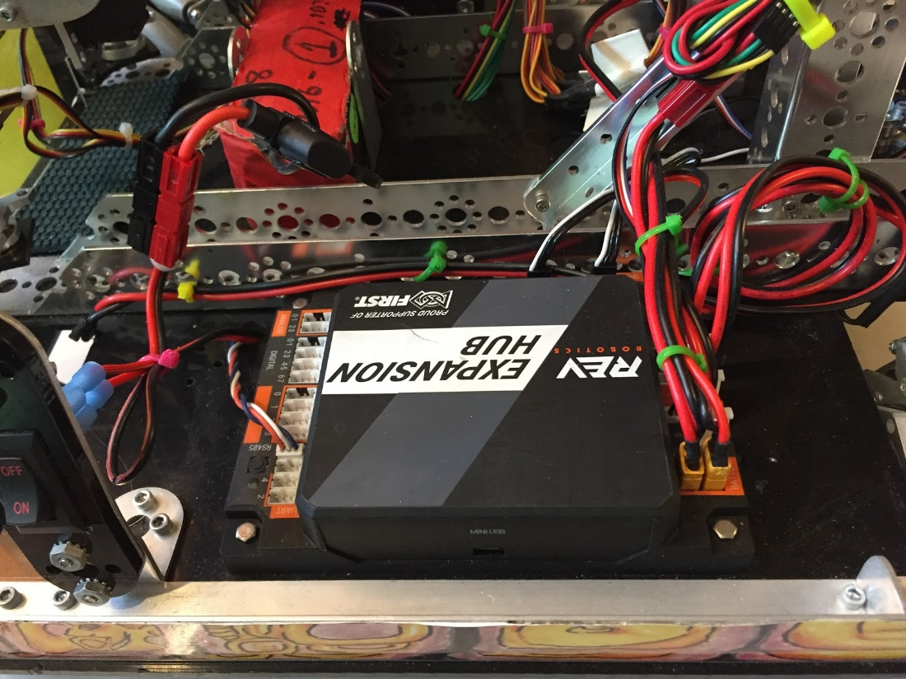

   Strain relief and wire restraints

   - Wires are channeled with zip ties.
   - Wires are also bundled based on their destination, such as motors, and then neatly coiled.
   - The 12V battery is held in place by a metal TETRIX bracket and Velcro (under the battery), and the main power connector is also constrained to the c-channel. The power switch is mounted in an easily accessible location, protected behind a side shield with a finger hole.
   - The REV Expansion Hub is mounted to a plastic base, which extends 1/8" beyond the metal chassis to minimize ESD (electrostatic discharge).

.. important:: Every wire connection is a possible point of failure. This applies to all electronics.

Securing Wires and Connectors
^^^^^^^^^^^^^^^^^^^^^^^^^^^^^^

In general, all wires should be properly secured. Properly securing
wiring will:

- Minimize connection errors with the Android phone.
- Prevent wires from moving into pinch points (e.g., between two gears or into a movable mechanism).
- Prevent entanglement with field elements and other robots.
- Provide easier access for maintenance.
- Prevent strain on wiring components.

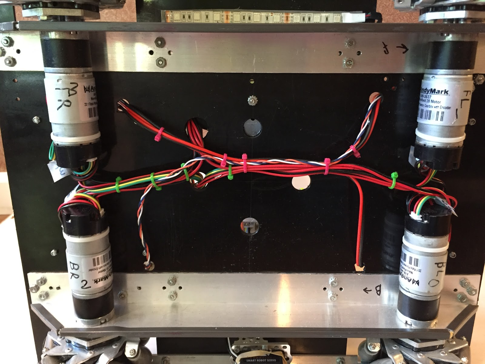

   Securing wires

   - The power and encoder wires for this drive train are strain relieved at the motors themselves.
   - Wires are secured to each other and to the plastic chassis baseplate.
   - The metallic chassis beams are insulated with plastic strips to prevent electrostatic discharges as the robot rolls off its metal platform.

Wires should be tied down (secured) at regular intervals to prevent them
from moving or shaking loose during a match. It is best to run wires
along stationary parts of a robot. Zip ties offer a sturdy way to secure
wires, but electrical tape or Velcro straps can also be used.

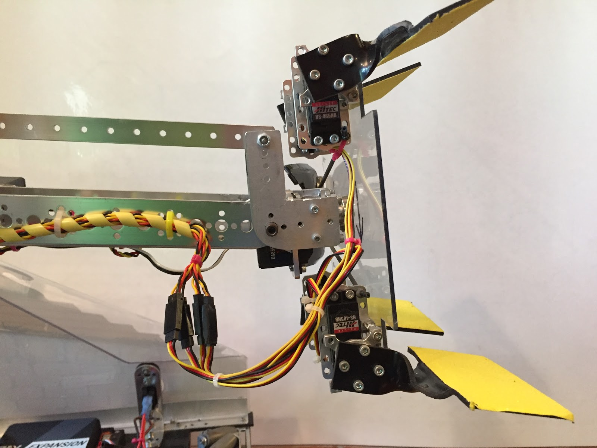

   In-line connections

   - A group of servo extension wires is used to accommodate a long arm.
   - Each pair of mating servo connectors is firmly held together, either with a plastic shroud or with electrical tape.
   - Each side of the connector bundle is also stabilized with a zip tie, and a service loop has been created to permit the end-effector (grabber) to rotate without pulling on the wires.

In some instances, the connectors on the ends of wires should also be
secured in place. This is true for USB connections and some 12V power
connectors. These connectors are susceptible to vibration or impacts,
which may cause temporary or permanent loss of control.

.. list-table::

   * - .. figure:: images/wires-moving-parts-1.jpg
          :alt: An orange spiral wire sheath protecting a bundle of wires as they cross a rotating arm joint.

          Wires near moving parts
     - .. figure:: images/wires-moving-parts-2.jpg
          :alt: The same orange spiral wire sheath viewed from the side, anchored to the chassis with a zip tie.

          ..

On this robot, many servo wires had to pass a rotating arm joint with
several gears. To prevent loose wires from being pinched, the wires
were bundled and then wrapped in a split sheath (orange). The sheath
was anchored to the base at one end, and to the arm at the other end. A
service loop of extra cable was created to allow full rotation of the
arm without putting tension on the wires.

Connectors can be secured using zip ties or Velcro, or teams can use 3D
printed connector mounts. REV Robotics provides a USB connector
restraint for its REV Expansion Hub.

.. list-table::

   * - .. figure:: images/usb-connector-mount.png
          :alt: A green 3D-printed USB connector restraint clipped onto a REV Expansion Hub.

          USB connector mount
     - .. figure:: images/printed-connector-mount.png
          :alt: A close-up of the green cable clip holding a USB cable secured to the port of a REV Expansion Hub.

          3D printed connector mount

If interconnected connectors are used to extend sensor/servo cables, or
extend 12V DC power cables, the connectors should be firmly secured to
each other. Electrical tape is often the simplest and most effective
way to do this.

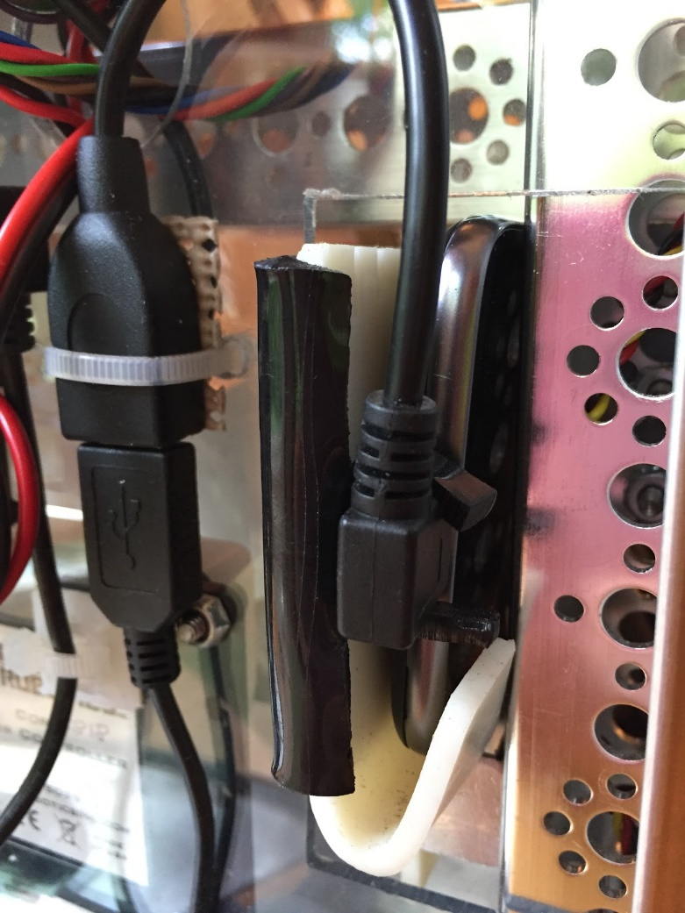

   Stabilizing USB cables

   - The USB plug is constrained with the addition of a custom clamp.
   - The use of a right-angled USB connector helps to keep the wiring near the robot structure.
   - The female USB-A connector is zip-tied in place to prevent vibrations and to stop the cable from falling free when the phone is removed.

.. note:: Locating the phone next to a metal beam may not be optimal, as it may reduce wireless signal
   strength, but it can be a reasonable compromise to achieve the desired camera location.

If wires need to be shortened or extended, soldering provides a robust
yet compact splicing method. In this case, all soldered joints should
be protected with heat shrink tubing. Slightly oversized tubing should
be cut to length and placed over one wire before soldering the two
wires together. Then a heat gun can be used to shrink the tubing to
hold it in place. Many sizes and colors of heat shrink tubing can be
purchased from most electronics suppliers.

Wire Management
^^^^^^^^^^^^^^^^

The most important step towards neat wiring is the implementation of
proper wire management. Wire management involves bundling and routing
wires along a defined path to the various electrical parts.

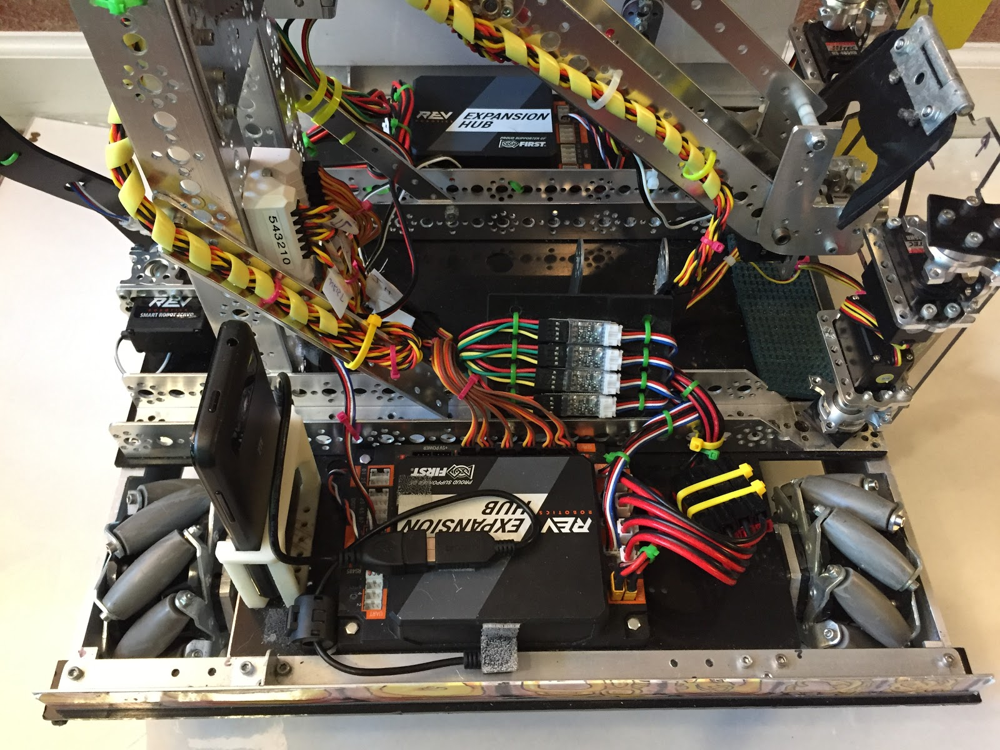

   Multiple wire management types

   - This robot utilizes multiple actuators, requiring level converters, boosters, and wire extensions. Clutter is eliminated by organizing a logical flow through the robot, then bundling and constraining wire clusters wherever possible.
   - Four encoder level converters are mounted to a plastic plate which is bolted to the main chassis. Wires to and from these converters are strain relieved on either side.
   - Motor wires pass through Anderson Powerpole connectors and are bundled and restrained.
   - Servo PWM cables (and their extensions) are grouped in a flat bundle and routed to a servo booster module. Wires from the booster module are bundled and wrapped with a spiral sheath which runs all the way up the arm support to the rotating grabber. A service loop is created and attached to the arm on one side, and the grabber on the other side.

Tips to keep in mind to ensure neat, robust wiring:

- Keep the wiring stationary.
- Protect the wiring.
- Where possible, make sure all cables are the correct length.
- Bundle cables together if they are running to a common destination.
- Use right-angle USB connectors if they keep wiring more compact.
- Use wire management hardware.
- Self-adhesive cable tie mounts help attach wires to surfaces without holes.
- Grommets protect wires from damage from sharp edges.
- Wire sheaths allow teams to quickly protect at-risk wiring.

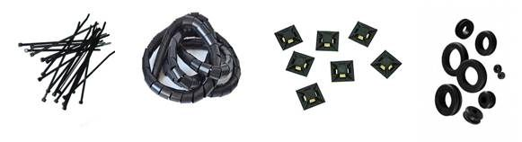

   Wire management hardware

Wires on Moving Parts
^^^^^^^^^^^^^^^^^^^^^^

Most robots have one or more components that move relative to the main
drive chassis. This could be things like a pivoting arm, an extending
collector, or a shooter turntable. When these components have motors
and sensors attached, it is important to ensure that the connecting
wires can accommodate the movement. There are several precautions that
can be taken to ensure that wires do not get pinched, twisted, or
entangled.

Constraining wires is the first line of defense. An unconstrained wire
is likely to get caught and pulled as one component moves past another.
However, moving parts often need "extra" wire when they are fully
extended or rotated, so it is important to plan this extra wire when
the part is retracted. The extra wire should be formed into a "service
loop," which keeps wires bundled together and provides predictable
movement. These bundled wires can be further protected by an
expandable, spiral, or split sheathing. This sheathing serves as a
flexible outer protector for the wire bundle as it moves near potential
pinch/entanglement points.

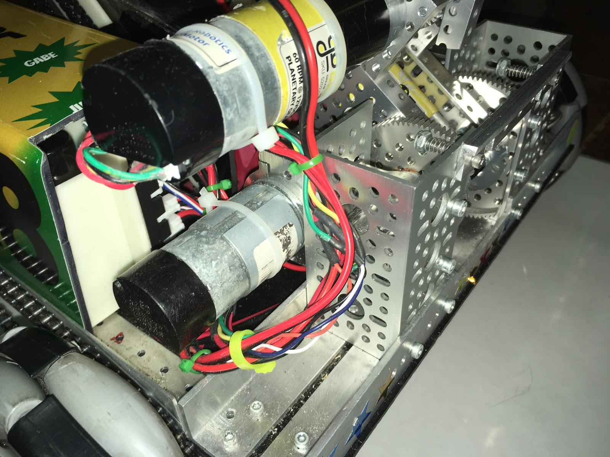

   Wires near moving parts

   - The upper motor is mounted to a movable arm, which rotates relative to the robot chassis.
   - The motor's power and encoder wires have been bundled (yellow and green zip ties) into a service loop.
   - Wires are anchored to the motors (white zip ties). This maintains control over the wires when the arm rotates and ensures that none are pinched.

Battery Security
^^^^^^^^^^^^^^^^^

The placement, connectors, and methods for securing the battery
properly will ensure safety and enhance the life of the battery.

The battery is often one of the heaviest parts of the robot, and its
placement can have a dramatic effect on drivability and stability. A
good rule of thumb is to place the battery as low as possible for
stability. Omnidirectional drives require constant pressure on all
wheels, so position the battery to help with even weight distribution.

Since batteries need to be removed to be charged, extra thought should
be given to how they are mounted in the robot. A loose battery can get
caught in moving parts and be damaged, or can tug on the battery
connector and cause the robot to lose power. Since they are heavy,
batteries tend to want to shake free as the robot maneuvers, so it is
important to ensure that they are fixed in place. This can be achieved
by creating a mechanical "receptacle" that snugly holds the battery in
place. They can also be restrained with Velcro attached to the battery
and robot, or by using a Velcro strap to hold the battery against the
frame.

.. list-table::

   * - .. figure:: images/battery-security-1.jpg
          :alt: A flat REV Robotics battery pack mounted vertically in a 3D-printed holder secured with a Velcro strap.

          Battery security
     - .. figure:: images/battery-security-2.jpg
          :alt: A battery secured in a white 3D-printed enclosure, with the yellow XT30 power connector zip-tied in place.

          ..

- A REV Robotics flat battery pack is mounted vertically next to an Expansion Hub.
- A 3D printed container was created to loosely constrain the battery, and a Velcro strap was added to prevent the battery from bouncing out during robot deployment.

.. note:: In the case of a Control Hub, this mounting method could block radio waves traveling to and from the Hub's wireless adapter.

- For security, the battery connector (yellow XT30 plug) is plugged into a mating connector on the robot, which is zip tied in place.

Some teams use zip ties to secure their battery, but unless the team
only has one battery, these zip ties will need to be cut and replaced
each time the battery is removed to be charged. Consider using a method
that can be "un-done" rather than replaced each time. If zip ties are
used, make sure the ties are not overtightened, to prevent damaging the
internal connections of the battery.

Care should also be taken to make sure the mounting points for the
battery do not puncture or break the insulation of the battery or
battery leads. Ensure there are no sharp edges that can cut into the
battery.

Battery Safety
^^^^^^^^^^^^^^^

Batteries are used to store energy, and so it is important to store and
manage that energy safely. The following guidelines should always be
followed:

- For safety reasons, batteries should not be left unattended while charging. The charging process may cause faulty batteries to overheat and create a fire hazard.
- Be sure to protect the battery terminals while storing batteries. Do not store or transport batteries with other loose metallic items, which could inadvertently cause a short circuit across the battery terminals.
- Under no circumstances should there be exposed ends on both battery wires. Bare wires that touch will short out and damage the battery and may create a fire hazard.

12V Power Switch
^^^^^^^^^^^^^^^^^

A single 12V power switch is required on all FTC robots. Since quick
access to this switch may be required by field personnel, it should be
mounted in a readily accessible location. This will typically mean near
the exterior of the robot, facing outwards. However, the switch should
be protected so that it cannot be turned off accidentally through
contact with a field element or other robot.

Here are some ways to achieve this:

- Do not mount the switch outside, or flush with, the chassis perimeter of the robot.
- Angle the switch upwards to prevent contact from basic robot movement.
- Place the switch behind a cover plate or side shield with a small opening for manual operation.
- Ensure that game pieces cannot fall onto the switch.

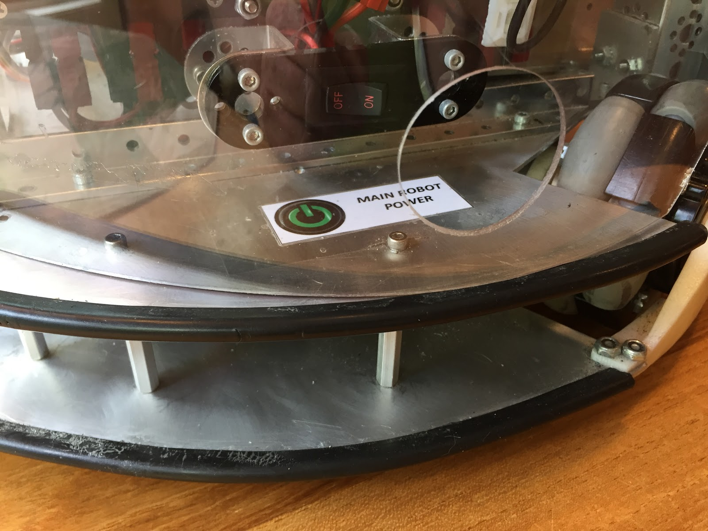

   Power switch placement, side shield, and chassis insulation

   - The power switch is mounted inside the robot frame using TETRIX hardware, facing outwards for easy operation. The switch is behind a transparent (PETG) side shield, with a hole cut for easy access. This protects the switch from accidental contact, but still provides FTAs (FIRST Technical Advisors) with great visibility and access.
   - Side shields are also used to protect internal electronics from entanglement and possible ESD events. Black rubber edge guards also protect the chassis plates from external electrical contact.

12V Power Distribution
^^^^^^^^^^^^^^^^^^^^^^^

To enable full functionality of the robot's electronics, it is
important to have stable 12V power and sufficient current capacity for
all 12V wiring. FTC-approved 12V power components are designed with
appropriate connectors and wire gauges to support a typical robot. A
simple REV power system would supply 12V from the fused battery,
through a power switch, into a REV Expansion Hub. Power would be daisy
chained out of the parent hub into an optional child hub.

However, for robots that have high current loads (from many motors) or
have a larger number of 12V components (like Servo Power Modules or
SPARK Mini motor controllers), it may be desirable to utilize a 12V
power distribution bus. A power bus takes a single input power feed and
splits it into several 12V outputs, each of which can power a dedicated
device instead of daisy chaining the power from one component to the
next.

A power bus can be created by building a custom wiring harness or by
purchasing a commercial power distribution block.

.. list-table::

   * - .. figure:: images/power-dist-block-1.png
          :alt: A REV XT30 power distribution block with multiple output ports.

          Power distribution blocks
     - .. figure:: images/power-dist-block-2.png
          :alt: An Anderson Powerpole power distribution block with four output pairs.

          ..

Protective Side Shields
^^^^^^^^^^^^^^^^^^^^^^^^

Most FTC games involve Robot-to-Robot and Robot-to-Game element
contact. This contact may be intentional or accidental, and it can
sometimes extend into the inner workings of your robot. To prevent
damage or interference (such as ESD), it is desirable to prevent
external objects from being able to contact critical internal
electrical components.

One popular way to prevent undesired intrusion is to add one or more
side shields to your robot. These should be constructed from
non-conductive materials. They can also be used to add strength or
industrial design elements to your robot. Shields are also useful for
preventing loose, game-scoring elements (balls, blocks, etc.) from
falling into your robot and counting against any maximum holding
allowance.

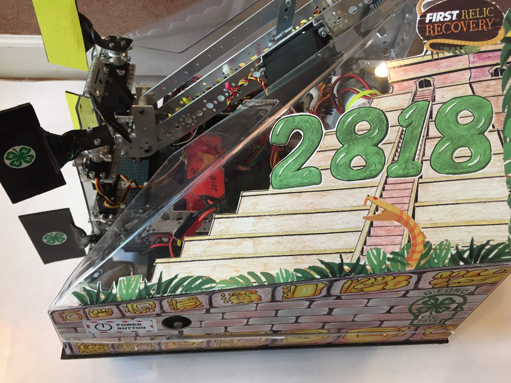

   Side shields

   - They protect the inner workings of the robot from contact from other robots.
   - They prevent game elements from getting caught inside the robot.
   - They protect the power switch.
   - They provide a surface for theme decoration and team identification.

Durable, clear plastic side shields can be constructed using
polycarbonate, PVC, or PETG to allow internal visibility for status
lights or mechanisms.

.. caution:: Plexiglass (acrylic) is a commonly available clear plastic, but it is quite brittle, so it may not be suitable for protective shields.

Wi-Fi Considerations
^^^^^^^^^^^^^^^^^^^^^

The Robot Controller device (Control Hub or Android smartphone) uses a
wireless radio to communicate with the Driver Station. Choose the
placement of the Hub/phone with the following considerations:

- It is important to protect the phone and Control Hub from robot-to-robot contact. Attach the phone or Hub to the robot in a place protected from physical impact.
- Choose a location on the robot where the radio waves traveling to or from the phone or Control Hub will not be blocked/reflected by large pieces of metal or by a 12V battery or a motor.
- Choose a location on the robot where the radio waves traveling to or from the phone or Control Hub will not be disrupted by electromagnetic interference that could potentially be generated by a 12V DC motor.
- Reduce the risk of an electrostatic shock between the phone and the metallic frame of the robot by mounting the phone on an insulator, like plastic or wood.

.. list-table::

   * - .. figure:: images/phone-mounting-1.jpg
          :alt: A Robot Controller phone held in a white 3D-printed mount attached to the robot frame.

          Phone mounting
     - .. figure:: images/phone-mounting-2.jpg
          :alt: A two-part USB cable connecting a phone to a REV Expansion Hub, with a ferrite choke clipped onto the cable.

          ..

- The Robot Controller phone is held in position using a 3D printed mount.
- The mount is bolted to a plastic base plate, keeping the phone separated from all metalwork.
- USB connector is strain relieved by the 3D printed mount.
- A two-part cable is used to connect the phone to the REV Expansion Hub. This permits the two devices to be frequently disconnected without wear and tear on either device.
- A ferrite choke is attached to the USB cable and held in place with Dual Lock. The Expansion Hub is also bolted to a plastic base plate to provide additional ESD immunity.

ESD Mitigation
^^^^^^^^^^^^^^^

An electrostatic discharge (ESD) event occurs when a charged object
(like a robot) discharges to a neutral or oppositely charged object.
Because wiring choices affect how well a robot's electronics are
isolated from its frame, the same practices covered throughout this
guide (strain relief, wire routing, keeping connectors away from
exposed metal) also reduce ESD risk. A few wiring-specific tips:

- Use ferrite chokes on sensor, encoder, and servo cables to help block the current spikes seen in an ESD event.
- Keep connectors and exposed wire ends away from the metal frame of the robot; an air gap of at least 3/8" (10 mm), or a wrap of electrical tape, reduces the chance of a shock disrupting a port.
- Wheel material and design can affect how much static charge a robot builds up. Mecanum wheels, for example, may produce more static than other wheel types.

For a complete explanation of ESD, how robots become charged, and full
grounding and insulation procedures, see
:doc:`Managing Electrostatic Discharge Effects </hardware_and_software_configuration/configuring/managing_esd/managing-esd>`.

Driver Station
^^^^^^^^^^^^^^^

Not all wiring issues are on the robot. The driver station also has
several components that must have reliable connections to ensure proper
operation. Many teams who bring their phones and game controllers to
the competition field as a handful of loose pieces will see problems
with loss of control before or during a match. If a game controller
cord gets tugged, it may cause a brief USB disconnect, which will cause
the controller to stop communicating with the robot. This can cause
loss of control of the robot at a critical time.

To ensure stable and consistent operation, it is recommended to mount
the Driver Station phone, USB hub, and game controller connectors to a
rigid base plate. This base plate should be non-metallic (wood or
plastic), and it can also provide an easy way to store the game
controllers. Items can be attached to the base plate with Velcro, zip
ties, Dual Lock, or even hot glue. All connectors should be strain
relieved.

.. list-table::

   * - .. figure:: images/driver-station-1.jpg
          :alt: The back of two game controllers attached to a plywood board using hook-and-loop fasteners.

          Driver station
     - .. figure:: images/driver-station-2.jpg
          :alt: Two game controllers and a Robot Controller phone mounted on a plywood driver station board, connected through a USB hub.

          ..

- The game controllers are attached to the board using hook and loop fasteners.
- The Micro USB connector entering the phone is strain relieved. It has enough free wire to be easily unplugged to charge the phone.
- The phone holder, USB hub, and connectors are all anchored in place to prevent them from disconnecting due to jostling.

Adapting Power Systems
-----------------------

Types of Wires and Connectors
^^^^^^^^^^^^^^^^^^^^^^^^^^^^^^

.. list-table::

   * - .. figure:: images/xt30-connector-1.jpg
          :alt: A male XT30 connector on a black and red wire.

          XT30 connectors (male and female)
     - .. figure:: images/xt30-connector-2.jpg
          :alt: A male XT30 connector viewed from the side.

          ..
     - .. figure:: images/xt30-connector-3.jpg
          :alt: A female XT30 connector on a black and red wire.

          ..

REV Robotics: The REV system uses XT30 connectors for the power wires.
These connectors are used in the RC vehicle industry and are designed
to withstand repeated connect and disconnect cycles. It is not
necessary to replace these connectors with Anderson Powerpoles.
However, there have been credible reports of occasional disconnects
between the XT30 connectors provided with the REV Robotics hardware.

If you suspect that you might have a loose XT30 connection, conduct a
careful physical inspection of the connection. Check to make sure the
connectors fit snugly together and there is a slight amount of
retention between the connectors when you try to pull them apart. Also
check to make sure that power is not disrupted when the ends of the
power cables that connect through the XT30 connectors are jiggled. If
you do find a loose connection, first try replacing the cable, or if
the bad connector is mounted on the Hub, you can
`attempt a repair yourself <https://docs.revrobotics.com/duo-control/troubleshooting-the-control-system/control-hub-troubleshooting>`__
or contact REV Robotics support.

If you prefer to use Anderson Powerpoles as your primary connectors,
you can attach an XT30/Anderson Powerpole converter cable to the Hub
and strain relieve it properly. Once this converter is plugged into the
Hub, it can be left in place, and the battery can connect or disconnect
using the Anderson Powerpole connection. This will reduce the wear
experienced by the XT30 connectors.

.. warning:: Do not reverse the polarity of the input DC power. Although the REV Robotics Hubs have
   built-in reverse polarity protection, it is still possible to damage Hubs when reverse polarity
   power is applied.

Making an Adapter
^^^^^^^^^^^^^^^^^^

Teams may wish to replace the connectors on their batteries and install
more reliable connectors in their place. If teams choose to do this,
the old connectors can be useful.

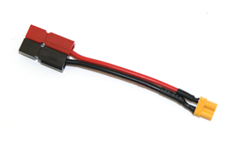

   Anderson Powerpole and XT30 connectors

When removing the unwanted connectors from the battery, do not cut the
wires flush with the end of the connector. Instead, leave a 1/2" length
of wire attached to the connector.

Installing Anderson PowerPoles
^^^^^^^^^^^^^^^^^^^^^^^^^^^^^^^

The following steps explain how to install Anderson Powerpoles on a
battery (TETRIX, REV, and current MATRIX). The same steps can be
modified to install Anderson Powerpoles on any wire.

1. Remove the fuse from the battery.

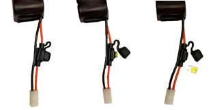

   Fuse removal

2. Cut one of the wires close to the attached Tamiya connector. Do not
   cut too close to the battery or the fuse housing, which will make
   installation difficult or impossible.
3. Strip the wire to the Anderson Powerpole specifications.

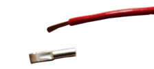

   Strip the wire

4. Crimp the connector to the wire. Make sure the wire is in the proper
   orientation before doing this -- the Powerpoles need to connect
   properly.

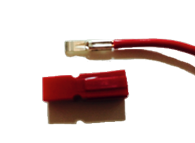

   Crimped connector and red housing

5. Snap on the plastic housing.
6. Attach red housing to the positive wire, and black housing to the
   negative wire.
7. Repeat steps 2 through 5 on the remaining wire.
8. Slide the side locking mechanism of the adjacent red and black
   housing. The red positive raised side should slide into the black
   negative recessed side.

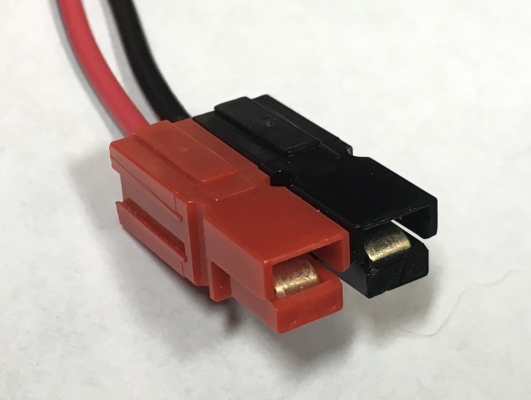

   Proper orientation of housing

9. Slide and snap the red housing to the other red housing, and repeat
   for the black housings.
10. If applicable, reinsert the fuse.
11. Repeat the procedure on the battery charger.

Adapting Logic Levels
----------------------

Level Shifters
^^^^^^^^^^^^^^^

There are two voltage levels commonly used for logic on integrated
circuits (like the chips in a REV Robotics Expansion Hub): 5V and 3.3V.
The REV Expansion Hub uses 3.3V logic levels, but some third-party
devices work using 5V logic levels. If you would like to use a 5V I2C
sensor with the REV Robotics Expansion Hub, then you will need:

- Logic level converters (also known as level shifters) to convert the signals to and from the sensor.
- A REV Robotics Sensor Adapter Cable (REV-31-1384) to connect the 5V sensor to the logic level converter.
- A complete explanation can be found in the
  `REV Robotics Expansion Hub Getting Started Guide <https://docs.revrobotics.com/duo-control/adding-more-motors/adding-an-expansion-hub>`__.

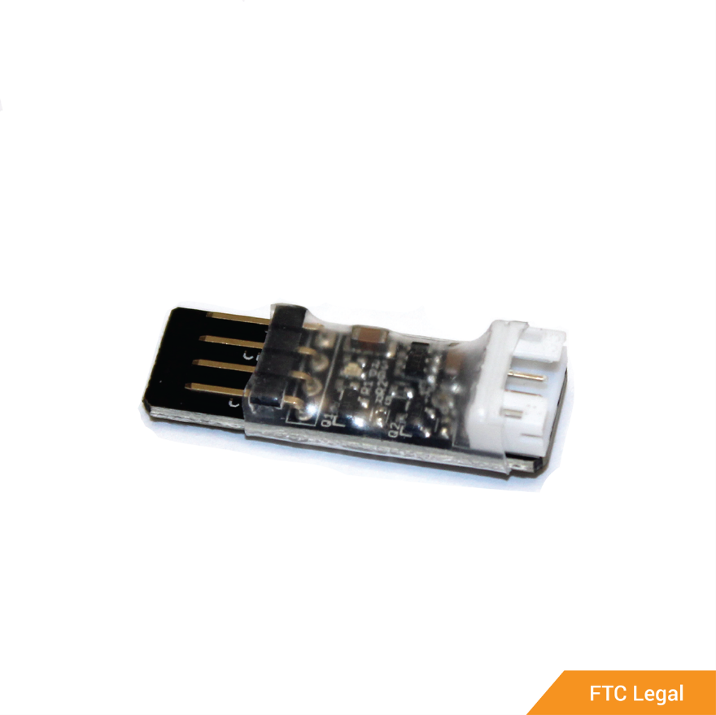

   Logic level converter

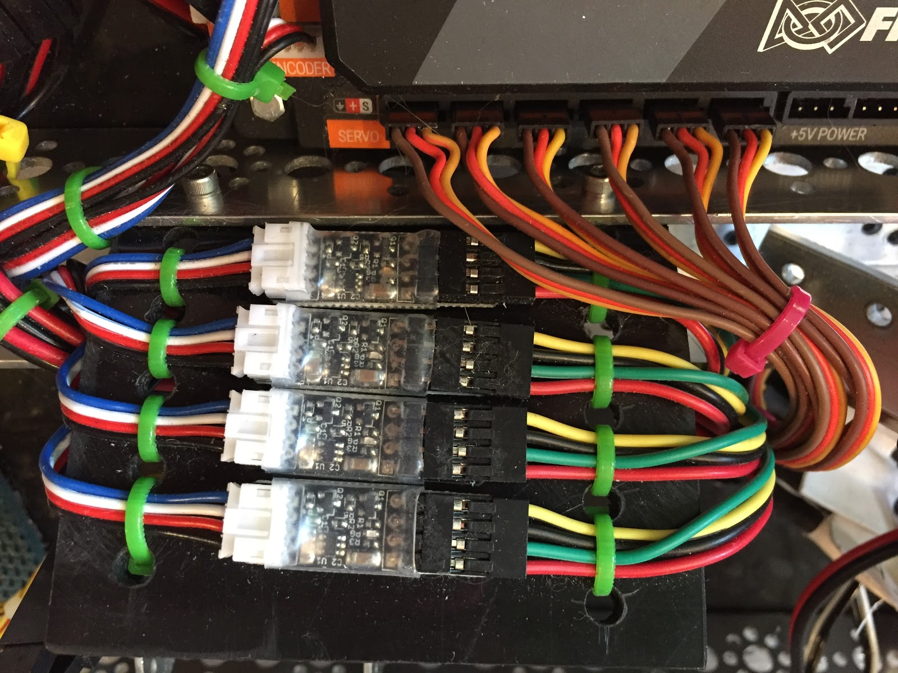

   Level shifters

These level shifters are being used to interface motor encoders with
the Expansion Hub. Four motors require four encoders, so four shifter
modules have been mounted to a plastic bracket to minimize ESD and then
bolted to the chassis. Wires leading to and from the modules have been
restrained to provide strain relief to the connectors, and the cables
are bundled to consume minimal space.

Common Problems and Troubleshooting
-------------------------------------

Connection Issues
^^^^^^^^^^^^^^^^^^

Hardware Issues

- Before wiring a robot, make sure to inspect the ports on all the modules. It is possible to damage the pins in the module ports. If this is the case, do not use the module; it should be sent back to the manufacturer for repairs.

Reversed Wires

- The Expansion Hub and the Control Hub have three color-coded symbols that align the servo wire colors.
- Be sure to match the black, red, and white wires with the color-coded symbols on the Hub.
- Check the connection on servo extensions and splitters too.
- Check tightness of XT30 connections. Over time the male "pins" compress, and the connector becomes loose. Follow the
  `REV Robotics XT30 pin troubleshooting guide <https://docs.revrobotics.com/duo-control/troubleshooting-the-control-system/control-hub-troubleshooting>`__.

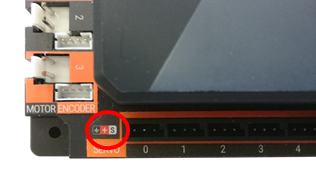

   Color-coded symbols

Hub and Phone Communication Issues
^^^^^^^^^^^^^^^^^^^^^^^^^^^^^^^^^^^

The signals that pass between the Android phone and the controllers
are sensitive to interference. If a motor power wire or servo wire is
routed next to a USB cable, it is possible to induce a stray signal
that can lead to intermittent problems.

Additional Resources
----------------------

Careful incorporation of the solutions and wire management tips in this
guide should help ensure more robust electrical system performance and
increase robot reliability.

Basic wiring instructions are also provided by
`REV Robotics <http://www.revrobotics.com/>`__ on their
`DUO Control System support pages <https://docs.revrobotics.com/duo-control/menu/control-hub-gs/wiring-diagram>`__.
